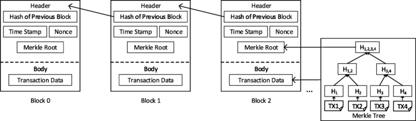
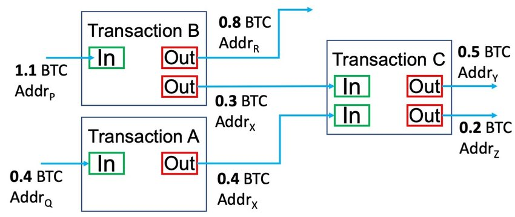
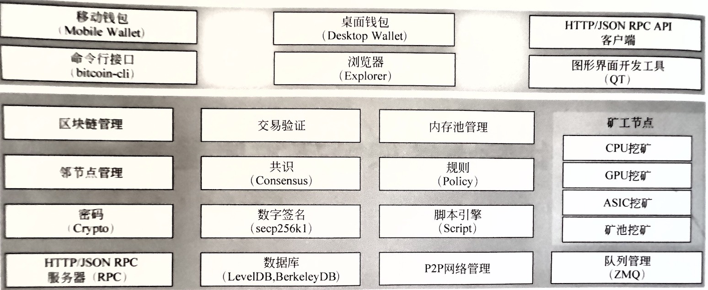
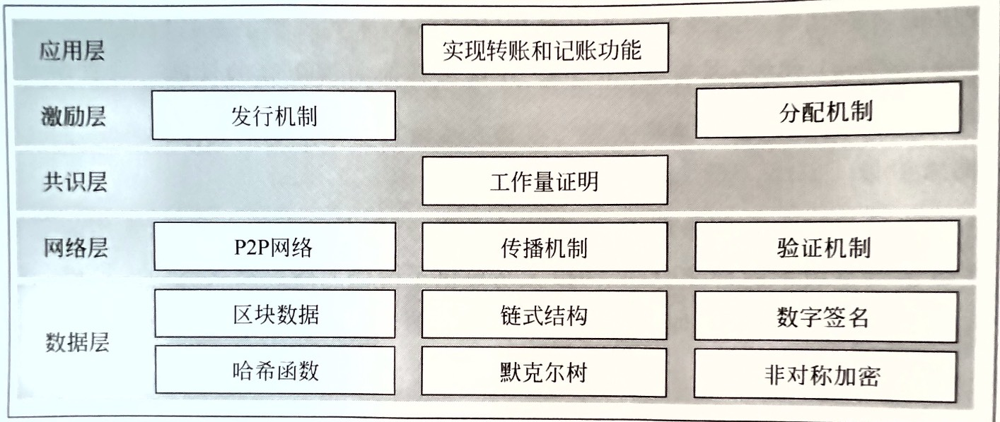

# 比特币技术细节（整理）

### 目录
TODO
 
## 1. 四个关键设计

1. p2p网络技术：TODO
2. 分布式账本（区块链）：首先，交易信息需要存储，没有了中心机构，比特币将它存储在全网所有加入比特币网络的节点之上，这叫做分布式账本。它是以N个区块链接起来的形式工作的，
   每个区块相当于一个小账本，记录了多笔交易信息和上一个区块的地址。
3. 工作量证明（Proof of work，记账权）：如何保证每个账本的一致性成了一个问题，比如A本来只有1元，在两个节点的记录结果却不同可不行。比特币引入记账权的概念，网络中的节点若要想要获得
   记账的权利， 就必须完成一道系统提供的数学题（耗费一定的算力和时间进行一项哈希计算工作，直到算出一个满足条件的结果结束）。谁做得快就就优先获得记账权。
   这也叫做工作量证明，它是区块链账本的安全机制。
4. 最长链原则：传统交易基于中心机构进行，没有双花（双重支付）问题，但区块链架构之上该如何解决？那就是最长链原则。同一笔钱的第二次以上的交易一定是无效的，
   并且第一次和第二次交易不可能存在于同一个链条中（把同一个链条看做一个中心账本），所以第二次交易所在区块（账本）一定是从主链上分叉出去的，这就导致
   链条分叉，从上面得知想要记账先要获得记账权，就得有很高的算力，因为比特币系统中任意节点都可以来竞争记账权，显然主链增加的速度一定是极快的，分叉的链条
   就一定很慢，因为只有攻击者独自维护分叉链条，这就变成了一场算力比拼，显然攻击者的算力无法与全网算力竞争，最终就只有主链被系统承认。


## 2. 分布式账本（区块链的本体）

首先要知道账本（区块）是如何链接的。整个账本（一条区块链）由一串使用密码学算法产生的区块（单个账本）连接而成。每一个区块上写满了交易记录，区块按顺序相连形成链状结构，也就是区块链大账本。  
矿工在生成新区块时，需要根据前一个区块的唯一哈希值（叫做区块哈希）、新交易区块和随机数，来计算新的区块哈希和随机数。也就是说每一个
区块都是在前一个区块数据的基础上生成的，该机制保证了区块链数据的唯一性。  
区块中的主要数据就是一系列交易，第一条交易通常是Coinbase交易，也就是矿工的挖矿奖励，后续交易都是用户的交易。


———————————— **图1【区块的大致组成和链接方式】** ————————————

  


———————————— **图2【Merkle根的组成结构】** ————————————

## 3. 比特币分叉

指的是区块链条的分叉，又分为硬分叉和软分叉。为什么会分叉？  
因为比特币系统中的1个区块大小为1MB，区块限制了容纳交易的笔数。比特币对单笔交易的大小没有限制，一般来说一笔交易的大小为250B，所以一个区块大约
能容纳4000多笔交易，然后比特币系统规定10分钟产生一个新区块，通过计算得知比特币系统的每秒可交易笔数 4000/600≈7笔。显然，对于全球用户来说，
这个速度可太慢了，所以人们就想到了对比特币区块扩容，这就要修改比特币软件代码了。

### 3.1 什么是分叉

软件由于**方案优化、BUG修复**等原因进行升级是一种非常常见的现象。如手机应用等传统软件，升级非常简单，只需厂商发布，用户接 受升级即可。  
但是对于比特币这种去中心化的系统，升级是非常困难 的，需要协调网络中每个参与者。软件升级意味着运行逻辑的改变， 但是在比特币中，
升级必然会导致不同节点在一定时间内运行不同的版本，于是就会产生分叉。

分叉主要包含软分叉和硬分叉两种。如果比特币升级后，新的代码逻辑向前兼容，即新规则产生的区块仍然会被旧节点接受，则为软分叉；
如果新的代码逻辑无法向前兼容，即新产生的规则产生的区块无法被旧节点接受，则为硬分叉。

### 3.2 硬分叉
比如对区块大小扩容从1M到4M，升级后的节点产生的4M区块广播到网络中，那些旧节点会认为这个区块是非法的，不认可。旧节点仍然会基于原来的1M区块
的链条继续产生新区块。如此新旧节点不兼容就导致主链分叉，产生第二条链。  
>注意：硬分叉后，新节点会认可旧节点产生的区块，但反之则否。

这种分叉是永久性的，只要旧节点不更新软件，原先的主链就不会消失，并且无法合并两条链，这就叫做硬分叉。
>2017年8月1日，区块扩容至8M导致比特币主链分叉出新的链条，形成了现在的**BitCash(BCH)**。BCH吸取以太坊分叉的教训，加入了双向重放保护，分叉后并没有出现资产损失等混乱情况。
> 自2017年8月1日21:16:14（GMT+8），即区块高度478,558之后分离出的一个新的基于区块链的加密货币，旧链条仍然是比特币。  
> 在BCH之后，又发生了多个分叉。理论上，任何参与比特币网络的节点（矿工）都可以分叉。

### 3.3 软分叉
同样是比特币协议发生了部分变化，但旧节点仍然能接受新节点产生（挖出）的区块，并基于新区块继续添加旧区块。  
软分叉由于向前兼容，新旧节点仍然运行在同一条区块链上，并不会产生两条链，对整个系统影响相对较小。  
到目前为止，比特币发生过多次软分叉，如BIP-34，BIP-65，BIP-66，BIP-9等。其中比特币改进建议（Bitcoin Improvement Proposal, BIP）
指的是比特币社区成员针对比特币提出的一系列改进建议。
>软分叉虽然对系统的影响较小，但是为了保证向前兼容，不能新增字段，只能在现有数据结构下修改，即可升级的内容非常有限。  
> 同时，因为这些限制，软分叉一般升级方案比较复杂，复杂的方案往往更容易产生BUG，并且可维护性很差。

## 4. 一些通用概念

### 4.1 矿工和挖矿
指的是参与到比特币网络中不停消耗算力去试图把新的交易打包成新区块的节点，这个尝试打包的过程就是挖矿；它们的动力来自于产生新区块而获得的比特币奖励

### 4.2 挖矿过程(原理)
比特币挖矿的逻辑过程如下：
1. 打包交易，检索待确认交易内存池，选择包含进区块的交易。矿工可以任意选择，甚至可以不选择(挖空块)，因为每一个区块有容量限制(当前是1M)，所以矿工
也不能无限选择。对于矿工来说，最合理的策略是首先根据手续费对待确认交易集进行排序，然后由高到低尽量纳入最多的交易。
2. 构造Coinbase，确定了包含进区块的交易集后，就可以统计本区块手续费总额，结合产出规则，矿工可以计算自己本区块的收益。
3. 构造hashMerkleRoot，对所有交易构造Merkle数。
4. 填充其他字段，获得完整区块头。
5. Hash运算，对区块头进行SHA256D运算。
6. 验证结果，如果符合难度，则广播到全网，挖下一个块;不符合难度则根据一定策略改变以上某个字段后再进行Hash运算并验证。
>Coinbase是什么：每个区块都会包含至少一个交易，第一笔交易就叫做coinbase，每笔交易都包含了input和output，正常交易的input是转账来源方的钱包地址，
> output就是接收方的地址；而coinbase的input没有任何地址，只有output记录了给与矿工打包区块成功的奖励和手续费。Coinbase是一笔特殊交易。

这个算法也叫做**POW**（Proof Of Work）。  
合格的区块条件： **SHA256D(BlockHeader) < F(nBits)**  
其中，SHA256D(BlockHeader)就是挖矿结果，F(nBits)是难度对应的目标值，两者都是256位，都当成大整数处理，直接对比大小以判断是否符合难度要求。

### 4.3 不断的计算哈希值（挖矿）
比特币系统规定，打包产生的新区块的区块哈希值，必须小于给定的难度哈希值，这个区块才算有效。
区块哈希的大致计算方式：block_hash=Sha256D(BlockHeader)，而区块头包含了nVersion，hashPrevBlock, hashMerkleRoot, nTIme, nBits, nNonce这些字段；  

其中nVersion是比特币协议号，一般不会变化，hashPrevBlock是前一个有效区块的区块哈希，nBits由全网决定，每2016个区块重新调整，调整算法固定。
因此这三个字段可以认为是固定的，对于每个矿工都是一样，而矿工可以自由调整的是剩下三个字段：hashMerkleRoot,nTime,nNonce；  
其中nTime提供的修改空间非常有限，因为有效的区块时间由一个范围，范围由前一个区块决定，比前一个区块时间太早或者太延后都会被其他节点拒绝。
一般来说，矿工会直接使用机器当前时间戳。  
nNonce，提供2^32种可能取值；  
hashMerkleRoot，理论上提供2^256种可能，本字段的变化来自于对包含进区块的交易进行增删，或改变顺序，或者修改Coinbase交易的输入字段。 

在CPU挖矿时代，修改空间主要由nNonce提供，也就是不断的累加nNonce值然后进行哈希计算，然后判断哈希值是否小于难度值，循环往复。进入矿机时代，
nNonce提供的4个字节已经远远不够，搜索空间转向hashMerkleRoot。

### 4.4 动态调整的难度哈希
比特币网络的难度是不断变化的，它的难度保证大约每10分钟产生一个区块，而难度值在每2015个区块调整一次：如果区块平均生成时间小于10分钟，
说明全网算力增加，难度也会增加，如果区块平均生成时间大于10分钟，说明全网算力减少，难度也会减少。因此，难度随着全网算力的增减会动态调整。

所以比特币的工作量证明被通俗地称之为挖矿。在同一时间，所有矿工都在努力计算下一个区块的哈希。而挖矿难度取决于全网总算力的百分比。  
比特币挖矿已经从早期的CPU、GPU发展到专用的ASIC芯片构建的矿池挖矿。
>比特币设计时本来打算每2016个区块调整一次难度，也就是两周一次，但是由于第一版代码的一个bug，实际调整周期是2015个区块。


## 5. 密码算法

主要采用了**哈希算法**（SHA-256和RipeMD160）用于计算单个区块的唯一哈希值，保证区块信息无法被篡改，因为一旦篡改，哈希值将改变，
无法通过其他节点的区块验证，进而导致此区块被全网拒绝。所以少部分节点的修改是无意义的；  
采用了**非对称加密算法**（ECDSA）用于数字签名。

### 5.1 哈希算法
又称散列算法、摘要/单向加密算法。具有不可逆推性，它把任意长度的字节输入转换为固定长度的输出。  
一个优秀的哈希算法需要满足较低碰撞率。  
#### 5.1.1 比特币中的Merkle Hash
在区块的头部中，有一个MerkleRoot字段，它是将当前区块里的所有交易记录的Hash使用二叉树的方式，
层层通过hash字符串拼接的方式并计算出新的Hash，直到最后一个节点Hash就是MerkleRoot，MerkleRoot是把一系列数据的哈希根据一个简单算法变成一个汇总的哈希。
在每一层计算中，如果是偶数个交易哈希，每两个交易哈希通过double_hash方式合成一个，其中
>data = tx1_hash_str + tx2_hash_str  
>double_hash(data)=sha256(sha256(data))

如果有单数，就把最后一份数据复制，再合成;如果只有一笔交易，那么直接使用这笔交易的hash作为MerkleRoot，通过这样不断进行金字塔式合成的方式，最后一定能计算出MerkleRoot。
详细计算过程如下：
1. 检查总交易数是否为偶数，不是则复制最后一笔交易，以得到一个偶数交易集合；
2. 将每一笔交易的哈希转换为小端序（比特币中的交易数据都是以小端序处理）；
3. 将转换字节序后的连续的两个交易哈希拼接起来，然后计算两次hash，即sha256(sha256(tx1_hash_str + tx2_hash_str))，将结果作为父节点；
4. 不断执行以上步骤，直到最后剩下一个hash值，将其转换为大端序，就得到MerkleRoot。

读者可以仅包含两笔交易的[区块#80000](https://www.blockchain.com/explorer/blocks/btc/80000) 为例计算其MerkleRoot是否与区块链浏览器上显示的一致。  

从MerkleRoot的计算过程可以得出结论：
**修改任意一个交易哪怕一个字节，或者交换两个交易的顺序，都会导致MerkleRoot验证失败**，也就会导致这个区块本身是无效的，所以，MerkleRoot记录在区块头部，
它的作用就是保证交易记录是完整的、未损坏和未修改的。MerkleRoot的优点如下：
- 验证（交易）数据的完整性，确认数据未经修改；
- 占用较小空间，方便存储和传输；
- 高效验证：数据格式高效，验证数据完整性只需几分钟。

MerkleRoot在其他软件中也有应用，如Git、Amazon DynamoDB和Apache Cassandra等。

#### 5.1.2 比特币中的Block Hash
区块哈希，由区块头中的多个字段哈希计算后得出，所以一个区块自己的区块哈希并没有记录在区块头部。
区块头部的Prev Hash记录了上一个区块的Block Hash，这样，可以通过Prev Hash追踪到上一个区块。由于下一个区块的Prev Hash又会指向当前区块，
这样，每个区块的Prev Hash都指向自己的上一个区块，这些区块串起来就形成了区块链。区块链的第一个区块（又称创世区块）并没有上一个区块，因此，
它的Prev Hash被设置为00000000...000，部分区块链浏览器也将该字段显示为空，查看[创世区块](https://bitinfocharts.com/bitcoin/block/763148/000000000019d6689c085ae165831e934ff763ae46a2a6c172b3f1b60a8ce26f) 。

### 5.2 签名算法
指用于数字签名的算法。有三个作用：**防伪造，防篡改，防抵赖**  
1. 签名不可伪造，因为私钥只有签名人自己知道，所以其他人无法伪造签名。
2. 消息不可篡改，如果原始消息被人篡改了，那么对签名进行验证将失败。
3. 签名不可抵赖。如果对签名进行验证通过了，那么，该消息肯定是由签名人自己发出的，他不能抵赖自己曾经发过这一条消息。

签名算法一般采用**非对称加密算法**，它包含一套由**公钥和私钥**组成的密钥对，私钥由发送方保管，公钥可以公开。公私钥的作用是互补的，公钥加密则
私钥解密，私钥加密则公钥解密；  
在**加密场景**中的使用方式就是公钥加密，私钥解密；而**签名场景**中就是私钥加密，公钥解密。

>非对称加密算法有：RSA、Elgamal、背包算法、Rabin、D-H、ECC椭圆曲线加密算法

在签名场景中的**使用方法**：
1. 签名：发送方首先将明文消息进行哈希计算得到消息哈希值，然后使用**私钥加密**这个哈希值得到加密摘要（就是签名），把加密摘要（签名）和明文消息发给接收方
2. 验签：接收方使用事先发送方告知的**公钥解密**出消息哈希值，另外再使用提前已知的哈希算法对计算明文消息的哈希值，对比两个哈希值是否一致即可知道消息是否被篡改以及是否由发送方发送。
>签名过程也会用到哈希算法。

#### 5.2.1 比特币对签名算法的使用  
比特币中使用签名算法（ECDSA）来实现交易签名，同时也是一套账户方案。过程：用户用私钥对自己发起的交易进行签名，网络中的节点（矿工）使用同时**作为账户地址
的公钥**验证用户签发的交易数据是否有效/篡改；  
>通过私钥可以推出公钥，用户如果丢失私钥，则失去公钥账户下的所有资产。

比特币中用于签名的私钥本质上是一个256位的大整数，公钥则由私钥通过ECDSA算法计算出来的，且这个过程不能逆推，所以不必保存公钥。  
用银行卡作比较，公钥就是银行卡号，由两个256位整数（后会编码成一个地址），私钥就是密码（一个256位整数）。与银行卡不同的是，签名算法中，需要先确定
秘钥（密码），再算出公钥（卡号），所以无法修改【密码】，因为公私钥是一一对应的。  
**匿名性**  
由于比特币账本是全网公开的，所以，任何人都可以根据公钥查询余额，但是不知道拥有者是谁。这就是比特币的匿名特性。  
**无限账户**  
和银行账户不同，比特币网络没有账户的概念，任何人都可以从区块链查询到任意公钥对应的比特币余额，但是，并不知道这些公钥是由谁持有的，也就无法根据
用户查询比特币余额。作为用户，可以生成任意数量的私钥-公钥对，公钥是接收别人转账的地址，而私钥是花费比特币的唯一手段，**钱包程序**可以帮助用户
管理私钥-公钥对。  
**对私钥编码**
因为私钥是一位256位整数，太长无法被人类记住。因此，比特币有一种对私钥进行编码的方式，即带校验的Base58编码，而且有非压缩和压缩两种编码格式，也分别对应
非压缩和压缩的公钥格式。

**推导公钥**  
上面说过，根据ECDSA算法，可以对一个256整数的私钥推导出两个256位整数（公钥），记作（x,y），它们是**非压缩的公钥**。由于ECC曲线特点，根据非压缩
的公钥（x,y）的x也可以推算出y，但需要知道y的奇偶性，所以最终（x,y）就可以记录为x'，它作为**压缩的公钥**。  
压缩格式的公钥实际上只保存x这一个256位整数，但需要根据y的奇偶性在x前面添加02或03前缀，y为偶数时添加02，否则添加03，这样，得到一个1+32=33字节
的压缩格式的公钥数据，记作x'。注意压缩格式的公钥和非压缩格式的公钥是可以互相转换的，但均不可反向推导出私钥。非压缩格式的公钥目前已很少使用，
原因是非压缩格式的公钥签名脚本数据会更长。  

**比特币地址（即收款地址）**  
在早期的比特币系统中，都是直接使用公钥作为比特币地址收款的（P2PK，pay-to-pubkey），但由于后来证实ECDSA算法不安全，可以通过公钥破解私钥。
所以2010年就引入了一种新的交易类型P2PKH（pay-to-pubkey-hash），即使用将公钥通过哈希计算后得到的哈希值作为收款地址。  

以上，关于从私钥生成到推导公钥、生成比特币地址的详细过程可以参考本仓库的另一篇文章[比特币使用—比特币的公钥、私钥和「账户」地址](./bitcoin_usage.md#比特币的公钥私钥和账户地址) 。

## 6. UTXO模型（Unspent Transaction Outputs）
它是比特币创新的一种账户余额模型（不同于常见系统中只记录某个账户的余额的方式），翻译为"未花费的交易输出"，下面进行解释。

### 6.1 Input与Output
首先，每个区块由区块头和区块体组成，区块头存放了比特币协议号、区块哈希、时间戳、上一区块哈希等字段信息；  
区块体则存放多笔交易信息，而每笔交易都由n(n≥0)个input和m（m≥1）个output（输入和输出）组成。  
- 输入（input）：0个或多个转账方比特币地址，以及转出比特币数量
- 输出（output）：1个或多个接受方比特币地址，每个地址对应一个转入比特币数量
- **每笔交易的输入之和 == 输出之和**

**请看下图**



### 6.2 Coinbase
区块体中，第一笔交易叫做Coinbase（也可称铸币交易），它也是一笔特殊交易，因为其没有input（或者说以Coinbase为input），只有output就是矿工比特币地址以及得到的比特币奖励。  
每个区块都有Coinbase，这笔交易将使矿工比特币地址凭空增加比特币余额。

### 6.3 UTXO交易过程
比如，我这个月打工挣了1w块，那么这笔交易的输入就是公司-1w，输出就是我+1w，这很简单；然后我要消费，比如买个电脑6k，剩余4k，在传统系统中，是我的
银行账户余额数字变成了4k，我后续的消费（交易）都是基于这个余额数字进行的，我也是通过银行账户直接查询我的余额，这很方便没问题；但是在比特币系统中，
没有类似银行账户的中央系统可查，那就说到这个UTXO模型，这个模型中，我上述2笔交易的记录是这样的：  
```
tx1： input：公司，1w，output：我，1w  （相当于我+1w）

tx2： input：我，1w  output-1：商场，6k （消费）
                    output-2:我，  4k （找零）
```
可以发现，现在我的余额可以这样计算：+1w - 1w + 4k = 4k，这其实就是关联我的多笔交易的输入输出合并后的结果。这里要注意一点，这个模型中不允许将
output拆开消费，比如tx1中针对我的output是1w，但我买电脑只需要6k，那我第二笔交易不可以只input 6k，必须从之前的交易中找到≥6k的output作为这次
交易的input，当然也可以合并多个之前的output作为这次的input（足够抵扣本次交易就行），简单说就是不能掰开花只能合并花。在tx2中可以看到，如果input
数字大于消费需要的output数字，那么抵扣消费后的数字会作为找零再形成兑付给我的output，这部分就叫做【**未花费的交易输出**】，等到这个output作为其他交易
的input之后，那它就不叫未花费的交易输出了！

**计算余额**  
在比特币网络中，每笔交易的每个输出都是一定数量的不可分割的比特币，这些输出由全网共同验证，并且可能被其持有者用做后续交易的输入。比特币全节点会
追踪和统计网络中所有可用的未交易输出，我们称这些交易输出为UTXO集合。当我们称一位用户拥有多少比特币时，实际上指的是比特币网络中有多少UTXO可以被该用户
控制的密钥使用。  
这些UTXO可能分散在成千上万的区块和交易中，比特币钱包帮我做收集和计算的工作，将这些UTXO总额以账户余额方式显示给用户。  
可以看到，UTXO模型完美适配比特币这种去中心化的货币系统。
>注意：交易输出可以是任意数量的Satoshi（比特币最小计量单位）；Coinbase只有输出，所以可以认为比特币网络是**先有输出**，再有输入的。

在任意时间点，现有 UTXO 的集合都被称为 UTXO 集。比特币节点会追踪 UTXO 集，从而确定哪些代币未被花费，以及哪些人可以花费它们。该系统可以让比特币
解决多重支付（Double Spend）问题。双重花费问题是长期困扰数字货币尝试的一大难题。

### 6.4 UTXO 是如何创建的？  
新的 UTXO 是通过花费现有 UTXO 创建的。每个比特币交易都由输入和输出组成。输入花费已有 UTXO，输出则创建新的 UTXO。如果新的 UTXO 是通过销毁
已有 UTXO 创建的，那么最初的 UTXO 是怎么来的？  
显然就是Coinbase，每个UTXO的历史都可以追溯到 coinbase 交易的一个或多个输出。

### 6.5 传统账户余额模型
这种模型更容易让人们理解，它就类似银行账户，银行系统直接存储了每个账户余额，交易时判断发起方余额是否足够。  
以太坊（Ethereum）就是使用账户余额模型的典型代表，它还区分了外部账户和智能合约账户，这里不做过多说明。

### 6.6 UTXO与传统账户余额模型对比

1. 建模对象：用户交易是扣减分布在全网区块中与自己账户地址关联的未交易输出之和，也就是代币，所以UTXO对资产进行建模；余额模型对账户进行建模
2. 适用场景：UTXO不存在账户当前状态概念，可称它是无状态的，因此很难基于UTXO模型构建转账/货币发行等数字货币领域外的复杂应用，如智能合约；  
而余额模型就直接拥有账户余额状态等数据，可以进行丰富的编程应用。
3. 隐私性：UTXO模型为用户提供隐私优势。比特币用户可以将每个UTXO存储在不同的地址中分别处理。通过这种方式，用户可以隐藏其持有的 UTXO 之间的联系；
比特币的设计极大降低了生成新地址的难度。传统余额模型使得生成新账户变得非常麻烦，甚至不可行，迫使用户将全部或大部分资金存放在一个账户中。观察者可以
直接查询这个账户的交易流水以获得信息。

## 7. 解决双花问题

这要提到几个关键词：**UTXO，区块时间戳，6次确认，分叉及最长链原则**

1. UTXO：当一个用户接收比特币时，金额被当作UTXO记录到区块链里。比特币系统当中记录着每一笔未花费的交易输出。当某一笔比特币交易被创建并广播到区块链网络之后，
接收到此交易信息的节点会对交易进行验证，需要去UTXO数据库里查，检查其是否存在于UTXO中。如果交易输出已不存在于UTXO中，则验证失败。
2. 区块时间戳：当一个用户同时将1个比特币同时转账给两人时，两笔交易仅会有一笔成功，因为矿工会选择记录优先接收到的，或者交付手续费更高的那笔交易。
当交易被矿工们先后记录到区块后，根据区块时间戳的大小来证明，最先被记录（时间戳小的）的交易才是有效的，其他记录了来自同一笔UTXO的交易的区块将被网络拒绝
（因为这一笔UTXO已经被全部花费了）。
3. 6次确认：是指在这当前区块之后又有5个区块被计算出来连接到区块链上，每一个都相当于对前面一个区块进行确认，区块链上每增加一个区块就增大了前面区块被篡改的难度，
6个之后就认为基本上没法被篡改，所以认为这笔交易就算完成了。
4. 分叉及最长链原则：因为同一时间段内全网不止一个节点能计算出随机数，也就是同时挖到了矿，这些节点都会把自己挖到的区块，链到自己本地的区块链上，
这就出现了区块链分叉，他们都会在网络广播他们各自打包好的区块，以便于其他节点同步完最新数据后，在最新的区块链上继续挖矿。由于同步需要时间，不同矿工看到的
这些区块是有先后顺序的，矿工会把先看到的区块复制过来，然后在该区块上继续开始新的挖矿工作。最终其中的一条链被证实为较长的一条，那么其他分支链条上工作
的节点将转换阵营，开始在较长的链条上工作，这条链就成了主链，其他分叉出来的链将会被网络抛弃、消失。

## 8. 功能架构

### 8.1 功能架构图



### 8.2 区块链管理
主要包括同步区块、接收区块、验证区块以及发现最长链功能。在一个比特币全节点第一次加入比特币网络的时候，先要下载并验证整条区块链。随着时间推移，
比特币区块容量会不断增大，下载时间也会随之变长。2014年开始，区块链同步方式正式变成先从自己相邻节点下载区块头，相比一个1MB的完整区块，区块头只有80字节，
同步起来很快。 区块头同步完成后，节点就可以从不同节点同时更新不同区间的区块，大大提高整个区块链的同步速度。在同步过程中，节点会使用CheckPoint对特定区块hash进行验证。

### 8.3 交易验证
临近节点收到交易后，会对交易信息进行一系列验证，验证通过后再广播至网络，无效交易在第一个节点处就会丢弃。

### 8.4 交易内存池管理
节点将收到的合法交易放入本地内存池，准备放在一个区块中构成Merkle树进行挖矿。挖矿时，按照一定顺序从交易池中取出部分交易并打包进区块。
而顺序由交易输入和手续费共同决定。也就是说，存在时间越长的UTXO以及交易手续费越高的交易，越优先被打包。

挖矿成功后，将区块广播到网络中交给其他节点验证，同时从交易池中剔除已打包的交易。在发生分叉时，全节点会自动识别并同步最长链，同时将本地的较短链抛弃，重新在最长链上进行挖矿。

### 8.5 邻节点管理
一个比特币节点启动时，需要去发现比特币网络中的节点，至少与一个节点相连才能正常使用。节点通过8333端口与一个已知节点建立TCP连接。发现新节点有两种方法：
1. 通过DNS种子。它是提供比特币地址的DNS服务器，在Bitcoin Core软件配置中自带了5个不同的种子。
2. 添加已知节点的IP。用户可以通过配置文件或控制台命令的方式添加已知节点的IP地址。

### 8.6 共识管理
比特币是在P2P模式下运行的，因此共识的管理非常重要。目前比特币使用的是PoW算法。未来比特币社区会将共识模块从比特币核心中分离出去作为独立模块。

### 8.7 规则管理
定义比特币所有节点都需要遵守的规则，只有遵守这些规则才能加入比特币网络正常运行。例如，比特币交易验证规则、区块验证规则等。

### 8.8 密码模块
比特币系统中大量运用了密码学技术，主要用来处理比特币地址生成以及验证。使用了SHA256和RIPEMD160哈希算法，同时还有Base58Check编码。
这些算法的代码放在 [crypto](https://github.com/bitcoin/bitcoin/tree/master/src/crypto) 子目录下。

### 8.9 签名模块
比特币采用的是椭圆曲线签名算法（ECDSA）来实现数字签名以及生成公钥，使用的曲线是secp256k1，因为该曲线具有比其他曲线更高的性能。
这部分代码放在 [secp256k1](https://github.com/bitcoin/bitcoin/tree/master/src/secp256k1) 子目录下。

### 8.10 脚本引擎
虽然比特币的脚本语言非常小，只有256条指令，每条指令是1字节，常用的只有几条。但这可以说是最早版本的智能合约，为以太坊提供了解决思路。
以太坊虚拟机，就是比特币脚本的一个扩展，为其增加了图灵完备性。目前脚本部分代码放在 [script](https://github.com/bitcoin/bitcoin/tree/master/src/script) 子目录下。

### 8.11 挖矿
在比特币的PoW算法中，挖矿是最核心的内容。其本质是全网矿工（任何具有一定算力的节点）进行双哈希运算的算力竞赛，争取记账权的一个过程。
起初，比特币最早的挖矿程序是通过CPU来挖矿的，但随着矿工节点的增加，很快CPU就不再具有优势，取而代之的是GPU成为挖矿主力。随着比特币价值进一步提高，
更专业的FPGA、ASIC等专业设备相继出现。新旧更迭，目前市场上的矿机均是清一色的ASIC组成的矿池。

### 8.12 HTTP/JSON RPC服务端
比特币节点启动时，初始化程序init.cpp会启动HTTP/JSON RPC服务端，该组件对外提供了JSON RPC接口，外部程序可以通过接口控制比特币节点。但远程连接比特币节点有极大风险，一般不推荐使用。

### 8.13 数据库
比特币系统采用的数据库有BerkeleyDB和LevelDB，二者均是非关系型数据库。其中比特币钱包使用的是BerkeleyDB，而LevelDB用在存储区块索引和UTXO记录。
区块原始数据则以dat文件形式存储在本地，非数据库存储。

### 8.14 ZeroMQ
比特币采用ZeroMQ作为消息队列管理和消息分发的工具。它是一种基于消息队列的多线程网络库，其对套接字类型、连接处理、帧、路由的底层细节进行抽象，
提供跨越多种传输协议的套接字。

## 9. 系统架构
比特币系统是区块链1.0的典型应用，是第一个去中心化的数字货币系统。一般来说，区块链1.0数字货币系统系统架构分5层，如下图

### 9.1 系统架构图


### 9.2 数据层
以密码学为基础构建的以区块为单位的链状数据结构。其中每个区块都需要包括前一个区块的哈希值，当前时间戳以及最近一段时间的交易信息等内容。
由于每个区块都是与前续区块通过密码学证明的方式链接在一起的，当区块链达到一定长度后，要修改某个历史区块中的交易就必须将该区块之后所有的区块及密码学证明进行重构，
这已经被证实为实际不可能（或者说极低概率）发生的事件。因为比特币使用的PoW共识算法以及最长链原则要求攻击者具有全网51%算力才能成功替换现有主链，随着比特币系统的逐渐发展，目前其节点已遍布全球，
所以想要拥有51%的算力在实际上已经不太可能，即使存在可能，那么攻击者为获得高算力资源而付出的成本已经超出了攻击获利。并且当发生如此重量级的攻击事件后，
比特币的价值必然暴跌，到头来损失最惨重的还是攻击者。

### 9.3 网络层
比特币系统采用P2P网络架构。所有节点在系统中的地位一致，以扁平式的拓扑相连通和交互，不存在任何中心化的特殊节点和层级结构。
每个节点都会承担网络路由、传播交易数据、验证区块数据、传播区块数据、发现新节点等功能。比特币也因此具有可靠、去中心化、开放性的特点。

### 9.4 共识层
比特币因为其分布式架构，所以各节点数据一致性是必须考虑的问题，这也是共识层的作用。
区块链技术的核心优势之一就是能够在决策权高度分散的去中心化架构中使各节点对区块数据的一致性达成共识。比特币区块链采用了高度依赖算力的工作量证明机制来保证比特币网络分布式记账的一致性。

### 9.5 激励层
比特币中，所有比特币都通过酬劳的方式赠给那些创造出有效区块的矿工。另一个激励的来源来自交易费，所有交易的手续费都会支付给打包此交易进区块的矿工。
只有具有合理的分配激励机制，矿工才愿意提供更高算力来维护比特币网络的稳定、安全、防止欺诈交易。

### 9.6 应用层
目前，因为比特币的唯一功能就是数字货币，所以其应用层主要还是钱包，包括在线钱包、硬件钱包。

## 10. 节点类型
尽管在比特币网络中，所有节点都是平等无差别的，但是比特币全节点账本已经接近500G（截至2022年11月15日），对于普通用户或移动端用户来说包含全节点账本也是不现实的。
所以，根据用户选择节点类型不同，每个节点也代表不同的角色，提供不同的功能。一般来说，一个比特币的全节点包括钱包+矿工+完整区块链+网络路由四种功能。

总的来说，比特币一共有如下节点类型：
- **全节点**：全节点存储了比特币的完整账本数据，所以可以建立一个完整的UTXO数据库，进而独立进行所有交易和区块的验证和打包操作，不需要其他节点帮助。
全节点一般不进行挖矿，而是负责同步区块、提供网间路由的服务。
- **矿工节点**：矿工节点同样存储了完整的账本数据，除此之外还负责将交易打包进区块的事务。它与全节点的主要区别在于矿工节点需要使用性能较好的硬件才能获得记账权，
而全节点不需要，后者可以运行在一台普通笔记本上。
- **轻节点**：也叫SPV节点（Simple Payment Verification）。SPV节点运行了一个特殊版本的软件，其只下载区块头数据，所以同步数据的速度非常快只需10多分钟，
不像全节点同步需要1天以上。SPV节点存在的意义是为了解决全账本逐渐庞大、钱包节点不可能同步全账本的问题。SPV过程是通过请求全节点辅助来完成交易验证工作的。
标准的SPV节点同样是去中心化、随机连接全节点的服务方式。需要注意的是，**SPV节点与市面上交易所的轻钱包是有区别的**，后者通常是通过请求交易所的中心化服务器来查验交易确认信息的，
所以存在交易所作恶的可能。

## 11. 创新技术

### 11.1 隔离见证（Segregated Witness）

#### 11.1.1 背景
**区块容量限制导致交易效率低**。我们知道，比特币的区块大小限制为1MB，这点空间能容纳的交易数量一般在2000~4000多笔，而且由于单个交易大小无限制，导致单个区块能容纳的平均交易数量非常低，
再加上区块的生产速度限制为10min一块，导致比特币网络的交易吞吐量非常之低，约为每秒7笔。2015年7月，出现了恶意堵塞网络的大量小额比特币交易攻击，导致比特币网络被阻塞几个小时，
最后还是靠鱼池F2Pool以生成了史上最大一笔比特币交易的方式解决。  
如果用户想要交易快速确认就必须支付更多手续费，否则就得等待大约1h后交易才能完成确认。如此低的交易效率，导致多数用户的体验非常不好。

**区块扩容是提高交易效率的首要方案**。区块扩容是提高交易效率最简单粗暴的方式，扩容后单个区块能够容纳更多交易，自然提高了交易效率。但是区块扩容有两种方案
- **一是硬扩容**。通过修改比特币代码的方式来直接提高区块容量，这种方式简单，但也粗暴。它必须要说服比特币网络中算力过半的节点进行软件升级，才能算是一种有效的方案。
2018年由于强行扩容导致BTC硬分叉产生的BCH就是一个典型案例，硬分叉是因为此方案有不少比例的反对者。**反对者们认为**这不是一种有效的方案，因为硬扩容到多少合适呢？
况且以后随着网络中交易数量的逐渐增加，会不会又要面临扩容问题呢，所以反对者们认为应该从其他方向研究扩容方案。
- **二是软扩容**。以向后兼容的方式修改比特币软件，这样不会导致硬分叉。不过，具体如何修改就成为人们需要研究的内容。后来，也就出现了「隔离见证」方案。

**交易延展性（Transaction malleability）攻击**。交易延展性指的是，在早期的比特币设计中，可以在不改变交易输出或交易内容的情况下，更改交易ID。这个特点意味着，在交易被矿工写入区块之前，
交易签名可以被更改。换句话说，也就是一笔未被确认的比特币交易，有可能被黑客造出两笔合法的交易。谁会受影响呢？交易所。虽然，矿机最终只会确认一笔交易，
而且交易的输出保持不变，你的比特币，还是会转入给预期的收款人。但是，确认了修改后的交易ID，会改变哈希值，由于哈希函数的特性，后面的交易，
取决于前面交易ID中包含的哈希值。交易ID变动，后续的哈希值都会完全改变。在这种情况下，任何未确认的交易，都是不安全的。交易延展性攻击，会给那些追求确认快速到账的交易所，造成巨大损失。  
 
隔离见证也正是为了**主要解决交易延展性问题**而提出的，在后面的小节中会详细介绍交易延展性攻击。

#### 11.1.2 基本概念
SegWit（Segregated Witness的缩写）是一种改变区块数据存储结构的区块链扩容方案，这种方案需要95%的矿工节点进行软件升级才能完全激活。比特币核心开发人员Pieter Wiulle
于2015年12月在Scaling Bitcoin会议上首次提出了这一想法。它于2017年5月10日在莱特币上激活，并于2017年8月24日在比特币上激活，区块高度481,824。
它是目前比特币应对扩容比较好的解决方案，主要思想是把区块中签名信息隔离出来，实现变相扩容。SegWit在BIP-141~145中提出和改进，在Bitcoin Core v0.13.1首次发布，读者还可参阅官方发布的[隔离见证升级指导](https://bitcoincore.org/en/2016/10/27/segwit-upgrade-guide/) 。
>BIP（Bitcoin Improvement Proposal）是比特币软件改进建议，是用于引入特征信息的比特币设计文档。

所谓**Witness**（见证），在密码学指的是**签名**，其可以证明事物的真实性。而在比特币中，witness指的是交易输入中的解锁脚本（scriptSig），因为解锁脚本中存在签名信息（证明交易发起人可以使用对应UTXO）。
而**Segregated**（隔离）指的是将解锁脚本从交易输入中分离出来，放在一个单独的数据结构中。矿工在打包交易的时候会验证这个新的数据结构的有效性，以确保交易合法。

**隔离见证如何解决区块扩容**。一笔交易的平均大小是250Byte，而光是解锁脚本就占用了一半的空间。通过将解锁脚本分离出交易的方式，区块就可以容纳更多交易笔数，以此间接达到区块扩容2倍的效果。

#### 11.1.3 带来的好处
- 解决交易延展性问题：计算交易ID不再包括解锁脚本内容，使得交易ID变为固定值。
- 扩容：以前的解锁脚本内容最长会占据超过交易数据75%的空间，严重压缩了区块可容纳的交易笔数。现在分离出去后，相当于变相对区块扩容一倍，增加了比特币交易吞吐量。
- 增加脚本版本管理：引入隔离见证后，新的脚本结构中增加版本号字段，类似于交易和区块，脚本也有了自己的版本号，使得脚本语言也可以一种向后兼容的方式来升级。
- 优化签名算法：隔离见证降低了签名函数（CHECKSIG/CHECKMULTSIG）算法的计算复杂性。例如，一笔交易中可能有多笔输入，那么验证过程中就需要多次验证签名，
而验签需要多次执行哈希计算，随着交易输入的增加，验证交易所需时间几乎呈指数增长。在引入隔离见证后，所需时间就呈线性增长，大大提高了效率。
- 节省SPV节点空间：由于SPV节点并不需要验证交易的有效性，只需验证交易的存在性即可。所以SPV节点其实并不需要交易中的解锁脚本，在交易中去除了这部分信息后，
SPV节点同样的带宽就可以下载更多的交易数据，也节省了许多空间。
- 减少交易手续费：因为解锁脚本被单独存放起来，对交易数据进行了「瘦身」。而交易费又是和交易大小挂钩的，交易数据变小了，自然手续费也就降低了。

#### 11.1.4 隔离见证避免了交易延展性攻击

**什么是交易延展性（Transaction Malleability）？**  
我们知道比特币交易ID是一个以交易明细作为输入的hash值，交易明细包含解锁脚本、金额等信息，
如果交易明细中发生任意的细微修改，交易ID也会发生改变（从而改变MerkleRoot和区块哈希）。而解锁脚本中包含了转款人的公钥和对上笔交易的签名信息，
其中的签名信息是将私钥通过ECDSA算法计算而来，由于该算法具有可以**基于私钥生成多个有效签名**的特点，所以理论上转款人（私钥拥有者）可以在发起一笔交易后，
立即换一种方式生成该交易的签名（交易明细依旧不变），然后再次发起一笔交易。一旦第二次发起的交易先于第一笔被多数节点确认，那么第一笔交易就会被网络拒绝，但重点来了，
第二笔交易并没有修改付款人和收款人以及金额信息，所以这笔交易实质上还是发生了，收款人已经收到比特币。若此时还用第一笔交易的哈希ID去区块链浏览器中查询，
结果必然是「查无此交易」，因为该交易已经被拒绝（**两笔交易引用了同一个UTXO，但一个UTXO只能被成功引用一次**），这其实就是双花攻击。  
而交易延展性攻击就是指的利用上述比特币交易缺陷展开的攻击，一般是针对交易所的攻击。具体来说就是，攻击者首先启动一批Sybil节点（可认为是虚假节点）包围交易所节点，然后在交易所中发起一个取现交易，
当该交易离开交易所后，虚假节点立即修改该交易的签名（但不修改收款人）然后广播修改后的交易到网络中。那么当修改后的交易被成功确认时，交易所发起的交易还没有收到确认消息。
攻击者会要求交易所重新发起取现交易，因为他们会谎称这笔取现交易在网络上“**没有被通过**”；最后继续重复上述攻击手段。
>通常来说，包围交易所节点的Sybil节点越多，攻击成功的概率就会越高。据说Mt.Gox事件就是因此攻击而引发的。

**隔离见证**通过将解锁脚本从交易中分离出去，使得脚本中的签名变化不会导致交易哈希ID改变，以避免了延展性攻击。

#### 11.1.5 工作方式

**【交易结构变化】**  
隔离见证采用一种软分叉的方式来升级比特币全网节点。在引入隔离见证前，交易数据结构大致有如下几个字段：
>version, txins(交易输入数组), txouts(交易输出数组), locktime

在引入隔离见证后，交易数据结构**增加**了几个字段：`marker, flag, witness`，其中marker和flag分别为固定值0x00和0x01，**重点是witness字段**，
它是一个交易里面所有的见证数据，witness字段的数据结构如下：
>witness=witness_field_1, witness_field_2...witness_field_n

每个txin都有一个`witness_field`，是这个输入的见证数据。如果一笔交易的输入是非隔离见证交易，那该输入的witness_field字段为空，或表示为0x00。

**【交易ID计算方法】**  
首先，不管是否引入隔离见证，交易ID的计算方式如下：
>txid=double_sha256(version+txins+txouts+locktime), 只不过在隔离见证交易中，txin.scriptSig字段为空。

引入隔离见证前后的差别在于，引入前的txins中包含了见证数据的，即包含签名的解锁脚本。而引入后的txins中的见证数据（scriptSig）位置为空，留空而不删除正是一种向后兼容的方式。

在隔离见证后，每笔交易中除了txid外，还定义了一个新的wtxid，其计算方式如下：
>wtxid=double_sha256(verson+marker+flag+txins+txouts+witness+locktime)

**【区块头结构没有变化】**  
区块头结构没有发生任何变化，因为区块头的变化会影响区块哈希的计算，会导致硬分叉。目前的区块头仍然包含如下字段：
>version, prev_block_hash, merkle_root, timestamp, nbits, nonce

**【增加一颗witness merkle树】**  
试想，在引入隔离见证前，解锁脚本是包含在交易ID，最终会影响区块hash的。现在把它分离出去了，如果不以某种方式进行约束，那攻击者不就可以构造大量包含无效签名的交易数据传播到网络中，达到造成网络拥堵的目的吗？

想要保证witness不被修改，其实很简单。只要效仿已有的merkle树构成就行了，我们知道merkle树有一个根，其目的就是为了保证所有叶子节点不被修改，因为一旦修改任一叶子节点，
merkle根也会改变，进而改变区块hash。隔离见证的设计中如法炮制，又构建了一颗`witness merkle`树，它是由所有交易的wtxid构成的merkle树，其生成方式与txid的merkle树完全一致。这样一来，就会多出一个
`witness_merkle_root`的字段，那么将这个字段放在何处才能既影响区块hash的计算结果又能不影响旧的共识规则呢？直接在区块头中添加一个字段肯定是不行的，
最简单的办法是放入某一笔交易中。所以，由矿工创建的Cinbase交易，就自然而然成了唯一的选择。最终，witness_merkle_root放在了Coinbase的交易输出的锁定脚本处。

>PS：将witness_merkle_root字段放在Coinbase交易输出中是非常丑陋的设计，因为两者毫无关系。但或许是为了不影响区块结构（影响共识规则），才作出如此妥协的设计。

**witness_merkle_root避免了DOS攻击**。该字段的构成包含了签名信息，如果修改签名，不会导致交易hash变化，但会导致区块hash变化（因为改变了Coinbase txout）。
区块hash变化就可能不再满足难度规则。这样一来，攻击者就无法构造大量无效签名的交易提交到网络中，以导致网络拥堵。

**【如何使用witness】**  
在引入隔离见证后，每笔交易的输入和输出中的脚本内容和格式、以及脚本工作方式都发生了一些变化，下面进行详细说明（在这之前，读者需要了解什么是[锁定/解锁脚本](./bitcoin_usage.md#锁定脚本和解锁脚本)）。

首先讲传统的P2PK交易类型，为了从视觉上减小篇幅以便阅读整体内容，将内容统一放在代码块中进行说明：
```
# 1. P2PKH交易中的锁定/解锁脚本格式如下：
pk_script = OP_DUP OP_HASH160 <PubKey_HASH> OP_EQUALVERIFY OP_CHECKSIG
sig_script = <sig> <pubkey>

# 2. 对P2PKH交易引入隔离见证后，脚本格式如下：
pk_script = <version_byte> <witness_program>
sig_script = 空
witness = <sig> <pubkey>

# 📖
-- a.这种新的交易类型被命名为P2WPKH（pay-to-witness-pubkey-hash）；
-- b.其中version_byte代表后跟witness_program的版本号，目前是0；增加了一个概念叫witness_program（见证程序），它本质上也是一个串字符，只不过具体格式由交易类型决定，
在P2WPKH中它就是pubkey_hash，实际算法是ripemd160(sha256(pubkey))，hash160也是指的这个算法;
-- c.witness是新引入的存在于交易外的字段，由它来存放之前解锁脚本的内容。

# 3. 给出一个示例如下
pk_script = "0 92a0db923b3a13eb576a40c4b35515aa30206cba" （转十六进制：0x001492a0db923b3a13eb576a40c4b35515aa30206cba，其中00和14分别对应0和空格，空格先转ASCII码再转十六进制）
sig_script = 空
witness.sig="3044022064f633ccfc4e937ef9e3edcaa9835ea9a98d31fbea1622c1d8a38d4e7f8f6cb602204bffef45a094de1306f99da055bd5a603a15c277a59a48f40a615aa4f7e5038001"
witness.pubkey="03839e6035b33e37597908c83a2f992ec835b093d65790f43218cb49ffe5538903"

# 📖
-- a.可以看到，P2WPKH中的锁定脚本比P2PKH简单许多，它把堆栈指令都给去掉了

# 4. 那它是怎么运行的呢？（假设引用的UTXO也是隔离见证交易）
其实很简单，新节点会先去检查新交易中的witness字段，然后检查UTXO中的pk_script版本号后面的pubkey_hash是否和witness.pubkey的hash值匹配，
若匹配，再使用OP_CHECKSIG指令检查签名和公钥是否有效。可以看出只是将整个脚本验证过程换一种方式进行。

# 5. 如何在新节点上引用不支持隔离见证的UTXO?
显而易见，因为witness的格式和原来的scriptSig一致，所以直接将其和pk_script拼接起来执行即可。

# 6. 如何在未升级的旧节点上引用支持隔离见证的UTXO
这类UTXO的pk_script = <version_byte> <witness_program>
旧节点的工作方式仍然是将 sig_script 和 pk_script拼接后执行，虽然前者没变，但后者发生了变化，那执行结果是什么？先将其拼接起来看看：
concated_script = <sig> <pubkey> <version_byte> <witness_program>

# 📖
-- a.可以发现，拼接后的完整脚本没有任何指令，只有4个字符串参数。将它们按序入栈后，最终执行结果就是栈顶的值，也就是witness_program（此处是pubkey_hash）。
只要结果非0，软件就会认为是验证成功。
-- b.按照上一点描述，这样岂不是任何旧节点都能消费已经支持隔离见证的UTXO？其实不然，因为支持隔离见证的这个比特币软件版本已经被全网95%以上的节点接受，
这意味着只有剩下5%的旧节点会引用隔离见证的UTXO，由它们打包出来的区块会很快被其他节点拒绝，因为无法通过witness验证。
```
然后讲传统的P2SH交易类型，同样将内容放在代码块中：
```
# 1. P2SH交易中的锁定/解锁脚本格式如下（以2~3交易为例，即3个公钥至少2个签名）：
redeem_script = 2 <Public KeyA> <Public KeyB> <Public KeyC> 3 OP_CHECKMULTISIG
pk_script = OP_HASH160 <hash160 hash of redeem_script> OP_EQUAL
sig_script = OP_0 <signature B> <signature C> <redeem_script>  

# 2. 对P2SH交易引入隔离见证后，脚本格式如下：
redeem_script = 2 <Public KeyA> <Public KeyB> <Public KeyC> 3 OP_CHECKMULTISIG  （未变化）
pk_script = 0 <sha256 hash of redeem_script>
sig_script = 空
witness = OP_0 <signature B> <signature C> <redeem_script>  

# 📖
-- a.这种新的交易类型被命名为P2WSH（pay-to-witness-script-hash）；
-- b.可以看出，这种交易把sig_script的内容转移到了witness字段存放，并且变换了pk_script的构成方式（去除指令以及修改哈希过程）
-- c.P2WSH的pk_script使用了安全性更强的sha256算法，其输出是32Byte，包含前面的0和空格总34Byte，对比之前的P2SH是23Byte。虽然变长了，
但提升了安全性，能够防御碰撞攻击。
```
理解了上述两种新的交易类型后，我们不禁还有一个疑问。那就是想要所有节点都进行升级基本是不大可能，在这种情况下未升级的A想给已升级隔离见证的B转账，该如何进行呢？  
这就要提到又一种新的交易类型了：内嵌了P2WPKH的P2SH，下面的代码块中进行详细说明：
```
# 1. A尚未升级支持隔离见证，所以A发起的交易输出中的锁定脚本格式依然是旧的P2SH（暂时只考虑P2SH），但B提供的赎回脚本格式有变化，
# 也就是说与旧P2SH相比，在这种交易类型中，由收款方提供的脚本hash收款地址的生成方式发生了一些变化，如下
redeem_script = 0 <hash160 hash of Pubkey>  （构成发生了变化）
pk_script = OP_HASH160 <hash160 hash of redeem_script> OP_EQUAL

# 📖
-- a.可见，锁定脚本中的20Byte hash串的生成方式变为了：hash160(<0 hash160(recipient's Pubkey)>)

# 2. B如何解锁UTXO，B的解锁脚本格式和witness字段如下：
sig_script = 0 <hash160 hash of redeem_script>  (注意这里非空，并且是赎回脚本的hash而不是公钥哈希)
witness = <signature> <Pubkey>

# 📖
-- a.解锁过程：将sig_script和pk_script进行拼接，然后在堆栈中执行，这个执行过程仅验证公钥是否匹配。若匹配，再对witness中的签名进行验证（使用OP_CHECKMULTISIG）。

```
既然P2WPKH可以嵌入P2SH，那么P2WSH也可以嵌入P2SH，下面简单描述几个字段的构成，不再详述过程：
```
redeem_script = 0 <sha256 hash of <Multi-Sig-And-PubKey>>  （构成发生了变化）
pk_script = OP_HASH160 <hash160 of redeem_script> OP_EQUAL
sig_script = 0 <sha256 of redeem_script>
witness = <Multi-Sig-And-PubKey>

# 📖
-- a.先执行sig_script+pk_script，再验证witness中的签名
```

综上所述，引入隔离见证后，比特币又新增了4种交易类型，分别是：
- [P2WPKH](https://github.com/bitcoin/bips/blob/master/bip-0141.mediawiki#p2wpkh)
- [P2WSH](https://github.com/bitcoin/bips/blob/master/bip-0141.mediawiki#p2wsh)
- [内嵌P2WPKH的BIP16 P2SH](https://github.com/bitcoin/bips/blob/master/bip-0141.mediawiki#p2wpkh-nested-in-bip16-p2sh)
- [内嵌P2WSH的BIP16 P2SH](https://github.com/bitcoin/bips/blob/master/bip-0141.mediawiki#p2wsh-nested-in-bip16-p2sh)

#### 11.1.6 带来的问题
1. 因为隔离见证是一个软分叉更新，所以依旧有大部分节点不会更新软件。所以网络中会同时存在新旧两种类型的UTXO。即交易延展性问题仍然会持续存在。
2. 隔离见证一定程度上降低了比特币网络的安全性，因为能够执行区块完全验证的节点数量变少了（只有升级后的节点才能进行witness验证）。
3. 隔离见证功能不可回退，一旦回退，新的UTXO将能够被任意旧节点消费。
4. 此功能解决了不少问题，同时也添加了不少代码，它使整个网络变得更复杂，增加了潜在的bug风险。

### 11.2 闪电网络

TODO

---

### 参考
- [《区块链技术开发指南-马兆丰》](https://baike.baidu.com/item/区块链技术开发指南/56688853?fr=aladdin)
- [《精通比特币》](https://www.oreilly.com/library/view/mastering-bitcoin/9781491902639/ch05.html)
- [个人博客：比特币区块链哈希树(MerkleRoot)的计算方法](https://www.exchen.net/bitcoin-blockchain-merkleroot.html)
- [medium文章：Calculating merkle root and merkle proof in Bitcoin](https://ashutosh-tripathi.medium.com/calculating-merkle-root-and-proof-of-inclusion-in-bitcoin-ebd65f504af9)
- [medium文章：Segregated Witness for dummies](https://medium.com/softblocks/segregated-witness-for-dummies-d00606e8de63)
- [比特币官方文章：Segregated Witness Wallet Development Guide](https://bitcoincore.org/en/segwit_wallet_dev/)