# 比特币使用

### 目录
- [站点使用](#站点使用)
- [查看创世区块](#查看创世区块)
- [比特币客户端（钱包）](#比特币客户端钱包)
  - [1.冷钱包](#1-冷钱包)
  - [2.热钱包](#2-热钱包)
  - [3.冷热钱包对比](#3-冷热钱包对比)
  - [4.桌面钱包和移动钱包](#4-桌面钱包和移动钱包)
  - [5.轻钱包和全节点钱包](#5-轻钱包和全节点钱包)
  - [6.使用钱包注意](#6-使用钱包注意)
- [获取比特币](#获取比特币)
- [交易比特币](#交易比特币)
---

## 站点使用

https://bitcoin.org  
比特币官网

https://bitcointalk.org  
比特币知名论坛

https://www.blockchain.com/explorer  
英国加密货币公司，前身是blockchain.info, 其主要产品是其加密货币钱包，交易所，区块浏览器和机构市场产品。
通过这个网站可以查询到比特币实时大盘，以及所有历史区块和其中的交易记录。除了比特币，还支持市场上流行的大多数加密货币。

https://bitinfocharts.com  
加密货币数据网站，展示了各种加密货币当前的已发行货币数量、币价、市场总价、24h交易量、全网难度、全网算力(Hashrate)、挖矿收益、top富人榜、区块链账本大小，
以及项目代码的迭代信息等。还支持查询某个**地址、区块、交易**的详细信息。

https://www.coinwarz.com/mining/bitcoin/hashrate-chart  
CoinWarz 为用户提供有关可用于采矿或交易的各种加密货币的盈利能力的信息。站内还提供了比特币全网难度、全网算力的历史变化记录图表。

## 查看创世区块

它是指区块链加密货币的第一个区块，也叫genesis block，访问 https://www.blockchain.com/explorer/blocks/btc/0

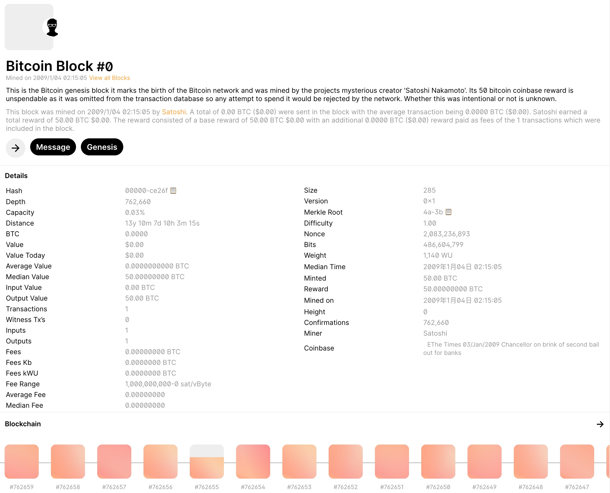

在上图中可以看到一个区块的所有详细信息，如区块hash、区块高度、区块大小(285B)和区块产生时间等。

## 比特币客户端（钱包）
也可以叫做数字货币钱包，它可以管理你的账户私钥，主要用途是用来接收或向他人转账比特币。数字货币已经发展多年，钱包技术经过多次迭代也发展出不同的版本，
如硬件钱包（离线钱包）、在线钱包、冷钱包/热钱包、桌面/移动钱包。需要明确的是，冷钱包/热钱包才是大分类，而硬件钱包和在线钱包、以及桌面/移动钱包只是大分类下的一种形式。
另外，还有浏览器插件钱包（属于热钱包），一般在电脑浏览器端使用。  

此外，还有轻钱包（Simplified Payment Verification,SPV）的概念，它的相对概念是全节点钱包、中心化钱包。

### 1. 冷钱包
是用于存储加密货币私钥地址的离线钱包。其功能是将私钥存储在不联网的硬件设备中，因此很安全。不联网的硬件设备可以是硬件钱包，
也可以是装有钱包软件但不联网的电子设备，如电脑、手机、U盘等。  

**硬件钱包**  
是用于存储加密资产私钥地址的专用电子设备，其功能就是将私钥存储在内部的芯片内，永远不会将设备直接联网，安全性很高。
>目前市面上的多数硬件钱包在对外转账时仍旧需要通过蓝牙/USB、二维码、TF卡和NFC等方式连接到手机或电脑中的配套app。其中二维码、TF卡和NFC的连接方式更好，因为使用时它们建立的是一次性连接，
> 可以将攻击面降到最小。而对于蓝牙和USB，虽然连接时间短暂，但这在这段「间接联网」的过程中也是非常危险的。
> 硬件钱包对外转账的过程本质上是生成交易信息后再使用私钥签名，然后将交易明文和签名广播到网络中等待矿工确认。
> 
> 对于收款场景，只需通过硬件钱包显示屏出示钱包地址或二维码即可，过程无需连接联网app。

目前市面上支持比特币的硬件钱包较多，这里列出几个用户较多的品牌，如Ledger、Trezor、KeepKey、OPendime、库神钱包(中国)。

### 2. 热钱包
和冷钱包相反，热钱包是通过联网存储的钱包。  
热钱包是指互联网能够访问你私钥的钱包，热钱包往往是在线钱包的形式，使用热钱包时，最好在不同平台设置不同的密码。且开启二次认证以确保资产安全。
一般而言，普通散户用得比较多的是热钱包，因为使用方便。而大户才会用冷钱包，因为资产庞大，预防黑客入侵的风险。
>使用交易所账户交易是一种常见的交易方式，而它的危险之处就在于交易所掌握了用户的私钥和助记词，用户钱包安全完全依赖交易所。
> 近年来交易所被攻击或一夜间卷款跑路导致大量用户损失资产的新闻不绝于耳。

### 3. 冷热钱包对比
安全方面，热钱包不如冷钱包，联网功能使得热钱包在安全性方面稍显逊色。但如果从便携方面考虑，联网状态下的热钱包可以随时进行资产交易，使用体验更加方便快捷。

### 4. 桌面钱包和移动钱包
其实就是在电脑上/手机上运行的客户端钱包，也属于在线钱包的一种。  
- 主流的桌面钱包有：Bitcoin Core，Atomic Wallet，BitPay，Electrum和Exodus等；  
- 主流的移动钱包有：欧易OKx、Tokenall、Blockchain、Coinbase、imtoken等。

### 5. 轻钱包和全节点钱包
#### 5.1 轻钱包  
轻钱包(SPV)是“Simplified Payment Verification”（简单支付验证）的缩写。指的是不加载全部账本的钱包，这类钱包只加载所有的block header，
然后验证某一笔交易的hash是否在其中即可验证某一笔支付是否完成。它的优点是轻量，占用空间小，但依赖网络中的其他全节点，属于去中心化钱包。  

#### 5.2 全节点钱包
轻钱包只具有「支付验证」的功能，而没有「交易验证」的功能。「交易验证」是一个矿工节点的作用，矿工挖矿本质上是先下载整条最长链上的账本信息到本地，
然后从网络中收集交易并**验证**和打包它们到区块的过程，其中的验证指的就是交易验证，这个验证过程包含遍历整个账本以确认转账方确实包含交易所需的货币金额。

如上所述，包含了完整账本信息的钱包就是全节点钱包，它和矿工的区别是它不挖矿。优点是交易确认最快，也最安全。全节点钱包也是最早出现的钱包版本。

#### 5.3 中心化钱包
在交易所创建的在线钱包就是中心化钱包，它不依赖去中心化网络，而是通过交易所服务器接口查询账户和交易信息。
- 中心化钱包的优点是使用方便，一个账户管理多个币种，即使忘记密码也能通过注册信息找回。
- 中心化钱包的缺点是资产所有权不在用户手中，因为私钥管理在平台手中，平台随时可以限制账户的交易和提现。（不过部分交易所也将私钥告知用户，但即便如此，平台也掌握了用户私钥）

### 6. 使用钱包注意
#### 6.1 备份好私钥和助记词
对于钱包的安全管理，一定要做好私钥或助记词的离线备份及存储，忘记它你将永远无法找回这个账户。切记助记词和私钥一定不要截图存在手机里或者在线保存在云盘中，不要复制粘贴收藏在社交平台上，也不要通过网络传输“私钥，助记词，密码。

#### 6.2 不要下载来历不能的软件
不要随便下载来历不明的软件，特别是加密货币资产相关的，下载软件一定要通过官网跳转下载。假如你在这些途径输入了私钥，从技术上来说，很容易就能获取。

#### 6.3 不要连接公共WiFi
若你使用在线钱包，请尽量不要连接公共WiFi，否则也可能造成你的数据泄露。


## 获取比特币
有几种途径可以获取：
- 接受其他人的转账
- 挖矿：购买专业矿机，加入矿池，挖矿成功后获得比特币奖励。但是主流币的挖矿门槛越来越高
- 从比特币交易所购买。如火币、币安、Coinbase等

## 交易比特币
这里在 https://electrum.org/#download 下载 electrum 轻钱包进行演示，笔者电脑是macOS，Windows系统请[参考此贴](https://www.jinse.com/news/blockchain/1019059.html) 。

### 1. 将钱包连接到测试网
在mac上双击.dmg安装包将app拖到应用程序目录，然后通过终端执行命令：`open -n /Applications/Electrum.app --args --testnet`

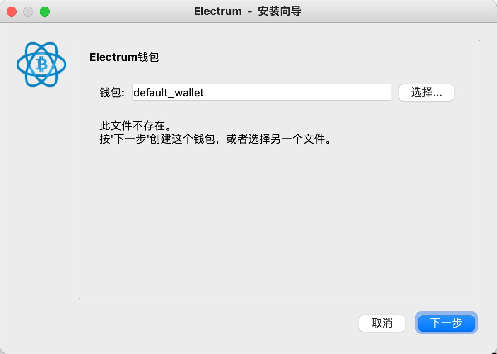

如图所示，点击下一步（名字不重要，可以命名为钱包1），选择标准钱包，下一步， 选择创建新的密语种子(助记词)，下一步，复制密语种子到你的记事本，下一步，
粘贴密语种子通过验证，下一步，输入密码用来加密存储本地钱包（重点是助记词），即可创建钱包，然后看到下图

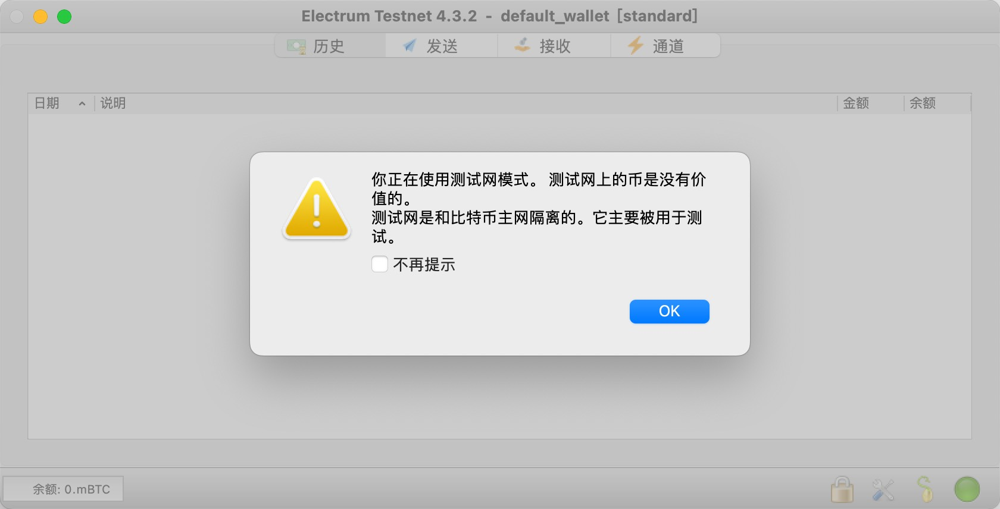

### 2. 获取测试网账户的比特币
首先，通过钱包获取收款地址，点击【接收】，输入请求的金额，大于1就行，点击创建请求，选择右侧【地址】，右下角左键复制地址

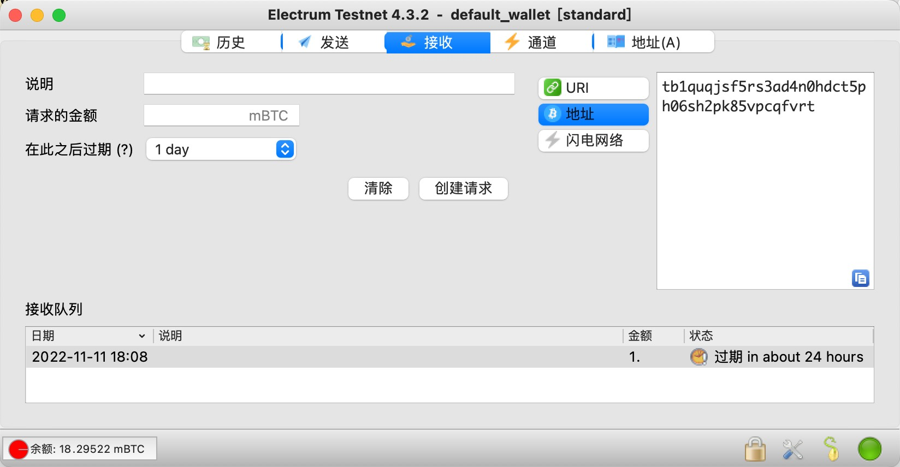

接下来，访问免费发币的测试网 https://coinfaucet.eu/en/btc-testnet/ ，输入框右键粘贴地址，点击按钮【Get bitcoins!】

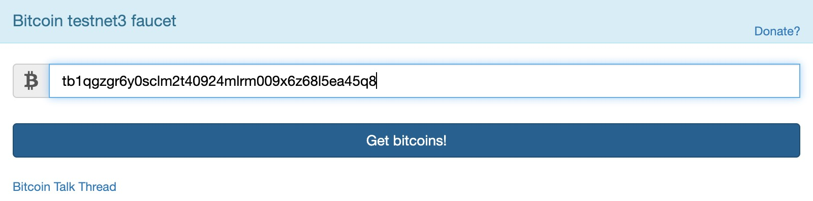

不出意外的话，你就可以看到下图所示的效果，表示交易发起成功，等待网络确认。注意，这里的金额并不是由我们决定的

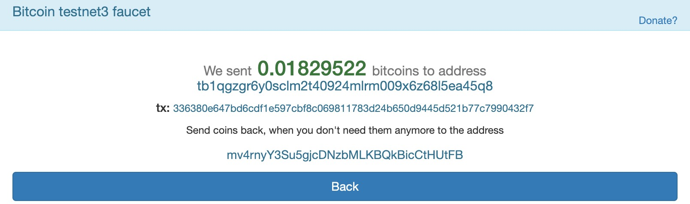

等几分钟后，交易确认完成，在【历史】菜单栏下可见交易记录，左下角余额从开始的红色变成绿色，红色表示未确认，
这里显示单位是mBTC，1BTC=1000mBTC，1mBTC = 100,000 satoshi，后者是BTC最小单位

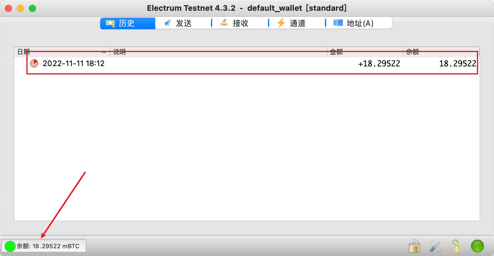

>需要注意的是：该站点对IP进行限制，每12h仅能使用一次转账功能。

### 3. 转出比特币
首先我们需要获取收款方地址，这里我们直接将BTC转回给原地址。右键【历史】中的交易记录，点击【查看交易】，如下图

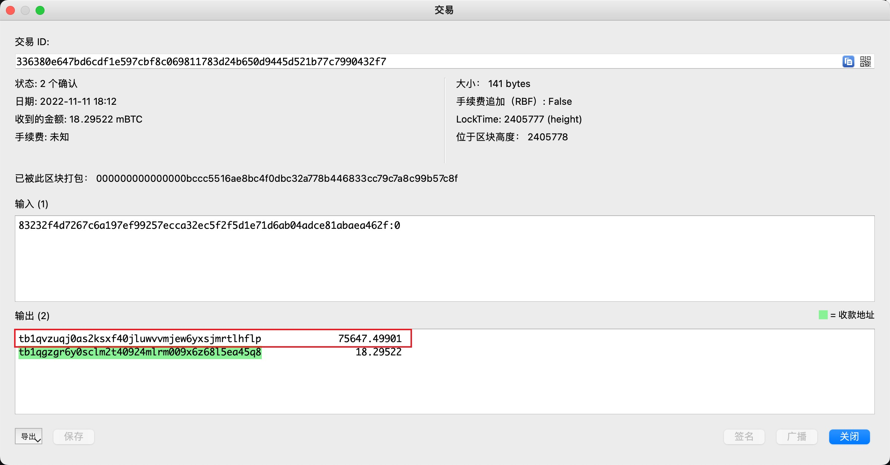

图中输出标记的位置就是原转账方地址，这里是根据地址后面的金额判断出来的，显然金额18前面是我们的地址，那剩余的钱必然转回原地址。
当然，这里也可以看到右侧提示绿色标记为收款地址，根据这一点也能看出来。那么复制该地址作为我们的收款方，然后在【发送】栏中输入交易相关信息。
>注意：千万不要复制【输入】框中的字符串作为收款地址，因为它并不是一个收款地址，而是一个UTXO指针（由上一笔交易ID+引用的输出索引号构成，下文会讲到）。
> 转账到一个无效收款地址会导致BTC损失，无法找回。

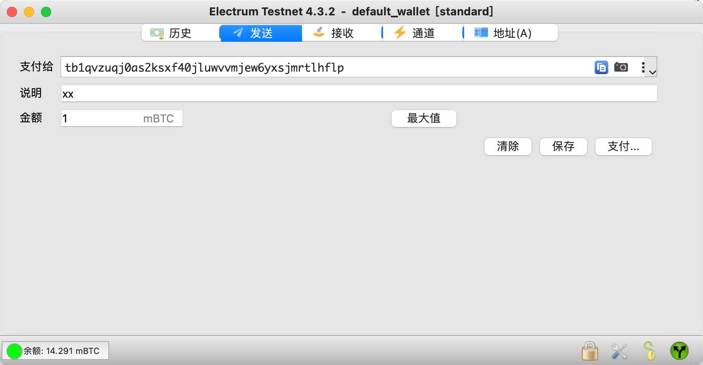

点击支付，输入密码，发起转账。几分钟后，交易被确认，下图展示笔者的两笔转出交易

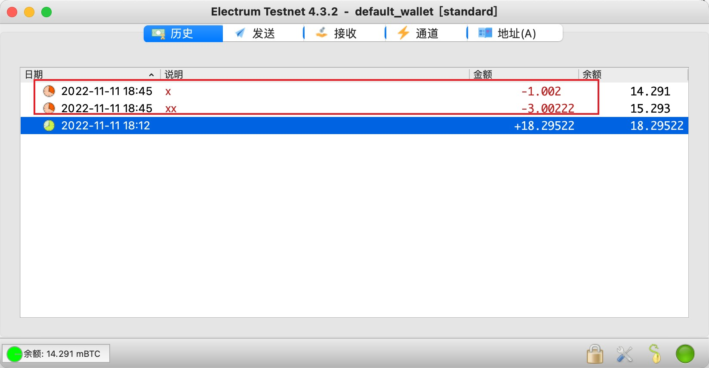

其中第二笔是支付到一个无效地址，但交易仍然能被确认，通过右键该笔交易，选择【使用区块链浏览器查看】，如下图

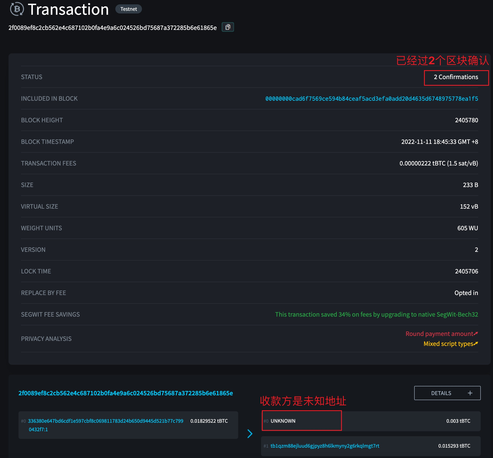

## 比特币的公钥、私钥、「账户」地址

在比特币系统中，比特币归属权完全绑定私钥，通过私钥可以计算出公钥和对外收款地址（比特币地址）。而比特币交易过程的交易验证则通过公钥+数字签名算法来进行。  
用户可以通过钱包软件生成和管理自己的私钥，这些操作完全在本地，不经过网络。所以比特币的资产所有权以及去中心化信任都是通过密码学算法来实现的。

### 1. 简述概念
**私钥**  
用来对账户拥有者发起的交易信息进行签名，交易信息和账户拥有者的公钥被广播至网络后，矿工使用公钥对交易信息进行验证，验证过程分两步：
一是通过验证签名来确认交易就是账户拥有者发起的交易；二是通过全账本UTXO集合找出该公钥地址确有足够比特币可以扣除。
>私钥永远私密保存，不会传播至网络，一旦暴露，如同将银行卡号和密码一同泄露。

**公钥**  
如上所述，公钥的使用者是网络中的矿工，被用于对账户拥有者发起的交易信息进行验证。
>公钥会随交易信息一起传播至比特币网络，所以是可以公开的。私钥可以推出公钥，但反之则不行。

**账户（比特币）地址**  
作为一般的对外公开收款地址，是将公钥通过多次哈希计算+Base58Check得来，通常也叫做公钥哈希地址。
>注意：公钥也可以直接作为对外收款地址，不直接使用公钥的原因一般是不想暴露公钥地址。

### 2. 安装libbitcoin-explorer工具
[libbitcoin-explorer](https://github.com/libbitcoin/libbitcoin-explorer) 是cpp写的一款cli工具，通过它可以看到比特币中各种密钥以及交易信息再不同生命周期阶段编码的样子，对于学习和理解比特币原理有很大帮助。
下面以macOS为例进行安装演示：
```
# 首先需要安装brew，这里假设你已安装
# 1. 安装依赖库
$ brew install autoconf automake libtool pkgconfig wget boost zeromq

# 2. 下载安装脚本
$ wget https://raw.githubusercontent.com/libbitcoin/libbitcoin-explorer/version3/install.sh && chmod +x install.sh

# 3. 先设置好命令行http_proxy，过程需要下载文件
$ export https_proxy=http://127.0.0.1:7890 http_proxy=http://127.0.0.1:7890 all_proxy=socks5://127.0.0.1:7890
# -- 注意raw.githubusercontent.com的域名劫持问题，如被解析到0.0.0.0或代理加速失效说明被劫持，需要修改dns，笔者使用的是114.114.114.114

# 4. 创建安装主目录，然后执行脚本(安装过程大概几分钟)
$ mkdir ~/libbitcoin-explorer
$ ./install.sh --prefix=~/libbitcoin-explorer/prefix --build-dir=~/libbitcoin-explorer/build \
--build-boost --build-zmq --disable-shared

# 5. 安装完成，得到可执行文件
$ lei@MacBook-Pro ~ % ./libbitcoin-explorer/prefix/bin/bx

Usage: bx COMMAND [--help]

Version: 3.7.0

Info: The bx commands are:

address-decode
address-embed
address-encode

...

# 6. 将bin目录添加到全局环境变量（可选）
sudo 修改/etc/paths（追加bin绝对路径然后新开shell窗口生效），或/etc/profile（追加 export PATH=$PATH:/path/to/libbitcoin-explorer/prefix/bin）
```

### 3. 生成私钥
比特币私钥通过椭圆曲线签名算法secp256kl生成，该算法标准中定义私钥长度256bit，即32Byte。也就是说比特币系统中一共最多可以生成2<sup>256</sup>个私钥，
且对应公钥和比特币地址也有一样多。这个数字比🌏上的沙子还多。所以也不用担心别人生成和你一样的私钥地址，还把你的比特币花掉。

本质上来说，私钥就是一个随机数，即可以是0\~2<sup>256</sup>之间的任意数字，算法实现一般通过调用操作系统底层随机数生成器来随机生成私钥。

**私钥编码**  
因为私钥是一位**256位整数**，**太长无法被人类记住**。因此，比特币有一种对私钥进行编码的方式，即带校验的Base58编码，而且有非压缩和压缩两种编码格式，
也分别对应非压缩和压缩的公钥格式。**由于公钥会附在交易信息中，为了减小账本空间，所以一般使用压缩格式公钥**。

下面使用上个步骤中下载的工具来生成私钥
```
# 1. 生成一个256位随机大整数，默认以十六进制显示
$ lei@WilldeMacBook-Pro ~ % bx seed | bx ec-new  // bx seed生成随机种子作为输入提供给ec-new命令
82e4dac3269c6ef55a3f25e5ef0265f73e25366f8cabba74d379ca1bac4398b6  // 十六进制的64位字符

# 2. 给随机数加上网络标识前缀，0x80标识mainnet主网，0xef表示testnet测试网，这里以主网为例，加上80
8082e4dac3269c6ef55a3f25e5ef0265f73e25366f8cabba74d379ca1bac4398b6

# 3. 添加公钥格式十六进制字符后缀：压缩公钥追加0x01，非压缩不追加，这里以压缩为例
8082e4dac3269c6ef55a3f25e5ef0265f73e25366f8cabba74d379ca1bac4398b601

# 4. 对上个步骤结果进行两次SHA256哈希: sha256(sha256(x))
$ lei@WilldeMacBook-Pro ~ % bx sha256 8082e4dac3269c6ef55a3f25e5ef0265f73e25366f8cabba74d379ca1bac4398b601
8ba3b4f90f95acce33661eee239ec02faf4f5b4337dad31dbd9ea6ce9e952a11
$ lei@WilldeMacBook-Pro ~ % bx sha256 8ba3b4f90f95acce33661eee239ec02faf4f5b4337dad31dbd9ea6ce9e952a11
611cef1d7ffeea5f4157cc5282c595ebd7a95bb9395bdd0605e409f9000a896c

# 5. 取上个步骤结果中前4字节，即0x611cef1d作为校验值，追加到步骤3结果的末尾
8082e4dac3269c6ef55a3f25e5ef0265f73e25366f8cabba74d379ca1bac4398b601611cef1d

# 6. 对上个步骤结果进行base58编码
$ lei@WilldeMacBook-Pro ~ % bx base58-encode 8082e4dac3269c6ef55a3f25e5ef0265f73e25366f8cabba74d379ca1bac4398b601611cef1d
L1c9kNdPw68cwn6WTE9wFpkYedeeQKxypGCjusYTgq4tc2oDjHJt
```
最后的结果`L1c9kNdPw68cwn6WTE9wFpkYedeeQKxypGCjusYTgq4tc2oDjHJt` 就是钱包客户端中常见的私钥格式，又称为钱包导入格式（WIF: wallet import format）。
 
### 4. 生成公钥
根据前述内容，我们知道比特币公钥有压缩和非压缩两种格式，对应两种格式的私钥。需要注意的是，非压缩公钥包含两部分，暂且叫做x,y（都是256位长度，共512位），
而且通过x能够推出y。首先取得上一节步骤1中的原始私钥为
`8082e4dac3269c6ef55a3f25e5ef0265f73e25366f8cabba74d379ca1bac4398b6`，下面进行演示：

#### 4.1 非压缩格式公钥（包含0x04的十六进制前缀）
```
# 使用原始十六进制私钥作为参数
$ lei@WilldeMacBook-Pro ~ % bx ec-to-public -u 82e4dac3269c6ef55a3f25e5ef0265f73e25366f8cabba74d379ca1bac4398b6
04c42c3b35f18de5b6976b02eb80ef937117e064b6c77b570893ae5fba3fac41c9e1a2e1aef64038c8f222f14b6f111aedf8898956c6b3deefd345bf926c2b9ca2
# 共520位，1字节的0x04前缀表示这是非压缩公钥，之后的512位分别是x，y（各256位），即
x=c42c3b35f18de5b6976b02eb80ef937117e064b6c77b570893ae5fba3fac41c9
y=e1a2e1aef64038c8f222f14b6f111aedf8898956c6b3deefd345bf926c2b9ca2
```

#### 4.2 压缩格式公钥（包含表示公钥y正负的前缀）
```
# 同样使用原始十六进制私钥作为参数
$ lei@WilldeMacBook-Pro ~ % bx ec-to-public 82e4dac3269c6ef55a3f25e5ef0265f73e25366f8cabba74d379ca1bac4398b6 
02c42c3b35f18de5b6976b02eb80ef937117e064b6c77b570893ae5fba3fac41c9  // 264bit
```
上述结果为264bit（33Byte），其中1字节的前缀表示公钥中的y的正负，0x02为正，0x03为负。

### 5. 生成账户（比特币）地址
账户地址通过公钥计算得来，取上文中压缩格式公钥为`02c42c3b35f18de5b6976b02eb80ef937117e064b6c77b570893ae5fba3fac41c9`，计算过程如下：
```
# 1. 对公钥进行一次SHA256
$ lei@WilldeMacBook-Pro ~ % bx sha256 02c42c3b35f18de5b6976b02eb80ef937117e064b6c77b570893ae5fba3fac41c9
c0b0c1f4066e2886bfa5fb7844b7b123362200b0ff26f45b6522f70588aeb1c3

# 2. 对上个步骤结果进行ripemd160再次哈希
$ lei@WilldeMacBook-Pro ~ % bx ripemd160 c0b0c1f4066e2886bfa5fb7844b7b123362200b0ff26f45b6522f70588aeb1c3
c6f4a45a003d829d3696228c8d26906e33c5f50e

# 3. 对上个步骤结果添加网络标识前缀，0x00表示主网，0x6f表示测试网，这里选择主网，添加前缀后如下
00c6f4a45a003d829d3696228c8d26906e33c5f50e

# 4. 对上个步骤结果进行两次SHA256哈希
$ lei@WilldeMacBook-Pro ~ % bx sha256 00c6f4a45a003d829d3696228c8d26906e33c5f50e
e8c6bc3fa9ba524bdb49515db90ff451ffba17cb3222d7532f8f5adb0758e06d
lei@WilldeMacBook-Pro ~ % bx sha256 e8c6bc3fa9ba524bdb49515db90ff451ffba17cb3222d7532f8f5adb0758e06d
1891874ae85fccd526b1a16cb0c93ae72d82447990e8a29b206a634c7da658c5

# 5. 取上个步骤结果前4字节作为校验码，拼接到步骤3结尾，如下
00c6f4a45a003d829d3696228c8d26906e33c5f50e1891874a

# 6. 对上个步骤结果进行base58Check编码，得到账户地址
$ lei@WilldeMacBook-Pro ~ % bx base58-encode 00c6f4a45a003d829d3696228c8d26906e33c5f50e1891874a
1K8ys1NjZjL1gcc4n2KtB74fhsFxbBBDQu
```
如上所述，由私钥`8082e4dac3269c6ef55a3f25e5ef0265f73e25366f8cabba74d379ca1bac4398b6` 最终生成的压缩公钥比特币地址是
`1K8ys1NjZjL1gcc4n2KtB74fhsFxbBBDQu`，同理，使用非压缩公钥进行同样步骤会得到另一个地址，这两个地址都对应同一个私钥，都是有效的。
上述步骤比较繁琐，我们可以通过私钥快速生成（压缩公钥对应的）比特币地址：
```
$ lei@WilldeMacBook-Pro ~ % echo 82e4dac3269c6ef55a3f25e5ef0265f73e25366f8cabba74d379ca1bac4398b6 |bx ec-to-public | bx ec-to-address
1K8ys1NjZjL1gcc4n2KtB74fhsFxbBBDQu    // 与上面的结果一致
```

## 交易过程
### 1. 创建交易
如A给B转账10BTC，首先是创建一张交易订单大致如下：
```
# Transaction for A->B
amount: 10 BTC
From: A的比特币地址
To：B的比特币地址
Signature: A对此交易订单的签名
```

### 2. 广播交易
合法交易会被节点发送给相连的其他节点，其他节点再执行相同步骤。几秒钟后，一笔有效交易就会以指数级的扩散速度在比特币网络中传播开来，直到所有节点都收到它。

### 3. 交易验证和打包
交易订单创建后，会被发送到至少一个与比特币网络相连的节点，节点会先验证交易是否合法。验证步骤主要包含：
- 交易语法和数据结果是否正确
- 交易总价值是否为0\~2100万
- 交易输入是否合法
- 交易解锁脚本能否解锁引用的UTXO锁定脚本（下文介绍）

如果验证不合法，则交易被节点拒绝，不会广播到网络中。  
验证合法的交易将被获得记账权的节点打包到区块中，区块会追加到节点本地的账本链条中，同时将区块广播到网络中其他节点。
>注意：交易是先被第一个收到的节点验证后再广播到网络中，随后被获得记账权的节点进行打包。

### 4. 交易确认
其他节点收到区块后，会对区块进行验证，验证内容包括
- 记账权归属是否正确
- 所有交易是否合法

如果区块验证通过，则接入到节点本地区块链中，并广播给相连节点。

### 5. 交易记录
为了防止分叉和双花问题，这笔交易所在区块之后又接上一个新的区块，成为这笔交易的一次确认，当经过6次确认时，可以认为交易永久上链，不可篡改。

## 基于UTXO的交易模型
### 1. 交易数据结构
在比特币系统中，没有一个中心化的位置可以查询账户余额，而是基于UTXO(Unspent Transaction outputs)模型进行余额确认的。关于UTXO的解释，请参考[比特币技术细节-UTXO小节](./bitcoin_tech_detail.md#utxo模型unspent-transaction-outputs) 。
在这个模型中，所有交易由n个输入和n个输出构成（n>0，coinbase没有输入），一笔比特币交易的数据结构如下图

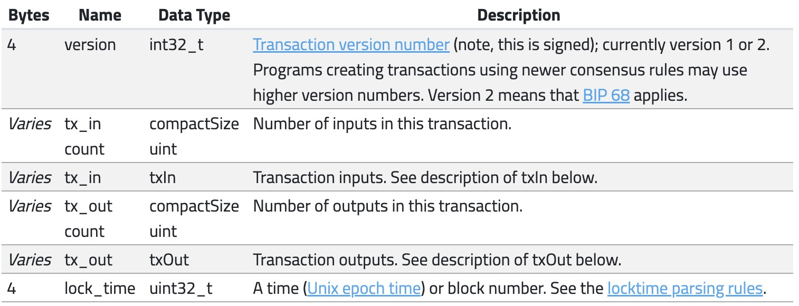

截取自 https://developer.bitcoin.org/reference/transactions.html#raw-transaction-format

其中从上到下依次是软件版本号，交易中input的数量，交易中input明细列表，交易中output数量，output明细列表，
锁定时间（多意义字段，为0时表示立即生效；<5亿时表示区块高度，并且是该区块高度之前锁定；>5亿时表示时间戳，并且是该时刻之前锁定）。

在比特币系统中，除了挖矿奖励外，其他任何交易的输入都来自于前面某个区块中的某笔交易的某个输出，就像是无数条链将所有交易串联起来，链头节点是Coinbase。
每一笔交易都可以查到对应来源。  
一笔交易的输入必须是从该用户的UTXO中创建而来。也就是说，在一笔交易中，输入是来自某一笔交易的UTXO，输出又可能作为后续某笔交易的输入，输入金额之和一定等于输出金额之和，
如此循环往复下去，使得比特币在不同私钥之间流转/交易。另外，在输出集合中，通常会包含一笔手续费，是支付给矿工作为酬劳的。
### 2. 交易输出和输入
#### 2.1 交易输出
交易输出结构如下图

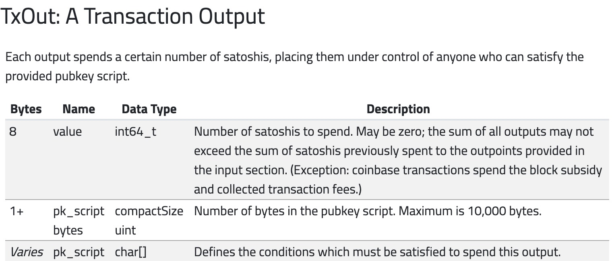

其中value是比特币数量，pk_script_bytes是锁定脚本大小，pk_script是锁定脚本（不定长）。锁定脚本好比是输出金额的一把锁，付款人将这笔输出金额锁住，
然后钥匙交给收款人，那就只有收款人能消费这笔金额。  
交易输出的类型有两种，分别是Standard TxOut（标准交易输出）和Coinbase TxOut（挖矿交易输出）。

#### 2.2 交易输入
它是指向一个UTXO的指针，指针由是上一笔交易的哈希ID和UTXO索引号n组成（n表示交易输出的序号，序号从0开始）。想要成功消费这笔UTXO中的金额，
就需要解锁脚本来解锁UTXO中的锁定脚本，所以交易输入又包含解锁脚本，也叫签名脚本。总体结构如下图

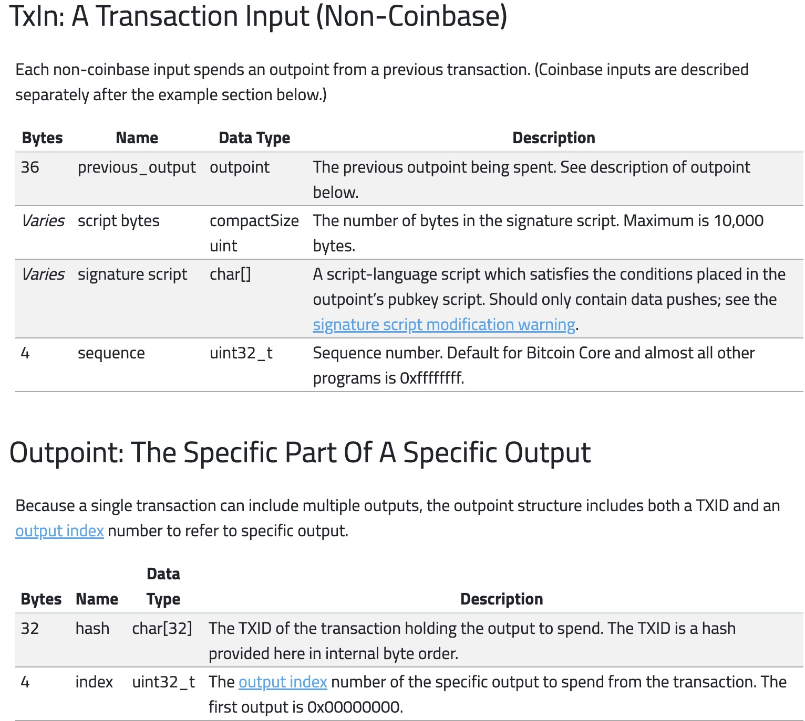

表一中的previous_output就是引用的UTXO指针，signature script就是解锁脚本，sequence是保留字段，固定为0xffffffff。表二其实就是指针构成。  
交易输入的类型有三种，分别是Standard TxIn、Spend Coinbase TxIn（花费挖矿交易输入）和Coinbase。

#### 2.3 交易手续费
>公式：手续费 = 所有输入之和 - 所有输出之和

在比特币交易中，交易费可以由用户来设置。需要注意的是，手续费与交易包含多少比特币无关，而是与交易大小（字节数）有关，也就是交易大小每一千字节所需的费用。
下图展示了[区块#762953](https://www.blockchain.com/explorer/blocks/btc/762953) 中第**2**笔交易的手续费

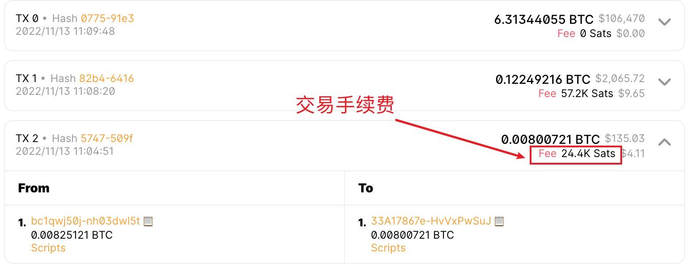

满足上述公式。当然，任何一笔交易都会满足这个公式。
>0.00825121 = 0.00800721 + 0.00024400 (1BTC = 1亿 satoshi)

## 锁定/解锁脚本
相信看完上文的读者一定对这个脚本的具体内容是急不可耐的想要了解了，本节将对它进行完整剖析。
### 1. 概念解释
锁定脚本英文叫做scriptPubKey，位于一个UTXO上，是花费这个UTXO的一把「锁」。通俗来讲，锁定脚本是交易时，由付款方创建的，内容包含了收款人的比特币地址信息。  

解锁脚本英文叫做scriptSig，是一把能够解开一个UTXO锁定脚本的钥匙，位于一笔交易的一个输入中，每个输入都有一个解锁脚本，对应一个UTXO。解锁后方能使用UTXO中的金额。
既然锁定脚本中包含的收款人的比特币地址信息，那么想要解锁，也就是验证下一笔交易输入的发起人是上一笔交易输入的收款人，那就需要**比特币地址信息对应的公钥和对应私钥签名**。

下图展示了比特币常见交易类型P2PKH（对公钥哈希付款）的两个脚本的结构组成


矿工收到交易时，会先使用堆栈执行这个交易所有输入中的解锁脚本，如果执行完没有报错，则会将执行结果进行复制。然后执行锁定脚本，如果成功执行且执行结果为True，
则说明解锁脚本正确解锁该UTXO，输入有效，最后标记该UTXO为【已使用】。 TODO：优化这段话

### 2. 比特币交易类型
在比特币系统中，一共定义了五种类型的标准交易脚本，分别是P2PKH、P2PK、MS、P2SH和OP_RETURN，下面一一介绍。
#### 2.1 P2PKH
它是Pay-to-public-key-hash的缩写，也是最常见的交易类型。这种交易类型中，锁定脚本内包含的主要内容就是收款人的公钥哈希，而解锁脚本中包含的是收款人的公钥和对应私钥签名。
解锁过程就是先验证公钥是否正确，再验证签名是否正确。P2PKH的锁定脚本格式如下：
>OP_DUP OP_HASH160 <PubKey_HASH> OP_EQUALVERIFY OP_CHECKSIG

而P2PKH的解锁脚本格式如下：
>\<Sig> \<PubKey>

---

参考
- [区块链技术开发指南-马兆丰](https://baike.baidu.com/item/区块链技术开发指南/56688853?fr=aladdin)