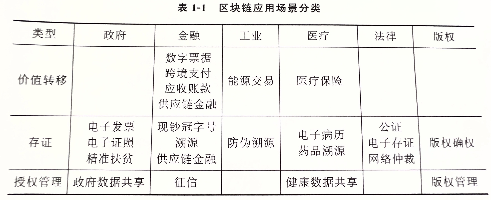

# 区块链金融

本文档主要介绍区块链在各类金融业务中的痛点和实际应用，以及创新点，内容主要节选、总结自书籍[《区块链金融》（赵华伟主编）](http://www.tup.tsinghua.edu.cn/booksCenter/book_08419801.html)

### 目录
- [区块链 + 数字货币](#区块链--数字货币)
- [区块链 + 征信](#区块链--征信)  

---

区块链之所以对金融行业有促进、创新作用，其核心之处就在于它能够用其去中心化、不可篡改特性打造一个由纯软件构成的无中介的数据生产和交换系统。如现实中的某某银行，
证券中心，保险机构，统统去掉，这个非常有利用普通用户；但这必然损害了一部分它们的利益，所以还必须在区块链系统之上构思新的审计和监管机制，这个叫创新，有利用
机构；另外除了在机构和用户之间直接去信任，还可以在机构之间去信任，让它们实现可信数据共享，这也有利于机构业务进行和单位监管。

## 应用场景汇总
根据实现方式和作用目的不同，当前基于区块链技术的应用可以划分为三类场景：
- 价值转移类：即实现数字资产在不同账户之间的转移，如跨境支付、数字货币
- 存证类：即将记录信息上链存储，作为存证/凭据，没有资产转移，如电子合同、发票
- 授权管理类：即利用智能合约控制数据访问，如数据共享

具体应用场景如下图：

## 区块链 + 数字货币
TODO

## 区块链 + 征信
TODO
