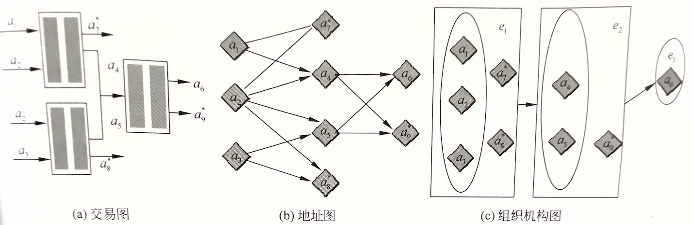
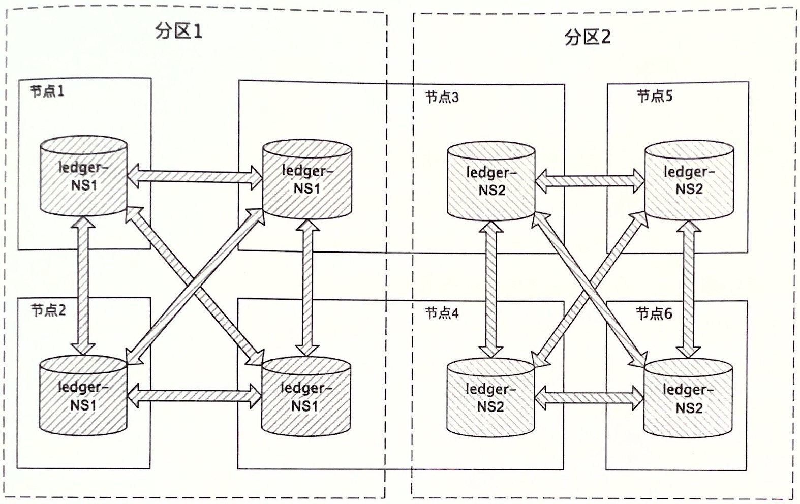
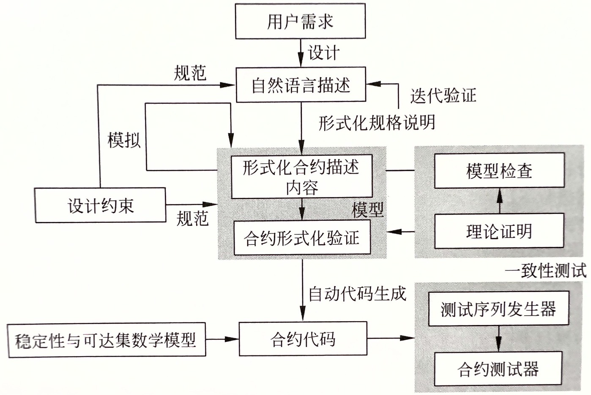
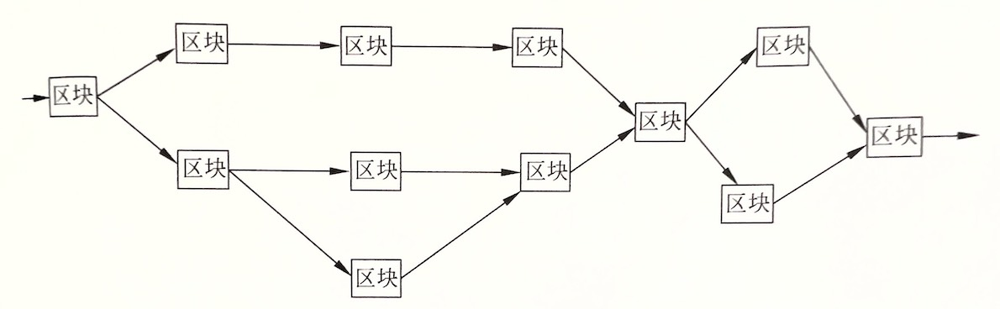
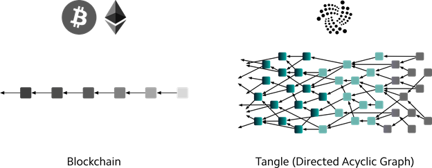
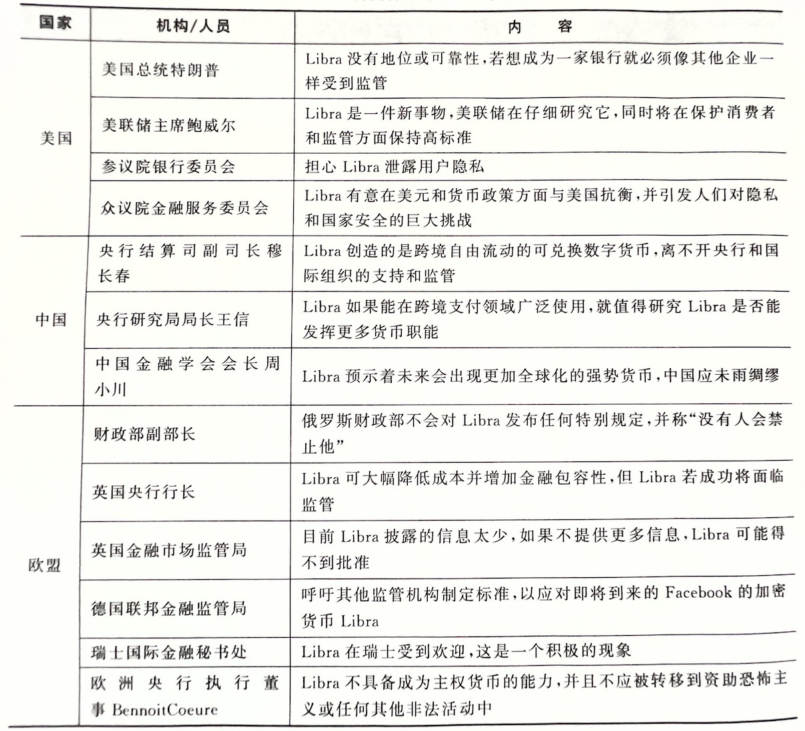

# 区块链技术细节（整理）
### 目录
<!-- TOC -->
  * [区块链分层参考模型](#区块链分层参考模型)
    * [1. 网络层](#1-网络层)
    * [2. 数据层](#2-数据层)
    * [3. 安全层](#3-安全层)
    * [4. 共识层](#4-共识层)
    * [5. 合约层](#5-合约层)
    * [6. 服务层](#6-服务层)
    * [7. 应用层](#7-应用层)
  * [区块链现存问题](#区块链现存问题)
    * [1. 数据冗余过量](#1-数据冗余过量)
    * [2. 系统安全](#2-系统安全)
    * [3. 共识算法](#3-共识算法)
    * [4. 可扩展性](#4-可扩展性)
  * [区块链安全问题](#区块链安全问题)
    * [1. 区块链安全属性](#1-区块链安全属性)
    * [2. 数据层安全](#2-数据层安全)
    * [3. 网络层安全](#3-网络层安全)
    * [4. 共识层安全](#4-共识层安全)
    * [5. 应用层安全](#5-应用层安全)
    * [6. 隐私保护](#6-隐私保护)
  * [智能合约安全检测](#智能合约安全检测)
    * [1. 智能合约概述](#1-智能合约概述)
    * [2. 安全代码编写建议](#2-安全代码编写建议)
  * [区块链前沿技术](#区块链前沿技术)
    * [1. 跨链技术](#1-跨链技术)
    * [2. EOS区块链](#2-EOS区块链)
    * [3. DAG区块链](#3-DAG区块链)
    * [4. JMP Coin](#4-jmp-coin)
    * [5. Libra](#5-libra)
<!-- TOC -->

## 区块链分层参考模型

### 1. 网络层

区块链技术网络层本质上是一个P2P网络。以比特币为例，网络层涉及技术主要包括有构建网络、传播机制、同步机制、验证机制以及其他一些高级功能。

#### 1.1 构建网络

区块链网络层一般也是基于TCP/IP的，比特币网络使用的是8333端口，节点加入也是建立对应TCP链接。首先需要先找到一些稳定可靠的合法节点地址，
将自己版本内容等基本信息发送给网络上的节点，网络上的节点收到后，会检测是否兼容，之后回复确认信息建立连接。

#### 1.2 传播机制

网络层的功能主要是节点之间传播各类信息。一般是指向网络中主动发送信息，并依次转发在全网广播开来。这种信息一般主要是用户钱包新生成的交易信息，以及矿工成功打包的区块信息。

#### 1.3 同步机制

指的是节点向邻居节点请求信息，用于同步各种数据。在比特币系统中，节点加入网络后，会向自己的邻居节点发送getaddr信息，请求自己的邻居节点将其维护的节点地址列表同步给自己；
除此之外，还会发送getblocks、getdata等请求来同步区块信息。

#### 1.4 验证机制

节点收到交易和区块信息后，对其合法性进行验证，只有合法正确的信息才会对其进行转发，如果不符合共识规则则丢弃。这样能保证全网中只传播合法信息，
不至于网络拥塞，同时防止DOS攻击。

#### 1.5 其他

在区块链技术发展过程中，不断加入了一些新功能和协议。例如，后来的比特币区块链中使用洋葱网络（Tor），原理是将用户发起的交易信息，
先在网络中找到一些节点转发，最后回到该用户自己，形成闭环，然后再从这个闭环内发送到全网，使得无法推断到底是哪个节点发起的这笔交易。

### 2. 数据层

区块链数据层就是嵌入式数据存储的一个分布式账本。除了账本外，节点一般会维护一些节点信息等元数据，属于区块链底层数据结构。目前包含的区块链数据层包含以下特征：

- 分布式账本：每个节点保存一份**完整**账本数据，存储于嵌入式数据库中；
- 区块结构：交易信息被打包成区块；
- 链式结构：所有区块通过哈希指针方式连接在一起，防止篡改；
- 节点信息：向邻居节点请求其维护的节点地址列表，这些返回值也会以文件形式存储在本地。

### 3. 安全层

主要是密码学中的技术，这层是区块链的安全保障。一般区块链中都涉及大量数字资产，所以区块链安全是现阶段比较重要，研究最广泛，成果最多的一个方向。
安全层提供的服务包括：

- 基础安全保证：在区块链的账户体系中，使用了椭圆曲线算法生成地址作为账户公开地址。另外，挖矿、地址生成、签名等多处使用了哈希算法。地址生成也用到了编解码算法；
- 隐私保护：比特币采用的是假名机制，由于账本是公开透明的，区块链不具备很好的隐私保护能力。目前区块链隐私保护的研究多集中在数字货币上，主要目标是将用户身份和交易
  以及交易金额做分离。现阶段可以被用于区块链隐私保护的技术主要有环签名技术、盲签名技术、零知识证明、同态加密以及新兴的安全多方计算。
- 网络安全：由于区块链网络的开放性，在设计区块链架构时，要重点考虑防止安全攻击的问题。常见攻击手段有：
    - DOS攻击：攻击者发送大量垃圾信息到某个节点或全网中，导致网络拥塞，造成DOS攻击；
    - 女巫攻击：攻击者搭建大量恶意节点，以此获得大量投票数；
    - 日蚀攻击：比特币单节点一般默认设置8个连接，攻击者可以设置8个恶意节点去连接至某个正常节点，导致其被隔离出比特币网络，这通常是针对交易所的攻击。
- 密钥安全：区块链之上的数字资产的拥有权完全绑定到单一秘钥，一旦丢失就无法找回。所以这是设计数字钱包时，需要重点考虑的问题。目前市场上的钱包一般分为
  硬件钱包、在线钱包等，它们在可用性和安全性方面有不同的考量。密钥安全涉及的技术，主要有分层确定性密钥管理、助记词、离线签名等。
- 算法安全：区块链设计过程中，也需要考虑所使用算法的安全性，必须使用那些目前被证明为极难被破解的算法。目前的区块链项目中多采用椭圆曲线算法、SHA-256等。

### 4. 共识层

这层的作用是让所有人按照一种机制对区块链的某一刻的状态达成一致性的认识，本质上是一个分布式系统中的一致性方案，用于解决拜占庭将军问题。区块链系统中
需要达成共识的内容主要包括三部分：交易、区块、以及一些其他共识内容。  
关于共识机制的研究成果已经有多种方案，如Paxos、Raft等；目前现有区块链项目中所采用的共识算法如下表所示：

| 项目                                              | 共识机制                           |
|-------------------------------------------------|--------------------------------|
| 比特币系列：以Bitcoin技术体系为基础发行 的数字货币，如莱特币、达世币、大零币等 | PoW                            |
| 点点币                                             | PoS                            |
| 以太坊                                             | PoW结合PoS，未来会升级到纯PoS共识          |
| 超级账本                                            | Kafka算法，Solo排序；共识机制可插拔，支持拜占庭容错 |
| 比特股、Steem、EOS等                                  | DPoS                           |
| 瑞波                                              | 瑞波共识（Ripple）                   |

### 5. 合约层

主要包括各种脚本、代码、算法机制和智能合约，它是区块链技术可编程的基础保证。合约层的本质是将代码逻辑存储在区块链中，实现可以自行定义和编写的智能合约，
在触发某一条件时，无需第三方调用，代码自动执行，即常说的「代码即法律」，这也是区块链去信任的基础。  
智能合约一般使用高级语言编写后，编译成为可供区块链用户调用的ABI二进制接口文件，部署到区块链上。目前公有链的智能合约编程分为两类：

- 以太坊：使用的是Solidity语言，执行环境是EVM虚拟机；
- EOS：它选用的语言是功能更强大的C++，执行环境是WebAssembly。并且EOS考虑了可扩展性设计，将会支持安全的沙盒环境设计成可插拔模式，将来可支持各种
  沙盒，以允许其他平台的智能合约无缝迁移到此平台。

### 6. 服务层

主要包括区块链中的数字货币发行机制和分配机制。比特币中引入挖矿奖励来激励节点加入去完成区块打包和验证工作；达氏币中加入网络成为混币节点需要抵押一部分
数字货币，如果作恶则不会返回；EOS为代表的基于DPoS共识建立的区块链系统中，为防止女巫攻击，使用代币作为抵押投票。在早期区块链体系中，被成为激励层。

### 7. 应用层

主要包括各类场景下的实际应用，类似常用的PC客户端、手机客户端等。二者区别是，区块链中的应用叫做去中心化应用（DApp）。由于早期区块链主要应用场景就是
数字货币，所以当时主要应用层就是各类数字货币钱包。  
目前，受限于行业生产关系变革中遇到的阻力，区块链应用暂时还没有彻底普及开来。典型的应用，如以太坊上运行最多的就是众筹项目，EOS上运行最多的应用集中
在博彩业。

## 区块链现存问题

### 1. 数据冗余过量

在一个完全去中心化的区块链系统中，用户如果想要亲自验证交易合法性，同时保证数据的可信、完整、未篡改的特性，用户就需要下载全部的账本。
随着时间的推移，区块链的数据量呈线性递增，长期以往，极大提高了用户的使用成本，导致用户只能依赖其他全节点去验证交易，然而这会导致新的中心化趋势。

以比特币为例，每10min产生一个区块，每个区块1MB，每年的区块增长速度为24x60/10x365=51.3GB，10年后大概需要5TB。EOS理论上可以达到太字节（百万TB），
按照一个交易100字节计算，1天的区块数据为1000000x100x60x60x24=7.8TB，一年的区块数据量为7.8x265=2868TB，到2023年大约需要14340TB存储空间。
另外，还需要包括智能合约代码以及用户上传的图片、视频等。普通用户个人用户显然无法承担如此巨大的存储空间。

### 2. 系统安全

区块链本质上是一个分布式数据库。与传统应用系统不同，在运行过程中，区块链会将数据信息采用分布式方式记录，并且通过共识机制由所有参与者共同记录。
整个区块链平台具有开放性的特点，特别是公有链中，任意节点可以自由加入/退出区块链网络，任意节点都可以存储整个账本数据。区块链的这种开放性也决定了其不同于传统技术的安全问题。

### 3. 共识算法

就目前业界研究情况来看，并不存在一种完美的共识算法适用于任何场景，每一种共识算法均有自己的优缺点，适用于不同的应用场景，我们只能根据实际应用来取舍。
例如，在最早的区块链平台中，比特币和以太坊都采用PoW算法。PoW算法是目前唯一经过严格数学论证的安全共识机制，但其缺点也是明显，那就是速度慢且严重浪费资源。
BitShare和EOS等所采用的DPoS共识机制虽然提高了效率，并解决了资源浪费的问题，但是牺牲了去中心化的特性，存在21个超级节点，并且共识的安全严重依赖于代币。

由于目前设计完美的共识机制几乎不太可能实现，所以大多数项目在开发区块链平台时，均会考虑可插拔共识机制，用户在实际部署应用时，可以根据场景使用合适的共识机制。

下表展示了常见共识机制之间的特点对比：

| 共识机制     | 是否挖矿 | 需要代币 | 安全性 | 资源消耗 | 去中心化程度 | 交易确认时间 | 交易性能 | 典型项目          | 适用场景   |
|----------|------|------|-----|------|--------|--------|------|---------------|--------|
| ByteBall | 否    | 是    | 高   | 小    | 不完全    | 长      | 高    | ByteBall      | DAG区块链 |
| IOTA     | 否    | 是    | 高   | 小    | 完全     | 长      | 高    | IOTA          | DAG区块链 |
| Pool验证池  | 否    | 否    | 高   | 小    | 不完全    | 实时     | 高    | 私有链           | 私有链    |
| Ripple   | 否    | 是    | 高   | 小    | 不完全    | 实时     | 高    | Ripple网       | 公有链    |
| Paxos    | 否    | 否    | 高   | 小    | 不完全    | 实时     | 高    | 暂无            | 联盟链    |
| PBFT     | 否    | 否    | 高   | 小    | 不完全    | 实时     | 高    | 超级账本          | 联盟链    |
| DPoS     | 否    | 是    | 高   | 小    | 不完全    | 秒级     | 高    | BitShare、EOS等 | 公有链    |
| PoS      | 是    | 是    | 高   | 一般   | 完全     | 短      | 低    | 点点币、未来币等      | 公有链    |
| PoW      | 是    | 是    | 高   | 大    | 完全     | 长      | 低    | 比特币、莱特币等      | 公有链    |

### 4. 可扩展性

区块链的可扩展性问题主要包括两个方面：交易效率和区块链的分叉与升级。

#### 4.1 交易性能

我们已经知道，比特币区块链每秒只能处理大概7笔交易，每笔交易需要接近1h的确认时间。相较于比特币，以太坊的处理速度得到了不小的改善，每秒可以处理二十多笔交易，
每笔交易一般推荐15-20个区块的确认，大约时间为4-8分钟。而现有的传统系统中，像支付宝交易的处理峰值可达每秒几十万，如果投入正式环境，区块链现有的处理速度实在难以让人满意。

可扩展性是传统分布式系统的基本特性，但区块链由于去中心化的要求，难以满足可扩展性。业界总结了一个三元悖论描述去中心化与可扩展性之间的矛盾，
尚未被严格证明，只能被称为猜想，但实际系统设计过程中却能感觉到时时受其挑战：去中心化、安全性、可扩展性这三个属性，区块链系统无法同时满足，最多三选二。
这也叫做分布式不可能三角。

就目前来说，解决区块链交易性能的主要方案有以下几种：  
**【共识机制创新】**  
从PoW到PoS再到DPoS和各种BFT类算法，共识机制不断创新，区块链平台性能也不断得到提升。**但需要明确的是**，后来创新的这些共识机制，
并非各方面都优于开始PoW，而是在其他方面作出了妥协，以达到提高交易性能的目的。比如PoS虽然解决了资源浪费问题，但是却产生了高概率分叉以及弱去中心化问题；
而DPoS虽然性能高，但是该算法以代理人共识取代全网共识的做法也受到一部分人的抨击。

**【交易通道】**  
交易通道的思路是保持底层区块链协议不变，将交易放到链下进行，通过改变协议用法的方式来解决扩展性问题。链下部分可以采用传统中心化分布式系统实现，
闪电网络是典型方案的一种。

**【分片处理】**  
以太坊项目正在研发中的分片（sharding）方案的总体思路是每个节点只处理一部分交易，比如一部分账户发起的交易，从而减轻节点的计算和存储负担。

**【多链架构】**  
主要思路是将原本的一条链分成多条链，每条链都负责部分计算和存储业务，并且有可扩展性，即链的数量可以随着业务量和数据的增加而增加，系统的总体性能和存储空间也会随之提升。
**侧链**技术就是一种方案。

#### 4.2 链的分叉（fork）

区块链的分叉，尤其是硬分叉也是一个目前难以解决的问题。最典型的例子，就是The
DAO事件所造成的以太坊分叉为ETH和ETC两条链，虽然为用户挽回了智能合约安全问题造成的损失，
但是导致了很大一部分人对区块链去中心化的质疑，显然这是靠中心化的运作强行更改了系统的运行轨迹。再比如BTC与BCH的分叉、BCH与BSV的分叉，也都造成了社区的分裂，
这不仅是技术层面的分歧，更多的也是各方利益使然。

**【硬分叉】**  
硬分叉是指代码修改后，旧节点拒绝接收新节点创造的区块。不符合原规则的区块将被忽略。硬分叉将会导致一个正在运行的区块链系统在某个区块高度发生永久分叉，
分叉点后产生的区块互不关联。硬分叉是**不向前兼容**的。

**【软分叉】**  
软分叉是指旧节点不会意识到系统代码发生改变，并继续接收新节点创造的区块，所以软分叉是**向前兼容**的。

分叉通常是为了解决当前系统中的某些问题，比如提高交易性能，亦或回滚某些交易（The DAO事件）。比特币采用的隔离见证就是一种软分叉方案，
隔离见证的思路是在不改变区块结构及参数的前提下，将签名信息放在块外存储，从而间接对区块扩容，提高了一些交易效率。而BCH则认为隔离见证只是减缓了网络拥塞问题，
也没有显著提高交易效率，还使得系统结构变得复杂，不利于未来系统改造。所以比特币社区又产生出另一种方案，那就是直接修改区块参数，将区块大小1MB的限制改为4MB。
显然，这种修改不是向前兼容的，旧节点不会认可4MB的区块，从而导致BTC分叉出了BCH。

## 区块链安全问题

相对于传统单点中心化服务的模式，区块链去中心化的特性在安全层面上已经是一种非常大的进步。在传统信息安全领域中，安全包括三个基本要素，
分别是保密性、完整性、可用性。本节从这三个方面入手，分析区块链自身所带的安全特性。

### 1. 区块链安全属性

#### 1.1 保密性

保密性是指要求保护数据内容不被泄露给非授权的个人、实体或流程，强调有用信息只被授权对象使用的特征。常用保密手段如下：

- 物理保密：利用限制、隔离、掩蔽、控制等措施，保护信息不被泄露；
- 防窃听：使对手侦听不对有用信息；
- 防辐射：防止有用信息以各种途径辐射出去；
- 信息加密：在密钥的控制下，用加密算法对信息加密存储、传播。即使对手得到了加密后的信息，也会因为没有密钥无法读取内容。

在区块链技术中，列举下面几种使用加密技术的场景：

- 存储用户密钥场景中使用了加密技术（用户设置一个密码来保存私钥在本地）
- 交易场景中使用了非对称加密技术来实现了无泄密授权（对交易签名）；
- 门罗币使用环签名算法来实现隐匿交易双方地址。

#### 1.2 完整性

完整性是指用户、进程或者硬件组件具有验证所发送或传送的内容的准确性的能力，并且进程或硬件组件不会被任何方式改变。完整性的目的是通过阻止威胁或探测威胁，保护可能遭到不同方式危害数据的完整性和数据相关属性的完整性。

区块链对数据的完整性实现了很好的保护。其主要通过链式账本、哈希加密以及交易签名技术保护了整个账本数据的完整性。

#### 1.3 可用性

可用性通常是指在某个考察期内系统正常运行的效率。可用性受到系统错误、基础设施问题、恶意攻击和系统负载等因素影响，通常以正常运行时间的百分比来衡量。
同时，如何在合理的时间内响应用户的请求也是可用性的一个重要方面。

在区块链系统中，由于多个节点的存在、多个备份的账本，从正常运行时间百分比的角度来看，可用性是增强的。以比特币为例，从2009年1月比特币网络正式启动至今，
已经有十多年的光阴，这期间只出现了有限次的安全事件，几乎一直处于稳定运行状态。但同样是由于这种分布式多备份的特性，数据同步和共识机制的存在，
使得区块链在性能方面与传统中心化系统相比还有很大差距。从这一角度讲，区块链在可用性方面，相较于保密性和完整性，还有很大的改进空间。

### 2. 数据层安全

#### 2.1 数据存储安全

在传统信息安全中，数据存储安全的目标包含多个方面，如保护机密数据、确保数据完整性、防止数据破坏和丢失等。而这些工作都是由提供服务的中心化机构来完成。
对于区块链技术来说，其账本具有分布式存储且不可篡改的特性，所以区块链上的数据天然具有存储安全的特性，而保护机密数据则需要区块链隐私保护技术来实现，
这一点在后续章节进行说明。

在传统信息安全中，实现数据安全的方式有很多种，如访问控制、增加安全硬件防护等。而区块链是一种开放、去中心化的技术，数据安全完全依赖于密码学技术，
例如比特币中交易和区块实体都涉及非对称加密算法、数字签名和哈希技术等多种密码学组件。为满足更高的隐私保护需求，还要引入**同态加密、环签名、零知识证明、
多方安全计算**等隐私保护技术。区块链本身开放式的技术特点也决定了其数据安全会面临与传统信息安全不同的风险。

综上所述，区块链数据层的安全主要包括两个方面，密码学算法本身的安全风险和区块链数据内容的安全风险。

**【一、密码算法安全风险】**  
信息安全理论中，密码算法安全分为信息论安全和计算安全。信息论安全是指无条件安全、绝对安全，但为了考虑实用性，我们所使用的密码均为计算安全，
即基于一个困难的数学假设，在现有计算能力下是解不开这个数学难题的。例如，现在区块链技术中常用到的椭圆曲线算法，就是基于离散对数问题，这种算法目前来看是安全的。
但是，从现代密码学发展历史来看，MD5/DES等早期常用算法均被证明了存在安全漏洞，以及SHA-1算法也在2005年2月被证明安全性不足，SHA-2和SHA-1类型，
虽然还未出现有效攻击，但安全性也被严重质疑。随着量子计算的飞速发展，现在被认为安全的算法，未来也未必是无懈可击。  
目前针对加密算法进行攻击的方式主要有穷举攻击、碰撞攻击、长度扩展攻击、后门攻击、量子攻击等。而量子计算对一般密码算法的影响如下表所示：

| 密码算法        | 类型   | 功能      | 安全性影响  |
|-------------|------|---------|--------|
| AES         | 对称密码 | 加密      | 攻击难度减半 |
| SHA-2,SHA-3 | 哈希算法 | 哈希      | 攻击难度减半 |
| RSA         | 公钥算法 | 加密      | 攻破     |
| ECDSA,ECDH  | 公钥算法 | 签名，密钥交换 | 攻破     |
| DSA         | 公钥算法 | 签名，密钥交换 | 攻破     |

**【二、链上内容安全风险】**  
由于区块链技术拥有不可篡改/删除的特性，给到了不法分子可利用之处。不法分子将大量有害信息、病毒特征码、淫秽信息等写入区块链中，影响区块链生态环境。
另一方面，大量垃圾交易数据攻击会阻塞区块链，使得正常交易和信息迟迟得不到处理。
另外，隐私保护也属于内容安全的一部分。用户不希望自己的交易记录被公开，所以如何保证数据不被篡改的同时，又能保证数据隐私是区块链领域中一个重要的研究课题。
目前，已有的解决方案分为两种：
- 借助密码学手段
- 借助硬件的TEE

第一种主要使用的是同态加密算法。第二种借助硬件的TEE，TEE指的是在处理器中创建一个Trusted Execution Environment（可信执行环境），
当用户执行需要数据严格保密的任务时，可借助TEE在一个CPU中的隔离环境中执行任务，数据只有在CPU内是明文，在内存或硬盘中均为密文，
能够有效抵御CPU以外的攻击，对操作系统或虚拟机的攻击都不会影响该机制的安全性。目前投入商用的主流TEE技术包括**ARM TrustZone和Intel SGX**技术。

#### 2.2 密钥存储安全

在目前的知名区块链应用中，不乏大量的加密货币应用，这其中涉及到数字资产交易，直接关系到用户利益，也成为攻击者的目标。即使现代密码学技术现阶段是安全的，
也是建立在密钥安全的基础上。然而现有区块链技术普遍缺乏有效的密钥管理技术。以比特币为例，每年因使用、存储不当导致的密钥丢失都会给用户带来巨大的利益损失。

目前，区块链技术中主流的密钥管理方法包括本地存储、离线存储、托管存储和门限钱包。

**【一、本地存储】**  
将密钥直接或加密存放在本地存储介质中，这种方法最不安全，很容易被恶意读取和使用，本地设备损坏时也无法恢复。

**【二、离线存储】**  
将密钥存储在不联网的离线设备中，完全与互联网隔离，如现在常见的硬件钱包，这种方案最大的问题是携带和使用不方便，而且有些离线存储方案在使用时仍需要接入互联网，
无法完全避免恶意软件的入侵。

**【三、托管存储】**  
可以使用第三方提供的托管服务管理密钥，但这显然违反了区块链去中心化的本意，密钥的安全与否完全取决于第三方机构的可信程度。

**【四、门限钱包】**  
使用门限加密技术将密钥分散处处在多个设备中，使用时需要多方参与，如常见的（t,n）门限密码算法，n个参与者中至少有t方参与才可恢复密钥，
允许最大t-1个被攻破。

### 3. 网络层安全
网络层的安全主要分为两个层面：传输信道安全和网络节点安全。  

#### 3.1 传输信道安全
如果没有安全可信的传输信道，那么区块链节点和节点之间任何通信的信任都无从谈起。特别是在有准入要求的联盟链和私有链网络中，身份鉴定和连接建立是一个整体，
因此节点准入机制也依赖网络层安全。部署共识算法依赖节点算法，如果不能保证网络中节点的合法性，那么共识算法的安全性也不能保证。

实践中，安全信道的建立和通信往往是对称和非对称加密算法的结合应用。例如，在TLS协议中，就是使用非对称加密算法来协商后续交换密文用到的对称加密密钥，
其中第一阶段是使用服务器返回包含公钥的可信证书来发布公钥的，简单的中间人攻击是没有用的，因为即使中间人获取到公钥，也无法解密公钥加密的密钥数据；
第一阶段负责协商出一个会话密钥，以供在第二阶段中进行对称加密会话使用，黑客无法窃取第一阶段中协商出的秘钥，自然也无法破解第二阶段中的会话内容。
>我们常说的SSL协议是TLS协议的前身，由于存在漏洞的原因已经被废弃使用。所以目前常用的是TLS协议，已经升级到1.3版本。

#### 3.2 网络节点安全
区块链中的网络节点，可能是云服务器，也可能是个人计算机，安全性必然参差不齐，对安全性较差的节点发起网络攻击，必然会造成严重的后果。
针对区块链分布式网络的安全风险，主要分为DDoS攻击、女巫攻击和日蚀攻击。

**【一、DDoS攻击】**  
由于目前区块链系统的处理能力有限，攻击者很容易向某个节点发送垃圾交易，通过较大流量致使该节点瘫痪。除此之外，攻击者也可以利用节点客户端的漏洞发起攻击，使其无法提供服务。
程度较轻的情况下，只攻击一个节点，使某个节点的用户无法使用区块链服务。程度严重的话，使网络中部分节点瘫痪，这就意味着全网的安全性直接降低，
例如在比特币网络，这意味着总体算力的下降，网络会更容易遭受51%攻击。而且，目前发起DDoS攻击的成本非常低，大量的攻击工具可以从黑市上轻易购买。

**【二、女巫攻击】**  
女巫攻击（Sybil Attack）是2002年提出的，它是作用于P2P网络中的一种攻击形式，攻击者控制**多个节点**
来伪造多个身份存在于P2P网络中，从而达到削弱网络的冗余性，
降低网络健壮性，监视或干扰网络正常活动等目的。  
目前，对抗女巫攻击的手段主要是防止身份伪造。由于公链和联盟链的网络结构不同，抗女巫攻击的方式一般也分为两种。
1. 公有链  
主要做法是设计共识机制时，不依赖于节点数量。常用共识机制PoW采用算力证明节点身份不是伪造的（算力提高伪造单个节点的伪造成本），算力大的具有主导权；
PoS采用代币也就是股权证明节点的身份不是伪造的，股权大的具有主导权；DPoS采用代币投票，而不是一机一票。
2. 联盟链  
联盟链主要采用的共识机制都是一机一票形式的，如PBFT。联盟链一般是引入身份认证的机制，具体分两种，基于第三方的身份认证和纯分布式的身份认证。
二者区别在于，前者需要一个可信机构管理身份认证，而纯分布式身份认证则需要全网大多数节点认证才可以加入网络。

**【三、日蚀攻击】**  
日蚀攻击（Eclipse Attack）是指攻击者利用节点间的拓扑关系实现网络隔离的一种典型攻击方式。其基本思想是攻击者通过网络拓扑控制目标节点的数据传入传出节点，
限制目标节点与外界的数据交互，甚至将目标节点与区块链主网隔离，使目标节点仅能接收到攻击传输的消息，导致目标节点保存的区块链视图与主网视图不一致，
破坏局部的一致性。  
日蚀攻击最早是一种针对比特币网络的攻击。每个比特币网络的节点最多可以允许117个网络节点接入（输入连接），同时默认向8个其他节点发起连接（输出连接）。日蚀攻击的目标就是建立足够多的节点，
让某个节点的输入连接和输出连接都是恶意节点，使得这个节点只可以和恶意节点通信，之后再发起攻击。这种攻击行为最常见的是攻击交易所的服务器。
除了比特币网络，也有研究人员在2018年1月9日向以太坊透露了它们的攻击方法，为此，以太坊开发者发布了一个补丁 Geth v1.8.1来修复这个漏洞。

### 4. 共识层安全

共识机制是区块链中各分布式节点能够协同运作的核心，但是现在没有一种完美的共识机制可以适用所有应用场景。通常来说，一般都是根据区块链平台的应用环境、
网络拓扑选择适合的共识机制。每一种共识机制都有自己的漏洞，本节我们列出几种常见的对共识算法的攻击手段。

#### 4.1 51%攻击

51%攻击主要针对PoW算法。PoW中如果攻击者掌握了全网51%的算力，那么就可以很轻易的从某个历史区块开始，生成一条高度大于现有主链的新链，这样就达到了篡改账本的目的。
虽然达到全网51%的算力是一件非常困难的事，但也并非不可能，如2019年1月份，以太经典（ETC）就受到了51%攻击。

#### 4.2 币龄累积攻击

这种攻击手段针对的是PoS算法。在PoS算法中，币龄条件也作为记账权的竞争资格之一，攻击者可以通过长期囤积代币的方式来轻易提高获得记账权的概率，
再通过组建大量节点获得记账权就能控制整个区块链网络的**共识**。

#### 4.3 自私挖矿

自私挖矿的概念最早在2014年提出。正常状态下，矿工挖到某个区块就立刻进行全网广播获取奖励，而在自私挖矿中，矿工维护了两条链，一条公开的，一条私有的，
具体操作流程如下：

1. 自私矿池挖到块A之后不直接发布全网，只在自己的矿池中广播该快，形成私有链，并且继续挖下一块B；
2. 当检测到网络上有人发出下一块A'时，再广播自己挖到的块A，使网络进入竞争状态（A与A'是相同高度区块）；
3. 再当自私矿池挖出B时，就直接发布，由于B是跟在A后面的，所以A-B这条链会大概率成为最长链，进而使得自私矿池可以获得块A和块B的收益，导致网络中其他节点在A'以及其分叉链上的挖矿行为无效；
4. 倘若其他诚实节点在A后挖出新块，自私矿池也可以享受A的收益；
5. 还有一种情况是其他诚实节点更快的挖到了A'之后的区块，那么自私矿池就没有任何收益。

这通常需要自私矿池在全网中拥有占比较高的算力，才能达到一定的收益率。

#### 4.4 贿赂攻击

贿赂攻击更多的针对节点个数有限的联盟链，一般是指恶意攻击者通过数字货币或法币贿赂共识节点，使其与自己共同工作在特定区块或分叉上，
来生成有利于攻击方的分叉链。以PBFT算法为例，可以容忍f个节点发生错误（全网至少有3f+1个节点），因此，只需贿赂f+1个节点就可以使共识停止，
贿赂2f+1个节点就能转变共识方向。

### 5. 应用层安全

一个面向用户的DApp应用都会有Web或者移动端App/传统Web App中所遇到的安全问题。在这里我们引用OWASP（Open Web Application
Security Project），
介绍一下其整理的10项最严重的Web App安全风险。

#### 5.1 注入

例如SQL注入、NoSQL注入、OS注入和LDAP注入的注入缺陷。攻击者的恶意数据可以诱使解析器在没有适当授权的情况下执行非预期命令或访问数据。

#### 5.2 失效的身份认证

通常，通过错误使用App的身份认证和会话管理功能，攻击者能够破译密码、密钥或会话Token，或者利用其他开发缺陷来暂时性或永久性冒充其他用户身份。

#### 5.3 敏感数据泄露

许多Web App和API都无法正确保护敏感数据，如财务、医疗等用户隐私数据。攻击者可以窃取这些未加密的数据来实施电信诈骗、身份冒充或其他犯罪行为。
因此，我们需要对敏感数据加密，这包括后台数据库、网络通信传输以及浏览器渲染中的数据。

#### 5.4 XML外部实体（XXE）

许多较早的或配置错误的XML处理器评估了XML文件中的外部实体引用。攻击者可以利用外部实体窃取使用URI文件处理器的内部文件和共享文件、监听内部扫描端口、执行远程代码和实施DOS攻击。

#### 5.5 失效的访问控制

未对通过身份验证的用户实施恰当的访问控制。攻击者可以利用这些缺陷访问未经授权的功能或数据。如访问其他用户账户、查看敏感文件、修改其他用户数据、更改访问权限等。

#### 5.6 安全配置错误

这是最常见的一种问题，通常是由于不安全的默认配置、不完整的临时配置、开源云存储、错误的HTTP头配置以及包含敏感信息的详细错误信息所造成的。
因此，不仅需要对所有的操作系统、框架、库和应用程序进行安全配置，而且必须及时修补和升级它们。

#### 5.7 跨站脚本（XSS）

当App的新网页中包含不受信任的、未经验证或转义的前端代码时，或者使用可以创建HTML或JS的浏览器API更新现有网页时，就会出现XSS缺陷。
XSS让攻击者能够在受害者的浏览器中执行脚本，并劫持用户会话、破坏网站或将用户重定向到恶意站点。

#### 5.8 不安全的反序列化

它也会导致远程代码执行。攻击者可以利用这种方式来执行包括重播攻击、注入攻击和特权升级攻击。

#### 5.9 使用含有已知漏洞的组件

组件（如库、框架和其他软件模块）拥有和应用程序相同的权限。如果应用程序中含有已知漏洞的组件被攻击者利用，可能会造成严重的数据丢失或服务器接管。

#### 5.10 不足的日志记录和监控

不足的日志记录和监控，以及事件响应缺失或无效的集成，使攻击者进一步攻击系统、保持持续性或转向更多系统，以及篡改、提取或销毁数据。大多数缺陷研究显示，
系统缺陷被检测出的时间超过200天，且通常是通过外部检测方得知，不是通过内部流程或监控检测得知。

### 6. 隐私保护

#### 6.1 比特币匿名性分析
比特币白皮书中简单描述了隐私保护方面的内容，大概内容是比特币的交易除了记录交易所必须的双方转账地址以及金额外，不会包含任何有关用户身份的数据。
更进一步，用户还可以在每次交易中都使用一个新的密钥对来隐匿账户的交易轨迹。

但是经过大量关于隐私和社交网络的研究之后，人们发现即使隐藏多重假名后，也会被串联起来，显露隐私信息，所以比特币并没有完全达到隐私保护的目的。
有研究人员对比特币账本的交易记录进行分析，根据交易之间的关系，从账本抽象总结出三种图状结构，交易图、地址图和组织机构图。如下图

图中a表示比特币地址，之后所有关于比特币隐私分析的结论都是在这个基础上进行的。

**【一、交易图】**  
交易图是最直观和简单的一种抽象。除了Coinbase交易外，比特币中一笔交易的输入一定是来源于上一笔交易的输出。如上图中的（a）所示推导，
最后可以表示为一种有向无环图结构*G(T, L)*，其中*T*代表整个账本的交易集合，*L*代表交易输入和输入指向的联系集合。

**【二、地址图】**  
由于每笔交易都是公开的，所以可以获取到每笔转账交易的来源地址和目的地址。对大量的交易地址转账方向分析之后，最终得到这个地址图，
从图中可以发现，有的是从一个地址转向多个地址，有的是从多个地址转向一个地址。

**【三、组织机构图】**  
比特币交易的特点，有一点是将多个未花费的输出组合起来，作为输入形成一笔交易。那么，这笔交易中的这些输入有极大可能性是来自同一组织机构之手。

将地址和身份对应起来还需要一些其他的方法。例如，一些地址是来自WikiLeaks和Silk Road公开的。也有一些在线服务、存储或交易所之类的，在使用前要求用户认证身份的。
还有一些是在公开的社交网络上通过爬虫获取，如bitcointalk等，这些工作都已经有研究人员完成。BitIodine则提供一种自动化的分析架构，使用上述方法论分析出交易图、
地址图、机构图，并归类，然后将用户和地址对应起来。

由上述分析可知，比特币系统中几乎没有使用什么隐私保护技术，仅仅是未明确将用户身份和账户地址绑定起来，而后者可以通过一些分析工作而实现。除了用户身份是隐私信息外，
交易本身和智能合约内容也属于隐私信息，所以区块链中的隐私保护主要涉及两个方面，一个是身份隐私保护，另一个是数据隐私保护。

#### 6.2 身份隐私保护
目前，大部分区块链采用的身份模型主要有两种，一种是公链普遍采用的签名验签，另一种是联盟链采用的PKI体系。

对于公链采用的签名验签技术，严格来说并不是完全「匿名」的，因为在大数据发展日益成熟的今天，匿名账号之间的交互完全能够暴露用户相当一部分的身份信息，
在有目的的攻击中往往还会结合社会工程学等手段，通过追溯账本上多个账户间的交易记录特征，能够大致刻画出用户身份。

相比公链，联盟链更关注监管和权限方面。因此大部分联盟链基本上选择了传统但发展成熟的PKI作为身份认证的基础体系。用户和节点持有相应证书来表明身份，完成准入或权限认证。
例如，用户的SDK调用应该使用SDK证书，每次调用都需要在请求报文中携带该证书。为了证明对SDK证书的所有权和保证请求内容的完整性，还应该附带SDK证书对请求内容的签名。

使用PKI完成身份认证和准入的优点是该体系已经被充分证明成熟可行，并且还能使用已有的TLS协议等完成信息的保密和完整性校验。但是，证书会暴露用户身份，
用户隐私得不到保证。一种弥补方案是使用临时证书，也就是在用户第一次连接到系统时使用基础证书来申请多个临时证书，之后的请求随机使用这些临时证书替代基础证书完成认证。
临时证书中没有用户的身份信息，一定程度上可以保护用户隐私。但这也只是增加了攻击者的工作量而已，而且每次都请求临时证书对区块链节点会造成签名和证书管理的压力。

因此，隐私保护应该更多地结合密码学手段进行，并且兼顾监管需求，从而避免陷入混乱。目前区块链产品较多采用的密码学手段有盲签名/群签名/环签名技术，还有直接匿名证明技术等。
下面进行一一介绍。

**【一、盲签名技术】**  
盲签名是一种具有盲性和不可追溯性的签名算法。盲性指的是签名者不知道具体签名内容，不可追溯性指的是当签名公开后，签名者不知道自己是哪一次签署的。
举例说明：签名者将对一个包含消息文件和一张复写纸的信封进行签名，签名者不能拆开信封查看内容。签名将透过复写纸签署到消息文件上。**注意**，这里涉及两点，
一点是签名者无法看到签名内容，也无法修改内容。第二点是签名公开后无法追溯签名所属人身份。通过这两点，其实就可以联想到其应用场景，比如匿名投票和匿名交易。

匿名投票不是无记名投票，如果完全不记名，那就可能出现伪造的投票，所以必须通过一种方式保证投票操作的合法性。匿名交易也是如此，依旧需要一种方式证明这笔钱来源真实账户。
如果不匿名，我们可以很快想到其实现方式，那就是明文的签名方式。而盲签名技术保留了签名这一操作，引入了**代理签名**的方式来实现其匿名性。

在盲签名技术中，使用某种方式对待签名内容进行模糊（使签名者无法看到明文）的操作叫做**盲化**，对签名进行处理得到原始签名（用来验签）的过程叫做**去盲化**。
在区块链中，常见的基于盲签名进行隐私保护的方案是设立一个密钥托管机构，由该机构对上链数据进行签名，通常先将上链数据盲化处理使机构无法查看和篡改数据，
然后数据交给机构签名并上链。这样就避免了托管方接触用户的隐私信息。

**【二、群签名和环签名技术】**  
**群签名**是一类特殊的签名算法。它除了具有一般签名算法的不可伪造/篡改、防抵赖性，还具有一些其他特性。

群签名允许群体中的成员以群成员身份进行签名，其他人只知道有个成员完成了签名不知道其身份。在验证签名时使用公共群公钥而不是某一成员的公钥。
简单来说，任何一个群成员都可以一个匿名身份代表整个群体对消息进行签名，仅用单个群公钥就能完成对签名的公开验证，所以群签名在隐私保护方面具有天然优势。
但是群签名也有一个缺点，那就是群管理员拥有查验签名者身份的特殊权限，这通常被认为群管理员的权限过大。

**环签名**是一种特殊的群签名，从门限群签名发展而来，主要解决群管理员权限过大的问题，能够更好地适用于隐私保护场景。假设一组用户，
每个用户都有公钥和私钥对（pk1,sk1），（pk2，sk3）...（pk3，sk3）。以用户i为例，给定消息m计算一个环签名s，输入参数为
（m, ski, pk1, sk1...pkn, skn）。谁都可以使用公开信息去验证签名的合法性，
如果签名是正确的，那么就可以通过验证。而对于验证人来说，只知道签名的人在这一组公钥集合中，而不知道是具体哪一个。

由于环签名更由于群签名，所以区块链中更多应用的是环签名技术。较为典型的是门罗币中的应用，当发送方要创建一笔交易时，
使用自己的私钥和随机选择其他用户的公钥来完成对交易数据的签名；在验证交易时，使用其他用户的公钥及交易签名中的参数进行验证。另外，
在部分依赖签名算法完成投票的共识算法中也有尝试。例如，运用环签名改进PBFT共识算法的签名和验证过程，从而解决区块链网络中节点的动态加入或退出问题。

**【三、直接匿名证明技术】**  
这是一种典型的有利于隐私保护的密码学手段，它融合了零知识证明和多种签名体制的密码学算法。下面通过一个实际场景来介绍直接匿名证明技术。

在设备制造过程中，生产厂家往往会在自己生产的设备中植入一个设备证书来避免造假者模仿并生成假冒伪劣产品。其原理是设备在使用过程中将设备证书发送到指定服务器，
即生产厂家的验证服务器。服务器在收到设备证书后验证其是否正版，然后返回一些指令告诉设备结果，设备根据返回做出不同响应。由于每个设备都有唯一证书，
厂家能够根据设备证书区分不同设备，从而对用户进行跟踪，因此用户隐私无从保障。所以需要一种新的正版验证方式，这种方式下，可以验证设备是否正版，
但厂家无法从多个设备中区分是哪台设备。

一种最简单但很弱鸡的方式是厂家可以为所有设备植入相同证书，说明自己不能区分某台设备。但是，这样的隐患在于如果某台设备被破解，那么这个防止盗版的措施就完全失效，
之后厂家也无法区分正版和盗版。

直接匿名证明就能够很好地解决上述问题。在应用这个技术后，每个设备都有不同的凭证，但设备不需要把凭证发给厂家，而是仅发送一个能够表明自己拥有正确凭证的证明（签名）。
首先，这个证明不会泄露任何设备凭证的信息；其次，同一个凭证可发出多个证明，但厂家不能判断出这多个证明来自同一个凭证。因此，
直接匿名证明拥有不可链接和最小披露的特点。最小披露是指当需要证明自己是合法设备时，仅证明自己是合法设备就可以了，不需要暴露其他信息，
这显著地不同于需要用户先披露身份，再根据用户身份查询是否合法的做法。

直接匿名证明技术在区块链中的应用，主要有Fabric中的IDEMIX。其大致应用过程是：签发机构先给用户颁发凭证，以证明用户的一组用户属性。
当用户需要向验证者证明身份时，可以使用该凭证生成一个自己拥有该凭证的「零知识证明」，在其中可以选择地仅公开必要的属性。例如，仅证明自己是某组织成员或仅证明自己的年龄大于多少等。
除了用户披露的信息，验证者不能得到其他用户信息。

**【四、技术优劣对比分析】**  
现在的隐私保护技术方案发展迅速，越来越多更强有力的方案被提出，如匿名凭证（Anonymous Credentials）、最小公开令牌（Minimal Disclosure Tokens）、
可自我保护凭证（Selfblindable Credentials）等。这些方案或多或少都结合了几种基本的密码学高级原语的综合性方案。在这些方案中，IBM的IDEMIX和Intel的EPID是相对成熟和可以信赖的设计。
但是这些设计的复杂原理都在某种程度上限制了推广，用户最后可能更倾向于选择稳妥的基于PKI的身份认证体系，而在隐私保护方面进行妥协。

#### 6.3 数据隐私保护
区块链作为一种公开账本，所有链上数据公开透明，其中不乏用户的账户以及交易记录等较为隐私的数据。而这在大部分人们看来是不能忍受的，所以，
传统的区块链系统逐渐不能满足实际应用。对于数据隐私保护方案，目前主要有工程上的账本隔离和密码学应用的账本加密。

**【一、账本隔离】**  
工程上的数据隔离中，可以分为粗粒度的分区共识与细粒度的隐私账本。

1. **分区共识**。它的思想主要是通过将不同业务的数据进行分流处理、分区存储，实现不同业务之间的隐私保护。在早期的做法当中，人们为了实现多业务并行，
为每个业务单独部署一套区块链平台，但这种做法显然成本较高，所以后来逐渐优化为分区共识。下面通过一张分区共识集群架构图来进行说明。

 

- 在一个节点上，我们将一个业务网络叫做一个分区（NameSpace，NS），每个分区都由一组可变的分区参与节点（NameSpace Participants，NSP）共同维护。
节点每参与一个新的业务，都要在本地开辟一个新分区。在上图中，节点1,2,3,4都参与了分区1，节点3,4还参与了分区2，所以节点1,2,3,4共享分区1的账本，
而节点3,4,5,6共享分区2的账本。需要注意的是，节点3,4上的两个分区的账本数据是隔离存储的，互不交互。

- 为了实现一个节点运行多个分区，需要一个分区管理器（NSM）来进行多分区管理。NSM是链上隐私保护的核心，它保证了不同分区间数据的分流执行与隔离存储，
实现单节点业务的并行处理。在引入NSM之前，单节点只需处理一个分区的交易请求，因此各模块之间相互耦合度较高。引入NSM后，为了实现交易的分流处理，
需要将各个模块拆分解耦，将主要模块由节点级别转化为分区级别。一个分区可以理解为一个虚拟的区块链网络，所有分区都可以单独处理各自分区内部的交易请求，
有各自的交易定序机制和执行引擎，并统一由NSM进行交易请求的分发。同时，为了提高底层的复用，所有分区共用一个物理网络层，而上层模块诸如共识层、执行层和存储层都是逻辑分离的。

- 分区共识的策略满足了业务级别、大数据量下隐私保护的需求。但是，并不是所有隐私数据请求都需要通过新建分区的方式来完成。一方面，一些简单的隐私数据请求如多方隐私存证等，
仅需要一条或若干条隐私交易请求就能完成，为每个数据量较小、交易频次也较小的隐私数据请求单独新建分区也是一种耗费资源的做法。

2. **隐私账本**。这是一种通过链上「双账本」的方式达到交易级别的隐私保护方案，可以解决**分区共识**面临的问题，即一个分区内存在公开和隐私两个账本，
隐私账本仅由隐私参与方节点共同维护。该方案实现了分区内交易级别、智能合约级别的隐私保护，通过在交易内指定隐私交易的参与方节点信息，用户可以选择分区参与方节点的任意合法子集作为本次隐私交易或隐私合约的参与方。
接受隐私交易/合约的中转节点负责将隐私数据同步至所有隐私参与方节点后，构造公开交易并进行分区内的全网共识。待最终公开交易同步至所有分区参与节点后，隐私参与节点再单独进行隐私账本更新。

- 其中的重点是，隐私交易/合约会通过将隐私数据转换为哈希值的方式与公开交易进行绑定，以便形成整体共识。

- 链上双账本架构解决了分区共识开销较大、不够灵活的问题，目前Fabric与Quorum链中均有类似实现，但是具体实现较为复杂，并依旧存在账本泄露风险，因此它与分区共识一样，
本质上都是通过数据隔离的方式提供一种隐私保护的工程上的数据隔离。如果想彻底地解决隐私保护问题，最根本的方法还是通过密码学方式进行数据源的加密保护。

**【二、账本加密】**  
目前区块链上的数据隐私保护方案主要分为两个方向：软件实现和硬件实现。软件实现中比较流行的几个方法是同态加密、零知识证明和安全多方计算；
硬件实现主要利用TEE来实现数据隐私保护。

1. **同态加密**。同态加密（Homomorphic encryption）是一种加密形式，它允许人们对密文进行特定形式的代数运算得到仍然是加密的结果，将其解密所得到的结果与对明文进行同样的运算结果一样。
换言之，这项技术令人们可以在加密的数据中进行诸如检索、比较等操作，得出正确的结果，而在整个处理过程中无需对数据进行解密。其意义在于，真正从根本上解决将数据及其操作委托给第三方时的保密问题，例如对于各种云计算的应用。
在区块链中可以应用同态加密来实现交易中金额的隐私计算以及保密存储，矿工无法得知交易中涉及的金额信息。

2. **零知识证明（ZKP）**。ZKP的概念初见于1985年的论文《互动证明系统的知识复杂性》。ZKP系统是一种密码学技术，允许两方（证明方和验证方）来证明某个提议是真实的，
而且无须泄露它是真实之外的任何信息。举个简单的例子，在机场领取丢失的行李箱时，你只需证明你知道行李箱的密码就能取走行李箱，这个时候你不需要说出行李箱密码，
而是说出其中的一两件物品特征然后再打开行李箱由工作人员检查即可。像这种无需泄露信息本身（如密码）而证明一个论述的过程就叫做零知识证明。目前，零知识证明用于区块链隐私的三种主要落地方案有Zk-SNARKs、Zk-STARKs和BulletProofs（防弹证明）。

3. **安全多方计算（SMPC）**。SMPC主要用于解决一组互不信任的参与方，在保护各自隐私的前提下，希望共同计算出一个函数并得到各自的输出，在这个过程中，除了应得到的输出之外，参与方不会得到任何额外信息。
具体来说，假设以P1，P2，...Pn代表多个参与者，各参与者希望共同安全地计算某个给定的具有n个输入和n个输出的函数：
F(x1, x2, ...xn)=(y1, y2, ...yn)，其中，函数F的n个输入分别由各方秘密提供，
在计算结束后，各方分别得到输出y1, y2, ...yn，在这个过程中，每个参与者Pi
除了知道xi, yi外，并不了解其他任何信息。

## 智能合约安全检测

### 1. 智能合约概述

#### 1.1 智能合约基本介绍

智能合约是在区块链上运行的程序，合约代码和状态存储在链中，它们可以发送和接收资金。今天，数以百万的智能合约在各个公链上运行，而且这一数字正在增长，
同时也埋下了越来越多的安全隐患。智能合约涉及的安全问题与传统代码不同，首先是它部署之后无法更新（也就无法升级或打补丁）；其次，它们是在一个新的运行时环境生态系统中编写的，
相对难以测试；第三，智能合约通常会直接涉及资金的操作，一旦被攻击者利用，会直接造成严重的经济损失。  
从2014年开始，层出不穷的智能合约安全漏洞事件造成了严重的资金损失，因此编写安全的智能合约极为重要。本章以以太坊上的智能合约漏洞为例，分析安全与不安全的智能合约代码，
总结编写安全的智能合约应遵守的规范及流程。

#### 1.2 智能合约漏洞分析

本章把以太坊智能合约漏洞发生的原因分为是哪个层面：Solidity层面、EVM层面和区块链层面。如下表所示，所列出的漏洞都有对应真实案例，这些漏洞造成了巨额的资金损失。

| 漏洞发生层面   | 漏洞描述                        |
|----------|-----------------------------|
| Solidity | 重入攻击、访问控制、整数溢出、未检查返回值、拒绝服务  |
| EVM      | 变量使用类型限制、合约Gas成本限制、调用堆栈深度限制 |
| 区块链底层    | 可被操控值依赖、私有变量依赖、阻塞交易攻击       |

**【一、Solidity层面】**  
这一层发生的漏洞主要是因为代码编写的逻辑问题或是使用了不当的Solidity内置方法，简而言之，它们基本都和Solidity的语言特性有关。例如

- 重入攻击，是由于外部函数对合约的send()或者call.value()方法进行了递归调用造成的漏洞，解决办法是改为使用transfer()，该方法只能被调用一次。需要注意的是合约中应避免使用send()或者call.value()方法，以免受到重入攻击；
- 访问控制攻击：是由于合约未设置函数的访问权限而造成的漏洞，解决办法是为函数加一个onlyOwner修饰符，限制函数访问；
- 整数溢出：是由于在这个语言中，要计算的数如果超过了EVM能处理的数字范围（0\~2256-1）就会重新从0或2256-1开始计数，解决办法是智能合约中只要是数学计算都使用safe-Math库；
- 未检查返回值：是由于合约使用了send()或call.value()函数，却没有检查函数是否执行成功就进行下一步操作导致的漏洞，解决办法是校验成功后再下一步；
- 拒绝服务：是由于攻击者恶意回退函数执行失败，使得原合约无法进行下一步操作而造成的漏洞，解决办法是把主动退款改为让用户申请退款，这样一个用户退款失败不影响合约继续执行。
这里需注意的是智能合约中能写成pull形式（用户主动发起调用）的代码不要写成push形式（合约主动执行操作）的代码；

**【二、EVM层面】**  
这一层发生的漏洞主要是由于EVM的限制导致的。 例如
- 变量使用类型限制：是因为var关键字声明变量时默认变量的类型是uint8，如果使用了for(var i=0;i<x;i++)这样的用法且恰好x>255，那将导致无限循环直到gas耗尽。
所以在编写合约时应显式标注变量类型，避免使用var；
- Gas限制：是由于在合约被调用时，每次修改合约状态都需要使用gas，如果一个函数涉及特别复杂的操作，需要消耗的gas达到了交易或区块的gas限制，那么对这个函数的调用将会在消耗很多gas的同时调用失败，
并回滚合约状态；
- 调用堆栈深度限制：是由于EVM最大允许栈深度为1024，如果调用者嵌套调用时，深度到1024，将会调用失败。

攻击者可以利用EVM的这三个限制使得合约调用失败，以此阻止合约下一步操作。避免这类漏洞的方法就是在编写合约中的函数时，避免让合约的下一步操作依赖这一步的状态。

**【三、区块链层面】**  
这一层主要有如下漏洞。  
**私有变量依赖**  
在Solidity中，私有变量虽然无法被自身合约以外的外围直接读取，但只要某一条交易中使用了这个私有变量，它就化私为公了。因为在以太坊中交易信息是全网公开的，
且每个交易的数据字段对应了规定的内容，只要对数据字段进行分析就可以知道私有变量的值。  

**被操控值依赖**  
智能合约中可被人为操控的值有随机数的种子、交易顺序、合约余额等。
- 随机数种子。在某类游戏合约中，通常需要依赖一个随机数下注来判断输赢。而计算机世界中不存在一个绝对随机数，只能通过seed去生成一个相对随机数，但如果这个seed是可预测的，那随机数也就不随机了。
智能合约新手习惯使用未来的区块头属性作为随机数种子，如区块Hash、区块高度、时间戳、难度值等，然而这些区块头属性的值都是可被矿工人为控制的，所以不能依赖这些属性作为随机数种子。
解决办法是使用链外可信第三方服务来获取随机数，如Oraclize；或者一些专门的随机数生成合约，如开源项目RANDAO。
- 交易顺序，也是可被矿工操作的。
- 合约中的Ether余额，这个值也特别容易诱导开发人员将其当做确定值来作为判断条件。尤其是Solidity新手可能会认为合约只能通过带有payable修饰符的函数接受Ether，
事实上，除此之外还有两种方式可将Ether强制发给合约，一种是通过selfdestruct自毁合约，可在删除合约地址中所有字节码的同时将合约存储的Ether强制发送到指定地址，
若这个地址是一个合约地址，那么这些Ether将不会调用这个合约的任何方法而是直接存入合约中。另一种更神奇的方式是让这个合约在出生前就拥有一笔财富，因为合约地址都是确定的，
可根据这个合约的创建人地址以及交易的nonce值计算得到，这样就可在创建这个合约之前就给它转入一笔Ether，当合约创建后就拥有非零Ether余额。  
合约逻辑应该避免依赖于合约余额的确切值，因为可能飞来横币。如果非要使用合约余额作为判断条件，也应根据实时查询到的合约当前余额来判断。

**阻塞交易攻击**  
以太坊智能合约中存在一个指令assert()用于断言，当assert参数不满足条件时，不仅交易失败，而且会消耗交易设置的gasLimit对应的gas费用，而花费gas越多的交易越容易被区块打包。
但每个区块总的gas数目也是有上限的，因此单笔交易使用的gas越多，区块包含的交易数就越少。在游戏合约中，就可以利用这个特点来破坏游戏公平，
假如某个游戏设定大奖的获得者是每轮游戏结束前最后一个购买道具的玩家，那么玩家们会在倒计时快要结束时，发起购买交易参与游戏，如果能幸运地在最后一刻被矿工打包，即可获胜。
如果恰好这个时候玩家能够调用游戏提供的函数查询倒计时以及最后一位玩家的购买地址，那么玩家就可以在查询得知刚好自己是最后一位时发送一条交易费很高的交易并通过assert()使gas被全部消耗，
吸引矿工优先打包并占满区块的gas，从而使得其他玩家的交易无法被正常打包，最终加速游戏结束，极大地提高了自己的中奖概率。  
所有采用类似机制，即需要玩家抢在某个时间范围内完成某种竞争操作的智能合约，都会受此种威胁。防范此类攻击只能通过完善游戏规则，如禁止玩家查看游戏具体进程的信息，
这样玩家就不知道当前最后一个参与者是谁。或者把最后一个参与者获奖改为只有一定的概率获奖，增加玩家的试错成本。

#### 1.3 智能合约检测现状
目前全球做智能合约安全审计的公司并不多，开发出形式化验证工具的更是少之又少，国内外做合约形式化验证的平台有俄罗斯的SmartDec、瑞士的Securify、
美国的Quantstamp和中国的Vaas，其中VaaS检测平台比较易用。除此之外，非基于形式化验证的工具有Solidity开发文档中推荐的SmartCheck、Oyente、Manticore、Mythril、Porosity等，
这些工具只能检测特定的部分漏洞。再者就是依靠专业智能合约审计人员人工检测，检测结果依赖审计人员水平而定。

#### 1.4 智能合约检测方法
大致有以下几种方法。
1. 把已知的可能存在漏洞的代码写在工具的源代码中，当待检测的合约代码有类似漏洞代码或逻辑时，便将其标记出来，这一类检测工具有SmarkCheck、Securify等。
2. 对合约代码进行反编译，然后通过对字节码的分析，找出漏洞，这一类检测工具有Oyente、Manticore、Mythril、Porosity等。
3. 通过生成一个DOT图，显示合约代码的功能控制流程，实现对代码逻辑的检测，这列工具主要有Solgraph。

还有一类检测方法与上述工具的检测思路都不一致，它就是形式化验证，这是形式化方法中的一部分。形式化方法就是用数学工具来进行定义、开发和验证一个系统。  
形式化验证是一种基于数学和逻辑学的方法，其应用于智能合约的过程简单来说就是在智能合约部署之前，对其代码和文档进行形式化建模，然后通过数学的手段对代码安全性和功能正确性进行严格证明，
可有效检测出智能合约是否存在安全漏洞和逻辑漏洞。下图展示了形式化验证应用于智能合约的过程

形式化验证方法可用于智能合约的建模、模型检测和验证过程，以支持规模化的智能合约生成。通过形式化验证，开发者可以直接发现代码中的逻辑漏洞和安全漏洞，或者自动生成安全的合约代码，
大大降低代码中漏洞存在的可能性，也弥补了人工方式对逻辑漏洞查找的不足。

### 2. 安全代码编写建议
#### 2.1 代码模块化
如果要编写逻辑复杂的合约，尽可能使合约代码模块化，使得一个模块只包含一个特定的功能。模块化不仅方便代码编写者对代码整体逻辑的把我，而且一旦代码发生错误，
也方便测试者定位代码的错误所在。

#### 2.2 使用安全代码
如果代码中需要使用的功能，已被安全审计智能合约框架所包含，直接调用已被审计过的代码比自己重写这个功能更安全。例如，在以太坊中发行ERC-20 代币的代码，
在开源框openZeppelin中已有经过大量安全测试的代码模板，使用此代码模板发行代币可避免很多安全风险。

#### 2.3 防范代码漏洞
针对上一节中描述的合约漏洞，需要在编码时加以防范，此处不再赘述。

#### 2.4 做好漏洞措施
无论使用何种检测方法/工具，漏洞都是无法完全避免的，这时就需要代码能在错误发生时自己暂停，以防继续被攻击，并能允许进行合约升级，一边合约继续使用。
此功能可使用assert()断言来实现，当断言条件不满足时（如本应为恒定值的代币总量发生变化），将触发断言失败，然后暂停合约执行。  
合约执行的方法有两种：
1. 虽然合约部署后不可更改，但可以利用一个专门的注册合约，在注册合约中保存最新版本的合约地址；
2. 另外一种就是更常见的方法。利用一个中间合约来转发调用数据到最新版本的合约。

防范可能发生的资金风险也可通过**限制转账速率**和**限制最大转账额度**来实现。这样当发生盗币危险时，可控制损失金额和给修复合约错误预留一定时间。

#### 2.5 合约测试
当合约代码编写完之后，发布之前还需要对合约进行大量测试。测试代码可以利用Truffle的测试框架来编写。Truffle是建立以太坊DApp的一套开发框架，
它提供了编译、部署、测试和创建合约所需的命令行工具，同时还提供了编写测试代码的包。利用它可以使用两种方法编写测试代码，一是使用JS编写，另一种是使用Solidity编写。
这两种方法对合约的执行方式有所不同。**执行方法不同**，在JS中被测试的合约所在客户端中执行，在Solidity中被测试的合约是通过被其他合约调用来执行。
使用JS编写测试代码时还可以使用Mocha测试框架和Chai断言库；Solidity测试可以与JS测试代码协同工作，编写完成后在命令行中使用`truffle test`命令运行它们。

在运行测试代码时，可现在以太坊轻节点Ganache中运行，以节省运行时间。但在生产环境中部署合约时，需要再次在Geth客户端或另外的以太坊客户端中运行测试。

智能合约编程和传统编程在资金安全方面有很多不同，首先是智能合约本身可以存储大量资金，一旦遭到攻击会直接导致资金损失，很容易被黑客当做攻击目标；
其次，智能合约代码是公开的，黑客可以不受限制地研究代码漏洞，只要代码存在漏洞，不被发现的概率很小，所以编写智能合约时需要尽可能详尽地考虑安全问题。
另外，由于智能合约在区块链上部署成功后就不能修改，即使发现了安全漏洞，也无法像传统程序那样打补丁或升级，所以合约编写者需要做到的是，一方面必须在编写代码过程中就把异常终止和升级逻辑写进智能合约，
另一方面必须减少编写不安全代码的概率。

## 区块链前沿技术
### 1. 跨链技术
#### 1.1 基本概念
跨链指的是一种跨区块链的解决方案，通过该方案可以实现在不同区块链之间进行价值转移，其中转移前的区块链被称为主链，转移后的链被称为侧链。
这种设想为数字资产在不同链之间转移打开了一扇大门，为开发新型的区块链应用和生态提供了条件，因为将来整个区块链生态中不可能只有一条链。同时，
也为区块链TPS提升提出了一种新的思路。

#### 1.2 产生背景
**【一、应对其他链带来的威胁】**  
作为区块链的创世鼻祖，多数交易所、挖矿公司都是以比特币起家，这使得比特币在整个区块链界长期占据着主导地位。但是，随着技术发展，市面上又出现了几种流行的主流区块链，如以太坊、比特股等。
特别是以太坊，其支持智能合约的特性对比特币产生极大的冲击，而基于比特币的项目至今仍然很少。而且，由于比特币共识机制的特性，对其进行重大改造升级，
基本是一件不可能的事情，提出侧链技术有助于在保持比特币主链不进行大的变动下，使得对其进行升级改造变得可能。

**【二、提升区块链可扩展性】**  
可扩展性一直是区块链网络的一个硬伤，提升区块链的交易吞吐率是现阶段一个非常重要的研究方向。不管是比特币后来升级的隔离见证技术或因区块扩容分叉出的BCH，
对交易吞吐率的提升都是十分有限的。以太坊目前（2022）交易的TPS也只有20笔左右，其现阶段的主要任务是升级到PoS共识、分片，最终目标就是提高全网吞吐率。
目前比较知名的Hyperledger Fabric等，在控制节点数量、缩短共识时间的前提下，TPS也只能达到1000笔。这与支付宝在"双十一"顶峰所达到的每秒几十万交易量相差实在太大。

如果实施跨链技术，就有望在多链上并发交易，那么吞吐率也会成倍增长。比如，将比特币的一部分交易放在其侧链上去执行，减轻主链的压力，这样便可以无形中提升比特币系统的可扩展性。

#### 1.3 实现方案
目前，主流的跨链技术方案的实现方式主要有三大类，分别是公证人机制、侧链/中继链和哈希锁定。

**【一、公证人机制】**  
也称为见证人机制，本质上是一种引入中介的方式。具体而言，假设区块链A和B本身并不能直接进行互操作的，那么它们可以引入一个共同信任的第三方作为中介，
由这个共同信任的中介进行跨链消息的验证和转发。这种实现方式的优点是能够灵活支持各种不同结构的区块链，缺点是存在中心化风险。

- 传统的公证人机制是基于中心化的交易所来实现跨链资产转移，实现起来比较容易，但功能也单一。以比特币和以太币的交换为例，具体流程是用户将自己在比特币区块链上的资产发送给托管方，
后者收到信息后，锁定比特币区块链上的资产，并且激活等价值的以太币区块链资产。这种方案最大的问题是拥有一个中心化的机构。
- 还有一种升级版的方式，将交易所省纪委一个由公正联盟使用多签名技术来控制的机构，不再是一个单一机构。这样使得想要偷窃已经锁定的数字资产，就需要得到多个机构的签名。
相对于传统交易所来说，安全性有所增加，但锁定数字资产的安全仍然取决于公正联盟的忠诚度。
- 最后一种是著名的分布式账本技术Ripple。它是采用类似公证人机制来解决全球金融机构之间的资产交换，并且不收取任何手续费，其交易可以在几秒内完成。读者可以谷歌上搜索关于Ripple共识的资料。

**【二、侧链/中继链】**  
**关于侧链**。实现侧链的技术基础是双向锚定（Two-way Peg），这种技术可以将数字资产在主链中锁定，同时在侧链中释放等价数字资产。而且可以这个操作可以反过来进行。
现阶段去中心化的双向锚定实现，主要基于SPV技术，这是一种只需要少量数据就可以证明某笔交易存在的方法，在这种模式下，可以将主链上的数字资产发送到一个特定的地址，
在经过一定区块链数量的确认交易生效之后，创建一个SPV证明发送到侧链，侧链收到后再验证主链上资产是否已经被锁定，同时释放侧链上等价的数字资产。
同理，在侧链经过一定区块数量确认之后，可以使用同样的操作，将侧链上的数字资产锁定发送到主链。  
BTC Relay号称史上第一个侧链。它通过以太坊构建了一个比特币的侧链，运用以太坊智能合约验证比特币交易的存在性。

**关于中继链**。中继链算是公证人机制和侧链机制的融合及扩展，即在两条链之间建立一条类似公证人角色的通信通道，如果这个通道本身也是一个区块链，
则称这个链为中继链。目前，比较著名的跨链项目Cosmos就是采用了中级链的多链多层架构，支持跨链资产交互。

### 2. EOS区块链
#### 2.1 基本介绍
EOS是当下最火的区块链技术之一，被社会广泛地看好为下一代区块链3.0。EOS的开发语言是C++。

EOS是奇才BM（DanielLarimer）领导的团队Block.one开发的类似操作系统的架构平台，旨在实现DApp的性能扩展（作者认为以太坊合约消耗gas不合理，并且合约运行仍然会受到交易阻塞的影响）。
EOS提供帐户，身份验证，数据库，异步通信以及在数以百计的CPU或集群上的程序调度。该技术的最终形式是一个体系架构，该架构目标是实现每秒支持数百万个交易，同时普通用户无需支付使用费用。
EOS通证（Token）则是EOS平台中的价值载体，是获取网络资源、用户进行投票等行为的重要工具，串联起了EOS生态中的各个角色。

>Daniel Larimer，江湖人称BM（Bytemaster），他的github账号就是Bytemaster。BM是目前世界上唯一一个连续成功开发了三个基于区块链技术的去中心化系统的人，
是Bitshares，Steemit和EOS的联合创始人。此人在区块链领域中可以算的上是一号传奇人物。

区块链诞生至今已超过10年，通过对区块链技术的学习和深入理解，可以认识到，下一代区块链不是比特币，更不是ICO，而是大规模的各行各业的DApp的崛起。
所以，能够做好大型商业应用的基建工作的公有链就是未来众多区块链中的宠儿。从这个角度去看，呼喊着百万级TPS，免手续费，快速部署DApp的EOS无疑切中了所有要点。

下面对一些名词进行解释：
- EOS.IO 是由Block.one团队开发的可构建公链的软件源代码；
- EOS platform，采用EOS.IO软件构建的公链平台；
- DApp，在EOS公链平台基于EOS.IO软件开发部署的去中心化应用。

### 3. DAG区块链
#### 3.1 基本概述
DAG是Directed Acyclic Graph，有向无环图，从数据结构上讲，就是一种任意一条边都有方向，并且不会形成环路的图形结构。

在传统区块链中，其数据结构就类似于一条单链表。有编程知识背景的人都知道，单链表是一种线性结构，元素的增减只能在一个方向上进行，以比特币为例，
平均10min生成一个区块添加到链上，由于区块大小是固定的，所以这10min内处理的交易量相当于也是在一个固定范围内的。所以，如果想提升区块链的吞吐量性能，
目前主要有三种思路，即缩短区块生成时间、区块扩容和改变账本数据结构。前两种思路已经有实际案例了，比如莱特币将出块时间缩短至2.5min，BCH将区块扩容至8M（原来是BTC的1MB），
第三种思路当然有人将其付诸实践。采用了DAG结构的区块链就是采用第三种思路，在同一时间周期内，可以在账本的最末端向多个方向添加新数据，让新数据的添加可以平行进行，
从而提高吞吐率。

#### 3.2 DAG与区块链
最早在区块链中引入DAG概念作为共识算法的是在2013年由ID为avivz78的以色列希伯来大学学者在bitcointalk.org上提出的，也就是GHOST协议，
作为比特币的交易吞吐率提高方案；Vitalik在《以太坊紫皮书》描述的PoS共识协议Casper也是基于GHOST PoW协议的PoS变种。

后来NXT社区有人提出用DAG的拓扑结构来存储区块，解决区块链的效率问题。在区块打包时间不变的情况下，网络中可以并行打包N个区块，网络中的交易就可以容纳N倍。
下图展示了一种DAG区块结构：

此时，DAG跟区块链的结合依旧停留在类似侧链的解决思路，交易打包可以并行在不同的分支链条进行，达到提升性能的目的。并且此时还有仍然有区块的概念。

2015年9月，Sergo Demian Lerner发表了DagCoin：_a cryptocurrency without blocks_ 一文，提出了DAG-Chain的概念，首次把DAG网络从区块成链这样的粗粒度提升到了基于交易成链的细粒度链式结构，
但DagCoin只是一篇论文，没有代码实现。它的思路是让每一笔交易都直接参与维护全网的交易顺序。交易发起后，直接广播全网，跳过打包区块阶段，达到所谓的Blockless。
这样省去了打包交易出块的事件。如前文提到的，DAG最初跟区块链的结合就是为了解决效率问题，现在不用打包确认，交易发起后直接广播网络确认，理论上效率得到了质的飞跃。
DAG进一步演变成了完全抛弃区块链的一种解决方案。

2016年7月，基于Bitcointalk论坛公布的创世贴，IOTA横空出世，随后Byteball也闪亮登场，二者是第一次真正实现DAG区块链网络，也是此领域最耀眼的领军者。
此时，号称无块之链（Blockless）、独树一帜的DAG链家族雏形基本形成。

综上所述，DAG是面向未来的新一代区块链，从图论拓扑模型宏观看，从单链进化到树状和网状、从区块粒度细化到交易粒度、从单点跃迁到并发写入，是区块链从容量到速度的一次重大革新。

#### 3.3 DAG区块链典型代表——IOTA
**【一、IOTA项目简介】**  
IOTA是在2015年创立的一个开源的分布式账户系统，专注于为物联网上的计算机之间提供安全的通信和支付。它使用DAG技术代替传统区块链结构，无论交易规模大小，
确认时间都非常快，系统可以同时处理的交易数量无限，并且系统可以轻松扩展，无手续费。IOTA的主要定位如下：
- 在物联网中起到小额支付作用，计算机间可以在无人干预的情况下自己交易；
- 可以进行物联网数据交易，如医疗科研机构可在用户自愿的情况下进行各种手环设备的数据采集。而用户也将有机会通过将其物联网设备连接到IOTA账本，
在市场中销售自己的数据并可以获得相应的IOTA代币奖励；
- 随着智慧城市、基础设施和智能电网、供应链、运输和移动性等领域的发展，IOTA的应用场景会越来越多，构建一个未来的物联网经济。其代币可以认为就是物联网的货币。

**【二、IOTA技术原理】**  
IOTA所使用到的主要技术是一种被称为缠结（Tangle）的分布式账本技术。与传统区块链不同，IOTA的分布式账本上没有区块，也没有链的概念。它是以交易为账本的基本单位，不存在全局的区块链，
取而代之的是一种DAG结构，其中DAG的每个节点就是一笔交易，Tangle就是由交易构成的有向无环图，全网的交易量也大，这个有向无环图的规模就越大。

当一个网络的节点用户要发起一笔新交易时，首先需要在Tangle账本中找两笔没有确认过的交易，去验证这两笔交易的合法性，并且将自己的交易指向这两笔交易，
整个Tangle账本就是这样一点点扩张出去的。正是因为这样的设计，IOTA中去除了矿工概念，交易验证工作由全网用户来完成，想要加入网络，就需要去验证交易，
而不是像比特币那样由矿工来完成，这样来达到完全的去中心化，而不是有几家超级矿工存在的那种伪去中心化。

下图展示了传统区块链与IOTA的账本结构对比：

#### 3.4 DAG区块链典型代表——ByteBall
**【一、ByteBall项目简介】**  
它是2017年诞生的比较有影响力的DAG区块链项目，如果是IOTA是面向工业领域的，那么ByteBall则是面向普通大众的。一个走的是精英路线，一个走的是人海路线，各有各的优势。
Byteball是一种具有防篡改证明的分布式数据存储系统，它可以存储任何数据，包括用于记录价值传输信息的数据，如数字资产、产权、债务、股份等。
存储单元之间采用前向引用的方式进行连接，每个存储单元将包含一个或多个之前的存储单元的哈希值，从而用来确认之前的单元并给出自身的偏序。
所有的存储单元之间的连接构成有向无环图。网络中不存在具有数据库管理权限的单店中心，所有人都可以在数据库中添加新的存储单元，只要提供响应的数据签名并支付与数据大小对应的手续费。
手续费将分配给包含该存储单元哈希值的那些存储单元。随着新的存储单元不断加入，前面的存储单元不断被确认。 

**【二、ByteBall技术原理】**  
1. **数据结构**。用户若想要将数据添加到数据库时，创建一个新的存储单元并将其广播给网络中其他节点，存储单元内容包括：
   1. 需要存储的数据。存储单元中可以包括多个数据包，数据包也称为消息。有许多不同类型的消息，每种消息都有自己的结构。其中一种消息类型是支付消息，用于将bytes或其他资产发送给接收方。
   2. 创建该单元的一个或多个用户的签名。用户是通过其地址标识的。类似比特币，用户可以拥有多个地址。在最简单的情况下，地址通过公钥生成，这也跟比特币类似。
   3. 引用一个或多个先前单元的哈希值（父单元）。

其与传统区块链的区别在于，Byteball中一个区块可以被多个区块引用，也可以引用多个区块，并不限定于传统区块中的一对一的关系。在新单元数量极少的情况下，
DAG会看起来像是一条单链，只有偶尔的分叉会快速合并。与传统区块链类似，Byteball中每个新区块需要确认所有先前的区块以及其中的交易，即每个新单元确认其父单元，以及父单元的父单元。。。

关于ByteBall的DAG区块链的更多细节，在此不再叙述。

#### 3.5 DAG区块链总结
DAG技术并不新鲜，但是应用到去中心化账本领域却是近几年的事情，没有像比特币经历过10多年的安全验证。目前大规模部署DApp的最大障碍。

DAG技术作为区块链的一个有益补充，其异步通信机制在提高扩展性、缩短确认时间和降低支付费用方面优势明显，未来在去中心化技术领域将会有一席之地。
其安全性和一致性的问题亟待解决，相信随着技术的发展，这些问题会得到逐步改善。

### 4. JMP Coin
#### 4.1 基本概述
美国时间2019年2月14日，摩根大通银行在官网宣布，将发行与美元等值的数字货币，实现机构客户之间的即时转账，即JMP Coin。这意味着全美最大的清算中心进军区块链领域，
发行与美元锚定的稳定币，用于**内部流通**。JMP Coin具有以下特点：
- 其不具备大部分基于区块链的加密货币的属性（不会在交易所流通），也不是法币；
- 解决的是实时全额结算问题，与普通投资者和机构没有关系；
- 锚定美元，即1JMP Coin=1美元，与USDT关系不大，与Ripple功能相似，对Ripple是降维打击；
- 是基于以太坊改造的Quorum链，引入了Zcash的隐私保护功能；
- 解决了银行业的一个大的合规痛点。

虽然，摩根大通成为美国第一家推出自家数字代币并加以实际应用的大型美国银行。但是早在2017年，该公司CEO Jamie Dimon曾将比特币描述为一种欺诈活动，
并表示任何参与比特币交易的员工都将因自己的「愚蠢」而被辞退。2018年，该公司和另外两家公司还禁止信用卡用户购买比特币。

尽管质疑比特币的合法性，但Dimon表示，他已经意识到区块链技术在为未来全球金融体系中的发展潜力。摩根大通公司已经发布自己的区块链平台Quorum，
目前有多个机构正在利用其追踪财务数据。

JMP Coin虽然是一种加密货币，但账本的查看、增加和监管只向部分节点开放。就代币的发行和使用来说，对象是严格限定的银行和金融机构，大众投资者无法参与。
就目前的功能来说，摩根币更接近于银行存单，银行之间的资金存入与转出，以摩根币为媒介，而摩根大通公司在其中发挥清算作用。

#### 4.2 技术特点
JMP Coin底层采用Quorum区块链技术，Quorum是基于以太坊改造而来，所以JMP Coin又被认为是企业级以太坊。Quorum是摩根大通在2017年3月推出的开源区块链平台，
是一种基于以太坊区块链开发的私有链平台，可以通过区块链架构提供私有智能合约的执行方案，满足企业性能的需求。关于Quorum技术在 [以太坊联盟链Quorum](./ethereum_tech_detail.md#1-以太坊联盟链Quorum)
有较详细的介绍。

**【一、以太坊主链兼容】**  
Quorum本身是在以太坊客户端的Go语言版本上改造而来，而且会跟随Go-Ethereum的版本更新，所以从技术角度上说，Quorum可以说是以太坊客户端的硬分叉版本。
这意味着Quorum可以兼容一切以太坊上的合约，包括如Truffle一样的开发框架，都可以直接部署在Quorum上。但是，Quorum和以太坊是两条不互相通的链，互通需要侧链技术。
与以太坊相比，Quorum更多的是一个联盟链，节点加入需要授权，所以节点身份都是已知的。另外，Quorum中将gasPrice设为0，交易无需手续费，也没有挖矿机制。
这些特点都使得Quorum区块链网络更适合企业级应用的需求。

**【二、注重隐私】**  
这是Quorum的核心功能之一，Quorum的交易分为公开和私有交易。公开交易与以太坊交易相同，在主链上完成交易，而私有交易放在链下由独立服务器进行加密处理。
Quorum主链上只存储加密后的数据哈希，私有数据存储于链下，节点之间通过管理引擎（Tessera或Constellation节点）共享。对于私有交易，只有交易相关方和监管方能看到细节。

2017年，Quorum与Zcash团队合作，提供一种链上隐私方案，连接私有合约以及主链，合约的商业逻辑在私有合约内达成一致，然后在主链上进行清算，并以零知识证明的方式使用z-token作为保护隐私的桥梁。

**【三、支持不同的共识机制】**  
Go-Quorum源代码中实现了IBFT、QBFT、Raft和Clique一共4种PoA类共识协议，使用者根据需求使用。PoA叫做权威证明，基于一组有身份的节点轮流记账。也就是说，
每个记账节点都是以自己的身份和权威来做背书，每个区块只需要一个签名就可以完成确认，从而大大提高交易吞吐率。但这种做法有中心化风险，PoA在设计时也考虑了限制单节点的权利，
每个节点出块的间隔区块数需要大于总节点个数的一半。

**【四、诞生意义】**  
作为第一家发行稳定币的主流机构，摩根大通发行JMP Coin的新闻一出现便立刻引来了各界的热议，最核心的意义主要有以下两点：
- 摩根大通使用区块链技术落地到了具体的银行业务。目前用于解决机构支付遇到的低效问题。比特币要颠覆的是金融业，结果金融业第一个与时俱进。
而且讽刺的是，第一个跟进的不是别人，正是一直以来痛斥比特币的摩根大通。
- 在美国有美联储之前，摩根大通是全美最大的清算中心。这次发行稳定币将先适用于机构间支付，未来将全面用于区块链技术重塑 存管、结算、清算等业务。

目前，JMP Coin采用的私有链的形式，未来势必会扩展到联盟链，甚至是公链形式。如果成功的话，对摩根金融服务竞争力的提高有很大帮助。
这会激励和迫使其他金融企业效仿，运用密码技术改造服务体系。从长期看，摩根大通发行JMP Coin对密码货币普及、国际金融体系革新和全球密码经济构建具有重要意义。

### 5. Libra
#### 5.1 基本概述
Libra是全球社交巨头Facebook准备发行的数字货币。经过几个月的预热期，2019年6月18日，Facebook发布Libra白皮书，标志着Libra项目正式推出。
白皮书中提到，Libra旨在成为一个新的去中心化的区块链、低波动性加密货币和一个智能合约平台，旨在创造一个新的机会，负责金融服务创新，最终建立一套简单的、无国界的货币和为数十亿人服务的金融基础设施。
总体来说，Libra具有以下特点。

**【一、稳定币】**  
现有数字货币中，以BTC和ETH为例，价格波动非常巨大，不能用来作为支付工具。而Libra不同，为了自己价值的稳定并且规模易于扩展收缩，会选择法定货币以及政府债券作为抵押，
发行抵押多种低风险法定金融资产的数字货币，并引入多家金融资产托管机构分散货托管。如此一来，Libra有对应实际抵押资产，可以尽可能降低波动性。

**【二、货币储备】**  
Libra的法定资产储备包括一系列「低波动性」资产，如银行存储和来自稳定中央银行（如美元、英镑、欧元和日元等）的货币证券。Libra并不是与单一的货币挂钩，
也没有任何现实货币的固定价值，所以严格意义上来讲，Libra不算真正的稳定币，而是一种「低波动币」。

**【三、非营利性组织管理】**  
Libra虽然由Facebook提出，但后转交给一个独立的非营利性成员制组织进行管理，总部设在瑞士日内瓦。协会旨在协调和提供网络与资产储备的管理框架，
并牵头进行能够产生社会影响力的资助，为普惠金融提供支持。Libra的成员分布于不同地理区域的多个行业、非盈利组织、多边组织和学术机构，到2020年上半年发布时，
预计成员数量达到100个左右。Facebook团队在Libra区块链诞生中扮演了关键角色，并将保持领导角色至2019年结束。

**【四、基于区块链技术】**  
金融服务的健康竞争和创新，最关键的先决条件是能够依靠通用基础设施来处理交易，维护账户以及确保跨服务和组织的互操作性。通过降低进入门槛和转换成本，
Libra希望将初创公司和现有企业能在竞争中发挥作用，并尝试新型商业模式和金融作用。而区块链技术非常适合去解决这些问题，因为区块链技术可以用来确保没有任何一个实体可以控制生态系统，
所以Libra使用区块链作为其底层技术。

**【五、监管】**  
以Libra区块链为基础的开发商有责任遵守其运营所在司法区的法律法规，Libra区块链本身不受监管。

#### 5.2 技术特点
**【一、总体设计】**  
Libra在设计上把自己定义为一个密码学技术认证的可信数据库（**a cryptographically authenticated database**），这个数据库就是常说的区块链平台中的世界状态（world state），
是一个全局状态的统一账本。密码学技术论证的意思是指这个全局状态的账本是通过密码学技术验证的，通过技术手段保证数据真实可靠，而不是依靠某个中心机构信用背书。
在Libra区块链上，有两类节点：客户端节点（Client）和验证节点（Validator）。Client可以提交交易、查询账本、查询历史状态以及请求Validator同步账本数据。
Validator负责根据Libra协议去处理这些交易并维护账本更新，类似于比特币和以太坊中的矿工角色。

**【二、账户模型】**  
Libra的账户模型与以太坊非常相似，其地址由一个非对称密码算法的公钥计算而来，用户可以使用公开的密码算法计算一个密钥对，之后由一个已经存在的账户使用生成的公钥做参数发起一笔创建账户的交易，。
便可以生成一个由对应私钥控制的账户。一个用户可以有多个账户，且具有匿名性，账户地址并不与用户现实真实身份所绑定。从逻辑上看，账户是一个拥有两类资源的集合：
Modules（程序代码）和Resources（数据）。Modules存储了一段代码，类似以太坊中的智能合约，定义了名称、变量和方法，但是和智能合约又有本质区别，
体现在下面三个方面：
- 二者看起来形式上都与面向对象编程中的Class非常相似，但智能合约更像是设计模式中所说的单例模式，而Modules可以被创建任意个实例，每个用户都可以创建自己在某个Modules的实例。
- 智能合约的值一般存在合约内定义的变量中，而每个用户在Modules上创建的实例的值都存储在对应的Resources中，通过自己的账户地址和Modules所在地址进行索引。
在Modules中的变量都是私有变量，不能直接外部访问。
- Modules中的方法都是静态方法，不是实例方法，并且没有this或self之类的概念。

**【三、交易结构】**  
如下表所示：

| 字段                  | 含义                                       |
|---------------------|------------------------------------------|
| Sender address      | 交易发起者的地址                                 |
| Sender's public key | 交易发起者的公钥                                 |
| Program             | 交易指令，一段代码                                |
| Gas Price           | Gas价格，与以太坊中的相同，执行每一行指令都需要消耗Gas费用，防止DoS攻击 |
| Maximum gas amount  | 客户愿意为交易支付的Gas费用上限                        |
| Sequence number     | 序列号                                      |
| Expiration time     | 失效时间（如果一个交易在失效时间之前没有被执行，则交易作废）           |
| Signature           | 数字签名                                     |

从表中可以看出，Libra交易结构的主要部分与以太坊大体一致，使用数字签名验证交易合法性，使用gas防止DoS攻击，使用序列号防止重放攻击。
唯一不同的是Program，这有点类似智能合约，增加了交易的可编程性。

**【四、Move语言】**  
Move语言是Libra区块链在设计过程中所创建的一种新的编程语言，在整个Libra区块链系统中，Move语言包括一下三种主要功能：
- 编写交易脚本，使交易变得灵活；
- 编写Modules，类似以太坊中的Solidity编写智能合约；
- 配置和扩展Libra协议。

Move程序包括三部分，source code、intermediate representation（IR）和bytecode。这里主要解释IR，它是一种更高层次的人类可读代码，
可以被用户用来快速开发安全智能合约。但是，系统运行初期，这些不会对普通用户开放，白皮书中的说法是方便解决后续智能合约在虚拟机中执行时遇到的可扩展性瓶颈等问题。

#### 5.3 各界声音
Facebook作为一家美国公司，首先迎来了美国监管机构的质疑。美国时间2019年7月2日下午，美国国会众议院金融服务委员会突然向扎克伯格等Facebook高管致函，
要求其立即停止数字货币/钱包项目Libra/Calibra的所有工作。2019年7月16日，美国参议院银行、住房和城市事务委员会就Libra的数据隐私问题举行了听证会。
紧接着，美国众议院金融服务委员会在7月17日也对Libra的运营方式和其对美国投资者、消费者以及美国金融系统的影响等问题举办了听证会。两场听证会的主要内容都是围绕Libra项目的安全、监管和垄断等问题开展，
国家监管机构表达了对Libra项目的担忧。

下表展示了各国各界对Libra的看法（图摘自书《区块链技术开发指南-马兆丰》）：

参考：

- [《区块链技术开发指南》马兆丰](https://baike.baidu.com/item/区块链技术开发指南/56688853?fr=aladdin)
- [《区块链技术指南》邱炜伟，李伟](https://item.jd.com/10057248453271.html)