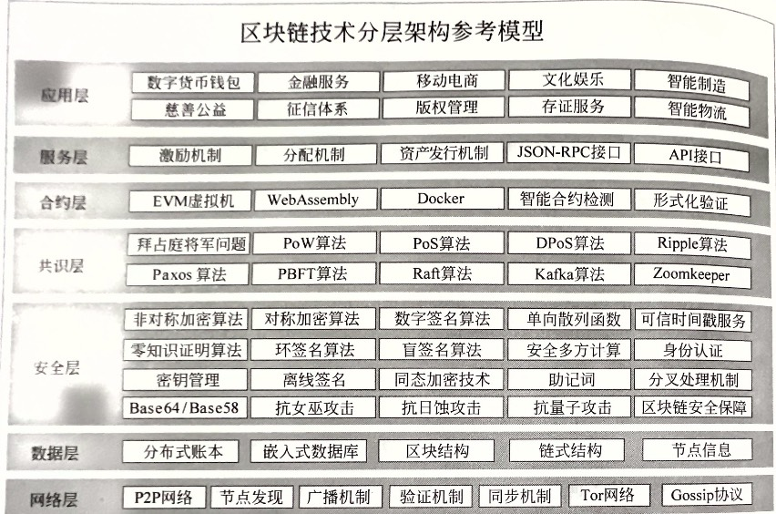

# 区块链技术细节（整理）

## 区块链分层参考模型

### 1. 网络层

区块链技术网络层本质上是一个P2P网络。以比特币为例，网络层涉及技术主要包括有构建网络、传播机制、同步机制、验证机制以及其他一些高级功能。

#### 1.1 构建网络

区块链网络层一般也是基于TCP/IP的，比特币网络使用的是8333端口，节点加入也是建立对应TCP链接。首先需要先找到一些稳定可靠的合法节点地址，
将自己版本内容等基本信息发送给网络上的节点，网络上的节点收到后，会检测是否兼容，之后回复确认信息建立连接。

#### 1.2 传播机制

网络层的功能主要是节点之间传播各类信息。一般是指向网络中主动发送信息，并依次转发在全网广播开来。这种信息一般主要是用户钱包新生成的交易信息，以及
矿工成功打包的区块信息。

#### 1.3 同步机制

指的是节点向邻居节点请求信息，用于同步各种数据。在比特币系统中，节点加入网络后，会向自己的邻居节点发送getaddr信息，请求自己的邻居节点将其维护的
节点地址列表同步给自己；除此之外，还会发送getblocks、getdata等请求来同步区块信息。

#### 1.4 验证机制

节点收到交易和区块信息后，对其合法性进行验证，只有合法正确的信息才会对其进行转发，如果不符合共识规则则丢弃。这样能保证全网中只传播合法信息，不至于
网络拥塞，同时防止DOS攻击。

#### 1.5 其他

在区块链技术发展过程中，不断加入了一些新功能和协议。例如，后来的比特币区块链中使用洋葱网络（Tor），原理是将用户发起的交易信息，先在网络中找到一些
节点转发，最后回到该用户自己，形成闭环，然后再从这个闭环内发送到全网，使得无法推断到底是哪个节点发起的这笔交易。

### 2. 数据层

区块链数据层就是嵌入式数据存储的一个分布式账本。除了账本外，节点一般会维护一些节点信息等元数据，属于区块链底层数据结构。目前包含的区块链数据层包含以下特征：

- 分布式账本：每个节点保存一份**完整**账本数据，存储于嵌入式数据库中；
- 区块结构：交易信息被打包成区块；
- 链式结构：所有区块通过哈希指针方式连接在一起，防止篡改；
- 节点信息：向邻居节点请求其维护的节点地址列表，这些返回值也会以文件形式存储在本地。

### 3. 安全层

主要是密码学中的技术，这层是区块链的安全保障。一般区块链中都涉及大量数字资产，所以区块链安全是现阶段比较重要，研究最广泛，成果最多的一个方向。
安全层提供的服务包括：

- 基础安全保证：在区块链的账户体系中，使用了椭圆曲线算法生成地址作为账户公开地址。另外，挖矿、地址生成、签名等多处使用了哈希算法。地址生成也用到了编解码算法；
- 隐私保护：比特币采用的是假名机制，由于账本是公开透明的，区块链不具备很好的隐私保护能力。目前区块链隐私保护的研究多集中在数字货币上，主要目标是将用户身份和交易
  以及交易金额做分离。现阶段可以被用于区块链隐私保护的技术主要有环签名技术、盲签名技术、零知识证明、同态加密以及新兴的安全多方计算。
- 网络安全：由于区块链网络的开放性，在设计区块链架构时，要重点考虑防止安全攻击的问题。常见攻击手段有：
    - DOS攻击：攻击者发送大量垃圾信息到某个节点或全网中，导致网络拥塞，造成DOS攻击；
    - 女巫攻击：攻击者搭建大量恶意节点，以此获得大量投票数；
    - 日蚀攻击：比特币单节点一般默认设置8个连接，攻击者可以设置8个恶意节点去连接至某个正常节点，导致其被隔离出比特币网络，这通常是针对交易所的攻击。
- 密钥安全：区块链之上的数字资产的拥有权完全绑定到单一秘钥，一旦丢失就无法找回。所以这是设计数字钱包时，需要重点考虑的问题。目前市场上的钱包一般分为
  硬件钱包、在线钱包等，它们在可用性和安全性方面有不同的考量。密钥安全涉及的技术，主要有分层确定性密钥管理、助记词、离线签名等。
- 算法安全：区块链设计过程中，也需要考虑所使用算法的安全性，必须使用那些目前被证明为极难被破解的算法。目前的区块链项目中多采用椭圆曲线算法、SHA-256等。

### 4. 共识层

这层的作用是让所有人按照一种机制对区块链的某一刻的状态达成一致性的认识，本质上是一个分布式系统中的一致性方案，用于解决拜占庭将军问题。区块链系统中
需要达成共识的内容主要包括三部分：交易、区块、以及一些其他共识内容。  
关于共识机制的研究成果已经有多种方案，如Paxos、Raft等；目前现有区块链项目中所采用的共识算法如下表所示：

| 项目                                              | 共识机制                           |
|-------------------------------------------------|--------------------------------|
| 比特币系列：以Bitcoin技术体系为基础发行 的数字货币，如莱特币、达低币、大零币等 | PoW                            |
| 点点币                                             | PoS                            |
| 以太坊                                             | PoW结合PoS，未来会升级到纯PoS共识          |
| 超级账本                                            | Kafka算法，Solo排序；共识机制可插拔，支持拜占庭容错 |
| 比特股、Steem、EOS等                                  | DPoS                           |
| 瑞波                                              | 瑞波共识（Ripple）                   |

### 5. 合约层

主要包括各种脚本、代码、算法机制和智能合约，它是区块链技术可编程的基础保证。合约层的本质是将代码逻辑存储在区块链中，实现可以自行定义和编写的智能合约，
在触发某一条件时，无需第三方调用，代码自动执行，即常说的「代码即法律」，这也是区块链去信任的基础。  
智能合约一般使用高级语言编写后，编译成为可供区块链用户调用的ABI二进制接口文件，部署到区块链上。目前公有链的智能合约编程分为两类：

- 以太坊：使用的是Solidity语言，执行环境是EVM虚拟机；
- EOS：它选用的语言是功能更强大的C++，执行环境是WebAssembly。并且EOS考虑了可扩展性设计，将会支持安全的沙盒环境设计成可插拔模式，将来可支持各种
  沙盒，以允许其他平台的智能合约无缝迁移到此平台。

### 6.服务层

主要包括区块链中的数字货币发行机制和分配机制。比特币中引入挖矿奖励来激励节点加入去完成区块打包和验证工作；达氏币中加入网络成为混币节点需要抵押一部分
数字货币，如果作恶则不会返回；EOS为代表的基于DPoS共识建立的区块链系统中，为防止女巫攻击，使用代币作为抵押投票。在早期区块链体系中，被成为激励层。

### 7.应用层

主要包括各类场景下的实际应用，类似常用的PC客户端、手机客户端等。二者区别是，区块链中的应用叫做去中心化应用（DApp）。由于早期区块链主要应用场景就是
数字货币，所以当时主要应用层就是各类数字货币钱包。  
目前，受限于行业生产关系变革中遇到的阻力，区块链应用暂时还没有彻底普及开来。典型的应用，如以太坊上运行最多的就是众筹项目，EOS上运行最多的应用集中
在博彩业。

## 区块链现存问题

### 1. 数据冗余过量

在一个完全去中心化的区块链系统中，用户如果想要亲自验证交易合法性，同时保证数据的可信、完整、未篡改的特性，用户就需要下载全部的账本。
随着时间的推移，区块链的数据量呈线性递增，长期以往，极大提高了用户的使用成本，导致用户只能依赖其他全节点去验证交易，然而这会导致新的中心化趋势。

以比特币为例，每10min产生一个区块，每个区块1MB，每年的区块增长速度为24x60/10x365=51.3GB，10年后大概需要5TB。EOS理论上可以达到太字节（百万TB），
按照一个交易100字节计算，1天的区块数据为1000000x100x60x60x24=7.8TB，一年的区块数据量为7.8x265=2868TB，到2023年大约需要14340TB存储空间。
另外，还需要包括智能合约代码以及用户上传的图片、视频等。普通用户个人用户显然无法承担如此巨大的存储空间。

### 2. 系统安全

区块链本质上是一个分布式数据库。与传统应用系统不同，在运行过程中，区块链会将数据信息采用分布式方式记录，并且通过共识机制由所有参与者共同记录。
整个区块链平台具有开放性的特点，特别是公有链中，任意节点可以自由加入/退出区块链网络，任意节点都可以存储整个账本数据。区块链的这种开放性也决定了其不同于传统技术的安全问题。

### 3. 共识算法

就目前业界研究情况来看，并不存在一种完美的共识算法适用于任何场景，每一种共识算法均有自己的优缺点，适用于不同的应用场景，我们只能根据实际应用来取舍。
例如，在最早的区块链平台中，比特币和以太坊都采用PoW算法。PoW算法是目前唯一经过严格数学论证的安全共识机制，但其缺点也是明显，那就是速度慢且严重浪费资源。
BitShare和EOS等所采用的DPoS共识机制虽然提高了效率，并解决了资源浪费的问题，但是牺牲了去中心化的特性，存在21个超级节点，并且共识的安全严重依赖于代币。

由于目前设计完美的共识机制几乎不太可能实现，所以大多数项目在开发区块链平台时，均会考虑可插拔共识机制，用户在实际部署应用时，可以根据场景使用合适的共识机制。

下表展示了常见共识机制之间的特点对比：

| 共识机制     | 是否挖矿 | 需要代币 | 安全性 | 资源消耗 | 去中心化程度 | 交易确认时间 | 交易性能 | 典型项目          | 适用场景   |
|----------|------|------|-----|------|--------|--------|------|---------------|--------|
| ByteBall | 否    | 是    | 高   | 小    | 不完全    | 长      | 高    | ByteBall      | DAG区块链 |
| IOTA     | 否    | 是    | 高   | 小    | 完全     | 长      | 高    | IOTA          | DAG区块链 |
| Pool验证池  | 否    | 否    | 高   | 小    | 不完全    | 实时     | 高    | 私有链           | 私有链    |
| Ripple   | 否    | 是    | 高   | 小    | 不完全    | 实时     | 高    | Ripple网       | 公有链    |
| Paxos    | 否    | 否    | 高   | 小    | 不完全    | 实时     | 高    | 暂无            | 联盟链    |
| PBFT     | 否    | 否    | 高   | 小    | 不完全    | 实时     | 高    | 超级账本          | 联盟链    |
| DPoS     | 否    | 是    | 高   | 小    | 不完全    | 秒级     | 高    | BitShare、EOS等 | 公有链    |
| PoS      | 是    | 是    | 高   | 一般   | 完全     | 短      | 低    | 点点币、未来币等      | 公有链    |
| PoW      | 是    | 是    | 高   | 大    | 完全     | 长      | 低    | 比特币、莱特币等      | 公有链    |

### 4. 可扩展性

区块链的可扩展性问题主要包括两个方面：交易效率和区块链的分叉与升级。  

#### 4.1 交易性能
我们已经知道，比特币区块链每秒只能处理大概7笔交易，每笔交易需要接近1h的确认时间。相较于比特币，以太坊的处理速度得到了不小的改善，每秒可以处理二十多笔交易，
每笔交易一般推荐15-20个区块的确认，大约时间为4-8分钟。而现有的传统系统中，像支付宝交易的处理峰值可达每秒几十万，如果投入正式环境，区块链现有的处理速度实在难以让人满意。

可扩展性是传统分布式系统的基本特性，但区块链由于去中心化的要求，难以满足可扩展性。业界总结了一个三元悖论描述去中心化与可扩展性之间的矛盾，
尚未被严格证明，只能被称为猜想，但实际系统设计过程中却能感觉到时时受其挑战：去中心化、安全性、可扩展性这三个属性，区块链系统无法同时满足，最多三选二。
这也叫做分布式不可能三角。

就目前来说，解决区块链交易性能的主要方案有以下几种：  
**【共识机制创新】**  
从PoW到PoS再到DPoS和各种BFT类算法，共识机制不断创新，区块链平台性能也不断得到提升。**但需要明确的是**，后来创新的这些共识机制，
并非各方面都优于开始PoW，而是在其他方面作出了妥协，以达到提高交易性能的目的。比如PoS虽然解决了资源浪费问题，但是却产生了高概率分叉以及弱去中心化问题；
而DPoS虽然性能高，但是该算法以代理人共识取代全网共识的做法也受到一部分人的抨击。  

**【交易通道】**  
交易通道的思路是保持底层区块链协议不变，将交易放到链下进行，通过改变协议用法的方式来解决扩展性问题。链下部分可以采用传统中心化分布式系统实现，
闪电网络是典型方案的一种。

**【分片处理】**  
以太坊项目正在研发中的分片（sharding）方案的总体思路是每个节点只处理一部分交易，比如一部分账户发起的交易，从而减轻节点的计算和存储负担。

**【多链架构】**  
主要思路是将原本的一条链分成多条链，每条链都负责部分计算和存储业务，并且有可扩展性，即链的数量可以随着业务量和数据的增加而增加，系统的总体性能和存储空间也会随之提升。
**侧链**技术就是一种方案。

#### 4.2 链的分叉（fork）
区块链的分叉，尤其是硬分叉也是一个目前难以解决的问题。最典型的例子，就是The DAO事件所造成的以太坊分叉为ETH和ETC两条链，虽然为用户挽回了智能合约安全问题造成的损失，
但是导致了很大一部分人对区块链去中心化的质疑，显然这是靠中心化的运作强行更改了系统的运行轨迹。再比如BTC与BCH的分叉、BCH与BSV的分叉，也都造成了社区的分裂，
这不仅是技术层面的分歧，更多的也是各方利益使然。

**【硬分叉】**  
硬分叉是指代码修改后，旧节点拒绝接收新节点创造的区块。不符合原规则的区块将被忽略。硬分叉将会导致一个正在运行的区块链系统在某个区块高度发生永久分叉，
分叉点后产生的区块互不关联。硬分叉是**不向前兼容**的。

**【软分叉】**  
软分叉是指旧节点不会意识到系统代码发生改变，并继续接收新节点创造的区块，所以软分叉是**向前兼容**的。

分叉通常是为了解决当前系统中的某些问题，比如提高交易性能，亦或回滚某些交易（The DAO事件）。比特币采用的隔离见证就是一种软分叉方案，
隔离见证的思路是在不改变区块结构及参数的前提下，将签名信息放在块外存储，从而间接对区块扩容，提高了一些交易效率。而BCH则认为隔离见证只是减缓了网络拥塞问题，
也没有显著提高交易效率，还使得系统结构变得复杂，不利于未来系统改造。所以比特币社区又产生出另一种方案，那就是直接修改区块参数，将区块大小1MB的限制改为4MB。
显然，这种修改不是向前兼容的，旧节点不会认可4MB的区块，从而导致BTC分叉出了BCH。

## 区块链安全问题
todo

参考：
- [《区块链技术开发指南-马兆丰》](https://baike.baidu.com/item/区块链技术开发指南/56688853?fr=aladdin)
