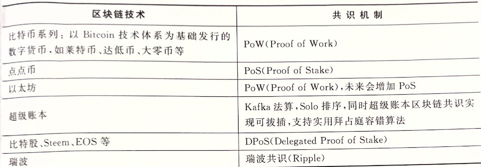

# 区块链技术细节

## 区块链分层参考模型

### 1. 网络层
区块链技术网络层本质上是一个P2P网络。以比特币为例，网络层涉及技术主要包括有构建网络、传播机制、同步机制、验证机制以及其他一些高级功能。

#### 1.1 构建网络
区块链网络层一般也是基于TCP/IP的，比特币网络使用的是8333端口，节点加入也是建立对应TCP链接。首先需要先找到一些稳定可靠的合法节点地址，
将自己版本内容等基本信息发送给网络上的节点，网络上的节点收到后，会检测是否兼容，之后回复确认信息建立连接。

#### 1.2 传播机制
网络层的功能主要是节点之间传播各类信息。一般是指向网络中主动发送信息，并依次转发在全网广播开来。这种信息一般主要是用户钱包新生成的交易信息，以及
矿工成功打包的区块信息。

#### 1.3 同步机制
指的是节点向邻居节点请求信息，用于同步各种数据。在比特币系统中，节点加入网络后，会向自己的邻居节点发送getaddr信息，请求自己的邻居节点将其维护的
节点地址列表同步给自己；除此之外，还会发送getblocks、getdata等请求来同步区块信息。

#### 1.4 验证机制
节点收到交易和区块信息后，对其合法性进行验证，只有合法正确的信息才会对其进行转发，如果不符合共识规则则丢弃。这样能保证全网中只传播合法信息，不至于
网络拥塞，同时防止DOS攻击。

#### 1.5 其他
在区块链技术发展过程中，不断加入了一些新功能和协议。例如，后来的比特币区块链中使用洋葱网络（Tor），原理是将用户发起的交易信息，先在网络中找到一些
节点转发，最后回到该用户自己，形成闭环，然后再从这个闭环内发送到全网，使得无法推断到底是哪个节点发起的这笔交易。

### 2. 数据层
区块链数据层就是嵌入式数据存储的一个分布式账本。除了账本外，节点一般会维护一些节点信息等元数据，属于区块链底层数据结构。目前包含的区块链数据层包含以下特征：
- 分布式账本：每个节点保存一份**完整**账本数据，存储于嵌入式数据库中；
- 区块结构：交易信息被打包成区块；
- 链式结构：所有区块通过哈希指针方式连接在一起，防止篡改；
- 节点信息：向邻居节点请求其维护的节点地址列表，这些返回值也会以文件形式存储在本地。

### 3. 安全层
主要是密码学中的技术，这层是区块链的安全保障。一般区块链中都涉及大量数字资产，所以区块链安全是现阶段比较重要，研究最广泛，成果最多的一个方向。
安全层提供的服务包括：
- 基础安全保证：在区块链的账户体系中，使用了椭圆曲线算法生成地址作为账户公开地址。另外，挖矿、地址生成、签名等多处使用了哈希算法。地址生成也用到了编解码算法；
- 隐私保护：比特币采用的是假名机制，由于账本是公开透明的，区块链不具备很好的隐私保护能力。目前区块链隐私保护的研究多集中在数字货币上，主要目标是将用户身份和交易
以及交易金额做分离。现阶段可以被用于区块链隐私保护的技术主要有环签名技术、盲签名技术、零知识证明、同态加密以及新兴的安全多方计算。
- 网络安全：由于区块链网络的开放性，在设计区块链架构时，要重点考虑防止安全攻击的问题。常见攻击手段有：
  - DOS攻击：攻击者发送大量垃圾信息到某个节点或全网中，导致网络拥塞，造成DOS攻击；
  - 女巫攻击：攻击者搭建大量恶意节点，以此获得大量投票数；
  - 日蚀攻击：比特币单节点一般默认设置8个连接，攻击者可以设置8个恶意节点去连接至某个正常节点，导致其被隔离出比特币网络，这通常是针对交易所的攻击。
- 密钥安全：区块链之上的数字资产的拥有权完全绑定到单一秘钥，一旦丢失就无法找回。所以这是设计数字钱包时，需要重点考虑的问题。目前市场上的钱包一般分为
硬件钱包、在线钱包等，它们在可用性和安全性方面有不同的考量。密钥安全涉及的技术，主要有分层确定性密钥管理、助记词、离线签名等。
- 算法安全：区块链设计过程中，也需要考虑所使用算法的安全性，必须使用那些目前被证明为极难被破解的算法。目前的区块链项目中多采用椭圆曲线算法、SHA-256等。

### 4. 共识层
这层的作用是让所有人按照一种机制对区块链的某一刻的状态达成一致性的认识，本质上是一个分布式系统中的一致性方案，用于解决拜占庭将军问题。区块链系统中
需要达成共识的内容主要包括三部分：交易、区块、以及一些其他共识内容。  
关于共识机制的研究成果已经有多种方案，如Paxos、Raft等；目前现有区块链项目中所采用的共识算法如下表所示：

### 5. 合约层
主要包括各种脚本、代码、算法机制和智能合约，它是区块链技术可编程的基础保证。合约层的本质是将代码逻辑存储在区块链中，实现可以自行定义和编写的智能合约，
在触发某一条件时，无需第三方调用，代码自动执行，即常说的「代码即法律」，这也是区块链去信任的基础。  
智能合约一般使用高级语言编写后，编译成为可供区块链用户调用的ABI二进制接口文件，部署到区块链上。目前公有链的智能合约编程分为两类：
- 以太坊：使用的是Solidity语言，执行环境是EVM虚拟机；
- EOS：它选用的语言是功能更强大的C++，执行环境是WebAssembly。并且EOS考虑了可扩展性设计，将会支持安全的沙盒环境设计成可插拔模式，将来可支持各种
沙盒，以允许其他平台的智能合约无缝迁移到此平台。

### 6.服务层
主要包括区块链中的数字货币发行机制和分配机制。比特币中引入挖矿奖励来激励节点加入去完成区块打包和验证工作；达氏币中加入网络成为混币节点需要抵押一部分
数字货币，如果作恶则不会返回；EOS为代表的基于DPoS共识建立的区块链系统中，为防止女巫攻击，使用代币作为抵押投票。在早期区块链体系中，被成为激励层。

### 7.应用层
主要包括各类场景下的实际应用，类似常用的PC客户端、手机客户端等。二者区别是，区块链中的应用叫做去中心化应用（DApp）。由于早期区块链主要应用场景就是
数字货币，所以当时主要应用层就是各类数字货币钱包。  
目前，受限于行业生产关系变革中遇到的阻力，区块链应用暂时还没有彻底普及开来。典型的应用，如以太坊上运行最多的就是众筹项目，EOS上运行最多的应用集中
在博彩业。

