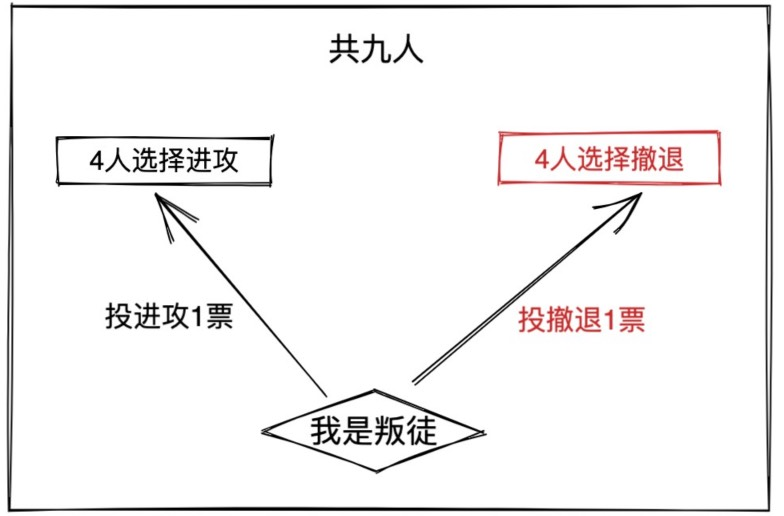
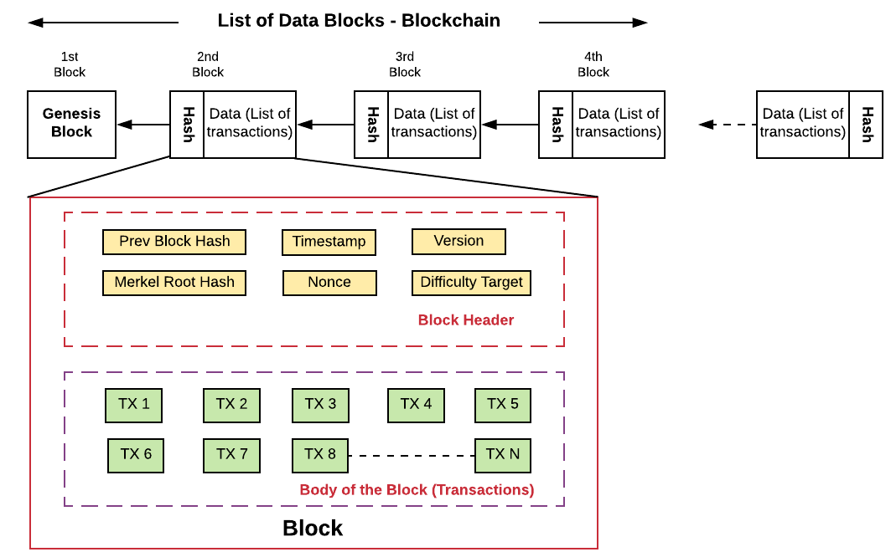
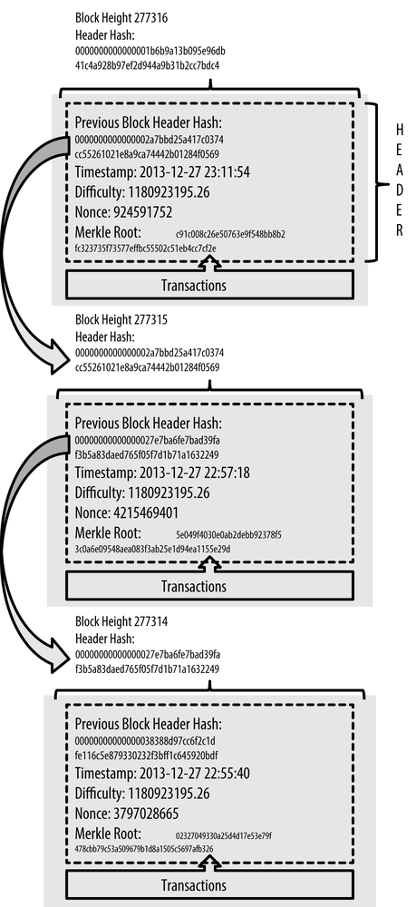
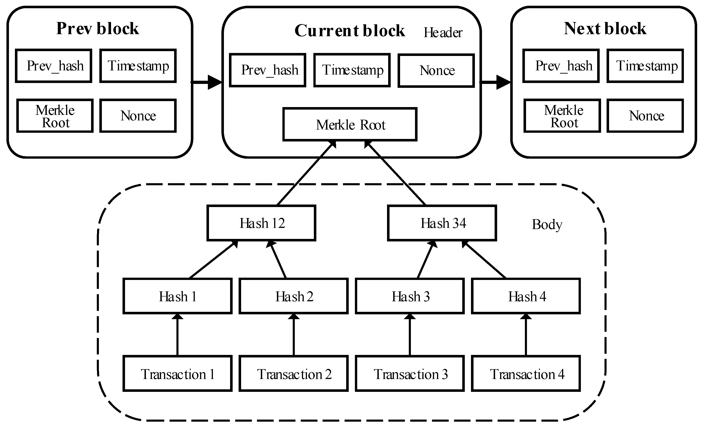
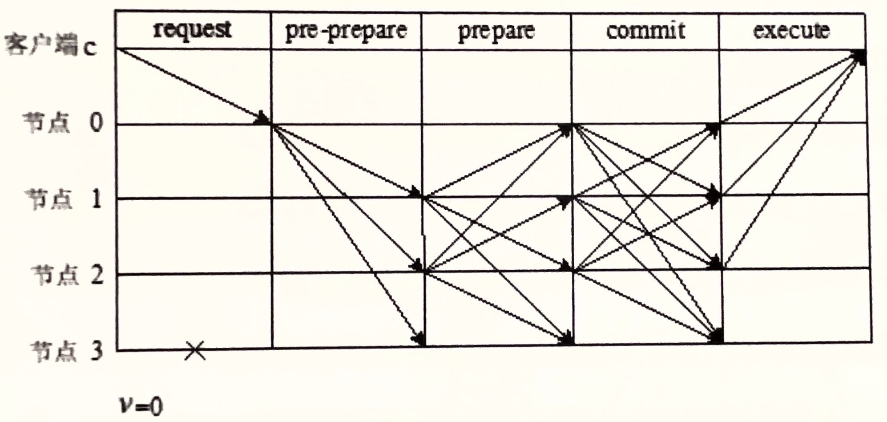
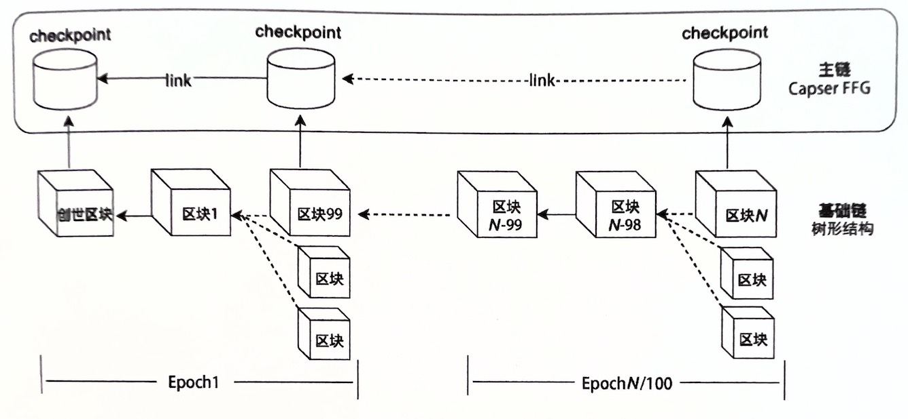
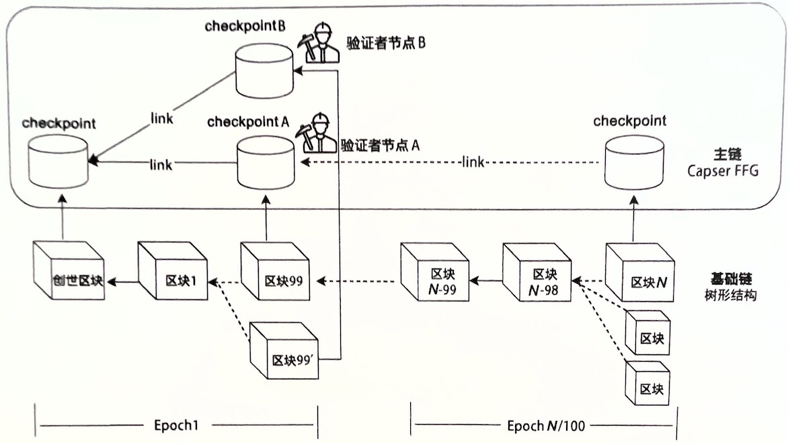

# 共识算法（整理）

### 目录
- [背景](#背景)
  - [1.共识算法简史](#1-共识算法简史)
  - [2.早期数据库系统中的共识机制（分布式一致性方案）](#2-早期数据库系统中的共识机制分布式一致性方案)
  - [3.拜占庭将军问题](#3-拜占庭将军问题)
  - [4.共识系统的基本定义](4-共识系统的基本定义)
  - [5.通信模型](#5-通信模型)
  - [6.FLP定理](#6-FLP定理)
  - [7.CAP定理](#7-CAP定理)
- [传统分布式一致性算法](#传统分布式一致性算法)
  - [1.PoW共识算法](#1-PoW共识算法)
  - [2.PoS共识算法](#2-PoS共识算法)
  - [3.DPoS算法](#3-DPoS算法)
  - [4.PBFT算法](#4-PBFT算法)
  - [5.Casper共识算法](5-Casper共识算法)
- [共识算法总结](#共识算法总结)

---


共识算法是各类分布式系统（如分布式文件系统、分布式DB）中保证系统状态一致性的重要技术。根据需求不同，在不同场景下使用的共识算法也不同，如公链和联盟链
对共识算法的要求不同，所使用的算法也不同。

公链要求共识算法具有高扩展性，能够在节点动态传入网络的情况下保证共识流程的节奏，同时又要防止拜占庭节点对网络的攻击。受限于FLP定理和CAP定理，公链使用的
共识算法一般不能保证强一致性；而联盟链则需要强一致性、高性能，但对高扩展性和防止拜占庭节点攻击方面的要求没有公链那么高。

>说明： 在本文档中，由于不是关键，所以没有对一致性（Consistency）和共识（Consensus）概念作严格区分，所以读者会看到这两个概念在同一个位置混用的情况。
> 笔者在此根据多方资料对这两个概念先进行解释：  
> **一致性**：主要描述的是分布式系统多节点的情况，各节点中某一类元素在不同时刻的对外呈现的状态一致性。其中的「状态」的概念由所在系统定义，如数据库系统中的状态主要指的是数据在事务执行前后的状态。
> 一致性可以分为**顺序一致性、线性一致性、弱一致性**，其中线性一致性也叫做强一致性，最终一致性是弱一致性的特定状态。
> 
> **共识**：主要描述的是分布式系统多个节点，彼此针对某一提案达成一致认识的**过程**。
> 
> 可以大致认为，一致性描述的是**对外呈现**的结果状态，共识描述的是过程。

## 背景

### 1. 共识算法简史
- 1978年Jim Gray在论文中提出两阶段提交（2PC），首次尝试解决分布式数据中的一致性问题，该方案存在已验证的阻塞和脑裂问题；
- 1981年Dale Skeen在论文中提出三阶段提交（3PC），可以解决2PC的阻塞问题，但是依然存在脑裂和单点故障问题；
- 1982年Leslie Lamport在论文中提出了著名的拜占庭将军问题，引入了拜占庭错误，将一致性问题的复杂度又提升了一个档次，并在论文中给出了在同步模型下的两种解法；
- 1985年，F、L、P（姓名简写）三人在论文中提出了FLP不可能定理，直截了当的告诉人们**在异步网络中，只要有一个节点故障，就不可能存在一种完美的共识算法**；
- 1988年，Dwork、Lynch、Stockmeyer在论文中提出了部分同步模型，是一种介于同步和异步网络之间的网络模型。在该模型中，FLP定理的限制可以被打破，即当
  系统处于异步状态时，共识可以阻塞，但系统总会在一个时间后进入同步状态，此时就可以继续达成共识；
- 1990年，Lamport在论文中提出Paxos，这是首次被提出的一个能在异步网络中保证安全性，并且在进入同步网络后保证共识性的共识算法。在这之后的一大部分共识
  算法都是Paxos的变体，如Raft。但是，Paxos的最大问题在于它只能安全运行在非拜占庭网络中，一旦有恶意节点加入网络，那么整个系统将崩溃；
- 1999年，Muguel Csatro和Barbara Liskov在论文中提出了PBFT共识算法，该算法大大降低了拜占庭容错算法的运行复杂度，成为第一个实用的拜占庭容错算法；
- 2008年，中本聪发表了比特币白皮书，首次提出比特币概念，同时将PoW共识算法应用到区块链中。此后，各类证明类的共识算法相继出现，如PoS、PoA等，共识算法
  也从传统分布式一致性算法慢慢演化成独特的区块链共识算法。


### 2. 早期数据库系统中的共识机制（分布式一致性方案）
在早期设计数据库系统时，为了保证多节点下的事务一致性，人们先后设计了2PC、3PC这样的分布式一致性方案。
这两个方案都采用**预写式日志**来实现节点的故障恢复，并且不考虑恶意节点，只考虑节点本身工作异常和因网络异常导致不响应的情况。

#### 2.1 两阶段提交（2PC）
在数据库系统中，两阶段提交是一个普遍使用的保证事务一致性的方法。它是由一个协调节点作为中央控制节点，协调各参与节点提交会回滚事务。

**第一阶段**  
协调节点（Transaction manager,TM）向所有参与者节点（Resource manager,RM）询问「是否准备好」，等待各节点响应Yes/No。

**第二阶段**  
若各节点响应都是Yes，则协调节点向所有节点广播**Commit**指令，只要有一个回复No或者超时回复就广播**Rollback**指令，参与者节点在执行完指令后再回复协调者Ack，
然后由协调者标记本次事务完成。

**优点**  
2PC模型简单，能够在同步通信系统中保证事务的强一致性。节点在故障时，系统服务也会暂停，节点故障恢复后，系统恢复正常，能够保证数据一致性。

**缺点**  
- 阻塞：第一阶段中，事务提交过程中，所有参与者节点持有的公共资源持续处于独占状态，第三方无法访问（协调者有超时机制，参与者没有超时机制）；
- **可恢复**的脑裂（网络分区导致数据不一致）：
  - 第二阶段中，部分节点因为协调者故障或网络问题未收到协调者的指令，也就不会执行对应指令，则系统产生临时不一致性，必须等到节点与协调者通信恢复才可能进入一致性状态；
  - 同样是第二阶段，当协调者和参与节点同时故障时的情况。即先收到提交指令的参与者在完成提交后，且向协调者回复ACK前宕机了，那么即使稍后协调者恢复了，也不知道
  事务的提交状态，**必须等待参与者也恢复之后才能确定**。
- 单点故障：过程中，协调者是单节点，当协调者故障，系统进入阻塞状态，直到协调者恢复。

#### 2.2 三阶段提交
为了解决两阶段提交的阻塞和脑裂问题，三阶段提交出现了。它引入参与者的超时机制和预写机制，以保证节点在宕机恢复后可以从预写日志中恢复正确状态；以及增加一个PreCommit阶段。

**第一阶段：询问提交**  
仍然是协调节点向所有节点询问「是否准备好」，即发出CanCommit指令，等待各节点响应Yes/No，同时开启超时等待，若超时未收到协调者下一步指令则终止事务。

**第二阶段：预提交**  
若所有参与者回复Yes，则协调者再次发出PreCommit指令，允许所有参与者执行预提交，并等待所有参与者回复执行结果Yes/No，同时参与者在回复之后开启超时等待，
若未接收到协调者的下一步指令，**直接提交事务**。
>预提交是指参与者将事务的undo和redo日志写入本地的稳定存储介质，但不进行真正提交；同时这里的参与者超时后回滚是与两阶段提交的「阻塞等待」的不同之处。

若有参与者回复No或超时回复，则协调者发出回滚指令，所有参与者回滚事务并释放持有的资源（根据undo日志）。

**第三阶段：最终提交**  
若所有参与者再次回复Yes，则协调者发出最后的DoCommit指令，参与者收到后执行最终提交，然后协调者等待参与者回复最后的Ack响应，收到后，完成事务。  
若有参与者回复No或超时回复，则协调者发出回滚指令，所有参与者回滚事务并释放持有的资源（根据undo日志）。

注意，在最后阶段：
1. 协调者宕机时，导致部分参与者未收到DoCommit指令，此时那些参与者在等待协调者指令超时后会直接进行提交；
2. 收到回滚指令后，参与者回滚完成时也需要回复Ack给协调者。

**优点**  
3PC解决了2PC的阻塞问题，即阶段二中只会发生两种情况，且这两种情况下参与者都不会阻塞：
 - 情况1：协调者发生故障，所有参与者通过查询自己的预写日志可以确认完成了PreCommit对应操作，参与者超时无法收到DoCommit指令，也会提交事务；
 - 情况2：协调者发生故障，部分参与者通过查询自己的预写日志可以确认未完成PreCommit对应操作，参与者根据超时机制，将回滚事务。 

2PC没有预提交阶段，所以在2PC的阶段二中，若协调者故障，参与者无法知道事务应该提交还是回滚，只能阻塞，直到协调者恢复。

**缺陷**  
脑裂问题仍然未解决，而且是不可恢复的。因为出现网络分区后，已收到PreCommit的节点在超时后会提交事务，未收到PreCommit的节点在超时后会回滚事务，
一个已回滚一个已提交，就算网络恢复了新的协调者也不确定事务应该提交还是回滚。

因此，无论两阶段提交或三阶段提交，都不能作为一个健壮的分布式共识算法，只能在通常情况下保障分布式系统的一致性。

#### 2.3 小结
两阶段和三阶段提交一般用在同步通信的分布式系统中，而多数分布式系统是由多个主机通过异步通信的方式组成集群。 在异步系统中，可能出现无法通信的故障主机，
主机可能性能不够，网络可能拥塞，都会导致错误信息再系统内传播。因此，需要更健壮的共识算法在默认不可靠的异步网络中建立容错协议，以确保各主机达成安全可靠的状态共识。

### 3. 拜占庭将军问题
前面所述的2PC、3PC这样的早期分布式一致性方案的特点是模型简单，但都有明显的安全性缺陷，并且只能工作在没有恶意节点的场景中。
所以，业界开始针对恶意节点这样在系统中达成一致性（共识）过程中出现更严重的故障时进行更进一步的研究。
拜占庭将军问题就是一个设计健壮的共识算法需要解决的一个核心问题，学习共识算法需要先理解它。  

拜占庭将军问题，是在1982年Leslie Lamport、Robert Shostak、Marshall Pease三位科学家的论文中提出的。下面贴出论文中的描述(来自维基百科)：
>一组拜占庭将军分别各率领一支军队共同围困一座城市。为了简化问题，将各支军队的行动策略限定为**进攻或撤离**两种。因为部分军队进攻部分军队撤离可能会造成
> 灾难性后果，因此各位将军必须通过投票来达成一致策略，即所有军队一起进攻或所有军队一起撤离。因为各位将军分处城市不同方向，他们只能通过信使互相联系。
> 在投票过程中每位将军都将自己投票给进攻还是撤退的信息通过信使分别通知其他所有将军，这样一来每位将军根据自己的投票和其他所有将军送来的信息就可以知道
> 共同的投票结果而决定行动策略。

系统的问题在于，可能将军中出现叛徒，他们不仅可能向较为糟糕的策略投票，还可能选择性地发送投票信息。假设有9位将军投票，其中1名叛徒。8名忠诚的将军中
出现了4人投进攻，4人投撤离的情况。这时候叛徒可能故意给4名投进攻的将领送信表示投票进攻，而给4名投撤离的将领送信表示投撤离。这样一来在4名投进攻的
将领看来，投票结果是5人投进攻，从而发起进攻；而在4名投撤离的将军看来则是5人投撤离。这样各支军队的一致协同就遭到了破坏。如下图



除了叛徒，还可能存在以下问题：
- 叛徒伪造其他将军身份投票
- 即使保证所有将军忠诚，也不能排除信使被敌人截杀或被间谍替换

因此很难通过保证人员可靠性及通讯可靠性来解决问题，只能通过收到的投票情况来做决定。

**问题建模**  
对拜占庭问题进行建模后，得出这样的问题描述：在上述假设下，能否找到一种算法，能够满足以下两个条件：  
- A. 所有忠诚将军最终会同意相同的决策；
- B. 少数叛徒不会导致忠诚将军们选择错误的决策。

满足这两个条件，就可以说是解决了拜占庭将军问题！三位科学家在论文中也给出了两种解法：
- **基于口头消息的协议**
- **基于书面消息的协议**

**解法1：基于口头消息的协议**  
这个方案中，需要有至少3m+1个将军才能容忍m个叛徒的存在。首先定义「口头消息」协议能正确进行的三个前提：
- A1：每个发出去的消息都能被成功地传递（通信正常）；
- A2：消息接收方能准确知道发送方是谁（不能伪造消息）；
- A3：消息丢失可以被检测到（消息丢失可以重发）；

可以看出，上述三点定义了一个严格的同步网络。这个协议还要求所有将军之间可以直接发生消息（点对点通信）。关于算法证明过程这里不做详述，请自行查阅权威
资料。下面通过例子来简单理解其思想：
1. 当共有n=3个将军时，若有m=1个叛徒时，则问题无解。设有ABC三位将军，有三种情况如下：
   - 最坏（最简单）：A是叛徒，假如A是指令发出者，向BC发出撤退指令（错误指令），然后B肯定向C传达相同撤退指令，那么BC最后都会作出错误的决策，也就是撤退（本来是进攻）；
   - 一般1：A是叛徒，也是指令发出者，向BC发出不同指令，然后BC之间会互相传达指令，结果是BC收到不同指令，无法作出最终决策；
   - 一般2：A是叛徒，但A是指令传达者，B是指令发出者向AC发出攻击指令（正确指令），然后A向C传达撤退指令（错误指令），结果是C收到不同指令，无法作出最终决策。
2. 当共有n=4个将军时，如果其中有m=1个叛徒，则问题可解，设有ABCD四位将军，有四种情况如下：
   - 最坏（最简单）：A是叛徒，也是指令发出者，向BCD发出错误指令X，同上，BCD最后作出错误决策；
   - 一般1：A是叛徒，也是指令发出者，向B发出正确指令X，向CD发出错误指令Y，然后BCD之间互相传达指令，结果是BCD都作出错误决策Y；
   - 一般2：A是叛徒，也是指令发出者，向BCD各自发出不同指令XYZ，然后BCD之间互相传达指令，结果是BCD都收到不同指令，无法作出最终决策；
   - 一般3：A是叛徒，但A是指令传达者，由B发出正确指令X给ACD，然后A会传达错误指令Y给CD，CD之间再互相传达，结果是CD都收到2个X和1个Y，
   由此可以判断A是叛徒，CD能够作出正确决策；

**解法2：基于书面消息的协议**  
这个方案可以处理n个将军至多有m个叛徒的情况，其中n≥m。  
根据基于口头协议的方案介绍，可以发现它不能容忍消息伪造，因为一旦叛徒能够伪造其他将军的消息，且接收方不能鉴别，那么根据最坏假设原则，接收方可以认为
所有收到的消息都是伪造的，那么所有将军都不能作出最终决策，只能撤退。而「基于书面消息的协议」的解法正是解决了这一关键问题，它引入了签名特点，消息
带上将军签名，接收方可以验证签名，从而使消息变得不可伪造。对应到计算机网络中，所有网络消息都带上节点的私钥签名，其他节点使用公钥验证。  


**拜占庭容错（BFT）**  
如果说有人能制定一个方案，能让将军们仅根据收到的投票情况就能决定它们的战略，就可以称作实现了**拜占庭容错**！
>拜占庭错误算是分布式系统中一个最极端的问题，某个算法解决了这个问题，就可以说这个共识算法是足够健壮的。


### 4. 共识系统的基本定义
#### 4.1 关于拜占庭缺陷和故障的4个定义
1. 拜占庭缺陷：任何观察者从不同角度看，均表现出不同症状的缺陷；
2. 拜占庭故障：在需要共识的系统中，由于拜占庭缺陷导致丧失系统服务；
3. 宕机缺陷：在需要共识的系统中，导致进程停止运行发生的缺陷，该缺陷对系统不产生其他副作用；
4. 宕机恢复故障：在需要共识的系统中，导致进程停止运行发生的故障，故障在重启进程后恢复，对系统不产生其他副作用；

在分布式系统中，不是所有缺陷或故障都能称作拜占庭缺陷或故障。像宕机、丢消息等缺陷或故障都不算。拜占庭缺陷或故障是最严重缺陷或故障，具有不可预测和任意性
的特点，例如遭黑客破坏、中木马病毒的服务器就是一个拜占庭故障例子。

在一个由N个节点组成的分布式系统中，一个正确的共识算法必须满足如下三个特性：
- 一致性：所有节点都同意某个决策值
- 有效性（正确性）：该决策值必须由这N个节点中的某个节点提出
- 终止性（可结束性）：所有节点最终都能完成决策（最终都能确定一个正常状态）

通常把满足一致性和正确性称为**安全性（Safety）**，而满足可结束性称为**活性（Liveness）**。

一致性好理解，如果所有节点最终决策值不一致，就无法共识。在某些情况下，可以减弱这个条件：只要多数节点共识就可以认为系统达成共识。  
有效性这样理解，如果最终决策值始终是一个默认值，那其实是没有意义的。例如在数据库提交时，若每次决策都是「回滚」，虽然不会破坏一致性，但所有合法事务
都会回滚，这显然是不合理的。  
终止性也是一个重要的特性。一致性定了如何选择一个决策值，却没有定义何时进行这样的选择。因此，共识算法需要终止性来保证系统不停向前运转。而不是一直
停留在一个决策中无法结束。这样的共识算法是不实用的。

### 5. 通信模型
分布式系统建立在许多通过网络或其他方式进行通信的节点之上，通信机制的不确定性会限制共识算法的设计。通信模型定义了不同消息的延迟对于分布式系统的限制
能力。总的来说，存在三种类型的通信模型：同步、异步、部分同步模型。

#### 5.1 同步模型
同步模型中，节点之间的通信延迟存在一个已知上限，超过上限则认为对方节点故障。这是一个非常理想的通信模型，早期的分布式一致性算法都在此模型假设下设计的。

#### 5.2 异步模型
异步模型中，没有通信延迟上限，可以包含任何异常情况，如通道问题、节点本身问题等。相比同步模型，异步模型更为符合现实情况，也就更通用。一个适用于
异步模型的共识算法，也必然适用于同步模型，但反之不成立。
>在异步模型中设计一个完美的共识算法被证明是**不可能**的！

#### 5.3 部分同步模型
介于同步和异步模型之间。于1988年在某论文中提出。模型假设一个全局稳定时间GST，在GST之前，系统可以处于异步状态，但在GST之后，系统可以恢复到同步状态。
然而该模型中的GST是未知的，也就不知道什么时候达到同步状态。这个模型同样贴合现实世界中对共识算法的需求，即共识总可以在同步状态下达成，当出现网络
问题时，共识会出现一段时间的阻塞，直到网络正常。因此，这个模型中的共识算法设计首要保证的是系统进入异步状态时的安全性（可以阻塞，但不要产生错误共识），然后在
进入同步状态后产生正确共识。  
这个模型是许多共识算法的模型基础，如Paxos、ViewStamp Replication、PBFT。

### 6. FLP定理
1985年，Fischer、Lynch和Patterson三位科学家发表了论文，提出了著名的FLP定理，它是分布式系统领域的最重要定理之一。该定理给出了一个重要的结论：
>FLP定理：在一个异步通信网络中，只要存在一个故障节点，就不存在一种完美的共识算法可以正确地终止（使所有节点达成一致）。

FLP定理是在一个比异步通信更强的通信模型下得出的结论，如果在这样一个更强的通信模型下都无法保证共识算法的终止性，那么在现实中更弱的通信模型下也不可能
达到这种保证。  
该定理假设系统中不存在拜占庭错误，并且消息传递是可靠的，即消息传递延迟未知，但最终都会成功传递且只传递一次。也就是说FLP定理假设网络消息可能出现延迟，
但是不会出现丢包、重复包的情况，这是一个比现实网络更可靠的网络假设条件。但即便是在这种网络假设下，FLP定理也证明了在任意时间停止某个节点/进程，会导致
任何一个共识算法都无法达成最终一致，更不要说现实网络中还存在网络分区与拜占庭错误等问题了。（网络分区指的是在系统中由于部分节点网络不通导致整个系统
被划分为不同的区域的现象）  
因此，如果不对通信模型做进一步的假设，或者对容错类型做更大的限制，那么该问题就不存在一个完美的解决方案。  
FLP定理告诉人们，不用再想方设法地设计一个在异步网络中始终能够达成一致的共识算法。因此，后续的共识算法设计通常会在某些方面作出妥协。例如，网络假设不再是
异步模型而是部分同步模型，即允许存在一定时间的异步网络状态，在此期间无需达成共识，但只要等到网络恢复到同步状态，就可以立即达成共识。虽然这样对系统活性
有一定的影响，但是只要能够保证系统安全性，依然是一个可接受的共识算法。例如，Paxos理论上也会出现活锁，但其能够保证即使出现活锁整个算法也是安全的，那么在
实际场景中，只要活锁结束了，就可以继续推进共识了。
>FLP定理在论文中有其完整证明过程，非数学专业不易看懂，感兴趣者请自行查阅资料。

所以目前已知的共识算法都会采用下面的部分假设：
- 故障模型：非拜占庭故障/拜占庭故障；
- 通信类型：同步/异步；
- 通信网络连接：节点间直连数；
- 信息发送者身份：实名/匿名；
- 通信通道稳定性：可靠/不可靠；
- 消息认证性：认证消息/非认证消息；

### 7. CAP定理
2000年，加州大学伯克利分校的Eric Brewer教授在ACM PODC会议上提出了CAP猜想。两年后，MIT的Seth Gilbert和Nancy Lynch从理论上证明的CAP猜想。
此后，CAP理论成为分布式领域公认定理。CAP定理认为一个分布式系统中最多只能同时满足以下三种特性中的两种：
- 强一致性（Consistency）：即当系统中任意节点完成了一次写操作后，那么其他任意节点读取出来的结果必须是最新结果，或者返回错误。这是最高级别的一致性，它的
实现代价通常非常之大，所以在工程实践中，通常放宽至较弱的一致性，如最终一致性。
- 可用性（Availability）：指来自客户端的请求在一定时间内必须收到正确回应，即服务一直可用。
- 分区容错性（Partition tolerance）：指当系统出现了网络分区问题时，系统仍然能够对外提供服务。

CAP定理告诉人们，在设计分布式系统时，不必奢求同时满足上述三种特性，必须选择性地做出取舍，才能设计出一个实际可用的、高效的系统。在分布式网络环境中，
由于网络分区是常态，因此一般在一致性和可用性上做权衡，如AWS推出的分布式数据库Dynamo就是舍弃了一致性的例子，而谷歌的GFS则舍弃了可用性。

## 共识算法分类
从传统分布式一致性算法逐渐发展到现在区块链共识算法的百花齐放，共识算法的发展已经走过四十个年头。不同共识算法侧重点不同，它们面临的问题、环境也不同。
下面从几个角度对共识算法进行分类。

**容错类型**  
根据是否解决拜占庭错误分类：
1. 拜占庭容错共识算法：PBFT、PoW、PoS、DPoS
2. 非拜占庭容错共识算法：Paxos、Raft

通常来说，在公链环境下必须使用拜占庭容错算法，在联盟链中可以根据参与方之间的信任程度进行选择。

**算法确定性**  
1. 确定性共识算法：Paxos、Raft、PBFT
2. 概率性共识算法：PoW、部分PoS

确定性共识指共识决策一旦达成，就不存在回退可能性。这类共识算法通常是传统分布式一致性算法及其改进版本；概率性共识是指已经达成的共识在未来一定概率
回退，这个概率随着时间的推移会趋近于0，这类共识算法通常应用于公链上。

**选主策略**  
1. 选举类共识算法：Raft、PBFT
2. 证明类共识算法：PoW、PoS

选举类是指通过投票选举出块节点，同一节点可以连续多轮作为出块节点存在。这类共识算法通常是传统分布式一致性算法及其改进版本；证明类是指出块节点需要
通过某种方式证明自己具备某种能力，从而获得出块权，这类算法通常每轮出块节点都不同，从而保证公平性，一般应用于公链。

## 传统分布式一致性算法
这类算法一般不考虑拜占庭错误，只假设节点宕机、网络故障时，如何让多节点保持一致，因此也叫**非拜占庭容错共识算法**。这类算法多应用在数据库场景中。
比较著名的分布式一致性算法包括：
2PC、3PC、Paxos、ViewStamp Replication、Zab、Raft。对于2PC、3PC在前面已经有描述，下面主要讲解Paxos相关算法。

### 1. Paxos

它是在一个异步模型下能够保证正确性且容错的一致性算法（也可以叫共识算法，此处不严格区分）。FLP定理指出了，在异步模型中只要存在节点故障，就不可能存在
一个可终止的共识算法。因此，Paxos也作出了一定的牺牲，它牺牲了「部分」的**活性（Liveness）**，从而保证了系统的**安全性（Safety）**。即在系统处于异步状态时暂停共识推进，
但只要有半数以上的节点恢复至同步状态，就可以推进共识，完成终止。总的来说，Paxos具有如下特点：
- 安全性：所有节点都会同意相同的决策，且决策一定是由某些节点提出的。
- 无保证的终止性：不保证收敛到一个最终决策，但只有在非常极端的场景下才会出现。
- 容错性：可以容忍少于半数的节点宕机，此时其他节点也可以达成一致。

需要注意的是，Paxos只是理论方案，直到后来才有了多个基于它的落地实例。另外，Paxos还代表了一系列一致性协议，包括Basic Paxos、Multi Paxos、
Cheap Paxos、Fast Paxos等协议及变体。其中，Basic Paxos主要描述了如何就一个值达成一致的决策，而Multi Paxos描述的是如何就一系列值达成一致的决策；
Raft就是Multi Paxos的变体。**下文简要描述Basic Paxos，也称经典Paxos**。

**Basic Paxos大致流程**  
首先，协议中约定存在以下几种角色，任意节点可担任多个角色：  
- Proposer（提议者）：是想要成为Leader（领导者）的节点，它提出了一个提议值并广播给其他Acceptor，收集它们的投票情况来决定最终提议值。任何时候可以有
多个Proposer；
- Acceptor（接受者）：一个从Proposer接收提议值的投票节点，根据一定规则拒绝或接受；
- Learner（学习者）：不参与投票流程，但必须从Proposer或Acceptor了解最后选出的Leader的提议值，并遵守该提议值采取适当行动；
- Leader（领导者）：在所有Proposer中最终选出的一个领导，大家都遵守它的提议值。

首先，所有参与节点需要初始化以下几个值：  
1. N<sub>a</sub>，V<sub>a</sub>：本节点接受的最大提案号及对应提议值
2. N<sub>h</sub>：本节点响应过的最大提案号
3. MY<sub>n</sub>：本轮共识中本节点提出的提案号

**阶段一：准备阶段**  
1. 如某节点想要发起提案，则直接选定一个提案号MY<sub>n</sub>（MY<sub>n</sub> > N<sub>h</sub>）,然后向集群中的大部分节点发送Prepare(N)请求，
其中N=MY<sub>n</sub>；
2. 每个Acceptor在收到一条Prepare(N)请求后，首先判断其中的提案号N是否大于本节点响应过的N<sub>h</sub>:
   1. 如果N ≤ N<sub>h</sub>（ 比它之前接受过的提案号小），则发送Reject拒绝消息给Proposer
   2. 否则，发送一个Promise(N<sub>a</sub>，V<sub>a</sub>)承诺消息给Proposer，并更新自己的N<sub>h</sub>=N，表示承诺本节点不会再接受任何提案号
   小于N的提案。如果本节点从未接受过任何提案，则发送的是Promise(Null，Null)消息。

**阶段二：接受阶段**  
1. 如果Proposer收到了超过半数节点关于Prepare(N)的响应，则从这些响应中找出提案号最大的Promise(N<sub>n</sub>，V<sub>n</sub>)，并向这些Acceptor
发送Accept(N,V<sub>n</sub>)请求；  
如果所有节点响应都是Null，那么Proposer就任意选择一个本地想要提出的提案值V，向这些Acceptor发送Accept(N,V)请求；  
如果任一节点响应Reject消息，说明已有其他Proposer提出更大提案号，此时又返回阶段一重新走流程。

2. 当Acceptor收到一条Accept(N,V)请求时，判断收到的N如果大于本地的N<sub>h</sub>，则发送一个Agree同意响应给Proposer，并更新本地N<sub>h</sub>=N<sub>a</sub>=N，
V<sub>a</sub>=V;  
否则，发送一个Reject拒绝消息给Proposer。

**活锁问题**  
在上述阶段二中，如果任一节点响应Reject消息，则当前Proposer会重走阶段一流程。这就可能导致一种情况，那就是若干个Proposer相继提出包含更大提案号的
提案时，使得Paxos进入活锁状态，从而无法达成共识。解决办法是选择一个固定的Proposer，或者给不同的Proposer设置不同的超时时间（随机数）来减小这种情况
发生概率，但是在异步网络中无法完全避免。

**无法逃脱FLP定理**  
在系统处于异步状态时（因网络异常或节点故障导致节点之间无法同步通信），Proposer如果可以收到过半数Acceptor节点的响应，那么系统仍然能够达成共识，
保证了**安全性(Safety)**；但也可能收不到过半数Acceptor节点的响应，就会导致系统共识推进陷入停滞状态，牺牲了一定**的活性（Liveness）**，
直到与多数节点的通信恢复。

**Paxos优点**  
- 平等共识：没有节点拥有特殊权限，任何节点都可以发起提案；
- 特殊排序规则：提案号的排序规则保证了即使多个Proposer同时提出不同提案值，最后也能收敛到一个最终值；
- 绝大多数共识：Paxos不要求每轮共识都等待所有节点完成投票，而是仅需要过半数节点的投票。因此它也是一个容错的算法。在不考虑节点作恶（拜占庭错误）的情况下，
Paxos在网络分区后也能保证系统安全性；

**Paxos缺点**  
Paxos是一个典型的非拜占庭容错共识算法，能够解决在一定程度上异步网络下的分布式一致性问题。但其算法晦涩难懂，在实践时会碰到不少问题。因此后面很多共识协议
是基于Paxos的二次设计，目的是为了适应不同场景，且有助于理解和实现。例如Raft、Chubby、Zookeeper、etcd等都是应用广泛的基于Paxos的共识协议。下文将会
重点介绍Raft，因为它在联盟链和私链上得到了比较广泛的应用。


### 2. Raft
尽管Paxos是一个非常有影响力的共识算法，可以说是奠定了分布式一致性算法的基础，但是由于其难以理解导致实现难度大，沉寂了很长一段时间。直到Chandra、Griesemer、
Redstone将其用到Chubby中实现了一种分布式锁服务，Paxos才渐渐为人所知并名声大噪。直到今天，想要实现一个完整的Paxos依旧非常困难，因此，出现了
非常多的Paxos变体，其中最著名的当属Raft。  
Raft是一种用来管理日志复制的一致性算法（共识算法）。它是一个为真实世界应用建立的协议，注重协议的落地性和可理解性。它具备Paxos的容错性和性能，
不同之处在于它将一致性问题分解为相对独立的三个问题，分别是领导选举、日志复制和安全性。在一些区块链系统中，会使用Raft来实现记账共识。

#### 2.1 Raft基础概念
首先，在Raft协议中，节点可以是三种角色之一：Leader、Candidate、Follower。下面详细说明各角色特点：
- Leader：处理所有来自客户端的请求，Follower若收到客户端的请求则转发给Leader处理（出现Leader时，则没有Candidate节点）；
- Candidate：是选举Leader阶段中出现的过渡状态，任何节点在发现Leader节点故障后都可以成为Candidate；
- Follower：节点的初始角色，属于被动角色，不主动发送任何请求。在选举阶段中若Follower未收到Leader的心跳消息，则转换为Candidate，然后去竞争Leader角色；

Raft协议将时间划分为任意不同长度的term（任期）。任期使用连续数字表示，每个任期的开始都是一次选举，若一个Candidate赢得了选举，则它在改任期剩余时间内
担任Leader。如果根据选票情况无法选出Leader，那么就会立即开始下一任期（选举）。

#### 2.2 过程详解

**阶段一：Leader选举**  
首先，所有节点均初始化为Follower。若收到来自Leader或Candidate的消息，则会一直保持Follower角色。Leader会向所有Follower周期性
的广播心跳消息来保持自己的地位。如果Follower在一个周期（为了避免选举冲突，这是一个时间范围：150~300ms）内没有收到Leader的心跳消息，那么它会开始选举，
准备竞争Leader。在开始选举前，Follower会自增它当前的任期号，然后转换为Candidate。随后，Candidate会给自己投票并向集群中其他节点发送RequestVote请求，
一个节点会一直处于Candidate角色，直到发生下面两种情况：
1. 有人（包括自己）赢得了选举
2. 一段时间后无人赢得选举

下面详细说明这两种情况：
1. 一个Candidate在一个任期内如果收到集群中过半节点数的投票就会赢得选举。投票原则：根据先到先服务原则，Follower会投票给它收到的第一个RequestVote请求
对应的Candidate。Candidate成为Leader会周期性的向其他节点广播心跳消息，建立自己的Leader地位，阻止新的选举。
2. 当一个Candidate在等待其他节点投票时，可能会收到Leader的心跳消息（Leader选完了）。如果这个心跳消息里的任期号大于自己的任期号，则Candidate
承认该Leader合法，并转换自己为Follower角色。否则拒绝该心跳消息，继续保持Candidate角色。
3. 一段时间后，没有节点赢得选举。这种情况一般出现在多个Follower同时成为Candidate的时候，此时每个Candidate都会发生选举**超时**，并通过自增任期号来发起
新一轮的选举。为了避免无限选举，在发起新一轮选举前，Candidate会产生一个随机选举超时时间（150~300ms内），这样就可以让大多数情况下只有一个节点会率先超时，然后赢得选举。

**阶段二：日志复制（对应区块链中的记账过程）**  
Leader选出后，就开始接收客户端请求。每个客户端请求都包含一条需要被复制状态机执行的命令，Leader把这条命令作为新的日志条目加入日志记录，然后向
其他Follower广播AppendEntries请求，要求其他节点复制这个日志条目。当这个条目录被所有节点复制完成后，Leader会将它应用到自己的状态机中，并向客户端
返回执行结果。如果Follower在一定时间内没有响应Leader（Follower崩溃了/执行缓慢/网络丢包），那么Leader会无限重发AppendEntries请求，
直到所有Follower最终都存储了日志条目。  
当日志条目已被复制到大多数Follower时，则可以称它是可被提交的Committed状态。Leader会记录它所知道的该日志条目的最大索引值（在日志中的顺序序号），然后
将这个索引值添加在之后的AppendEntries请求中（包括心跳消息），从而让其他节点知道这个日志条目已被提交，然后Follower就会将该日志条目应用到本地状态机执行。

**阶段三：Leader失联**  
在阶段二中，若发生网络故障或网络分区，导致Leader不能访问多数Follower。则这多数Follower会重新选举Leader，当网络恢复后，根据任期号规则，旧Leader会
变成Follower，且失联过程中旧Leader的任何更新都不作数，需要回滚。然后接受新Leader的更新。

### 3. 传统分布式一致性算法小结
基于Paxos的一致性（共识）协议有Chubby、Zookeeper、etcd等，这些共识算法广泛应于于各类分布式系统中。例如，谷歌的GFS和BigTable采用了Chubby的分布式锁协议；
Yahoo公司的Hadoop系统和OpenStack、Mesos采用了Zookeeper；kubernetes和CoreOS采用了etcd协议等。除了超级账本的Fabric 1.0用了基于Zookeeper的
Kafka做排序引擎外，这些协议在区块链场景不是很多见。

## 区块链共识算法
传统分布式一致性算法只能运行在不存在拜占庭节点的场景中，如数据库备份、日志备份、分布式锁等。但是在区块链（公链）系统中，没有对节点加入做鉴权，所以
利益的驱使下一定会存在恶意节点，因此在选择区块链共识算法的时候，必然要考虑节点作恶的情况，如双花攻击、51%算力攻击等。在进行区块链共识算法选择时，通常
根据两种思路选择：
1. 公链项目，考虑节点规模和安全性。通常选择能够容忍拜占庭故障的共识算法，如PoW、Pos、DPoS等；
2. 联盟链和私链项目，更考虑高性能和低延迟。通常选择经典PBFT、Raft等。

在公链项目中，因为存在拜占庭节点和节点规模较大的问题，只能采用最终一致性的共识算法，没法采用强一致性算法（如Raft）。在联盟链和私链项目中，
通常对共识算法有强一致性和高性能需求，而且一般来说也不会出现拜占庭故障（节点加入要接受鉴权）。因此，在这个场景下可以考虑采用传统分布式一致性算法（非拜占庭容错共识算法）。
在Hyperledger的Fabric项目中，共识模块是被设计为可插拔的，支持PBFT、Raft等算法。目前在区块链项目中，比较常见的非拜占庭容错共识算法是Raft。  

### 1. PoW共识算法
最早在1993年由Cynthia Dwork与Moni Naor在学术论文中提及，并于同年由Markus Jakobsson与Ari Juels正式提出。起初，PoW主要是用于防止垃圾邮件
的产生，2008年，PoW作为共识算法应用在比特币系统中。

比特币系统的一个重要概念是基于互联网的去中心化分布式账本，该账本以区块链形式保存，每个账本相当于账本页，区块中的信息主体就是交易内容。但是在去中心化
系统中由谁来负责记账，这是一个难点，因为不可能允许每个节点都能同时记账，这会导致账本的不一致。因此需要达成由哪个节点获得记账权的共识。PoW算法就是
通过基于算力的随机性竞争记账的方式，来选出一个记账节点打包区块，然后向其他节点广播这个新增区块信息。从此解决去中心化系统中的记账一致性问题。

那么如何比拼算力？具体来说就是一份确认工作量的证明。节点需要消耗一定算力去计算以完成工作得出结果，然后交给验证方进行验证，验证工作是可以很快的。
举个例子，对于给定的一个字符串「blockchain」，给出的工作量要求是，可以在这个字符串拼接一个成为Nonce的整数字符串，然后对拼接后的整个字符串进行
Sha-256哈希运算，如果得到的哈希结果（十六进制）是以若干个0开头的，则验证通过。为了达到这个目标，需要不停的枚举Nonce值（一般来说是递增），没有
任何技巧，然后对得到的字符串进行哈希运算。按照这个方式，需要经过2688次才能找到前三位均为0的哈希值；而要找到前六位均为0的哈希值，则需要进行约62万
次计算。  
上面的例子就是比特币中PoW的大致逻辑。其中，主要有三个要素：
- 工作量证明函数：不断枚举Nonce并哈希的过程，PoW使用的哈希函数就是Sha-256
- 区块：这道题的输入数据，代替上述字符串「blockchain」；区块由区块头和区块体组成。区块头为80B，包含4B的版本号、32B的上个区块的哈希值、32B的
默克尔根哈希值、4B的时间戳（当前时间）、4B的当前难度值（实际存的是难度值转换后的目标哈希值,通常表示为nBits）、4B的随机数组成。区块体就是交易列表，其中第一笔交易是CoinBase。
- 难度值：是比特币节点生成区块时的重要参考指标，它决定了节点大约需要经过多少次哈希运算才能产生一个合法区块。

#### 1.1 区块结构（多图说明，图源自互联网）



———————————— **图1【重点关注区块头】** ————————————

<br>



———————————— **图2【重点关注区块串联方式】** ————————————  

<br>



———————————— **图3【重点关注默克尔根】** ————————————


```
// 区块头结构：80字节
struct header_structure {      // BYTES   NAME
 uint32_t nVersion;            // 4       version
 uint8_t hashPrevBlock[32];    // 32      previous block header hash
 uint8_t hashMerkleRoot[32];   // 32      merkle root hash
 uint32_t nTime;               // 4       time
 uint32_t nBits;               // 4       target
 uint32_t nNonce;              // 4       nonce
};
```

#### 1.2 难度值
比特币的区块大约每10分钟生成一个，如果要在全网算力持续变化的过程中，让新区块产生速率保持不变的话，难度值就需要根据全网算力进行不断调整。  
难度调整是在每个全节点中独立自动发生的。每2016个区块，所有节点都会按统一公式自动调整难度，这个公式是由前2016个区块的花费时长和期望时长比较得出的。
>期望时长是20160分钟，即两周，是按每10分钟产生一个区块的速率计算得来的。

如果前2016个区块的花费时长比期望时长更短，则增加难度，否则减小难度。大致计算公式：  
>公式1：新的难度目标值 = 旧的难度目标值 * 生成最近2016个区块所花费的实际时间 / 系统期望生成2016个区块的时间

注意，这个难度目标值越大，则难度越小，是反比，下面会说明目标值和难度的换算关系。

在比特币区块头中，难度值是一个32B(256b)的数被压缩成一个4B的难度位nBits存储，所以区块头中存的
难度值实际是难度值转换后的目标哈希值，目标值的大小与难度值成反比，转换公式：
>公式2：目标哈希值(current_target)=最大目标值(difficulty_1_target) / 难度值(difficulty)

其中最大目标值是一个32字节恒定值，是比特币创世区块的target哈希值，比特币工作量证明的达成就是矿工计算出的区块哈希值必须小于目标哈希值。

**难度值表示：nBits、Target Threshold和Difficulty**  
如果读者对比特币挖矿难度值有过研究，就会发现不同的资料/图片会使用这三个字段中的一个来表示难度值，上面的图片就是例子。下面进行这三个字段的详细解释。

**【nBits & Target Threshold】**  
在区块头中直接存储的是nBits这个字段，占用4字节。nBits是一个无符号的32位整数，它是将32字节的**Target Threshold**根据一个固定算法压缩得来，目的是节省空间。
而**Target Threshold**就是某一个区块头的最大哈希值，矿工多次计算得出的区块哈希只要小于等于它就说明打包的区块是一个有效的区块，就可以广播全网，
从而获得比特币奖励。  

Target Threshold压缩算法： nBits的最高位的1个字节代表指数（exponent），低位的3个字节代表系数（coefficient）， 这个记法将工作量证明的target表示为系数/指数(coefficient/exponent)的格式。  
计算难度目标target的公式为：target = coefficient * 256^(exponent – 3)，以区块[#277,316](https://www.blockchain.com/explorer/blocks/btc/0000000000000001b6b9a13b095e96db41c4a928b97ef2d944a9b31b2cc7bdc4)
为例，nBits=0x1903a30c（十进制为419668748），则有0x19为幂（exponent ），而0x03a30c为系数（coefficient），所以这个区块的target值为：
```
target  = 0x03a30c * 256^(0x19 - 3)
        = 238,348 * 256^22
        = 22,829,202,948,393,929,850,749,706,076,701,368,331,072,452,018,388,575,715,328
```
十六进制为`0x0000000000000003a30c00000000000000000000000000000000000000000000`,也就是说高度为277316的有效区块头的哈希值，要小于等于这个目标值。
而高度277136区块的Hash值实际为`0x0000000000000001b6b9a13b095e96db41c4a928b97ef2d944a9b31b2cc7bdc4`（在上述区块链接中可查）。

**【Difficulty：难度值】**  
Difficulty的定义是为了使区块头的SHA256结果小于某个目标值（target），平均要尝试的计算次数。显然，随着矿机节点的不断加入，全网算力会不断增加，而为了使
出块时间保持在10分钟每块的速度，就必须增加Difficulty。通过查询比特币的[创世区块](https://www.blockchain.com/explorer/blocks/btc/000000000019d6689c085ae165831e934ff763ae46a2a6c172b3f1b60a8ce26f) ， 
可以得知创世区块的Bits为486,604,799（十六进制为0x1d00ffff），此时它的Difficulty=1。根据Bits，算出target为0x00ffff * 256^26，即`0x00000000ffff0000000000000000000000000000000000000000000000000000`，
说明有效哈希值必须小于等于它，而通过观察，要小于等于它，其实就是要求计算出的哈希值前32位必须是0，因为sha-256的计算结果被认为是随机的，可以说，SHA256的结果中的某一位的值，为0或为1的概率相同。
所以做一次计算，满足上述条件（前32位的值均为0）的概率为1 / (2^32)，也就是平均要做2^32次运算，才能找到这个值。

也就是说，1 Difficulty ≈ 2^32次计算，那么这里就会有一个全网算力和全网难度的关系公式：
>当前出块时间（约10min）= 当前全网难度(Difficulty) * 2^32 / 当前全网算力(Hash rate)

下面简要描述一下出块时间的计算过程：
```
出块时间(单位：秒) ≈ difficulty_当前 * 2^32 / 当前全网算力
全网算力：全网比特币矿机算力总合
比如，网络中现在有1亿台比特币的挖矿机器，每台算力是10t，那么全网算力就是10亿T，换算一下单位就是100E算力即100Ehash/s，表示每秒可完成100E次hash(哈希值)计算。
```
本文编写时，时间是2022年11月8日23:00 China Standard Time UTC+8:00，获取当前区块为[#762286](https://www.blockchain.com/explorer/blocks/btc/762286) ，
全网算力=[296.57EH/s](https://www.coinwarz.com/mining/bitcoin/hashrate-chart) ，则有
```
已知difficulty_762286 = 36,762,198,818,467.21（36*10^12≈36T）
可求#762286出块时间 = 36T * 2^32 / (296.57 * 10^18)
= 36 * 2^32 / (296.57 * 10^6)
= 36 * 4294 / 296.57
≈ 521s
```

另外，Difficulty还可以与Target进行换算，公式为：
>Difficulty_当前区块 = target_创世区块 / target_当前区块

从比特币的 [创世区块](https://www.blockchain.com/explorer/blocks/btc/000000000019d6689c085ae165831e934ff763ae46a2a6c172b3f1b60a8ce26f)
中可以看到，Bits为486604799（十六进制为0x1d00ffff）时，难度值（difficulty）为1（**注意，区块头中并没有存储difficulty的字段**）。根据Bits，
算出target为0x00ffff * 256^26，即`0x00000000ffff0000000000000000000000000000000000000000000000000000`。那么仍然以当前区块#762286为例，
Bits值为386,377,746（十六进制为0x1707A812），target为0x07A812 * 256 ^ (0x17-3)，计算其Difficulty如下：
```
difficulty_762286 = 0x00ffff * 256^26 / (0x07A812 * 256^20)
= (65535 / 501778) * 256^6
= 36,762,198,818,467.21
```
也就是36T左右，与上面链接中查询的Difficulty值匹配。

本节参考（在此表示感谢）：
- [cnblog—TIMLONG的这篇文章](https://www.cnblogs.com/timlong/p/9516373.html) 中列出了具体例子和相关比特币计算源码
- [zhihu—aaron67的回答](https://zhuanlan.zhihu.com/p/32739785) 中简要清晰的描述了这几个字段的换算过程

**难度调整**  
如前所述，区块头目标Hash值（target）决定了难度（difficulty），进而影响比特币的出块时间。根据设计，比特币要保证平均每10分钟的区块生成速度，
这是比特币新币发行和交易完成的基础，需要在长期内保持相对稳定。难度调整公式就是前面的**公式1**， 此外，要注意的是，难度的调整，
是通过调整区块头中的Bits字段来实现的，区块头中并没有直接存储全网难度（difficulty）的字段。

#### 1.3 最长链原则

比特币发展至今，全网矿工不计其数，那必然会有多个矿工同时挖出区块并在网络中广播的情况，此时区块链就会发生分叉。而**最长链原则**就是用来应对这个情况的。
>最长链原则：选择一条最长的链作为主链，矿工挖矿与数据同步都以最长链为标准，如果存在长度相同的链，就从中随机选择一条进行挖矿。存在于在非主链上的区块中的交易，
> 在主链上都不作数，相当于进行了「回滚」。

因为可能分叉的缘故，通常需要等待额外几个区块生成以后，才可以认为当前交易成功写入主链，基本不可回滚。一般来说，在连续生成6个区块后，
则认为第一个区块中的交易很难被篡改，可以被认为完成确认。比特币系统中一笔交易的确认时间大约为1小时。  

最长链原则作为识别主链的方式，被大部分共识算法采用，如PoW、PoS、DPoS等。

#### 1.4 PoW算法实际应用问题

**【51%算力攻击问题】**  
根据前述章节，可以了解到PoW算法的核心就是机器的算力，当某人/组织拥有的算力资源足够高，他就拥有足够快的挖矿速度，即打包区块的速度。相当于主链的构建权在他手上。
当他的算力超过全网算力的50%，那么根据最长链原则，他就拥有让当前主链「回滚」的能力，即他可以控制全部算力资源从较前的区块开始重新打包，以使后面的区块「回滚」。
这也相当于实现了【双花】。  
不过，比特币系统发展至今，全网算力已经达到一个非常恐怖的级别，想要控制全网50%的算力在实际上几乎是不可行的，或者说所需的经济成本也非常高。并且在51%攻击行为被发现后，
还会引发币价下跌，从而导致攻击者自己的财产缩水，这是一种吃力不讨好的行为。

**【算力集中问题】**  
随着计算机技术的进步，挖矿手段也发生了很大变化，大致经历了CPU挖矿、GPU挖矿、GPU集群挖矿、FPGA挖矿、ASIC挖矿、ASIC集群挖矿（矿池），其中GPU运算能力是CPU的几百倍，
FPGA是GPU的数十倍，ASIC是FPGA的数千倍，多个ASIC矿机又可以组成矿池。  
单个节点的算力飞速提升，需要使用更加专业的设备才能有效参与挖矿竞争。但这也使得挖矿成本提高，只有计算资源高度集中的矿池才能负担得起这种成本投入。据统计，
世界上规模排名前五的矿池掌握的计算资源占据比特币全网计算资源的一半以上。计算资源的集中，导致理想状态下的去中心化形式越来越难以满足，PoW的共识的公平性、
去中心化程度开始被破坏。

**【资源消耗问题】**  
大量矿机的投入需要消耗大量的电力，截至2017年，中国投入到比特币和以太坊挖矿的电力已经超过约旦、冰岛、利比亚等国家，在所有国家和地区的电力消耗排名第71为，
造成巨大的资源浪费。

**【吞吐量问题】**  
使用PoW共识算法的系统，为了尽可能降低分叉概率，区块生成速度相对较慢，交易确认时间长。在比特币系统中，平均需要10分钟才能完成一次出块，又要再经过1小时才能完成交易确认，
交易吞吐量非常之低，难以满足实际需求。

#### 1.5 PoW是否解决拜占庭将军问题
我们知道，由于公链系统的开放性，出现拜占庭节点是无法避免的，而PoW是如何「解决」拜占庭节点的呢？下面从两方面进行分析：
1. 51%算力。也就是说，除非攻击者拥有51%及以上的算力资源时，才能对主链发起有效攻击。虽然达到这个条件需要一定的成本，但也不是不可能，所以这也可以说是概率问题。
2. 矿工激励。比特币通过矿工奖励机制来提升网络的安全性。矿工挖矿可以获得区块奖励以及记账手续费，使得矿工更希望维护网络的正常运行，任何破坏网络的行为都会损害矿工自身的权益。
因此，即使存在拥有51%算力的个人/组织，它们也很难有作恶动机。

如上分析，PoW算法在理论上是存在拜占庭故障的，只是实际上由于成本和动机问题难以进行。另外，PoW算法也是一个最终一致性共识算法，不是强一致性算法。对于企业应用，
需要有强一致性算法保证交易的正确性，而不是依靠概率。所以它不适合联盟链和私链。

### 2. PoS共识算法
前面提到的PoW算法由于存在大量资源浪费，导致难以被更大规模的应用接受。对此，人们开始尝试使用股份（stake）作为标准进行记账权的竞争，所以诞生了权益证明（Proof of Stake，PoS）共识算法。  
PoS的思想起源于企业的股份制：一个人拥有的股份越多，其获得的股息和分红也就越高。如果采用这种方式进行区块链系统的维护，则不需要过多资源消耗，也能够使区块链资产有自然的通胀。
节点通过投入一定量的虚拟币参与共识，根据持币情况获得打包新区块的权利，并获得奖励。

本节介绍的是传统PoS算法，因为其本身具有一些缺陷，导致后来实际应用时会进行优化，或者说产生新的变体。

#### 2.1 基本概念
- 验证者：在PoS中，参与共识的节点被称为验证者节点（Validator）。任何拥有虚拟币的节点都可以通过发送特殊交易的方式，将部分虚拟货币转为股份，以成为验证者。完整的验证者节点集合由区块链系统维护。
- 币龄：为了描述持币情况，PoS共识算法引入了币龄（Coinage）概念，表示持有部分虚拟货币的时长。当节点将虚拟币作为股份投入后，这部分虚拟币就开始积累币龄，
币龄计算方式：Coinage=k * balance * age; 币龄在使用对应虚拟币（用于区块生成或交易）后会被销毁。节点币龄越大，越容易生成区块。

#### 2.2 共识流程
PoS算法在打包区块时，将同时考虑币龄和哈希计算难度，使得节点只需要消耗很少的计算资源就可以出块。

#### 2.3 实际应用问题
**【一、Nothing at Stake】**  
也叫做无成本作恶。在PoS算法中，节点可以很低成本出块，所以无法压制大量分叉行为。

**【二、Long Range Attack】**  
也叫长程攻击。指的是从创世区块开始，创建一条比当前主链还长的区块链，并篡改历史交易，用来代替主链。因此也叫历史覆盖攻击。典型的长程攻击有三种：
1. 简单攻击（Simple Attack）。攻击者通过缩短区块生成时间，从而以较快速度在分叉链上生成区块，依次成为最长链代替主链。这种攻击行为较为简陋，可以通过查询异常时间戳进行过滤。
2. 变节攻击（Posterior Corruption）。分叉链验证人通过获得旧验证人的私钥，在分叉链上加速完成超过主链长度的一种攻击方式。发展较长的区块链项目，可能已经更换了几轮验证人，
旧验证人的私钥依旧可以签署以前的旧区块，分叉链验证人可以通过购买、行贿或破解的方式获得旧验证人的私钥，从而签署合理的区块，达到加速的目的。
3. 权益流损（Stake Bleeding）。分叉链验证人通过延长在主链的区块生成时间，同时通过累计分叉链权益，以加快分叉链出块速度的攻击方式。
一般分叉链上的验证人也是原主链上的验证人，当他在原主链上获得出块机会时，验证人会通过某种方式延迟出块或不出块，为分叉链争取出块时间。从而逐渐超过主链长度。

**【三、冷启动问题】**  
由于PoS共识算法中币龄越大的节点优先获得记账权，所以参与节点都希望囤积虚拟币，很少交易。这就造成了纯粹的PoS公链无法冷启动。因此，实际运行时，
一般采用PoW算法启动区块链系统，再切换到PoW+PoS方式，最后切换到完全的PoS。在2022年9月15日，以太坊主网完成了从PoW向PoS过渡的阶段，也就是合并Beacon链。

#### 2.4 PoS算法应用
- 点点币（Peercoin）是首个采用PoS算法的虚拟货币，它采用PoW+PoS的混合共识机制。
- 未币（NXT）是一个完全使用PoS算法的公链虚拟货币系统。
- Tendermint区块链采用押金投票机制来避免无成本作恶问题，同时也能够在不超过1/3的拜占庭节点存在情况下保证共识一致性和正确性，是第一个能在理论上证明拜占庭容错的PoS协议。
- LPoS协议。传统PoS的缺点是「穷节点」只有渺茫的机会获得记账权，意味着很多币少的节点没有动力运行，网络就基本由小部分大玩家维持。这样会导致网络的安全性变差，
因为一个安全的区块链系统需要大量节点参与，所以需要激励小权益节点参与记账。LPoS(Leased PoS)租借权益证明可以解决这个问题，它让权益人将自己的余额租借给别的节点来出块，
租借的代币仍然由权益者控制，可以在租借到期后花掉或转移。出块后的收益由租借人和出块者共享。Waves是采用LPoS的区块链项目。
- DPoS协议，下节中介绍。

### 3. DPoS算法
不管是PoW还是传统PoS算法，随着项目发展，它们都逐渐具有一定的中心化特性，即拥有高算力或高代币余额的节点优先拥有记账权，DPoS的出现解决了这个不足。
DPoS 最早由 BitShares、Steemit 以及 EOS 的创办人 Dan Larimer 在2014年提出并应用，他在区块链项目 BitShares 中实现了 DPoS 共识机制。
>DPoS的设计者认为，从规模化角度看，PoW和PoS算法都有走向委托制的倾向，存在中心化风险。因此，不如在一开始就设计好如何进行权益分配与权力制约，有利于系统更好的运行，
>从而避免被动演化导致不可预期的结果。

DPoS是目前看到的最快、最高效和最灵活（但不去中心化）的共识算法。委托权益证明（Delegated Proof of Stake, DPoS）利用权益人投票的权利来公平民主的解决共识问题。

DPoS是一种基于投票选举的共识算法，有点像民主大会，持币人选出几个代表节点来运营网络， 用专业运行的网络服务器来保证区块链网络的安全和性能。
DPoS机制中，不需要算力解决数学难题，而是由持币者选出谁做生产者，如果生产者不称职，就有随时有可能被投票出局，这也就解决了PoS的性能问题。

#### 3.1 DPoS的优缺点
**优点**  
- 不需要耗费能源和硬件设备；缩短了区块的产生时间和确认时间，提高了系统效率。
- DPoS不需要挖矿，也不需要全节点验证，而是由有限数量的见证节点进行验证，因此简单、高效。

**缺点**  
- 为了提高效率，DPoS以代理人共识取代全网共识，因此时常被抨击与区块链去中心化的理念相违背。

#### 3.2 基本概念
**【候选人】**  
只要满足基本条件就可以成为候选人，参与见证人竞选。在竞选之前，候选人需要注册独有的身份，这个身份将被用于节点选举。在与身份相关的结构中，将保留个人的状态信息及详细介绍，
以供投票人参考。

**【投票人】**  
只要节点持有货币，就可以作为投票人根据自己设置的条件向自己认可的候选人投票。

**【见证人】**  
见证人是直接负责打包区块的节点。

**【受托人】**  
在早期的DPoS项目BitShares中，还有受托人（Delegates），它也是投票产生的，其主要功能是维护系统各项参数，如打包区块的时间间隔等。
而在后期的DPoS项目EOS.io中，只保留了见证人。

#### 3.3 共识流程
DPoS的共识流程主要就是投票选出见证人，并由见证人轮流进行区块生成的循环流程。系统在每轮循环中都会重新统计候选人得票，并选出N个见证人，并把它们的排序打乱，
然后见证人轮流生成区块。在一个生成周期结束后，再重新进行见证人选举。在使用DPoS算法的不同项目中，会对具体流程做优化，下面只对相关主流程做大致说明。

**【候选人注册】**  
候选人提供必要的信息标识以注册身份，以及提供接口使得外界可以获取到当前候选人状态。其次，候选人还需要提供个人介绍、网站等额外信息以供投票人参考。

此外，候选人注册支付一定费用，一般这笔费用是生成单个区块奖励的上百倍。所以候选人在成为见证人后，需要生成上千个区块才能达到收支平衡，这就防止了候选人不认真履行生成区块的责任。

**【投票】**  
为了对候选人进行投票，每个投票人都会记录必要的信息，包括可信代表（Trusted Delegates）、非可信代表（Distrusted Delegates）等。可信代表用于记录投票人信任的代表节点；
非可信代表用于记录投票人不信任的代表节点。投票时，投票人可以从尚未成为见证人的可信代表中，选择最有可能成为见证人的节点投出支持票；或者从已经是见证人的非可信代表中，
选择其中一个进行反对。  

此外，投票人还会根据候选人成为见证人后的表现进行评分，维护可见代表（Observed Delegates）的列表，并根据分数统计排名。对于一个DPoS区块链系统，由系统负责记录当前见证人的顺序，
后续每轮区块产生的顺序都与此相关。同时，社区会维护当前候选人的排名（Ranked Delegates），这个排名根据投票情况产生。

**【区块生成】**  
DPoS区块链系统的见证人顺序是公开的。每当候选人的排名更新时，见证人列表也会更新，并随后打乱顺序。根据当前的见证人顺序和当前时间，可以计算每个见证人生成下一个区块的时间表。
当达到某个时刻时，对应的见证人进行区块签发，其他节点也可以根据这个时间表进行验证。

### 4. PBFT算法
由于应用于公链的PoW和PoS等算法的吞吐量低且交易确认延迟高等问题，无法在实时性要求高的场景中使用。而在联盟链场景中，节点数量相对较少，且对交易吞吐量以及交易确认的实时性要求高，
因此需要更合适的共识算法。PBFT算法在1999年被提出，叫做「实用拜占庭容错」算法，它降低了拜占庭协议的运行复杂度，从指数级别降低到多项式级别。使得拜占庭协议在实际场景中应用成为可能。

PBFT算法主要应用在节点较少，且要求高吞吐量的区块链系统中，如联盟链和私链。

PBFT是一类状态机拜占庭协议，要求整个系统共同维护一个状态，所有节点采取的行动一致。算法中主要运行三类基本协议：一致性协议、检查点协议和视图更换协议。
我们主要关注支持系统日常运行的一致性协议。

#### 4.1 一致性协议
一致性协议要求客户端发出的请求在每个服务器节点上都按照一个确定的顺序执行。这个协议把服务器节点分为两类：1个主节点和多个从节点。其中主节点负责将客户端的请求排序，
从节点按照主节点提供的顺序执行请求。所有节点在相同的配置下工作，该配置称为试图，主节点更换则视图随之变化。

一致性协议包含5个阶段：请求（Request）、序号分配（Pre-Prepare）、交互（Prepare）、序号确认（Commit）和响应/执行（Reply/Execute）。



———————————— **PBFT一次请求中包含的共识流程图** ————————————

上图中节点3是拜占庭节点，故意不与其他节点交互。  
PBFT假设系统有拜占庭节点数f个，所有节点至少为3f+1。每个客户端的请求都会经过5个阶段，通过采用两两交互的方式在服务器之间达成共识后再执行客户端请求。
如果服务器在一段时间内都不能达成共识，则会触发视图更换协议（超时机制）。

**【1.Request（请求）阶段】**  
客户端发生请求给主节点，请求消息m=[op,ts,c-id,c-sig]，其中op是需要执行的操作，ts是时间戳，c-id是客户端ID，c-sig是客户端签名。时间戳是为了保证命令只被执行一次，
客户端的签名是方便客户认证和权限控制。

**【2.Pre-Prepare（序号分配）阶段】**  
主节点会给请求分配一个序列号sn，并构造Pre-Prepare消息[PP,vn,sn,D(m),p-sig,m]给其他从节点，其中PP表示Pre-Prepare消息，vn是视图号，D(m)是消息摘要，
p-sig是主节点签名，m是客户消息。序列号是为了保证命令执行顺序，视图号让从节点记录当前视图，主节点签名是为了让从节点认证主节点身份，而消息摘要是为了保证消息没有篡改。

**【3. Prepare（交互）阶段】**  
从节点接受PP消息，然后向其他从节点广播Prepare消息[P,vn,sn,D(m),b-id,b-sig]，其中P表示Prepare消息，b-id是从节点ID，b-sig是从节点签名。

**【4. Commit（序号确认）阶段】**  
从节点在收到2f+1个Prepare消息后，对视图内的请求和次序进行验证，然后广播Commit消息[C,vn,sn,D(m),b-id,b-sig]，其中C表示Commit消息。

**【5. Reply/Execute（响应）阶段】**  
当各节点收到2f+1个Commit消息后，它们将执行操作并提交，同时把回复返回给客户端。回复消息是[R,vn,ts,b-sig]，R是回复消息。客户端等待不同节点的回复，
若有f+1个回复一致，则接受该回复。

#### 4.2 PBFT不违背FLP定理
仔细观察，会发现PBFT的设计包含了超时机制，相当于一种同步通信模型。在超时机制下，PBFT能够保证安全性和活性。

#### 4.3 PBFT的应用
PBFT一般应用在需要强一致性的联盟链和私链场景中。例如，在IBM主导的超级账本项目中，PBFT就是一个可选的共识协议。Fabric 0.6版本自带PBFT。
除了PBFT，它还引入了基于PBFT的自用共识协议，目的是希望在PBFT基础之上能够对节点的输出也做好共识。

其他的拜占庭容错共识算法还有Fab Paxos、XFS、Zyzzyva、SBFT等。

#### 4.4 PBFT小结
由于PBFT是强一致性算法，所以不可能出现分叉行为。不过相较于前面的共识算法，PBFT的实现难度较高，对主节点有较高的负载压力，如果不考虑拜占庭行为，
则可以优先考虑Raft等轻量级的共识算法。

### 5. Casper共识算法
#### 5.1 背景
由于PoW的诸多问题，在2011年7月，Bitcointalk论坛首次提出PoS共识算法。发展至今，PoS算法主要分为两类：
1. 基于链的权益证明（Chain-Based PoS）共识算法，在每个时间段（如每10s）都通过伪随机的方式选取区块提议者来生成区块，区块仍然需要指向链上已有的区块，
随着时间的推移，所有区块会收敛到一天单链上。采用这种模拟挖矿的方式可以避免资源浪费，同时提高共识效率。使用这类PoS算法的项目代表是Peercoin、Blackcoin和Iddo Bentov等。
2. Tendermint团队在2014年首次提出了一种基于拜占庭协议的PoS算法（BFT-Based PoS），这类算法保留了PBFT算法的核心特性：
   1. 极短的最终确定时间（Finality），延续了经典的PBFT共识的两轮共识投票机制来达成最终共识。一旦完成共识，新区块立即最终确定性，这意味着该区块将不可逆转地安全上链。
   2. 可以从数学上证明，只要有2/3的资产掌握在诚实的参与方手中，那么不论网络延迟如何，该算法都能保证最终确定的区块没有冲突。

随后一系列BFT-Based PoS共识算法被踢出，包括Casper、Ouroboros和Algorand等算法。

#### 5.2 基本介绍
随着PoS算法的出现，以太坊逐渐将目光转向该类共识算法。Casper共识算法最早由以太坊核心研究员Vlad Zamfir提出，该名字源于20世纪90年代的一部喜剧电影*Casper*。
2017年10月，以太坊创始人Vitalik Buterin提出了另一种Casper共识算法。为了区分二者，前者被称为Casper CBC（Correct-by-Construction），
后者被称为Casper FFG（Friendly Finality Gadget），在以太坊内有两个团队分别研究这两种Casper共识算法。

**【一、Casper CBC（Correct-by-Construction）】**  
CBC是一个共识协议簇，其目标是构建一个抽象但足够灵活的框架，以支持在它的基础上逐步增加和构建协议框架的定义，并无缝集成所有理论证明和保证（如安全性和活性）。
Vlad称这种方式为「构建中修正（Correct-by-Construction）」，新协议的正确性在其构建过程中来保证。CBC是一种完全PoS化的共识算法。

**【二、Casper FFG（Friendly Finality Gadget）】**  
除了浪费资源和共识效率低的问题，PoW还存在一个隐含的问题，即不存在明确的最终确定时间。具体地说，PoW共识算法并不能为任何非创世区块提供严格的数学证明以证明其正确性，
只能提供一定的概率保证已经上链的交易不会发生双花问题（由于51%攻击的理论存在）。Casper FFG共识算法就是为了解决这个问题而诞生的。FFG可以和任一具有树形结构的区块链协议一起使用，
后者充当共识出块的基本协议，前者用来完成显式的区块最终确定工作，结合起来保证最终确定的区块将不可逆转地上链且保证没有冲突，所以FFG是一种PoW&PoS二者结合的共识算法。

为了更加安全、平稳地切换共识算法，以太坊2.0初期采用了更加温和的FFG方案，由PoW逐步过渡到完全的PoS共识。下文也将重点介绍FFG具体设计。

#### 5.3 FFG基本概念
**【一、Validator（验证者）】**  
FFG中的验证者主要负责投票产生checkpoint（下面介绍）区块。成为验证者需要先通过智能合约在系统中存入最低限度的保证金，验证者如果持续参与共识过程，
系统会增加其保证金数额进行奖励，如果有恶意行为将被系统减少保证金以示惩罚。验证者如想要取回保证金只能通过智能合约发出销毁命令。

**【二、Finality（最终确定性）】**  
达到最终确定性的交易或区块都将不可逆转地上链，不存在回滚和冲突的可能。

**【三、Epoch（世代）】**  
为了降低PoS的checkpoint数量，FFG算法将每100个区块划分为一个Epoch，Validator就在一个Epoch边界内的区块集合进行投票验证。

**【四、checkpoint】**  
FFG算法中，Validator会定期就Epoch边界内的区块进行投票，最终确定的区块将被虚拟机执行并写入账本，这些被选中的区块就叫做checkpoint，这些checkpoint最终会组成一颗checkpoint-tree。

#### 5.4 FFG共识流程
下图是Casper FFG架构图，虚线代表中间隔了若干区块或checkpoint。



FFG可与任一具有树形结构的区块链协议一起使用，如上图所示，基础链呈树形结构，每100个区块组成一个Epoch。Validator节点负责在Epoch边界构造和共识checkpoint，
已达到显式的最终确定作用。需要注意的是，在网络延迟或受到攻击的情况下，基础链可能会产生分叉，即一个父区块同时对应多个子区块。FFG假定基础链的共识协议有自己的分叉选择原则，
所有Validator节点在每个Epoch边界也会运行一次分叉选择原则，以确定checkpoint该构建在哪个区块之上。上图中，区块99的2个兄弟区块就是一种分叉情况，
Validator最终选择了区块99来构建checkpoint。  

**【checkpoint树分叉】**  
由于网络延迟、攻击甚至恶意验证者节点等问题，不同Validator节点运行基础链的分叉选择结果可能不同，造成同一高度的基础链具有多个不同的checkpoint。
如下图所示，创世区块对应一个checkpoint，此后高度是100个倍数的区块也对应一个checkpoint。Validator A节点和B节点则在同一高度发布不同的checkpoint。
显而易见，这些checkpoint最终构成一颗checkpoint tree。



**FFG中的共识**指的就是所有Validator节点对checkpoint-tree的共识。针对checkpoint的投票验证过程，还有更多细节，限于篇幅，此处不再赘述。
读者如有兴趣可自行查阅 [FFG论文](https://arxiv.org/abs/1710.09437) 。

#### 5.5 LMD-GHOST协议
由上文得知，不同Validator节点在同一区块高度可能发布不同的checkpoint区块，造成checkpoint链分叉，从而形成checkpoint树。由于长程攻击，传统的最长链原则不再适用PoS算法，
FFG引入GHOST协议来解决checkpoint的分叉。  
LMD-GHOST（Latest Message Driven Greediest Heaviest Observed SubTree）作为FFG Validator节点遵循的分叉选择规则。具体来说，在每个Epoch结束后，
Validator节点都将基于自己观察到的区块采用贪心算法选取最重（指资产权重）的子树作为主链。举例来说，在同一高度的多个区块中，
Validator节点会投票选择其中资产权重最高的区块作为checkpoint。
#### 5.6 实际应用
Casper FFG在尽可能提供一致性的同时保证系统的活性，目前已在以太坊2.0中上线，其最终目标是过渡到完全的PoS共识（可能是Casper CBC）。

## 共识算法总结
本文档共约3万字，主要讨论了传统分布式一致性算法和区块链场景使用的共识算法。首先从共识领域著名的拜占庭将军问题作为引子，逐步讲解了各类一致性协议和共识算法。

早期的传统分布式一致性算法有2PC、3PC等，它们的特点是模型简单，且只能工作在同步通信模型和没有拜占庭节点的场景中。较为明显的缺点是在发生网络分区时仍然会发生不一致的情况，
而这在生产应用中是不能接受的，2PC和3PC都无法很好的平衡一致性算法要求的安全性（Safety）和活性（Liveness）。

随着人们在共识算法领域中的持续研究，终于在1990年，Paxos诞生了，它是首个在异步网络中能够保证安全性，并在进入同步网络后保证活性的共识算法理论模型。
但由于完整的Paxos方案难以理解，所以落地实践较少。后续更多实践的共识算法是基于Paxos的各种变体算法，如Raft、Chubby、Zookeeper、etcd。

1993年，PoW算法被提出，但由于当时还是没有提出区块链这样先进的架构，所以没有广泛应用开来，只是被设计用来防止垃圾邮件。后来在2008年的比特币系统中采用得以广为人知，
PoW算法设计的巧妙之处在于利用完成一道数学难题的方式来提高作恶成本，并配合矿工奖励机制大大降低了系统中出现恶意节点的概率，这种方式也完美支持了去中心化的运行机制。
但由于PoW算法需要大量消耗算力来维持系统运行，并且这些算力只为了完成一道数学题，非常不环保，所以人们又提出了PoS算法，该算法巧妙地利用参与者所拥有的「股权」作为资本参与记账权的竞争，避免了算力消耗问题。

不管是PoW还是PoS最终都有中心化的运行趋势，且它们的吞吐量也非常低。所以在2014年，DPoS出现了，该算法提出者认为，既然最终都有中心化趋势，
倒不如在一开始就设计好如何进行权益分配与权力制约，有利于系统更好的运行。DPoS使用了代理人共识代替全节点共识的方式，使系统从设计上就呈现部分中心化的事实，
但是如果代理人不诚实就会损失记账权和信誉，但不会损失代币。DPoS的优势是大幅减少了记账节点，使得系统的吞吐量得到极大提升，达到10w笔每秒。
该算法目前应用的多个项目已经稳定运行多年，被证实为是一种可靠的共识算法。

前面讲的都是非拜占庭容错算法，那必然需要一种拜占庭容错算法出现，在1999年，首个拜占庭容错算法PBFT被提出来，该算法大大降低了拜占庭容错算法的网络复杂度，
同时它也是一个强一致性共识算法，比较适合联盟链和私链场景。另外，在PBFT的设计中包含了超时机制，即相当于它需要在同步网络中运行，具有一定的局限性。
PBFT的优势是能够容忍系统中不超过1/3的恶意节点，并且由于不需要进行记账权的竞争，系统的吞吐量也非常出色。
