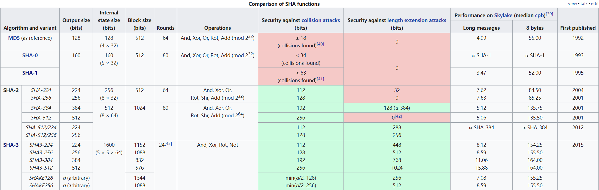
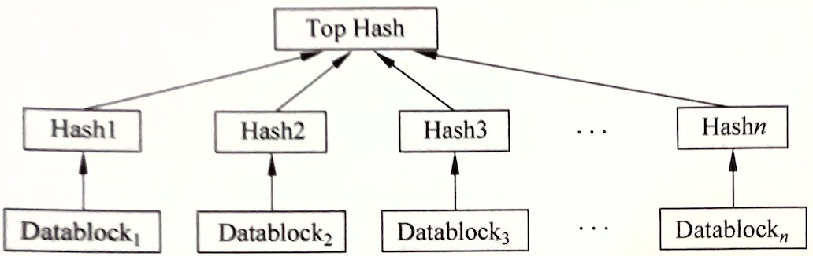
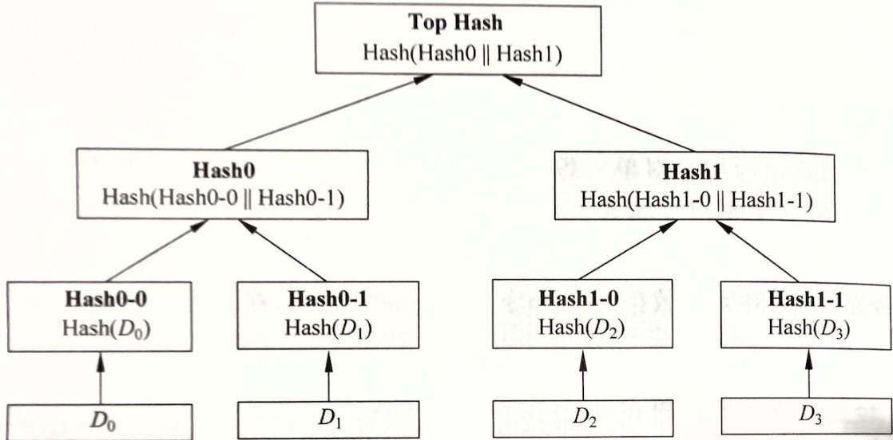

# 区块链密码学

## 对称密码算法
特点是加解密秘钥一致，包括两类：流密码和分组密码。
### 1. 流密码
- 用于WEP加密的RC4
- 3G中的SNOW 3G
- GSM系统的A5
- 4G通信加密的祖冲之序列密码

### 2. 分组密码
是将长明文序列分层固定长度的段后，每段分别加密。它是一类重要的密码算法，除了用来加密以外，也可用于构造随机生成器、流密码、消息认证码（MAC）和Hash函数等。
DES、IDEA、AES等分组密码算法因其安全和简洁获得了广泛使用。

#### 2.1 AES
数据加密标准（DES）是IBM研制的曾经使用最广泛的分组密码算法，自1977年公布后服务了20多年，直到2000年高级加密标准（AES）公布，替代DES成为新的加密标准。

AES将分组长度固定为128比特，密钥长度可以是128/192/256比特，根据密钥长度，将AES也分为AES-128，AES-192和AES-256，相应的加密轮数N，分别指定为10、
12和14轮。

#### 2.2 分组密码工作模式
这不是加密算法，而是一种工作模式，用于和DES,AES搭配使用。可以隐蔽明文的统计特性、数据格式等，以提高整体安全性，降低删除、重放、插入和伪造等攻击成功机会。
大概有4种工作模式：ECB/CBC/CFB/OFB。

- ECB（electronic codebook）：是最简单的模式，它将每个128bit明文分组分别加密，每个分组使用相同秘钥。特点是模式简单，有利用并行计算，没有误差传播；缺点是相同明文分组的密文也相同，
不利于隐藏含有某些固定内容的明文。
- CBC（cipher block chaining）：将明文分组与前一密文分组异或后作为加密算法的输入。优点是安全性高，缺点是有错误传播、不利于并行计算；在SSL、IPSec中有应用。
- CFB（cipher feedback）：将分组密码转化为流密码模式，算法每次输入除了秘钥以外，还包括前一密文分组的部分比特。特点是可以及时加密传输小分组的数据，只要更换IV
便可以很好隐藏明文内容；缺点是比特错误传播。
- OFB（output feedback）：类似CFB，不同之处是本次加密的输入是前一次加密的输出。优点是无错误传播，克服了CBC和CFB的错误传播问题。缺点是需要频繁更换密钥或初始向量。

## 公钥密码算法
又称非对称密码算法，弥补了对称密码算法在认证、签名用途上的不足。特点是采用两个一公一私两个密钥，二者具有互补性，即其中任一密钥用于加密，另一密钥都能解密。
特点是效率上稍慢于对称密码算法，优点是安全性更高，常用于数字签名场景。  
常见的公钥密码算法有：RSA、Diffie-Hellman以及ECC（椭圆曲线密码）算法。

### 1. RSA
是目前应用最广泛的公钥密码算法，由MIT于1987年提出，可直接用于加密和数字签名。

### 2. ECC
也就是椭圆曲线密码算法（Elliptic Curve Cryptography，ECC），在1985年提出。在许多应用中，ECC取代了RSA，因为相同安全性下，前者的系统参数更短。
区块链中使用的就是ECC，例如ECC公钥用于生成比特币地址、区块链的验证使用了ECC作为数字签名算法。

## Hash函数
也叫哈希函数、散列函数、单向加密函数。它将任一长度的序列作为输入，转换成固定长度的输出，可以是128/160/256比特。多用于消息认证、数据完整性验证和密钥生成等场景。
常见Hash函数有MD4/MD5、RipeMD-160、SHA系列函数。
>MD5和SHA1都被攻破，不能用于要求安全性较高的场景，区块链使用了SHA-256算法；

### 1. SHA
SHA包含SHA-[0~3]共四个系列，见下图（来自维基百科）

SHA系列应用在很多安全协议中，如TLS、SSL、PGP、SSH、S/MIME和IPSec等。

### 2.RipeMD-160
是1996年设计出来的一系列Hash算法，是基于MD4的设计原理而设计的增强版本。RipeMD-160是RipeMD-128的增强版本，用来替代MD4/MD5/RipeMD-128。
另外还有RipeMD-256/320这两个是更强的版本，但效率也更低，根据具体场景选用。

## Merkle树
译为默克尔树，也称哈希树。是存储hash值的一棵树。其叶子节点是原始数据的hash值，非叶节点是其子节点串联字符串的hash值。  
Merkle树可以看做是hash列表的泛化，通过构造树形结构的hash验证路径，可以对完整数据的单个分支单独完成验证，一定程度上这提高了完整性验证的效率。

### 1. 基于hash列表的完整性校验
hash列表可用于P2P网络数据传输的完整性校验。在P2P网络中，原始大数据块被分割成多个小数据块实现分布式下载，最后合成完整的大数据块。这时可以通过
构造hash列表实现对多个小数据块的完整性校验。大概过程：先计算每个小数据块的hash值，这些hash值级联在一起做一次hash计算，就得到hash列表的根hash。
下载数据时，首先从可信数据源得到正确的根hash，便可以用来校验hash列表的正确性，进而校验整个数据块的完整性。  
结构如下图

### 基于Merkle树的完整性校验
它的大致结构和hash列表类似，不同的是它的相邻节点会合并计算一个新的hash值作为上一层节点，若这一层是奇数个节点，则最后一个节点的hash值直接呈上。
以此计算，最终获得一个根节点和所有内部节点。  
在P2P网络下载之前，可以先从可信节点获得文件的Merkle树根节点，然后再从其他不可信节点获取树的子节点。与hash列表不同的是，Merkle树可以下载验证一个单独
分支，如果分支节点损坏，只需重新下载分支节点。当文件较大时，Merkle树的效率显著高于Hash列表。  
Merkle树多指完全二叉树，也可以是完全多叉树。结构如下图

## 数字签名技术
是指使用私密对数据进行一种密码运算生成的一串字符，用来代替手写签名或印章。在某些场景中，需要确认消息来源，防止欺诈或消息伪造，通常使用的技术就是数字签名。

### 1. 原理
数字签名技术是随着公钥密码算法（非对称加密）发展起来的，在身份验证、数据源认证、完整性保护、不可否认性方面有重要用途。  
它主要包括两部分：签名生成和签名验证。过程是：选择一种公钥算法，使用私钥加密原数据得到签名字符串，验证方使用公钥和该算法进行解密操作，若解密后的数据与收到的
源数据的摘要一致则说明签名有效。详细步骤：
1. 验证方通过可信途径获得签名者的公钥，例如可通过公钥数字证书获得；
2. 接收到签名后，计算原数据的摘要，并使用验证算法进行验证，通过摘要比对是否一致来判断签名的有效性；
### 2. 可选方案
- RSA签名
- 椭圆曲线签名方案（ECDSA）

## 零知识证明（Zero—Knowledge Proof，ZKP）

>本节内容主要参考自：https://zhuanlan.zhihu.com/p/152065162

它是在20世纪80年代初提出的，指的是证明者能够向验证者证明自己拥有某个秘密，而不暴露该秘密，即给外界的「知识」为零。   
它还分为交互式\~和非交互式\~。

零知识证明具有以下三个重要的性质：
- 完备性（Completeness）：只要证明者拥有相应的知识，那么就能通过验证者的验证，即证明者有足够大的概率使验证者确信。；
- 可靠性（Soundness）：如果证明者没有相应的知识，则无法通过验证者的验证，即证明者欺骗验证者的概率可以忽略;
- 零知识性（Zero-Knowledge）：证明者在交互过程中仅向验证者透露是否拥有相应知识的陈述，不会泄露任何关于知识的额外信息。

从零知识证明定义中可以提取到两个关键词：“不泄露信息”，“证明论断有效”，基于这两个特点扩展出零知识证明在区块链上的两大应用场景：

**隐私**：在隐私场景中，我们可以借助零知识证明的“不泄露信息”特性，在不泄漏交易的细节（接收方，发送方，交易余额）的情况下证明区块链上的资产转移是有效的。  
**扩容**：在扩容场景中，我们不太需要关注零知识证明技术的“不泄露信息”这个特性，我们的关注重点是它的“证明论断有效”这个特性，由于链上资源是有限的，所以我们需要把大量的计算迁移到链下进行，因此需要有一种技术能够证明这些在链下发生的动作是可信的，零知识证明正好可以帮助我们做链下可信计算的背书。

### 1. 交互式零知识证明（Interactive Zero-Knowledge, IZK）
证明者和验证者双方按照一个协议，通过一系列交互，最终验证者会得出一个明确的结论，证明者是或不掌握这个秘密。

### 2. 非交互式零知识证明（Non-Interactive Zero-Knowledge, NIZK）
交互式零知识证明协议依赖于验证者的随机尝试，需要证明者和验证者进行多次交互才能完成。非交互式零知识证明，将交互次数减少到一次，可实现离线证明和公开验证。

>区块链系统使用的就是这种，因为在区块链系统中，不能假设双方一直在线进行交互，在区块链网络上，证明者只要向全网广播一条证明交易，网络上的矿工在将
这条交易打包到区块中的时候就帮验证者完成了零知识证明的校验。

### 3. 发展历史
- 1985 年，零知识证明Zero-Knowledge Proof - 由 S.Goldwasser、 S.Micali 及 C.Rackoff 首次提出。
- 2010年，Groth实现了首个基于椭圆曲线双线性映射全能的，常数大小的非交互式零知识证明协议。后来这个协议经过不断优化，最终成为区块链著名的零知识证明协议SNARKs。
- 2013年，Pinocchio协议实现了分钟级别证明，毫秒级别验证，证明大小不到300字节，将零知识证明从理论带到了应用。后来Zcash使用的SNARKs正是基于Pinocchio的改进版。
- 2014 年，名为Zerocash的加密货币则使用了一种特殊的零知识证明工具zk-SNARKs （ Zero-Knowledge Succinct Non-interactive Arguments of Knowledge ) 实现了对交易金额、交易双方的完全隐藏，更注重于隐私，以及对交易透明的可控性。
- 2017 年， Zerocash 团队提出将 zk-SNARKs 与智能合约相互结合的方案，使交易能在众目睽睽下隐身，打造保护隐私的智能合约。

**零知识证明开发工具**  
目前，为了解决零知识证明技术的广泛应用需求，产生了多个用于实现zk-SNARK 零知识证明协议工程化的开源算法库，包括 **libsnark、bellman、ZoKrates** 等等。

### 4. 区块链如何应用零知识证明
#### 4.1 隐私
例如在比特币交易过程中，一笔交易是否合法，实际只需验证三件事：
- 发送方确实拥有这么多钱
- 发送方转的钱和接收方收的钱一致
- 发送方的钱对应数额确实被销毁了

整个证明过程中，矿工其实并不关心具体花掉了多少钱，发送者具体是谁，接受者具体是谁。**矿工只关心系统的钱是不是守恒的**。Zcash(大零币) 
就是用这个思路实现了隐私交易。

#### 4.2 扩容
早期的公链项目的TPS非常低，如比特币的TPS约为7，以太坊TPS约为15，这意味着以太坊每秒只能处理15笔交易，如此低的TPS严重限制了区块链应用的大规模落地，
所以有人开始研究区块链扩容的问题，目的就是为了提高链上的TPS。但区块链扩容受到Vitalik提出的不可能三角的限制，不可能三角是指区块链系统设计无法同时
兼顾可扩展性，去中心化和安全性，三者只能取其二。这是一个很让人失望的结论，但我们必须知道，一切事物都有自己的边界，公链不应该做所有的事情，公链应该
做它该做的事情：“公链是以最高效率达成共识的工具，能够以最低成本来构建信任”。  

作为共识的工具，信任的引擎，公链不应该为了可扩展性放弃去中心化与安全性。那么公链的TPS这么低，该怎么使用呢？我们是否可以将大量的工作放到链下去解决，
仅仅将最重要的数据提交到区块链主链上，让所有节点都能够验证这些链下的工作都是准确可靠的呢？社会的发展带来的是更精细化的分工，区块链的技术发展也是如此，
在底层区块链（Layer1）上构建一个扩展层（Layer2)，Layer1来保证安全和去中心化，绝对可靠、可信；它能做到全球共识，并作为“加密法院”，通过智能合约
设计的规则进行仲裁，以经济激励的形式将信任传递到Layer2 上，而Layer2追求极致的性能，它只能做到局部共识，但是能够满足各类商业场景的需求。

**链下扩容**  
ZK-Rollup就是基于零知识证明的二层扩容方案， ZK-Rollup方案起源于18年下半年，由Barry Whitehat和Vitalik先后提出。Rollup顾名思义有“卷起”和
“汇总”的意思，将大量的交易“卷起/汇总”打包成一个交易。  
ZK-Rollup的原理一句话就可以讲清楚：链下进行复杂的计算和证明的生成，链上进行证明的校验并存储部分数据保证数据可用性。ZK-Rollup数据可用性可以
让任何人都能根据链上存储的交易数据，还原出账户的全局状态。

## Base58编码方案
是一种58进制编码方案，与Base64类似，是一种基于58个可打印字符来表示二进制数据的方法。这些可打印字符包含了阿拉伯数字，大小写英文字母。
在Base64基础上去掉了6个易混淆字符，如数字0，大写O，小写L，大写i以及+/，一边在任何字体中都能肉眼区分字符。
>Base58和Base64的缺点是会造成信息冗余，输出比输入大许多，所以这种编码方案只适合小数据。而且Base58与Base64不同的是，前者采用大数进制转换，
> 效率更低，所以使用场景更少。

Base64普通应用于URL，短文本，图片；Base58一般用在比特币地址、私钥和脚本哈希场景。