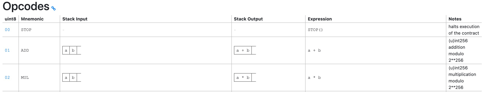

# 以太坊合约执行

## 基本概念

### EVM
EVM是一个**基于栈的、大端序**的虚拟机，这个虚拟机不是VMware那种，而是类似JVM的虚拟机，所以我们可以向理解JVM那样理解EVM。

类似JVM，EVM也是一个在真实计算机之上设计并创建出来的支持一套自定义指令集的计算机。它还包含一个栈和两个存储域，即memory和storage。
>是的，如果自定义一套指令集，一般就需要实现相对应的一个汇编语言，在汇编之上才是开发者使用的高级语言，如solidity，vyper等。

但EVM不像JVM，是可以直接安装在各种物理机之上，EVM在设计之处就是嵌入以太坊客户端中的，即EVM运行在以太坊系统之上。EVM的作用是运行以太坊智能合约，
合约是在外部账户通过一笔交易创建的，合约字节码会附在交易的`data`中。同样，交易也可以通过携带`data`的方式与合约进行各种类型的交互，比如调用、销毁合约等。

### 合约字节码
合约字节码由一系列操作符（也叫指令）组成，任何一个操作符都可以编码成一个字节面量，除了[PUSHn](https://www.ethervm.io/#PUSH1)。
EVM指令集支持多个PUSH指令，如PUSH1, PUSH2等，后面的数字指的是入栈的数据字节大小，PUSH1就是入栈1字节的数据，以此类推。PUSHn由于携带了数字变量，
所以只能编码为双字节。

### 合约的构造函数
合约在创建成功后，它的构造函数将从中剔除，即构造函数不会出现在已部署的合约中。

### 与合约交互
合约会暴露一些ABI（应用程序二进制接口）来与允许外部世界与之交互。

### Call Data
它是在调用合约时附在交易的`data`字段的信息，通常包含一个4字节的方法标识，方法标识的构造方式：`sha3-256("somefunc(uint)uint")[:4]`，即函数签名的SHA3-256哈希后的前4字节。

### 程序计数器（Program Counter）
计数器与栈、Memory和Storage通力协作，共同完成合约字节码的执行工作。

计数器的本质是一个部署后的操作码序列的offset，可理解为执行指针，计数器指向的位置就是下一步执行指令的位置。下面以一段简短的操作码序列进行说明（看不明白可先看完下文再回头看）：
```solidity
// 这段操作码序列的总offset为2+2+1=5，其中PUSH1指令占用1byte，指令后的数据占用1字节，JUMPI占用1byte
PUSH1 2 // offset=0，当指针指向offset=0时，表示接下来执行这一行指令。下一个指令的offset=这个指令的offset+这个指令占用的字节数
PUSH1 5 // offset=2
JUMPI    // offset=4，JUMPI实现条件跳转，首先依次取出栈顶2个元素5 2，判断第二个元素（2）是否为0，若不是就跳转到offset=第一个元素（5）的位置，那么就是0x05的位置
         // 若第二个元素是0，则指针自增，继续向下执行
JUMPDEST // offset=5，这个指令是标识此处作为一个跳转着陆点，跳转指令JUMP和JUMPI都必须以此作为着陆点，否则不能跳转，执行报错。
```

### 执行环境（上下文）
EVM在开始执行合约字节码的时候，会为这个合约创建一个临时且独立的上下文环境，具体来说就是创建几个单独的内存区，各自有不同用途，它们分别是
- 代码区：静态只读区，存储合约字节码。可以通过`CODESIZE`、`CODECOPY`指令读取，其他合约的代码可以通过`EXTCODESIZE`和`EXTCODECOPY`指令读取；
- 栈：是一个32字节元素、容量（长度）为1024的数组空间，用来存放EVM指令需要的参数和返回的结果。指令对栈元素的存取只能从栈顶开始。通常指令`PUSH1, DUP1, SWAP1, POP`会操作栈；
- Memory：是一个单字节元素的数组空间，用来存放合约执行过程中的瞬态数据。Memory空间通过字节offset来访问。通常指令`MLOAD, MSTORE, MSTORE8`会操作Memory（可以看到指令前的M前缀）；
- Storage：不同于前两个结构，它是存放持久化数据的一个map结构，key和value都是uint256类型。通常指令`SLOAD, SSTORE`会操作Storage（可以看到指令前的S前缀）；
- calldata：是在交易发生时附带的数据，静态只读区。比如在合约创建时，calldata的内容是构造器代码。通常指令`CALLDATALOAD, CALLDATASIZE, CALLDATACOPY`可以读取它.
- return data：是存放合约返回值的区域。可以通过指令`RETURN, REVERT`修改它，指令`RETURNDATASIZE, RETURNDATACOPY`读取它；

下面是Geth项目中涉及EVM解释器运行合约的源码 [EVMInterpreter.Run()](https://sourcegraph.com/github.com/ethereum/go-ethereum@v1.10.26/-/blob/core/vm/interpreter.go?L116:27&popover=pinned#tab=references)：
```go
// 这是EVM执行合约的核心方法
func (in *EVMInterpreter) Run(contract *Contract, input []byte, readOnly bool) (ret []byte, err error) {
    // 省略部分代码
	
    // 初始化执行合约所需的各种变量，其中就有stack、memory、pc等对象
    var (
        op          OpCode        // 当前执行的操作码，会在下面的for循环执行时不断变化
        mem         = NewMemory() // bound memory，内部初始化一个包含[]byte的结构体
        stack       = newstack()  // local stack，内部初始化一个[]uint256数组
        callContext = &ScopeContext{ // 属于当前合约的执行上下文
            Memory:   mem,
            Stack:    stack,
            Contract: contract,
        }
        // For optimisation reason we're using uint64 as the program counter.
        // It's theoretically possible to go above 2^64. The YP defines the PC
        // to be uint256. Practically much less so feasible.
        pc   = uint64(0) // program counter
        cost uint64
        // copies used by tracer
        pcCopy  uint64 // needed for the deferred EVMLogger
        gasCopy uint64 // for EVMLogger to log gas remaining before execution
        logged  bool   // deferred EVMLogger should ignore already logged steps
        res     []byte // result of the opcode execution function，当前调用返回值
    )
	
    // 省略部分代码

    for {
        // 省略执行合约的逻辑。。。
    }
}
```

### OpCode（操作码/EVM指令/助记符）
它是为EVM量身设计的一套汇编指令，支持算数运算、逻辑运算、位运算以及条件跳转等功能，属于图灵完备的语言。构建在其之上的solidity等语言当然也是图灵完备的语言。

OpCode可以称为操作码/EVM汇编指令/助记符(mnemonic)，其作用是帮助人们阅读代码逻辑。合约最终的编译和部署结果都是一串OpCode和操作数据组成的。
EVM执行合约逻辑就是从编译后的字节码序列中按顺序取出一个个OpCode执行的，如果执行到某个OpCode失败了（如参数不够/gas不够），那么EVM将revert所有的更改。
>在官方文档中，更多使用OpCode这个称呼，所以读者在查询时可以多使用OpCode作为关键字。

并非所有的OpCode都会消耗gas，而且部分OpCode会返还gas，已知会返还gas的操作有两个，一个是销毁合约（返24000gas），另一个是清空storage（返15000gas）。
但要注意的是，合约执行时，gas返还是存在一个单独的refund计数器中，并不会直接增加gas余额，如果稍后发生gas不够的情况，仍然会导致revert。也就是说，合约执行时不能使用刚返还的gas，
只能等执行结束后gas返还到账户中。最后，返还的gas数量不超过交易执行已消耗gas的一半，即至少支付已消耗gas的一半给矿工。

OpCode目前已经有140多个，每个都能编码为一个字节（配合数据构成字节码），`PUSH`指令除外，因为该指令可以携带任意长度的数据（不是从栈中获取，而是编写代码时就固定的），通常你看到的是`PUSH1`或`PUSH2`指令后面的数字表示的是携带数据的字节长度，
目前共有`PUSH1`\~`PUSH32`个PUSH指令。每个OpCode所需的参数从栈中获取（stack input），计算结果也会再压入栈中（stack output）。
>由于要将每个OpCode编码为单字节大小，所以最多允许设计256个指令（单字节的十进制范围是0\~255，十六进制为0x00\~0xFF，即最多表达256个不同的值）。

### Gas消耗
作为提供资源给交易执行的激励措施，一定数量的eth将被支付给矿工。这个数量由两个因素决定，发送的数量大小和完成交易需要的工作量大小。

gas费用分为固定费用和动态费用两种，固定费用是由以太坊平台为某些操作固定的gas费用设定，如一笔单纯的转账交易固定消耗21000gas；动态费用则是根据以下公式计算而来

>gas_price * gas_limit = total max gas costs

这两个变量的值都是由交易发起者来设定的。gas_price是1个gas单位的eth价格，比如gas_price=10wei，`wei`是以太币的单位，此处不赘述。gas_limit是发起交易的用户设定的愿意为交易执行支付的gas的最大数量，
这些gas并不总是会消耗完，交易完成后未消耗的gas将返还给交易发起者。如果设定的gas总量不足以支撑交易完成，那么不光交易会失败，已消耗的gas也不会退还。

>一笔携带合约字节码的交易的gas费用构成：交易本身费用21000gas + OpCode的gas费用。  
> 其中OpCode的gas费用分为两种，一种是固定费用；另一种是动态费用，通常由指令所需的参数大小或数量决定，具体可以在 [evm.codes](https://www.evm.codes/?fork=merge) 进行查询。


### 合约执行过程
我们需要了解EVM执行合约的大致过程：
- EVM中执行的每个指令都叫做OpCode（操作码）
- 在合约执行前，操作码会被转换为CPU可读的字节码。
- 首先，程序计数器（PC，类似寄存器）从合约字节码中读取一个OpCode，然后从JumpTable中检索出对应操作，即指令包含的函数集合。
  接下来计算该指令包含的所有函数所需的gas，如果足够，则执行该指令，若不够，则扣完gas，并回退执行过的指令。（根据指令不同，可能会对堆栈、memory或StateDB进行操作）

## 过程详解

我们编写的solidity代码经过remix或本地编译器如sloc、slocjs可以编译为对应的汇编代码，再转换为机器执行的纯十六进制字符的代码。

1. Remix的汇编代码和字节码可以在【Solidity Compiler——Compile Details】路径查看； 
2. 还可以下载solc编译器到本地，使用编译器编译代码得到汇编代码和字节码。

>下载支持全功能的cpp实现的solc编译器（推荐），查看[官方安装指导](https://docs.soliditylang.org/en/v0.8.17/installing-solidity.html#installing-the-solidity-compiler)  
> 下载支持部分功能的solcjs: npm install -g solc

通过一份简单代码来说明；

```solidity
contract Example {
    address _owner;
    constructor() {
        _owner = msg.sender;
    }
}
```

这是一份人类可读的solidity代码，用于实现自定义逻辑，为了便于机器执行，它需要编译为低级别的汇编代码（也称为操作码），再转换为十六进制代码由机器执行。
汇编代码可以认为是最接近CPU执行层的代码形式，通过汇编代码我们可以更清晰的看到solidity代码在汇编层的实际表现，比如一个函数用到了哪些汇编指令，
这十分有利于我们进行故障排查，特别是在debug阶段。下面将solidity转换为紧凑的**操作码序列**形式：

```solidity
// 请先下载solc编译器到本地
// solc -o learn_bytecode --opcodes 0x00_learn_bytecode.sol  
// 生成文件learn_bytecode/Example.opcode
PUSH1 0x80 PUSH1 0x40 MSTORE ...省略
```

操作码序列完全由EVM指令和数据组成，并以线性方式排列所有指令和数据。

以Example合约的前面部分操作码序列为例进行解释：`PUSH1 0x80 PUSH1 0x40 MSTORE`

- 首先，操作码不是字节码，操作码还能读，字节码就完全是 0128asdasda9s87d98asd 这样的一串不可读的十六进制字符了，每一个操作码可以转换为一个字节。
- `PUSH1 0x80 PUSH1 0x40` 表示将1字节的0x80入栈，紧接着是入栈0x40（随时记住，一个栈元素最大为32byte即256bit）
- `MSTORE` 指令是将一个值保存到EVM 临时内存的操作，接收2个参数，第一个参数是用于存放值的内存地址，第二个参数的要存放的值，
  注意这个指令按规定是它的参数从栈里面获取（而不是外部输入），所以这里的逻辑是 MSTORE 0x40 0x80 （将值0x80存入地址0x40）
- 其他指令的含义则查询指令集表，下面会列出

操作码序列并不利于我们对照代码阅读。所以我们需要生成按行显示的汇编代码：

```solidity
// solc -o learn_bytecode --asm 0x00_learn_bytecode.sol   生成learn_bytecode/Example.evm
  /* "0x00_learn_bytecode.sol":57:241  contract Example {... */
  mstore(0x40, 0x80)
  /* "0x00_learn_bytecode.sol":111:112  0 */
  0x00
  /* "0x00_learn_bytecode.sol":100:112  uint abc = 0 */
  0x01
  sstore
  /* "0x00_learn_bytecode.sol":118:168  constructor() {... */
  callvalue
  ...省略
  dataOffset(sub_0)
  0x00
  codecopy
  0x00
  return
stop

sub_0: assembly {
  ...
  auxdata: 0xa264697066735822122035b90a279bfd69292250dbe6e9f45c70ac30c03c0f50b99a887b24d9b292edce64736f6c63430008110033
}
```
这段代码分为两部分，以`sub_0 assembly`为界，在其之上的代码为**部署代码**，sub_0区域内的代码则是**runtime代码**。根据上面代码中的注释我们可以相对更清晰的对照solidity代码阅读汇编代码。 
尾部的`auxdata`字段是一种CBOR编码的二进制值，用来描述合约元数据，比如solidity版本，具体参考[Metadata](https://docs.soliditylang.org/en/v0.8.17/metadata.html#encoding-of-the-metadata-hash-in-the-bytecode) 。

### 关于部署代码
顾名思义，它在部署时就会执行。它主要执行三个任务： 
1. payable检查，如果合约构造函数未声明payable，部署时注入以太币将导致部署失败；  
2. 运行构造函数，初始化声明的状态变量；
3. 计算出runtime代码的字节码，并返给EVM存入StateDB（key为合约地址）；

### runtime代码
它在部署后，收到外部调用时执行。

### 最终字节码
最终字节码是携带在交易的`data`字段中用于合约部署的数据，它是一长串完全由十六进制字符组成的字符串，通过下面的方式生成：

```solidity
//solc -o learn_bytecode --bin 0x00_learn_bytecode.sol
6080604052600060015534801561001557600080fd5b50336000806101000a81548173ffffffffffffffffffffffffffffffffffffffff021916908373ffffffffffffffffffffffffffffffffffffffff16021790555060e3806100646000396000f3fe6080604052348015600f57600080fd5b506004361060285760003560e01c80634edd148314602d575b600080fd5b60436004803603810190603f91906085565b6045565b005b8060018190555050565b600080fd5b6000819050919050565b6065816054565b8114606f57600080fd5b50565b600081359050607f81605e565b92915050565b6000602082840312156098576097604f565b5b600060a4848285016072565b9150509291505056fea264697066735822122035b90a279bfd69292250dbe6e9f45c70ac30c03c0f50b99a887b24d9b292edce64736f6c63430008110033
```
最终字节码也是按照一个固定格式生成的：部署代码 + runtime代码 + auxdata 。

其中，runtime代码+auxdata可以通过如下方式生成：
```solidity
solc -o learn_bytecode --bin-runtime 0x00_learn_bytecode.sol
6080604052348015600f57600080fd5b506004361060285760003560e01c80634edd148314602d575b600080fd5b60436004803603810190603f91906085565b6045565b005b8060018190555050565b600080fd5b6000819050919050565b6065816054565b8114606f57600080fd5b50565b600081359050607f81605e565b92915050565b6000602082840312156098576097604f565b5b600060a4848285016072565b9150509291505056fea264697066735822122035b90a279bfd69292250dbe6e9f45c70ac30c03c0f50b99a887b24d9b292edce64736f6c63430008110033
```

### 为EVM设计的汇编语言
以太坊开发者为EVM设计了一种low-level的汇编语言，在没有高级语言（如Solidity）的情况下也可以使用。这种汇编语言也可以嵌入到高级语言源代码中当作“内联汇编（inline assembly）”使用。

汇编代码由执行引擎支持的汇编指令集中的一系列指令和操作的数据组成，不同的执行引擎支持的指令集也不相同，指令集可以由引擎的开发者自定义一套。solidity运行在EVM执行引擎上，
所以该指令集我们称为EVM指令集，完整的指令集表在[这里](https://ethervm.io/#opcodes)
查询。需要注意，在EVM环境中，把支持的指令集也叫做**OpCode**，即操作码。

这里也以下图简单说明一下：



为方便阅读，以表格形式翻译如下：

| uint8 | Mnemonic | StackInput  | Stack Output | Expression | Notes                        |
|-------|----------|-------------|--------------|------------|------------------------------|
| 译：字节码 | 指令名      | 指令执行时需要的栈元素 | 指令执行后写入栈的元素  | 表达式        | 备注                           |
| 00    | STOP     | 无           | 无            | STOP()     | 停止合约执行                       |
| 01    | ADD      | /a/b/       | /a+b/        | a+b        | 对栈顶的两个int256或uint256元素执行加法运算 |

注意，StackInput列中的元素排列顺序是从栈顶开始的，这可以使用一个例子来说明，比如减法运算指令`SUB`在表中的StackInput是`/a/b/`，那么则有下面的代码：
```solidity
// EVM指令交互平台：https://www.evm.codes/playground
PUSH 1 （代表b）
PUSH 2 （代表a）
SUB  // 减法运算
```
这段指令的输出是1而不是 FFFFFF...（-1的uint256形式）。

EVM目前共有140多个指令。需要注意的是，部分指令的参数数量是不固定的。简单起见，我们可以将所有操作码分为以下几类（列出部分）：
- 堆栈操作操作码（POP、PUSH、DUP、SWAP）
- 算术/比较/按位操作码（ADD、SUB、GT、LT、AND、OR）
- 环境操作码（CALLER、CALLVALUE、NUMBER）
- 内存操作操作码（MLOAD、MSTORE、MSTORE8、MSIZE）
- 存储操作操作码（SLOAD、SSTORE）
- 程序计数器相关操作码（JUMP、JUMPI、PC、JUMPDEST）
- 停止操作码（STOP、RETURN、REVERT、INVALID、SELFDESTRUCT）

读者可以在 [evm.codes](https://www.evm.codes/#60?fork=merge) 查询指令集表以及对应指令所消耗的gas数量。同时，这个网站还支持在线操作码编程，实时进行操作码与字节码、solidity代码之间的转换。
> 最准确的以太坊支持的指令集表还得在 Geth 的源码中查询，[这个链接](https://github.com/ethereum/go-ethereum/blob/v1.10.26/core/vm/opcodes.go)指向了v1.10.26版本的Geth的指令集相关go代码。

### 详解上面的汇编指令
<style>
pre {
  overflow-y: auto;
  max-height: 450px;
}
</style>

```solidity
    /* "0x00_learn_bytecode.sol":57:241  contract Example {... */
  mstore(0x40, 0x80)   // 将0x80这个值存入Memory中0x40的位置，这表示在Memory中开辟0x80这么多的空间以供临时使用，单位字节，转换一下就是 8x16^1+0x16^0=128Byte
    /* "0x00_learn_bytecode.sol":111:112  0 */
  0x00 // 将0x00入栈（省略PUSH）
    /* "0x00_learn_bytecode.sol":100:112  uint abc = 0 */
  0x01 // 将0x01入栈（省略PUSH）
  sstore // 将0x00这个值存入storage中0x01的位置，即storage[0x01] = 0x00
    /* "0x00_learn_bytecode.sol":118:168  constructor() {... */
  callvalue // 将本次调用注入的以太币数量入栈，没有就是0 （不管是创建合约，还是调用合约都是一次消息调用，都可注入以太币）
  dup1      // 复制栈顶的数值，即为本次调用注入的以太币数量，此时的栈中元素情况：[栈顶, 0, 0] ，这里假设注入0以太币。
  iszero    // 取出栈顶的值并判断是否为0，若是则入栈1，否则入栈0，stack: [栈顶,1,0,0]
  tag_1     // tag_1 入栈，stack：[栈顶,tag_1,1,0,0]。 注：tag_1只是汇编指令中的语法，并非EVM指令，通常标识一个函数起点，本质上是一个操作码序列的offset。
  jumpi     // 取出栈顶2个元素，即1,tag_1，判断第二接近栈顶的元素若非0，则跳转到tag_1位置，否则向下执行。显然这里会跳转tag_1
  0x00      // 若不跳转，则到达这一行，入栈0x00，stack：[栈顶,0,tag_1,1,0,0]
  dup1      // 复制栈顶元素，stack：[栈顶,0,0,tag_1,1,0,0]
  revert    // 回退操作，这将中断执行，并且回滚所有之前的逻辑。
// 段注释：从callvalue到revert这一段表示往合约发送以太坊，将会回退（因为没有定义fallback和receive函数）。

tag_1:    // 这里开始表示constructor()的逻辑，即 _owner = msg.sender
  pop   // 弹出并丢弃一个栈顶元素
  /* "0x00_learn_bytecode.sol":151:161  msg.sender */
  caller // 将msg.sender 入栈
  /* "0x00_learn_bytecode.sol":142:148  _owner */
  0x00   // 0x00 入栈
  dup1   // 复制 0x00
  /* "0x00_learn_bytecode.sol":142:161  _owner = msg.sender */
  0x0100 // 入栈 0x0100
  exp    // 指数运算，取出2个栈顶元素，0x0100^0x00 = 1，此时stack：[栈顶，1,0,msg.sender]
  dup2   // 复制栈顶下面一个元素，stack：[栈顶,0,1,0,msg.sender]
  sload  // 从storage中取出key为栈顶元素的value，并入栈，stack：[栈顶,storage[0x00],1,0,msg.sender]
  dup2   // stack：[栈顶,1,storage[0x00],1,0,msg.sender]
  0xffffffffffffffffffffffffffffffffffffffff // stack：[栈顶,0xffffffffffffffffffffffffffffffffffffffff,1,storage[0x00],1,0,msg.sender]
  mul   // 下面一段指令比较简单，不再注释
  not
  and
  swap1
  dup4
  0xffffffffffffffffffffffffffffffffffffffff
  and
  mul
  or
  swap1
  sstore
  pop
    /* "0x00_learn_bytecode.sol":57:241  contract Example {... */
  dataSize(sub_0)  // 这不是一种指令，可以理解为"PUSH dataSize(sub_0)"的缩写，意思是将下面的sub_0代码块的size压入栈顶
  dup1      // 复制栈顶的size值
  dataOffset(sub_0) // 与dataSize类似，这理解为"PUSH dataOffset(sub_0)"的缩写，意思是将下面的sub_0代码块的offset压入栈顶
  0x00      // 0x00入栈，假设size为0x36，offset=0x1c，则stack: [栈顶,0,0x1c,0x36,0x36]
  codecopy  // codecopy(destOffset,offset,size)，这个指令消费三个栈元素，所以它的作用是从code区offset(0x1c)的位置复制一段字节大小为size(0x36)的数据到Memory区的destOffset(0x00)位置
  0x00      // 入栈 0x00，stack：[栈顶, 0, 0x36]
  return    // return指令含义是本次调用执行结束，并消费2个栈元素，返回Memory区offset为0x00，size为0x36的一段数据
stop // 停止执行

sub_0: assembly {
  /* "0x00_learn_bytecode.sol":57:241  contract Example {... */
  mstore(0x40, 0x80)
  callvalue
  dup1
  iszero
  tag_1
  jumpi
  0x00
  dup1
  revert
  tag_1:
    pop
    jumpi(tag_2, lt(calldatasize, 0x04))
    shr(0xe0, calldataload(0x00))
    dup1
    0x4edd1483
    eq
    tag_3
    jumpi
  tag_2:
    0x00
    dup1
    revert
  /* "0x00_learn_bytecode.sol":173:239  function set_val(uint _value) public {... */
  tag_3:
    tag_4
    0x04
    dup1
    calldatasize
    sub
    dup2
    add
    swap1
    tag_5
    swap2
    swap1
    tag_6
    jump	// in
  tag_5:
    tag_7
    jump	// in
  tag_4:
    stop
  tag_7:
    /* "0x00_learn_bytecode.sol":226:232  _value */
    dup1
    /* "0x00_learn_bytecode.sol":220:223  abc */
    0x01
    /* "0x00_learn_bytecode.sol":220:232  abc = _value */
    dup2
    swap1
    sstore
    pop
    /* "0x00_learn_bytecode.sol":173:239  function set_val(uint _value) public {... */
    pop
    jump	// out
    /* "#utility.yul":88:205   */
  tag_10:
    /* "#utility.yul":197:198   */
    ... 省略一长段 utility.yul 代码
  auxdata: 0xa264697066735822122035b90a279bfd69292250dbe6e9f45c70ac30c03c0f50b99a887b24d9b292edce64736f6c63430008110033
}
```

参考
- [精通以太坊中关于EVM的章节](https://github.com/ethereumbook/ethereumbook/blob/develop/13evm.asciidoc)
- [以太坊虚拟机EVM的工作原理是怎样的](https://blog.csdn.net/pony_maggie/article/details/127021328)
- [以太坊操作码实时交互（与字节码实时转换）](https://www.evm.codes/playground?fork=merge)
- [以太坊黄皮书](https://ethereum.github.io/yellowpaper/paper.pdf)
- [以太坊Geth源码](https://sourcegraph.com/github.com/ethereum/go-ethereum@v1.10.26)
- [Diving Into The Ethereum VM Part 5 — The Smart Contract Creation Process](https://medium.com/@hayeah/diving-into-the-ethereum-vm-part-5-the-smart-contract-creation-process-cb7b6133b855)