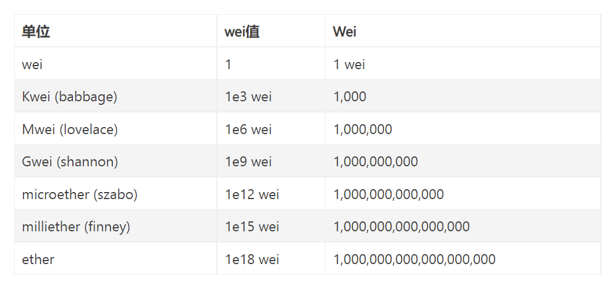

# 以太坊（Ethereum）（整理）

### 目录
TODO

---

## 以太坊简介
以太坊是一个在2015年7月正式运行的知名底层应用公链项目，它能够支持DApp（去中心化应用）在其上面进行创建和运行，就如同手机上的安卓或iOS系统能够支持APP运行一样。
在2016年，以太坊曾因为the DAO事件而进行了硬分叉。

### 1. 背景
以太坊最初是在2013年底由比特币杂志的程序员和联合创始人Vitalik Buterin在一篇白皮书中描述的，该白皮书描述了一种构建去中心化应用程序的方法。
Buterin在其中讨论了比特币设计的优点和不足，尤其是他认为区块链技术不应该只应用于加密货币，而是应该使用一种**图灵完备**的语言来开发能够将现实世界的资产（如股票和财产）
附加到区块链上的应用程序。
>[知乎：什么是图灵完备？- Ran C的回答](https://www.zhihu.com/question/20115374/answer/288346717)

### 2. 发展事记
- 2013年底，以太坊发明人Vitalik Buterin发布以太坊初版白皮书，并召集了一批认可以太坊理念的开发者启动项目，其中有项目联合创始人Gavin Wood和Jeffrey Wilcke；
- 2014年1月，以太坊在迈阿密举行的北美比特币会议上发布；
- 为了创建合适的基础结构和法律策略，团队将原本在2014年2月份举行的以太币预售时间延迟；
- 2014年2月，以太坊社区、代码数量、wiki内容、商业基础结构和法律策略等逐渐完善。上述提到的以太坊爱好者Gavin Wood和Jeffrey Wilcke开始全职专注以太坊开发等工作；
- 同年4月，Gavin Wood发表以太坊虚拟机技术说明黄皮书，该文档成为以太坊的技术圣经。根据说明，以太坊客户端支持7种编程语言，包括C++、 Go、Python、Java、JavaScript、Haskell、Rust等，软件性能更加优化;
- 同年7月24日，以太坊开放为期42天的以太币预售，共募集到31531个比特币，根据当时币价折合1843万美元，是当时排名第二大的众筹项目。预售时所使用的比特币地址是36PrZ1KHYMpqSyAQXSG8VwbUiq2EogxLo2，在比特币区块链浏览器里可以看到每一笔转入和转出，最终，售出的以太币的数量是60102216。
  接下来，以太坊开发逐渐走上正轨。
- 2015年5月，团队发布最后一个测试网络（POC9，此前已经有0~8个测试版本），代号为Olympic；
- 同年7月，团队发布正式的以太坊网络，代号Frontier，标准着以太坊区块链正式上线运行；月底，以太币Ether开始在多家交易所交易。其创世区块包含了8893笔交易，区块奖励是5个Ether币；
- 2016年7月，以太坊因The DAO事件发生硬分叉，从此分离出ETH和ETC两个区块链项目；
- 2017年3月，各种区块链初创公司、研究小组和财富500强公司宣布成立企业以太坊联盟（EEA），其拥有30个创始成员。截至2017年5月，非营利组织拥有116家企业成员，包括ConsenSys、CME集团、康奈尔大学研究组、丰田研究院、三星SDS、微软、英特尔、摩根大通、Cooley LLP、默克KGaA、DTCC、德勤、埃森哲、Banco Santander到2017年7月，联盟中有超过150个成员，包括万事达卡、思科系统公司、俄罗斯联邦储蓄银行和丰业银行；
- 2018年1月，以太币Ether成为市值仅次于比特币的世界第二大加密货币，直到2021年，依旧保持；
- 2021年3月，Visa Inc. 宣布开始使用以太坊结算稳定币交易。2021年4月，摩根大通(JP Morgan Chase)、瑞银(UBS)和万事达(MasterCard)宣布，他们将向ConsenSys投资6500万美元，ConsenSys是一家软件开发公司，负责构建以太坊相关基础设施；
- 2021年，以太坊进行了两次升级。第一次是4月代号为Berlin的升级，第二次是8月代号为London的升级。

#### The DAO事件
The DAO是以太坊上的一个DApp，是Decentralized Autonomous Organization（分布式自治组织）的简称。那时这个项目在以太坊上进行中众筹时，
在短短的28天内就筹集了1150万以太币，在当时价值1.49亿美元，成为有史以来最大的众筹项目。这个获得众多人看好的自治组织，由德国的以太坊创业公司
Slock.it 编写源代码，其职能被设计成为一个类似于投资基金的组织，可以由社区成员投票，授权给社区为以太坊项目提供资金。

在6月12日，创始人之一的Stephan Tual宣布，他们发现了软件中的一个“递归调用splitDAO函数”漏洞；

6月15日，the DAO上的漏洞尚未修复完成，发起攻击的合约就被创立了，令所有人都措手不及。17日，攻击正式开始；

以太坊创始人Vitalik Buterin立刻通知了中国社区，DAO遭到黑客的攻击，通过DAO上“递归调用”的漏洞，不断从the DAO 中分离出资产并建立自己的child DAO，将这些以太币转移到里面。根据当时以太币的价格，可以得出被黑客转移的以太币价值近6千万美元。

为了挽回这一局势，Buterine当机立断，发布了《紧急状态更新：关于the DAO的漏洞》的文章，解释了当时the DAO被攻击的细节，以及一个关于分叉解决方案提议。首先进行软分叉，就是修改以太坊区块链上的共识协议，使得新生成的区块获得所有节点的认同。

这是一个有效的提议，一经软分叉，所有被盗的币都将“冻结”在那个地址上。从区块高度1760000开始，所有关于the DAO以及child DAO的交易都将无效，以此来阻止黑客将以太币提出。然后，再进行一次硬分叉将这些以太币找回。

为了节省篇幅，这里省去一些内容。。。

**为了拿回被盗的币，以太坊最终还是进行了分叉**。7月20日，备受瞩目的以太坊硬分叉完成，中国的一个矿池成功地从这条新主链上挖到了第一个区块。而由黑客转移的，其中有价值4千万美元的以太币被成功地转移到了新的地址，也就是说，经过分叉回滚，黑客盗走的the DAO以太币，被成功“召唤”回来。

这一次分叉，无疑是力挽狂澜的壮举。然而，以太坊的分叉并没有得到所有矿工的同意，所有以太坊最终形成了两条链，一条是原来的链ETC（以太坊经典），一条为新分叉出的链ETH，即现在的以太坊。这两条链分别代表了不同的社区共识和价值观。

同时，这一次分叉也引发了区块链业内对以太坊的一系列争议和思考。虽然硬分叉夺回了被盗走的币，但也暴露出了这样一个问题：区块链的分叉，以及将被盗的币回滚的措施，违背了区块链不可篡改的特性。

内容节选自[知乎-The DAO：导致以太坊硬分叉的罪魁祸首](https://zhuanlan.zhihu.com/p/48575688)

### 3. 升级计划
以太坊发布的初期，进行了多次硬分叉形式的升级，包含了许多影响底层结构的重要改变。

以太坊的发布计划分为四个阶段，每个阶段都是硬分叉，分别是

- Frontier（前沿），于2015年7月发布。是以太坊的首个主网版本，Frontier只有命令行界面，没有图形界面，可以用于挖矿和交易；
- Homestead（家园），于2016年3月发布。与Frontier相比，它没有明显的技术性变革，主要提升了稳定性；
- Metropolis（大都会），于2016年12月发布。该阶段提供了一个普通用户可用的、功能完善的用户界面；
- Serenity（宁静），分多个子阶段进行，每个阶段大约需要六到八个月完成。此阶段标志着进入以太坊2.0时代；
    - 0阶段已于2020年12月进行，该阶段提供了三个关键技术——实现基于PoS共识机制（称为Casper）的Beacon链和验证节点。这些功能于2020年12月在试用状态下上线，与传统的以太坊区块链并行运行。
      Casper的实施，**标志着以太坊将不再需要挖矿的过程**。新交易区块的验证和确认将由验证节点来完成，验证节点将根据其股权进行选择；
    - 1阶段已于2022年9月15日进行，该阶段主要完成了从PoW到PoS的过渡，官方称为**Merge**。过程是将上一阶段开发的基于PoS的Beacon链合并到以太坊主链；
    - 本来1阶段是着重于分片技术（能显著提高交易吞吐量）的，但重心变更为Merge了。后面还有几个阶段尚未进行，拭目以待吧。

### 4. 以太坊2.0
以太坊官方的定义：
- 以太坊1.0主要是"执行层"，包含对交易的处理和执行；
- 以太坊2.0主要是"共识层"，指的是PoS版本的以太坊，当然，还有其他一系列升级，比如提示交易吞吐量、采用分片技术、优化EVM架构等。
截至2020年12月首个阶段的开始进行，标志着以太坊正式迈如2.0时代，**其共识算法已经从PoW替换为了PoS**。

## 如何使用以太坊平台

#### 1.谷歌扩展商店安装metamask插件
#### 2.设置密码
#### 3.获取平台根据密码生成的多个助记词组合
助记词相当于账户+密码，需要私密保存。可用来登录以太坊，以及恢复账户。
#### 4.注册&登录成功
此时已经拥有了一个0以太币（代号ETH）的以太坊账户Account_1，这个账户由一个唯一字符串地址，可以公开，相当于银行卡号，作为转账目标。
#### 5.使用测试网
点击插件展开的页面上方会显示**Main Ethereum Network**，这表示目前显示的主网中Account_1地址的余额，想要增加余额需要根据当前以太币市场价格用法币购买获得。  
为了测试，可以切换主网为其他测试网如Rinkeby Test Network，然后进入网站给Account_1地址转账以太币。
>在笔者测试时，所有展示的测试网中没有Rinkeby Test Network，但有其他测试网，读者可根据google查询其他测试网如何为自己地址充值以太币。  
> **注意**：通常测试网需要你输入的地址并不直接是以太坊地址，而是一个社交网站的包含了你以太坊地址的帖子链接，测试网会从链接中读取地址并转账，这是为了防范恶意行为者耗尽所有可用资金。

#### 6.油费（Gas fee，也叫矿工费）
以太币转账需要填写油费单价（gas price=gwei）和油费数量(gas limit)  
>Gas fee= gas price * gas limit

gas price也叫做**Gwei**表示gas最小单位，1Gwei等于0.000000001ETH(1ETH=10亿Gwei)。
>收油费一方面是为了防止有一些黑客发布大量无意义的交易堵塞网络。由于发送交易收费，黑客就不会通过这种方式攻击网络，因为发送大量交易需要付出大量的费用；
> 另一方面也是作为矿工激励，毕竟区块能存放的交易数量是有限的，矿工可以自由挑选gas价格高的交易去打包，所以gas出价高的交易更快被全网确认。

**gas price（gwei）**  
油费单价，根据网络情况变化，越高则交易完成速度越快。通常有个快-中-慢的推荐值，参考http://ethgasstation.info/
**gas limit**  
gwei数量，愿意为一笔交易付出的最大gas数量，目的是防止网络拥堵时你的交易被一直处理消耗大量eth，浪费钱财，如果以太坊网络长时间堵塞，那么矿工就会一直尝试
处理你的交易，一直消耗一定数量的gas price，直到耗完gas limit*price这么多的手续费，**并且交易因为拥堵也不一定会成功**。
>给一个帐户转账eth消耗的gas limit为固定21000；

上述metamask是官方插件；也可以使用其他交易所提供的钱包，在转账以太币时，这些钱包可能允许你直接设置gas费用，而不用单独设置limit和price。

## 以太坊核心概念

### 1. 账户和地址
以太坊中的账户包括外部账户和合约账户。

外部账户由人工创建，受私钥直接控制。外部账户的地址是一个外部账户的标识，类比一个电子账户的账号，私钥则类比账户的交易密码。除此之外，账户还包括余额等状态。

合约账户由外部账户创建，不受私钥控制，而是合约代码控制。它的地址是根据合约创建者的地址和合约创建者发送过的交易总数进行计算得出。
合约账户与外部账户最大的不同就是前者存有智能合约，所以合约账户还包括合约代码和合约存储。

### 2. 消息和交易
以太坊的消息在某种程度上类似于比特币的交易，但两者之间存在以下区别：
- 以太坊消息可以由外部账户或者合约账户发送，而比特币交易只能从外部账户发送；
- 以太坊消息可以在转账的同时传递信息，可用于信息上链；
- 如果以太坊消息的接收者是合约账户，可以进行回应，这意味着以太坊消息也包含函数概念。

消息机制使得合约账户和外部账户拥有同样的权利，包括发送信息和创建其他合约的权利。

以太坊的交易是只一个签名数据包，用于从一个账户向另一个账户转移以太币、调用合约方法或部署一个新合约。交易只有外部账户创建，交易内容一般包含：
- 消息的接收者
- 用于确认发送者的私钥签名
- 要转账的以太币数量
- 要发送的数据和两个被称为GasLimit和GasPrice的数值

为了防止代码的指数型爆炸和无限循环，每笔交易需要对执行代码所引发的计算步骤即出示消息和所有执行中引发的消息做出限制。gas是以太坊用于执行交易的虚拟燃料，
以太坊虚拟机通过衡量gas的消耗量来限制计算资源的消耗，或者说gas是执行交易的每条指令消耗的计量单位。而GasLimit就是交易执行允许消耗的计算资源最大值，
GasPrice则是每一计算步骤需要支付矿工的费用。当交易尚未执行完但gas已经用尽时，所有改变了的状态会恢复原状，但已经消耗的gas不会退回，未消耗部分则退回。
>交易实际产生费用 = gas_used * gas_price

### 3. 区块结构
区块本质上是一个数据包，也可以定义为一种记录一段时间内发生的交易和状态结果的数据结构。一个区块的生成是对当前账本状态的一次共识。以太坊的区块主要由区块头、交易列表和叔区块头组成。

区块头包含以下信息：父区块哈希、叔区块哈希(uncles hash)、状态树根哈希（state root）、交易树根hash（tx root）、收据树根哈希（receipt root）、时间戳、随机数等。

交易列表是矿工从交易池中选择打包进区块中的一系列哈希。

叔区块是指没有被包含进主链，但被主链区块引用的区块，每个主链中的区块最多引用两个叔区块。

### 4. 以太坊节点
以太坊作为一个分布式系统，是由多个节点协同运作的。节点包括全节点和轻节点，与比特币类似。

全节点同步以太坊区块链所有数据，包括区块头、区块体、交易列表等所有以太坊信息。全节点保存了全部数据，不需要依赖中介去进行数据验证。

轻节点只同步区块头，不存储交易列表等信息，而是通过Merkle证明来判断一笔交易的有效性，大大减少存储空间。

### 5. 挖矿和共识
挖矿是指矿工通过付出一定努力（如工作量）来与其他矿工竞争一系列交易的记账权，把这些交易打包成区块，并把区块添加到区块链上的过程。

共识是用来评判哪个矿工节点拥有一次打包成功区块的资格的规则。以太坊1.0是使用PoW共识， 2.0开始切换到PoS共识，下面简单列出两个共识的特点对比：

**【核心原理】**  
- PoW：寻找一个随机数，进行一个双hash计算，目的是寻找一个符合目标难度的值，整个计算过程主要考验算力。
- PoS：比拼算力，同时也拼余额，余额越大，越容易得到记账权。

**【优点】**  
- PoW：逻辑简单，易实现；
- PoS：解决了PoW浪费算力资源和算力导致中心化的问题，并在理论上缩短了达成共识的时间；

**【缺陷】**  
- PoW：每台设备都需要进行大量数学计算，造成资源浪费；存在51%攻击问题和算力集中问题；
- PoS：更容易产生分叉，一笔交易需要更多区块确认；安全性和容错性不像PoW一样有严格数学证明；同时也存在恶意囤积货币争取记账权的问题；

### 6. 以太坊虚拟机
虚拟机是指通过软件模拟的、具备完整硬件系统功能并运行在隔离环境下的完整计算机系统，如虚拟化物理机VMware、Java虚拟机等。
而以太坊虚拟机EVM则是建立在以太坊区块链上的代码运行环境，其主要作用是处理以太坊系统内的智能合约。

EVM是以太坊中智能合约的执行环境。它创建了一个类似容器一样的隔离环境，运行在EVM内部的代码不能连接外部网络、文件系统或其他进程，甚至智能合约与其他智能合约只有有限的接触。
EVM是一个简单的基于栈的架构，栈的最大深度是1024，其中字（word，栈中数据项）的大小是256位，这是为了便于执行Keccak-256位哈希和椭圆曲线计算。

### 7. 数字资产
以太坊中的第一种数字资产是内置货币——以太币（代号ETH，单位Ether即以太）。其主要两种功能：一是作为数字货币流通，二是支付交易费用。比特币的最小单位的satoshi，
以太币的最小单位是wei，1ether = 1018wei，以太坊内部使用的单位都是wei。除了wei，以太坊还有其他计算单位，如下：

## 智能合约

#### 1.定义
是跑在以太坊系统中的一段代码，亦称为代码合同，它可以行使类似现实中的合同约束行为。  
但它只能约束：
- 规则明确，一旦确定不轻易修改的业务，如**航班延误赔偿**（程序可以自动在航班系统中查询延误时间，一旦延误预期设定的N小时，则自动赔付以太币给预期设定的
账户）；
- 不能约束规则不明确，或会经常变化规则的业务，如汽车保险，人身医疗保险，因为这些业务无法通过程序去自动判别其中的具体情况以及程度，只能通过人工进行；并且
合约一旦开始运行，就无法撤销。

#### 2.适用场景

- 金融-银行
- 金融-证券
- 金融-众筹
- 金融-竞拍：解决恶意竞拍
- 跨境贸易
- 物流供应链：通过区块链记录和查询各类物品供应原始数据

---

参考
- [《区块链技术开发指南-马兆丰》](https://baike.baidu.com/item/区块链技术开发指南/56688853?fr=aladdin)
- [知乎：以太坊产生的背景和以太坊版本](https://zhuanlan.zhihu.com/p/379653329)
- [百度百科：以太坊](https://baike.baidu.com/item/以太坊/20865117?fr=aladdin)
- [维基百科：Ethereum](https://en.wikipedia.org/wiki/Ethereum)
- [Gemini: The 3 Phases of Ethereum’s 2.0 Serenity Upgrade](https://www.gemini.com/cryptopedia/ethereum-2-0-blockchain-roadmap-proof-of-stake-pos)
- [以太坊官网—升级计划](https://ethereum.org/en/upgrades)