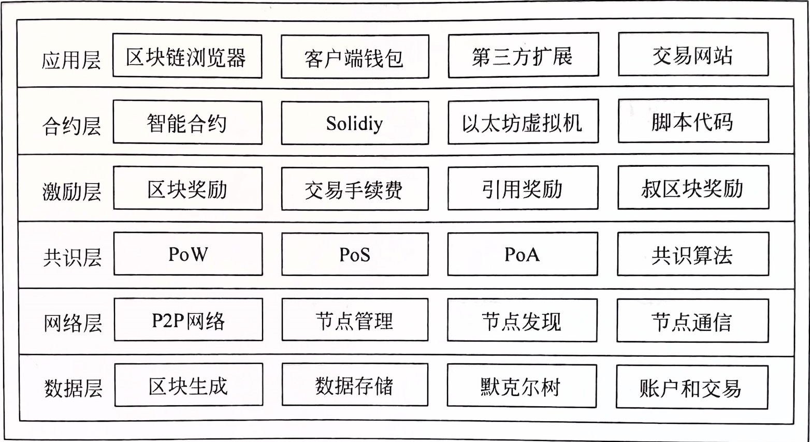
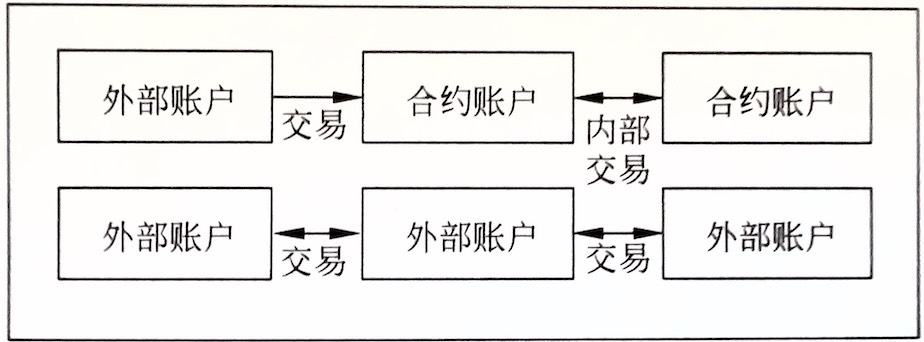
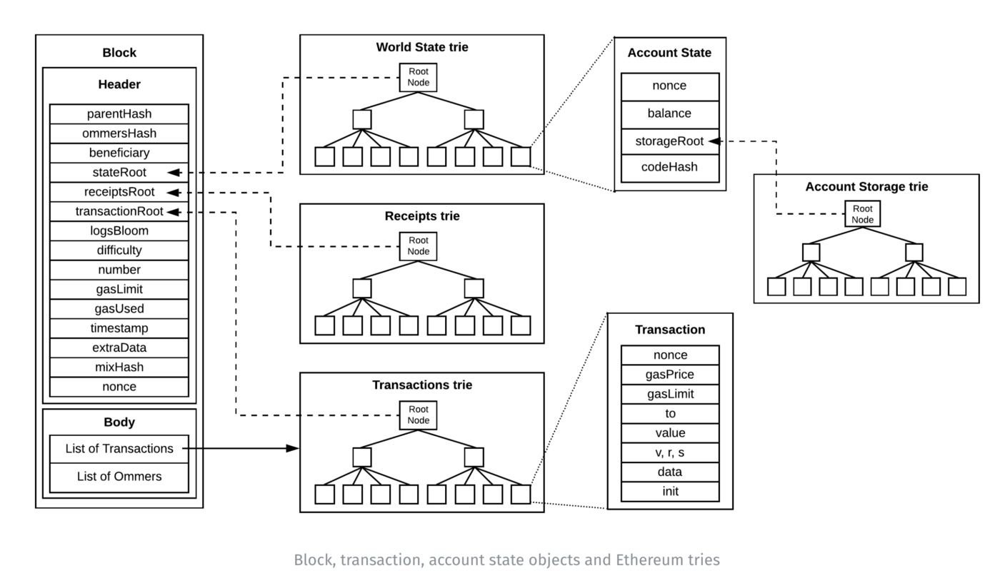
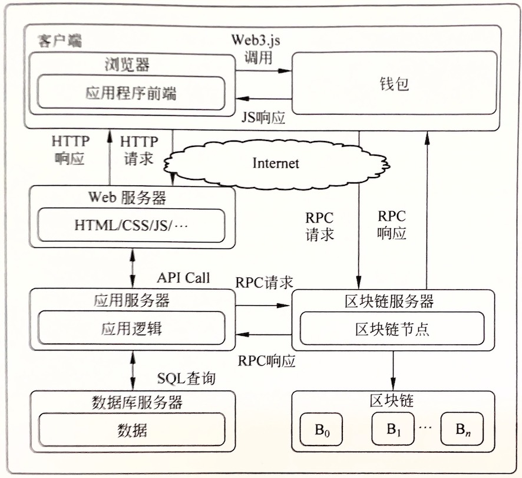
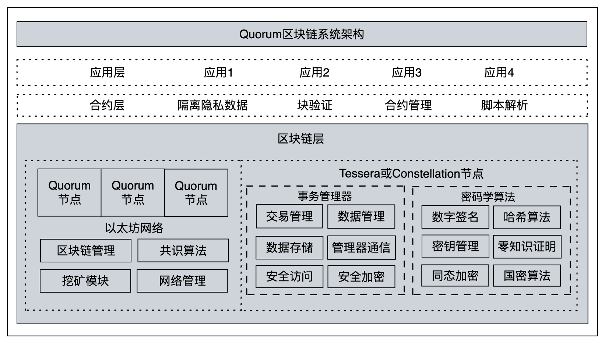
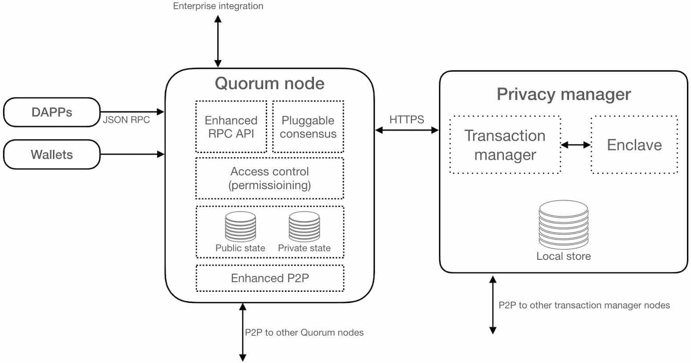

# 以太坊技术细节（整理）

### 目录

TODO

## 架构图



## 数据层

位于区块链架构的最底层，在数据层中数据键值对形式存在LevelDB数据库中，使用MPT（Merkle Patrcia Tree）作为数据结构来组织和管理。数据组成一个个区块，
区块中包含交易列表，交易执行会改变账户状态，进而改变以太坊的全局状态。

### 1. 账户原理

与比特币相比，以太坊的最大优点之一就是它使用传统账户余额模型，而不是UTXO模型，这使得以太坊账户可以拥有多种状态。下面从账户类型、账户状态、账户生成和账户管理这四个方面来讲解账户与原理。

#### 1.1 账户类型

在 [以太坊介绍](./ethereum_intro.md) 中我们简单介绍了账户分为外部账户和和合约账户，外部账户由人为创建，而合约账户可以由外部账户或合约账户创建。 这决定了两种账户在宏观上的不同表现。

**外部账户**可以通过个人私钥对交易签名，发送交易给另一个外部账户或合约账户。在两个外部账户之间传送的消息只是简单的价值转移；从外部账户到合约账户的消息则会激活合约账户中的合约代码，
允许合约代码执行响应逻辑，包括转移代币、修改合约状态、执行特定逻辑运算、创建新合约、调用其他合约代码等。

**合约账户**被合约代码控制，与外部账户不同的是，合约账户不可以自己主动发起交易，只能在收到一个交易后才能触发响应（即被动执行）。收到的交易可以是外部账户发起其他合约账户的代码调用。
同时合约之间还可以通过「消息」或「内部交易」进行通信，消息或内部交易也类似于交易，不过与交易的不同点是它们不是由外部账户产生，而是由合约账户产生。
而且它们只是虚拟对象，没有像交易一样被序列化并被记录到区块链中，而是只存在于以太坊执行环境中。当一个合约发送一个内部交易给另一个合约时，另一个合约中的代码就会被执行。 下图展示它们之间的调用逻辑：



从图上可以看出，以太坊上的任何动作，总是由外部账户先触发，然后产生交易，再根据情况决定是否触发合约账户以及后续的调用逻辑的。

#### 1.2 账户状态

外部账户和合约账户的状态有所不同，但都包含四个字段：

- nonce：在外部账户中这个字段表示由此账户地址发出的交易数量，该字段会在发送交易时用来防止双花。在和合约账户中表示账户所创建过的合约数量；
- balance：余额，以wei为单位，1ether=10<sup>18</sup>wei；
- storageRoot：账户存储内容的MPT的根节点哈希值；
- codeHash：在外部账户中这个字段是一个空字符串的哈希；在合约账户中表示这个账户的EVM code（编译后的合约字节码）的哈希，当账户收到一个消息调用时，代码就会被执行。
  与其他字段不同的是，codeHash是不可变的，可以被当做索引来从状态数据库中获得响应的EVM code。

一个预编译合约账户和一个被销毁的合约账户的状态都是空，为空的时候表示账户不被包含在以太坊全局状态中了。

一个新生成的外部账户，只有账户的nonce和balance为空，账户状态不为空。

#### 1.3 账户生成

**【外部账户生成】**  
一个外部账户是通过一对公私钥的形式体现的。公钥代表账户地址，私钥被编码在一个钥匙json文件中，可以用任何文本编辑器打开查看。 但文件中的私钥是在创建账户时设置了密码加密存储的，所以必须同时拥有私钥和私钥密码才有账户的所有权。

钥匙文件被保存在以太坊节点data/keystore目录中，同一个节点data/目录下的账户属于同一个钱包，一个以太坊节点可以设置不同的data/目录来创建多个钱包。

**【合约账户生成】**  
一个新的合约账户是通过部署一个合约来生成的。合约账户不受私钥管理，通常是受合约发布者的管理，并且这种所有权可以通过写在合约里的函数实现所有权转移、继承等。

合约所有者还拥有销毁合约的权利，销毁合约后合约地址上剩余以太币将会发送给指定目标，然后合约账户上的所有状态会被清除。但合约代码并没有从区块链上移除，
历史区块不受影响，只是合约被销毁后这个合约所有函数都不能被调用，再向合约地址转入以太币将无法被转出。

#### 1.4 账户管理

以太坊客户端中，管理账户信息的模块可以管理多个钱包，每个钱包管理多个账户。  
上述钱包是指用于管理账户的功能模块，即存放私钥的容器。我们平常所说的钱包一般是指拥有用户界面的应用程序，可用来访问用户资金，管理秘钥和地址、创建/签署交易、与合约交互和作为DApps入口。

### 2. 交易原理

交易的定义：以太坊交易是指一个签名数据包，用于从一个账户向另一个账户转移以太币、调用合约方法或部署一个新合约。交易分为两种类型：消息通信和合约创建，
两者都是由外部账户创建并提交到以太坊网络的，然后由以太坊网络传输，并在以太坊区块链上被记录。由此可见，交易是连接外部世界和以太坊内部状态的桥梁。

本节按照交易从产生到上链的基本流程来详细介绍以太坊交易原理。

#### 2.1 创建交易

创建交易需要在客户端填充以下交易信息：

- nonce：发送者账户中的nonce，表示发送者总共发出的交易数量
- gasPrice：发送者愿意支付的一个gas单位的价格
- gasLimit：发送者设置的执行这个交易可使用的最大gas数量
- to：接收者地址，在合约创建交易中为空，使用默认零地址
- value：发送者向接收者转移的wei的数目，或者是创建合约时作为合约账户的初始wei数目
- v,r,s：用于产生标识发送者的签名信息
- init：仅存在合约创建类型的交易中，用来初始化新合约账户的EVM代码片段。init值会执行一次，然后被丢弃。第一次执行init时，它返回一个账户代码体，即永久与合约账户关联的一段代码
- data：一个不限制大小的字节数组，作为交易的附加信息或合约代码或合约参数

#### 2.2 交易签署

以太坊目前使用的签名方案是在EIP-155中指定的包括交易重放保护的新签名方案。EIP-155向交易数据结构中添加了三个字段：v,r,s，其中r和s初始为0，v初始为链标识符。
三个字段在交易序列号前添加到交易数据中，因此它们会影响交易hash。v保证了链标识符的不可篡改，因为如果链标识符被篡改，签名将失效。因为签名的有效性取决于链标识符，所以交易无法在另一个链上重放。
> 交易重放保护方案的内容是：在签名前的交易数据中添加了链标识符（chain-id）。确保了在一个链上（如以太坊主网）创建的交易不能再其他链上（如ETC或Rposten测试网）重放。

可用的链标识符如下表：

| 区块链名称            | 链标识符 |
|------------------|---|
| ETH主网            | 1 |
| Expanse          | 2 |
| Rposten          | 3 |
| Rinkeby          | 4 |
| Rootstock主网      | 30 |
| Rootstock测试      | 31 |
| Kovan            | 42 |
| ETC主网            | 61 |
| ETC测试            | 62 |
| Geth private 测试  | 1337 |

#### 2.3 交易广播

以太坊使用P2P网络，网络中任意节点都可以创建、发送、接收和验证交易。广播始于创建交易的节点，然后传播到相邻的其他节点。

#### 2.4 交易提交

节点收到新交易后，会把它先放入交易内存池中。后者包含两个列表：queue列表和pending列表。新交易先放入queue列表中，接着从queue列表转移到pending列表中。

#### 2.5 交易执行

添加到pending列表中的交易是待处理交易，准备被执行。执行是在矿工挖掘一个新区块时进行的。矿工从pending列表中选择交易，把它交给EVM执行，并同时把它打包进区块中，不会等待执行结果。

#### 2.6 交易存储

交易执行后会返回一个收据，其中包含交易后账户状态的变化。当交易所在的区块被添加到区块链上时，此收据才会被提交到底层数据库中存储下来。这样，我们的交易就完成了从创建到被签署、传播、上链全过程。
它改变了以太坊这个状态机的状态，并在区块链上留下了不可磨灭的印记。

### 3. 区块从创建到入库

与比特币一样，在以太坊中，区块仍然是交易的载体。打包区块的过程是通过不断寻找一个小于系统给定哈希值的数来获得记账权。与比特币不同的是，以太坊的区块由交易列表和叔区块构成。
同样，由于网络延迟，最早打包区块的节点并不一定最先将区块广播至网络，那就可能发生同一时刻多个矿工打包出区块的情况，这个时候就涉及到链的分叉。
分叉时会选择多个分叉链中总难度最高的链作为主链，该链上的区块会获得奖励，而其他分叉链上的新区块只有在被后续作为uncle区块时才会获得奖励，否则就是没有价值的孤儿区块。

#### 3.1 区块结构



**------------------------【以太坊区块结构图：header+body】------------------------**

区块头字段解释（其中ommer同uncle）：

- parentHash：前一个区块（父区块）的256位hash
- ommersHash：区块关联的uncle区块的256位hash
- beneficiary：矿工用于接收交易费的以太坊的地址
- stateRoot：区块中所有交易被执行完且区块被确认后，状态树根节点的256位hash
- receiptRoot：区块中所有交易的收据所组成的树的根节点的256位hash
- transactionRoot：区块中所有交易所组成的树的根节点的256位hash
- logsBloom：区块中所有交易的收据的日志组成的bloom过滤器
- difficulty：区块难度值，可以根据父区块的难度值和时间戳计算得到
- number：区块高度，创世区块高度为0
- gasLimit：区块可用的gas数目上限，在区块创建时设置。可以根据父区块的gasUsed同gasLimit * 2/3 计算得到
- gasUsed：区块中所有交易用掉的gas数目之和
- timestamp：区块初始化的时间戳
- extraData：区块的附加数据，最多32字节
- mixHash：一个256位hash，用来与nonce一起证明当前区块执行了足够的计算量
- nonce：工作量证明过程中生成的一个64位hash，与mixHash一起证明当前区块执行了足够的计算量

**【区块体】**  
区块体包含交易列表和引用的uncle区块列表。交易列表是从交易池中选择进入区块的一系列经过验证的交易，叔区块是区块体中一个特别成员，从业务上来说，它不是必须的，
而且它的出现会使得区块计算hash需要更长时间。引用uncle区块的目的是为了使主链获得更多安全保证，降低以太坊网络中那些计算能力特别强大的节点对区块产生有过大影响力的风险。
通过对uncle区块打包者的奖励，来调动各节点计算资源分布的均匀性，防止这些节点破坏去中心化这个根本宗旨。

#### 3.2 区块生成

除了创世区块，其他区块都是由矿工创建并添加到网络中的。区块创建就是矿工根据一定规则从交易池中选择一系列经过验证的交易进行打包，生成区块头和区块体的过程。
矿工在网络中负责接收、转发、验证、打包交易。以太坊1.0时代仍然使用PoW算法来竞争记账权，以太坊中这一竞争过程称为区块的**封印**（Seal）。

#### 3.3 区块封印

我们所说的挖矿过程其实包含了区块创建和封印两阶段。第一阶段先创建出完整的新区块，其中包括区块头部分属性、交易列表、uncle区块等，并且所有交易已经执行完毕，
所有收据也收集完毕，各账号状态更新完毕。只等第二阶段的封印结果返回，就可以填充区块头中剩余的部分属性，如Difficulty、Nonce、MixHash等。 封印完成后，区块可以被广播给其他节点。封印阶段消耗的计算资源远超创建阶段。

区块封印由共识算法完成。目前以太坊中的共识算法包括Ethash算法和Clique算法，在以太坊发展的第四个阶段，将会从PoW转为PoS，即采用基于PoW的Casper算法。 Ethash算法是目前以太坊主网采用的，Clique是测试网(
ganache)采用的。封印过程不会增加或修改区块中任何跟有效数据有关的部分，封印目的是通过一系列复杂步骤选拔出本轮次有资格记账的矿工。

#### 3.4 区块验证

区块封印后被广播至其他节点，然后由其他节点进行验证是否有资格上链。验证包含四个步骤：验证区块头和uncle区块、验证交易、发放奖励、验证全局状态和工作量。

#### 3.5 选择主链

新区块在某个节点被验证通过后，还需要验证区块所在的链是否主链。由于以太坊生成区块的速度较快，同时生成多个区块的情况很多见，故每一时刻生成的基本都是一颗区块树。
那么主链就是该区块树中从根节点到叶子节点路径最长的链。为了形成路径共识，最终会选择具有最大计算量（总难度最大）的路径作为主链。

识别主链最直观的方式是比较从根走到叶子节点的路径长度，即除了创世区块以外总共走过的区块数量。路径越长，一般到达叶子节点的总体挖矿工作量越大。
但当出现到达两个叶子节点的路径长度相同时，就需要比较两个叶子节点的区块的总难度。新区块的总难度为它自己的难度值加父区块的难度值，因为区块头已经包含了难度值。 所以仅通过区块头就能比较已经完成的计算量。 TODO：优化这段话

#### 3.6 区块存储

在新区块确认加入主链后，区块中的数据才会被以键值对形式存入节点本地的LevelDB中。存入过程：
依次存入区块高度和区块哈希值的映射、上一个区块头哈希值、上一个区块的哈希值、快速同步链中上一个区块的哈希值、总体难度值、当前区块的RLP（区块头和区块体分开存入），
并将区块中所有收据存储为单个收据数组，用于在区块链重组期间重新安排丢弃的交易。经过以上流程，一个个区块被添加到区块链上，并存入LevelDB数据库中，形成以太坊的这条区块链。

### 4. 小结

至此，我们已经从数据层的角度讲述了以太坊中的账户发送交易、交易组成区块、区块构成区块链、区块数据入库的所有过程。

## 网络层

与比特币类似，以太坊的网络层也是采用P2P的网络架构，每个节点彼此对等，都可以独立生成和审核新数据。具体使用的P2P协议是Kad协议。

### 1. Kad网络协议

#### 1.1 协议介绍

TODO

#### 1.2 路由算法

TODO

#### 1.3 节点发现

节点发现的流程如下：

1. 系统启动后，随机生成本机NodeID，记为LocalID，并且此后不会变化。
2. 系统读取公共节点信息，PING,PONG命令完成后，即证明该公共节点存活，将公共节点信息写入本机节点的K桶。
3. 系统每隔7200ms执行一次K桶刷新流程。

以太坊网络的节点发行与传统Kad网络不同的是，传统Kad网络中节点发现是为了寻找一个固定的目标节点，而以太坊的节点发现是为了尽可能找到多个目标节点， 无固定目标节点。所以在以太坊节点发现的8次循环中，目标节点都是重新随机生成的。

### 2. P2P节点通信

节点在发现到自己的邻居节点后，就可以进行节点之间的通信了。在以太坊中用Peer来表示自己的邻居节点，节点之间通过TCP和UDP来接收和发送数据，数据一般是交易或区块。

#### 2.1 通信类型

根据节点之间数据传输类型和传输数量将通信分为四种类型：

1. 广播新的交易对象
2. 广播新挖掘的区块
3. 定期与邻居节点进行整个区块链的强制同步。每次都会找到自己邻居节点中维护的区块链的总难度值最高的节点进行同步。
4. 将新出现的多个交易对象均匀的同步给邻居节点

## 共识层

### 1. PoW算法和PoA算法

#### 1.1 基于PoW的Ethash算法

由于PoW算法浪费计算资源的问题，导致以太坊共识的长期目标是PoS（股权证明算法），但由于没有成功案例，并且该方案存在一些尚未解决的安全问题需要时间去一一解决，所以一开始仍然使用的是基于已稳定运行10年的PoW共识算法。

在以太坊早期起草的共识算法是 Dagger-Hashimoto2， 但被证明 Dagger很容易受到 Sergio Lerner 共享内存硬件加速的影响。 所以最终抛弃了 Dagger-Hashimoto，改变研究方向。 在对
Dagger-Hashimoto 进行大量修改，终于形成了明显不同于 Dagger-Hashimoto 的新算法：Ethash。

**所以Ethereum1.0采用的是基于PoW的Ethash共识算法，在 Ethereum2.0将推进PoS共识。**

Ethash具有以下特性：

- 抗ASIC性：为算法创建专用硬件的优势应该尽可能小，使得普通PC用户也能使用CPU挖矿；
    - 通过内存怒限制来抵制（ASIC矿机内存昂贵）
    - 大量随机读取内存数据时，计算速度不再仅仅取决于算力，更受到内存读取速度限制
- 轻客户端可验证性：一个区块能被轻客户端快速有效校验；
- 矿工被要求存储完整的区块链状态；

随着2022年9月15日Beacon链与以太坊主链的合并，象征着以太坊正式踏入PoS共识的时代。
> Beacon链使用了基于PoS的Casper共识算法，它于2020年12月启动，一开始作为以太坊主链的备胎链，后待其逐渐成熟后才合并至以太坊主链。

#### 1.2 基于PoA的Clique算法

**【什么是PoA（Proof of Authority）】**  
中文译为权威证明，PoA的基本思想应该也是来源于现实世界：在现实世界里，对很多事情我们往往“诉诸权威”，即我们相信专家。PoA的思想与此类似：授权一定数量的“专家”，
由这些人相互合作打包区块并对区块链进行维护，其它人则无权打包区块，并且普通人相信成为专家的人会努力维护区块链的正常秩序。  
当然事情没这么简单，不是说我们想当然的认为谁是专家他就是了。专家需要公开自己的身份。这也是PoA设计初衷的一部分：设计者认为每个人都是爱惜自己的声誉的，通过公开自己身份，专家会为了自己的声誉努力做正确的事，而不是作恶。  
总的来说PoA共识中出块权掌握在部分专家手里，而普通人是无法参与的（无论你有多少算力、多少权益）。可见PoA共识牺牲了一部去中心化的特性，换来了一种可控性。

**【Clique诞生背景及其应用】**  
最开始官方的testnet是“Morden”，但随着时间的推移它的各种遗留问题和兼容问题越来越多，所以干脆推倒重来，创建了新的测试网络“Ropsten”。“Ropsten”和主网一样，使用的是PoW共识算法。但后来“Ropsten”受到了恶意攻击，主要原因是因为PoW共识算法的安全性受限于计算机的算力，而“Ropsten”作为测试网络对算力的要求比较低，导致攻击者对算力的滥用。虽然这仍然可以通过重启测试网络来修复攻击造成的不良影响，但以太坊团队选了一个一劳永逸的方式，那就是将共识算法换成PoA类型。这才有了Clique模块。

从这里也可以看出，**在以太坊中Clique仅在测试网络里使用**，真实的以太坊主网还是使用PoW算法（ethash模块实现）。但在自己组成私有网络时，你可以自由选择使用Clique还是ethash。

**【Clique大致原理】**  
TODO

### 2. PoS算法

比特币使用的PoW算法由于存在大量计算资源浪费，导致难以被更大规模的应用接受。对此，以太坊2.0中尝试使用股份/权益（stake）作为标准进行记账权的竞争，并把这样的共识算法定义为PoS（Proof of Stake，权益证明）算法。
关于PoS的更多细节请参阅[共识算法——传统PoS共识算法](./consensus.md#2-传统PoS共识算法) 。
> PoS的思想起源于企业的股份制：一个人拥有的股份越多，其获得的股息和分红也就越高。如果采用这种方式进行区块链系统的维护，则不需要过多资源消耗，也能够使区块链资产有自然的通胀。 节点通过投入一定量的虚拟币参与共识，根据持币情况获得打包新区块的权利，并获得奖励。

以太坊2.0中采用的是基于PoS的Casper共识算法，它在PoS的基础上进行了一些优化，主要是解决PoS存在的一些安全问题。

### 3. Casper算法

在2022年9月15日以太坊主链完成了与Beacon链的合并（后者采用Casper算法），象征着以太坊正式跨入2.0时代。Casper属于权益证明制（PoS）范畴，除了继承PoS机制低能耗、防51%攻击更安全的优势外，
还在现有PoS机制上增加经济惩罚机制，解决PoS机制本身存在的“无利害攻击”问题。
> Casper 共识机制是一种旨在将以太坊从 1.0 版过渡到 2.0 版的协议，也称为“Serenity”计划。 以太坊 2.0 的长期目标是使其更快、更高效和高度可扩展。

Casper的上线意味着以太坊将不再需要挖矿来产生区块，而是通过基于股权的投票选出验证节点，然后由验证节点产生区块。

#### 3.1 CBC和FFG

目前为止，在以太坊生态系统中已经有两个共同开发的Casper版本：Casper CBC（Correct-by-Construction）和Casper FFG（Friendly Finality Gadget）。
CBC版本最初由以太坊基金会研究员Vlad Zamfir提出。尽管对CBC的研究最初侧重于公链的PoS协议，但它已经发展成为一个更广泛的研究领域，其中就包括一系列的PoS模型。

Casper FFG的研究由以太坊联合创始人Vitalik Buterin主导。最初的提议包括混合PoW & PoS系统，但实施仍在讨论中，新提案最终可能仅使用PoS模型取而代之。

虽然两个版本都是为以太坊开发的，但Casper是一种PoS模型，也可以在其他区块链网络中推广和使用。

#### 3.2 以太坊2.0选择的共识算法

以太坊2.0选择的共识算法是Casper FFG + LMD-GHOST，二者结合起来叫做**Gasper**。其中LMD GHOST是被FFG和CBC同时选择的分叉选择规则。
> FFG论文：https://arxiv.org/abs/1710.09437  
> LMD GHOST：https://vitalik.ca/general/2018/12/05/cbc_casper.html#lmd-ghost

#### 3.3 算法细节

TODO

## LMD-GHOST协议

TODO

## 激励层

想要系统长久的良性发展，就必须存在完善的奖惩机制。

首先介绍以太币的发行机制，一共包括四种形式：初始发行、普通区块奖励、uncle区块奖励、uncle区块引用奖励。

### 1. 初始发行

以太币在初始发行时，价格锚定比特币，以1BTC=1337\~2000ETH的价格发售，2014年7月~8月间，众筹发行了约7200万以太币，这7200万以太币全部发往众筹投资人的以太坊账户地址中。

### 2. 普通区块奖励

这是给挖出此区块的矿工的奖励，规则如下：

- 固定奖励3ETH（拜占庭分叉后，将原来的5TH奖励降为3ETH）；
- 区块内所有交易的交易费；
- 如果普通区块引用了uncle区块，则每引用一个uncle区块可以得到固定奖励3ETH的1/32，最多只能引用2个uncle区块。

### 3. uncle区块奖励

这是给挖出此uncle区块矿工的奖励。
> uncle区块奖励=（uncle区块高度 + 8 - 引用uncle区块的普通区块高度）x 普通区块的固定奖励/8

### 4. uncle区块被引用奖励

当uncle区块被引用时，挖出uncle区块矿工收到此奖励，奖励规则如下：


其中间隔层数指的是被引用的uncle区块与普通区块之间的高度差，越小则奖励越多。

## 合约层

以太坊作为一个应用开发平台，实现各种丰富的功能，都是因为智能合约的存在。合约层是一个承上启下的层级，它运行在底层的基础设施之上，又为应用层的运行提供各类功能的接口。

智能合约可以看做是把现实中的合约条款的自然语言以代码的形式描述，并记录到区块链中，然后有以太坊虚拟机来自动执行条款。智能合约从创建到执行需要以下几步：

1. 编写合约：把合约逻辑使用智能合约语言编写出来
2. 编译合约：使用编译器编译合约，生成ABI接口和字节码
3. 部署合约：使用合约部署工具把合约部署到以太坊上
4. 执行合约：合约代码被载入以太坊虚拟机中，解释成机器语言并执行，执行完后会改变相应账户的状态
5. 调用合约：使用合约交互平台调用合约功能，由EVM负责执行
6. 销毁合约：调用合约的自毁函数，清空这个合约账户的状态

### 1. 创建合约

如果一笔交易的to字段为空，说明该交易是一个合约创建交易，而该交易的data字段即为合约代码被编译成的字节码。

合约创建的第一步是使用合约语言编写合约代码，目前用来编写以太坊合约的语言是Solidity、Serpent和LLL，其中Solidity最为通用。编写完合约代码后，
通过编译器将其编译成字节码，附在交易的data字段，就可以交给EVM去创建这个合约了。

### 2. 执行合约

EVM在执行合约之前，会先判断此合约是否为预编译合约。若是则直接执行，不是则合约字节码交给编译器解析成字节码后再执行。

### 3. 合约调用

有两种类型：合约调用函数、合约调用合约。

#### 3.1 合约调用函数

在进入调用流程时，合约字节码会携带一个Input参数进入解释器，通过Input得知具体执行的函数。Input数据包含两个部分，前面4字节是某个函数前面的Keccak哈希的前4字节，
作为该函数的唯一标识，解释器通过这4字节知道该调用哪个函数。然后通过CALLDATALOAD指令将前4字节入栈，再依次跟合约中的函数进行对比，匹配的函数被调用JUMPI指令跳入改代码继续执行； 而后面的字节就是该函数需要的参数，长度不定。

#### 3.2 合约调用合约

这种类型有四种调用方式：CALL、CALLCODE、DELEGATECALL、STATICALL。其中STATICALL表示不允许读取和修改状态变量的调用类型，暂未使用，在此不讨论。 三种调用方式比较如下图：

| 调用方式            | 被修改状态的合约 | msg.sender |
|-----------------|----------|------------|
| CALL            | 被调用的合约   | 被调用的合约     |
| CALLCODE（不建议使用） | 发起调用的合约  | 被调用的合约     |
| DELEGATECALL    | 发起调用的合约  | 发起调用的合约    |

其中DELEGATECALL是CALLCODE的升级版本。使用委托调用的目的是让合约在不用传输自身状态的情况下，可以使用其他合约的代码，这使得合约可以实现「库」，
即将可复用的代码放在一个合约中，当被其他合约委托调用时，只使用库的代码而不会更改库中变量的状态。

以最简单的CALL指令为例，合约调用合约的流程大致如下：

1. 调用者把调用参数存储在内存中，然后执行CALL指令；
2. CALL指令执行时会创建新的合约对象，并以内存中的调用参数作为其Input；
3. 解释器会为新合约的执行创建新的栈和内存空间，不会破坏原合约的执行环境；
4. 新合约执行完成后，通过RETURN指令把执行结果写入原合约指定的内存地址，然后原合约继续向后执行。

## 应用层

以太坊应用层是区块链的展示层和业务层，通过调用web3等接口，使各类应用与区块链集成。应用层总的来说包括两类应用：一类是链需要用到的工具类应用，
它们的特点是本身用的非区块链技术，只是调用了区块链的一些接口为区块链提供图形化的界面方便用户使用，如轻节点钱包、区块链浏览器、中心化交易所等；
另一类是使用了区块链技术的应用，在以太坊中这类应用称为DApp，它的功能全部或部分由区块链技术实现，可真正发挥区块链优势。

### 1. 钱包

这里介绍的是狭义的钱包概念，单指用于管理密钥的系统。  
钱包只包含密钥，通过密钥来控制以太坊区块链中的代币。用户通过钱包密钥来签署交易以证明他们拥有代币，从而控制以太坊网络上的代币。因此，钱包可以看成是一个包含公私钥的钥匙串。

以太坊客户端中实现了软件钱包和硬件钱包。而软件钱包又分为两种：非确定性钱包和确定性钱包，二者通过其包含的秘钥是否彼此相关来区分。

- 非确定性钱包：其中每个秘钥都是随机数生成，秘钥之间没有关系；
- 确定性钱包：所有秘钥都来自一个叫做种子（seed）的主秘钥，所有其中包含的秘钥都是互相关联的。即只要主秘钥还在，就可以再次生成其他子秘钥。
  在确定性钱包中使用了许多不同的秘钥派生方法，常用的是树状结构，由此生成的钱包称为分层确定性钱包或HD钱包。为了使种子更容易被记住，一般编码为一些英文单词，也叫做助记词。

### 2. DApp

DApp的概念是一个基于开放的、去中心化的、p2p基础架构服务的web应用程序。它可以是一个网站，或者是一个手机app，只要有智能合约和web用户界面，就可以称为一个DApp。

#### 2.1 优势

DApp比智能合约更能体现以太坊作为一个通用区块链平台的功能。每一个DApp都运行在一个基于以太坊的节点网络上，主要有以下几个优点：

1. 永不宕机：依赖区块链系统运行；
2. 去中心化：DApp的数据分布式存储在区块链中的所有节点上；
3. 公开透明：DApp的代码开源，由所有人或组织来共同维护和监督，修改代码需要大多数用户达成共识决定，不能由单个人或机构私自修改。
4. 激励机制：由于DApp运行在各个用户节点上，需要用户投人一定资源来维护和运行该应用，因此DApp需要设计激励机制来奖励消耗了算力、内存空间等的用户，来维持DApp的长久运行。

#### 2.2 架构

DApp的架构通常有三种模式：间接模式、混合模式和直接模式。

- 间接模式：web网页客户端与中间服务器交互，中间服务器再跟区块链交互；
- 混合模式：链上数据直接跟链交互，其他内容跟中间服务器交互；
- 直接模式：DApp直接跟区块链交互。

DApp的实现与传统Web App对比如下表：

| 类别   | Web App             | DApp                      |
|------|---------------------|---------------------------|
| 前端   | html、css、JavaScript | 与webApp一致                 |
| 后端   | Java等高级语言编写，中心化部署   | Solidity等合约专用语言编写，部署在区块链上 |
| 数据存储 | 存储在中心化数据库上          | 存储在以太坊区块链上                |
| 使用货币 | 法币                  | 运行在区块链之上的代币               |

传统Web App的技术架构称为Web 2.0，而DApp架构称为Web 3.0。Web3.0与Web2.0是完全不同的体系架构，区块链技术，尤其是以太坊的出现使Web3.0成为基于区块链进行价值传递的基础网络。
在设计理念和哲学思考上，Web3.0带来的是自由、平等、去中心化，用户可以自己治理和使用数据，不再需要依赖中心化服务器，从而避免数据被滥用，最大限度保护自己的隐私。 进而杜绝Web2.0时代屡见不鲜的数据大规模泄露事件。

Web3.0架构图如下：



从技术架构来看，Web3.0更为复杂，它在传统信息互联网的基础上，增加了价值的传递。Web3.0引入Web3.js，通过远程过程调用（RPC）从远程计算机上请求服务器来与区块链节点通信，
并且需要借助钱包来连接前端的DApp和底层区块链，从而实现信息和价值在整个网络中的传递。  
从整个流程来看，底层逻辑很复杂，但是对于普通用户来说，比较普通的方式是通过DApp浏览器来访问使用DApp，他们接触的还是与传统App无差别的前端页面。
可以说，DApp浏览器是连接用户与Web3.0世界的窗口，为用户提供端对端、匿名、安全和零信任的交互体验。

#### 2.3 DApp浏览器

目前绝大多数DApp仅支持Web端使用，增加了用户的使用成本，不利于DApp的普及，所以在这种背景下，移动端的DApp浏览器应运而生。

与传统浏览器不同，DApp并不是一个独立入口，它需要结合或内嵌如数字钱包中才能使用。因为区块链带来的是价值互联网，现阶段的价值需要借助钱包来传递，并且钱包是加密货币持有者的标配， 借助钱包的流量入口优势，DApp更容易触达用户。

目前，常见的DApp浏览器包括Mist、MetaMask、Coinbase Wallet、Trust Wallet、imToken、Status、Cipher等。以太坊的Mist是最早的DApp浏览器，兼具钱包和DApp入口的功能，
用户可通过Mist来和以太坊网络上的其他DApp交互，但Mist需要用户下载以太坊完整区块链数据才能运行。而且由于账本会随着时间越来越庞大，导致同步一个全节点数据需要非常长的时间以及较大硬盘容量，
这对于普通用户非常不友好。因此后来的DApp一般通过RPC访问全节点来与区块链交互，无需自身作为全节点运行。

## 核心功能总览

从技术角度来看，以太坊是一个多层的、基于密码学的开源技术协议，并将各方面的技术进行了全面的整合。从功能角度来看，以太坊是一个创建和部署现代化、去中心化应用的综合平台。
以太坊的核心功能可分为两个部分：一部分是对区块链本身特性的应用，如账户秘钥管理、分布式数据存储；另一部分是基于智能合约实现的功能，如发行数字资产、创建DApp等。

### 1. 账户管理

以太坊中存在着两种账户：外部账户和合约账户。本小节所讲的是外部账户管理，包括外部账户的地址管理、私钥管理、资产管理。账户地址和资产信息都属于账户状态， 一个账户地址又对应一个私钥，所以以太坊的账户模式可以方便的实现上述三种管理功能。

#### 1.1 私钥管理

常见有三种私钥形态：

- PrivateKey形式：即一份随机生成的256位二进制数字编码的64位十六进制的字符串，可以通过把它记在纸上或电子设备上的方式来存储它，但此种方式容易导致泄露；
- Keystore形式：公钥和私钥以加密方式存在一个json文件中，文件存在以太坊节点数据目录的Keystore目录下，解密这个文件需要生成账户时设置的密码。以太坊客户端管理地址和私钥对就是采用这种方式；
- Memoniccode形式：由BIP39方案提出，即由随机生成的12~24个容易记住的单词，该单词序列作为种子通过密钥衍生函数来生成对应密钥，用户只需记住这些单词即可。现在多数数字钱包使用这种方式管理私钥，安全又便捷。

#### 1.2 全节点和轻节点钱包

绝大多数区块链用户都会使用钱包来管理自己的区块链账户（私钥）。钱包除了管理私钥外，还可以创建和广播交易。钱包分为全节点和轻节点两种，轻节点还可以根据是否中心化进行区分。

**【全节点钱包】**  
首先，全节点一定是全节点钱包，如Mist和Parity。实际上，Mist是在其后端启动了一个geth全节点。之前介绍的六种语言版本的以太坊客户端都可作为全节点钱包， 但只有Parity有GUI界面。

**【轻节点钱包】**  
它根据是否中心化运行又分为中心化钱包和去中心化钱包，它们有如下特点：

- 中心化钱包：非常轻量，不会下载任何区块数据，交易验证和账户数据完全通过请求中心化服务器得到。交易所提供的钱包就是这类，缺点是可能发生作假。
- 去中心化钱包：相比中心化钱包，它重一点点，因为要下载区块头数据进行交易存在性验证，而交易有效性验证则是交给相邻全节点去完成。缺点是功能比较单一。

**【钱包类型】**  
钱包主要由5中不同类型，桌面端钱包Mist、Parity，移动端钱包imToken、网页端钱包MyEtherWallet、MetaMask，硬件钱包Ledger Nano S，纸钱包ETHAaddress。

### 2. 数据存储

由于区块链具有的去中心化、公开透明、不可篡改和可溯源等特征，使得存储在区块链上的数据也具有这些特征，所以区块链也适合用做某些专用场景下的数据存储。
然而由于诸多公链如比特币、以太坊、EOS来说，尚未完全实现数据分布式存储，只是实现了数据分布式计算，所以在公链上存储数据非常昂贵。

一种解决办法是使用星际文件系统（IPFS）结合以太坊实现数据的分布式存储。IPFS是分布式文件系统，可以实现数据的分布式存储，同时它也是一个去中心化网络的基础设施， 包括公链在内的各种类型的应用都可以构建在它的基础之上。

### 3. 智能合约

智能合约是运行在以太坊虚拟机中的计算机程序，其基本功能有优化传统合同、进行资产的保管和流通、获取区块链外的数据、实现链上链下的数据交互等。依托这些基本功能， 智能合约可以作为DApp的基本组成单元。

智能合约相比于传统合约具有许多优势。首先不依赖第三方执行合约，可减少合约执行的人力物力和时间成本；其次由于合约条款无法更改，不受人为干预，可减少用户受骗风险； 最后合约存在区块链上，没有丢失风险。

智能合约可以保存资金，可以直接进行资金交易，除了管理以太坊本身的代币、以太币外，它还可以自定义各种类型的数字资产，并对它们进行类似代币转账等的各类功能操作。

### 4. 数字资产

目前，在以太坊上的众多智能合约之中，应用最为广泛的是代币合约。代币合约是在以太坊上发行代币和管理账户拥有的代币的智能合约。以太坊上的代币（Token）可以被称为数字资产。
代币既可以表示某一虚拟货币的价值，又可以象征某些实际的物理单位，甚至可用于记录账户持有者的信誉值。但归根结底，以太坊上的数字资产是指以太坊上代币合约中记录的账户代币余额数据。

与以往创建的由区块链直接记录的加密货币不同，以太坊上的数字资产是记录在以太坊之上的代币合约中的。常见的代币如比特币、以太币和莱特币等，是记录在账户状态中，直接存储在区块中的数据。
伴随挖矿机制发行，并通过交易方式流通；而数字资产则是以区块链为平台，记录在更高一层的代币合约中。具体来讲，是存在以太坊交易data字段中的可执行代码中。
数字资产的发行无需经过复杂的挖矿程序，代币合约的创建者可以通过智能合约定义自己的代币发行标准，直接在合约代码中实现铸币功能，并且，
代币流通是通过以太坊交易中调用智能合约的函数接口进行转账，代币合约创建者同样可以在这一过程中添加一些自定义操作。

在功能繁多的代币智能合约中，以太坊开发人员在以太坊改进计划（EIP）中提出了ERC-20系列和ERC-721系列的代币合约标准，为以太坊代币合约制定了一套标准的规范。

> ERC是以太坊的意见征求稿，包含一些关于以太坊网络建设的技术标准。为了创建一个以太坊平台的标准，开发人员应当提交一个以太坊改进方案（EIP），改进方案中包括协议规范和合约标准，
> 一旦EIP被委员会批准并最终确定，它就成为ERC。

按ERC-20标准定义的代币有同质化代币（Fungible Token，FT），和以ERC721标准为主的非同质化代币（Non-Fungible Token，NFT）。同质代币指的是每个单位的代币都是完全等同、等价值以及可互相替换的，
非同质代币就是值每个单位的代币具有不同的ID，不同ID的代币具有不同的含义。

#### 4.1 ERC-20标准

该标准自2015年提出以来，逐步确定为下标中的11个标准接口。接口可以分为三类：常量、功能函数和事件：

| 接口名称           | 含义     |
|----------------|--------|
| name()         | 代币名称   |
| symbol()       | 代币符号   |
| decimals()     | 小数点位   |
| totalSupply()  | 总供应量   |
| balanceOf()    | 余额     |
| transfer()     | 转账     |
| transferFrom() | 从他人处转账 |
| approve()      | 允许量值   |
| allowance()    | 限额     |
| Transfer()     | 转账事件   |
| Approval()     | 授权事件   |

#### 4.2 ERC-721标准

它也是一个代币标准，在2017年提出并应用在游戏加密猫（CryptoKitties）中。基于它的代币被称为NFT，每个NFT代表不同的含义。例如在加密猫中，
每只猫都是一个NFT，每只猫都是独特的，不可互相置换。这种读特性使得某些猫具有收藏价值，也因此收到追捧。非同质性广泛存在于我们的生活中，因此ERC-721合约必定有广泛的应用场景。

该标准定义的接口列表如下：

| 接口名称                  | 含义      |
|-----------------------|---------|
| name()                | 代币名称    |
| symbol()              | 代币符号    |
| totalSupply()         | 总供应量    |
| balanceOf()           | 余额      |
| ownerOf()             | 代币拥有着   |
| approve()             | 允许量值    |
| transfer()            | 转账      |
| takeOwnerShip()       | 获得所有权   |
| tokenOfOwnerByIndex() | 查找某个代币  |
| tokenMetadata         | NFT中继数据 |
| Transfer()            | 转账事件    |
| Approval()            | 授权事件    |

### 5. DApp应用

DApp是通过在区块链之上部署一组智能合约，然后为这些合约编写用户友好的界面，允许用户可与合约进行交互而实现的。DApp的应用场景可以包含游戏、存储、社交、金融、安全和媒体等方面。

## 开发环境搭建

[以太坊客户端的官方实现](https://github.com/ethereum/go-ethereum) ，因为是go语言实现，所以将go-ethereum叫做geth。  
[以太坊官方开发文档](https://geth.ethereum.org/docs/getting-started)

### 1. 安装geth


下面以macOS为例演示以太坊项目的搭建，其他系统请参考[geth安装指导](https://geth.ethereum.org/docs/install-and-build/installing-geth) 。

```
# 0. 设置代理(根据自身情况修改)
export https_proxy=http://127.0.0.1:7890 http_proxy=http://127.0.0.1:7890 all_proxy=socks5://127.0.0.1:7890

# 1. brew安装ethereum
$ brew tap ethereum/ethereum

# 2. brew安装ethereum (安装最新版：brew install ethereum -devel)
$ brew install ethereum

# 3. geth版本升级
$ brew update
$ brew upgrade ethereum

# 4. 安装完成，查看geth版本
lei@WilldeMacBook-Pro learn_blockchain % geth version
Geth
Version: 1.10.25-stable
Architecture: arm64
Go Version: go1.19.1
Operating System: darwin
GOPATH=
GOROOT=
```

### 2. 连接主网

这一步需要下载完整区块链数据，比较耗时，不演示，有兴趣的读者请自行参考github。后面演示的目的是运行智能合约，所以搭建私有链即可。

### 3. 搭建单节点私有链

在以太坊公链上部署智能合约、发起交易需要以太币。而通过修改配置，可以在本机搭建一套以太坊私有链，与公链完全无关，所以不用同步公链庞大数据，
也无需购买以太币，很好的满足了智能合约开发和测试的要求，而开发好的合约也可以很容易地切换接口部署到以太坊公链上。

#### 3.1 初始化创世区块

**先创建测试用的data目录**

```
$ mkdir -p test_ethereum/data
```
data目录存放数据库和keystore目录。

**创建创世区块配置文件**

```
$ vi test_ethereum/genesis.json
```

文件模板如下：

```
{
  "config": {
    "chainId": 1,
    "homesteadBlock": 0,
    "eip150Block": 0,
    "eip155Block": 0,
    "eip158Block": 0,
    "byzantiumBlock": 0,
    "constantinopleBlock": 0,
    "petersburgBlock": 0,
    "istanbulBlock": 0,
    "berlinBlock": 0,
    "londonBlock": 0
  },
  "alloc": {
    "0x0000000000000000000000000000000000000001": {
      "balance": "111111111"
    },
    "0x0000000000000000000000000000000000000002": {
      "balance": "222222222"
    }
  },
  "coinbase": "0x0000000000000000000000000000000000000000",
  "difficulty": "0x20000",
  "extraData": "",
  "gasLimit": "0x2fefd8",
  "nonce": "0x0000000000000042",
  "mixhash": "0x0000000000000000000000000000000000000000000000000000000000000000",
  "parentHash": "0x0000000000000000000000000000000000000000000000000000000000000000",
  "timestamp": "0x00"
}
```

其中chainId字段用于标识整个区块链，可以是任何正整数；修改nonce为随机值可以避免其他未知节点连接到你；`alloc`字段用于提前设置一些有余额的账户。

**初始化创世区块**

```
$ geth -datadir test_ethereum/data init test_ethereum/genesis.json
INFO [11-21|18:45:39.980] Maximum peer count                       ETH=50 LES=0 total=50
INFO [11-21|18:45:39.984] Set global gas cap                       cap=50,000,000
INFO [11-21|18:45:39.985] Allocated cache and file handles         database=/Users/lei/Desktop/Rust/learn_blockchain/test_ethereum/data/geth/chaindata cache=16.00MiB handles=16
INFO [11-21|18:45:40.376] Opened ancient database                  database=/Users/lei/Desktop/Rust/learn_blockchain/test_ethereum/data/geth/chaindata/ancient/chain readonly=false
INFO [11-21|18:45:40.376] Writing custom genesis block 
INFO [11-21|18:45:40.378] Persisted trie from memory database      nodes=3 size=399.00B time="178.958µs" gcnodes=0 gcsize=0.00B gctime=0s livenodes=1 livesize=0.00B
INFO [11-21|18:45:40.379] Successfully wrote genesis state         database=chaindata hash=6ab19c..97db44
INFO [11-21|18:45:40.379] Allocated cache and file handles         database=/Users/lei/Desktop/Rust/learn_blockchain/test_ethereum/data/geth/lightchaindata cache=16.00MiB handles=16
INFO [11-21|18:45:40.771] Opened ancient database                  database=/Users/lei/Desktop/Rust/learn_blockchain/test_ethereum/data/geth/lightchaindata/ancient/chain readonly=false
INFO [11-21|18:45:40.771] Writing custom genesis block 
INFO [11-21|18:45:40.772] Persisted trie from memory database      nodes=3 size=399.00B time="204.125µs" gcnodes=0 gcsize=0.00B gctime=0s livenodes=1 livesize=0.00B
INFO [11-21|18:45:40.772] Successfully wrote genesis state         database=lightchaindata hash=6ab19c..97db44
```

#### 3.2 创建账户
```
$ geth --datadir test_ethereum/data account new
INFO [11-21|18:50:46.284] Maximum peer count                       ETH=50 LES=0 total=50
Your new account is locked with a password. Please give a password. Do not forget this password.
Password: 
Repeat password: 

Your new key was generated

Public address of the key:   0xbb2903B12126d4dc8Ef38230703D19a1ca6c72F1
Path of the secret key file: test_ethereum/data/keystore/UTC--2022-11-21T10-50-50.928604000Z--bb2903b12126d4dc8ef38230703d19a1ca6c72f1
```
如上，连续输入两次密码，即创建一个以太坊账户，这个账户无关哪个区块链平台，都可以使用，但实际肯定是只在一个平台上使用。  
>注意，执行命令时记得都输入`-datadir`选项，以便相关区块链数据都存入这个路径，方便统一管理。

此时路径`test_ethereum/data/keystore/`下会多出一个文件对应这个新账户，内容是JSON格式，里面存储的是经过密码加密后的私钥信息。 


#### 3.3 运行节点，开始挖矿  
```
$ geth -datadir test_ethereum/data -networkid 1 -port "30303" \
-http -http.api "admin,debug,eth,miner,net,personal,txpool,web3" -http.port "8999" -http.corsdomain "*" -nodiscover \
-mine -miner.threads=1 -miner.etherbase 0xbb2903B12126d4dc8Ef38230703D19a1ca6c72F1
```

参数解释：
- -datadir是主数据目录，存放数据库和keystore目录
- -networkid的参数是chainID 
- -port是tcp监听端口，默认也是30303
- -http是开启http-rpc功能
- -http.api是通过http-rpc对外提供的http接口列表
- -http.port是http-rpc监听接口
- -http.corsdomain是http-rpc服务接受的跨域请求域名列表，逗号分隔或*，浏览器调用需要
- -nodiscover是关闭节点发现功能
- -mine是开启挖矿
- -miner.threads是挖矿线程数
- -miner.etherbase是指定矿工奖励发放地址，这里填的是上一步骤中创建的公钥地址（这是一个必填项）

若成功运行命令，就会看到控制台不停输出日志，在后续熟悉后，可以后台形式运行此命令，即`nohup geth ... &` 。

>注：geth v1.10.9-stable开始不再支持 --rpc | --rpcapi | --rpoccorsdoamin选项，而是用-http选项替代，[点此查看细节](https://github.com/ethereum/go-ethereum/releases/tag/v1.10.9) 。  
> 另外，除了http-rpc，geth还支持以websocket和本地IPC的方式提供控制台连接。

#### 3.4 进入JavaScript控制台，开始与私链交互
刚才启动的客户端程序已经在不断的刷屏输出挖矿日志，现在请打开一个新的窗口来连接到控制台：

连接到控制台后，使用JSON风格的RPC接口来与后台交互，接口文档：https://geth.ethereum.org/docs/rpc/server ，支持tab键列出可选命令。


```shell
$ geth attach http://127.0.0.1:8999   # 在启动命令中我们设置了这个端口
Welcome to the Geth JavaScript console!

instance: Geth/v1.10.25-stable/darwin-arm64/go1.19.1
coinbase: 0xbb2903b12126d4dc8ef38230703d19a1ca6c72f1
at block: 146 (Mon Nov 21 2022 19:02:23 GMT+0800 (CST))
 datadir: /Users/lei/Desktop/Rust/learn_blockchain/test_ethereum/data
 modules: admin:1.0 debug:1.0 eth:1.0 miner:1.0 net:1.0 personal:1.0 rpc:1.0 txpool:1.0 web3:1.0

To exit, press ctrl-d or type exit


-- 查看本节点下管理的账户
> eth.accounts  # 现在只有一个，它也是挖矿奖励账户
["0xbb2903b12126d4dc8ef38230703d19a1ca6c72f1"]
> eth.coinbase  # 挖矿奖励账户也叫coinbase
"0xbb2903b12126d4dc8ef38230703d19a1ca6c72f1"

-- 查看账户余额
> eth.getBalance("0xbb2903b12126d4dc8ef38230703d19a1ca6c72f1") 
484000000000000000000
> eth.getBalance("0x0000000000000000000000000000000000000002") # 查看预设账户余额，这个账户没有私钥地址
222222222
> web3.fromWei(eth.getBalance("0xbb2903b12126d4dc8ef38230703d19a1ca6c72f1")) # 上面的余额是wei单位，现在转换为ether单位
604
> web3.fromWei(eth.getBalance("0xbb2903b12126d4dc8ef38230703d19a1ca6c72f1"), 'ether') # 上面的余额是wei单位，现在转换为ether单位，第二个参数是可选的单位参数，大小写不敏感
604
> web3.fromWei(eth.getBalance("0xbb2903b12126d4dc8ef38230703d19a1ca6c72f1"), 'milliEther') # 1 ether=10^3 milliEther
604000


-- 在控制台内创建账户
> personal.newAccount()
Passphrase: 
Repeat passphrase: 
"0x901640a6cd1b4ac1f47d6cd93b50143e2053ef87"
> eth.accounts
["0xbb2903b12126d4dc8ef38230703d19a1ca6c72f1", "0x901640a6cd1b4ac1f47d6cd93b50143e2053ef87"]

-- 控制挖矿开始/结束
> miner.stop()  # 暂停挖矿，挖矿日志暂停输出
null
> miner.start() # 恢复挖矿
null

-- 修改挖矿奖励地址
> miner.setEtherbase(eth.accounts[1])
true
> eth.coinbase
"0x901640a6cd1b4ac1f47d6cd93b50143e2053ef87"
> eth.getBalance(eth.accounts[1])  # 稍等几秒执行此命令，可以看到余额增加
10000000000000000000

-- 交易
> amount = web3.toWei(10, 'ether')
"10000000000000000000"
> eth.sendTransaction({from: eth.accounts[0], to:eth.accounts[1], value: amount})  # 账户每隔5min就会锁住，需要先解锁，这里要解锁的是账户0
Error: authentication needed: password or unlock
        at web3.js:6365:9(45)
        at send (web3.js:5099:62(34))
        at <eval>:1:20(16)

> personal.unlockAccount(eth.accounts[0])  # 根据错误信息得知，http方式已经不可以解锁账户
Unlock account 0xbb2903b12126d4dc8ef38230703d19a1ca6c72f1
Passphrase: 
GoError: Error: account unlock with HTTP access is forbidden at web3.js:6365:9(45)
        at github.com/ethereum/go-ethereum/internal/jsre.MakeCallback.func1 (native)
        at <eval>:1:24(6)
```

通过查询[官网文档](https://geth.ethereum.org/docs/rpc/server) ，得到下面描述：
> Note: By default, account unlocking is forbidden when HTTP or Websocket access is enabled (i.e. by passing --http or ws flag).
> This is because an attacker that manages to access the node via the externally-exposed HTTP/WS port can then 
> control the unlocked account. It is possible to force account unlock by including the --allow-insecure-unlock
> flag but this is unsafe and not recommended except for expert users that completely understand how it can be
> used safely. This is not a hypothetical risk: there are bots that continually scan for http-enabled Ethereum
> nodes to attack.

也就是说，由于要避免被攻击的风险，当节点启用http或ws的rpc连接方式时，就会禁用解锁账户等一些功能。如要解锁，要么在程序启动时添加`--allow-insecure-unlock`选项，要么不启用http/ws的rpc连接功能。
如要不启用http方式，从命令中删除`-http`相关选项就可以了。下面通过第一种方式来解决这个问题：

修改程序启动命令如下：
```
geth -datadir test_ethereum/data -networkid 1 -port "30303" \
-http -http.api "admin,debug,eth,miner,net,personal,txpool,web3" -http.port "8999" -http.corsdomain "*" -nodiscover \
-mine -miner.threads=1 -miner.etherbase 0xbb2903B12126d4dc8Ef38230703D19a1ca6c72F1 --allow-insecure-unlock
```

```shell
> personal.unlockAccount(eth.accounts[0])
Unlock account 0xbb2903b12126d4dc8ef38230703d19a1ca6c72f1
Passphrase: 
true

-- 发起交易
> eth.sendTransaction({from: eth.accounts[0], to:eth.accounts[1], value: web3.toWei(0.5, "ether")})
"0x893b7661d51504d1cf3115aede472cd0da1d1253bbf2cb74fda7d8e8896feca2"   # 返回交易ID
> txpool.status  # 查看交易池状态
{
  pending: 1,  # 有一笔待处理交易
  queued: 0
}
> web3.fromWei(eth.getBalance(eth.accounts[1]))  # 账户1多出0.5
1572.5
> web3.fromWei(eth.getBalance(eth.accounts[0]))  # 由于账户0一直在挖矿，所以数字持续变化。（如果停止挖矿，交易则不会被处理，交易池不会变化，读者可以自行测试）
1547.499999999999853

-- 查看交易和区块
> eth.getTransaction('0x893b7661d51504d1cf3115aede472cd0da1d1253bbf2cb74fda7d8e8896feca2') # 通过交易hash查询
{
  accessList: [],
  blockHash: "0x5947c6d35e138ee5087672113f34a787f188b07e618a03a17d429afdfcee945b",
  blockNumber: 1546,
  chainId: "0x1",
  from: "0xbb2903b12126d4dc8ef38230703d19a1ca6c72f1",
  gas: 21000,
  gasPrice: 1000000007,
  hash: "0x893b7661d51504d1cf3115aede472cd0da1d1253bbf2cb74fda7d8e8896feca2",
  input: "0x",
  maxFeePerGas: 1000000014,
  maxPriorityFeePerGas: 1000000000,
  nonce: 0,
  r: "0xc95616456134428dfce57c089bea0278f3764689928133ab6cd39864ba06b77f",
  s: "0x78ff0d0fc96d61d9b1ad5fd4b495faff6a5acd3ec62d1bfd50ef5937c6d0c440",
  to: "0x901640a6cd1b4ac1f47d6cd93b50143e2053ef87",
  transactionIndex: 0,
  type: "0x2",
  v: "0x1",
  value: 500000000000000000   # 单位wei
}
> eth.blockNumber # 区块总高度
1720
> eth.getBlock(1546)  # 传入整数则按照区块高度查询，字符串参数则按区块哈希查询
{
  baseFeePerGas: 7,
  difficulty: 270965,
  extraData: "0xd983010a19846765746888676f312e31392e318664617277696e",
  gasLimit: 14201943,
  gasUsed: 21000,
  hash: "0x5947c6d35e138ee5087672113f34a787f188b07e618a03a17d429afdfcee945b",
  logsBloom: "0x00000000000000000000000000000000000000000000000000000000000000000000000000000000000000000000000000000000000000000000000000000000000000000000000000000000000000000000000000000000000000000000000000000000000000000000000000000000000000000000000000000000000000000000000000000000000000000000000000000000000000000000000000000000000000000000000000000000000000000000000000000000000000000000000000000000000000000000000000000000000000000000000000000000000000000000000000000000000000000000000000000000000000000000000000000000",
  miner: "0xbb2903b12126d4dc8ef38230703d19a1ca6c72f1",
  mixHash: "0xcbd60217cbfa7ffd329a54365ea529f2f2f5ae5567f4265fd47b491b0f836ff3",
  nonce: "0x4e0b74e5a30a08c3",
  number: 1546,
  parentHash: "0x7081b9ae5c7371296d32a82f967d8dd454f3407009826da41ca55967559110ed",
  receiptsRoot: "0xf78dfb743fbd92ade140711c8bbc542b5e307f0ab7984eff35d751969fe57efa",
  sha3Uncles: "0x1dcc4de8dec75d7aab85b567b6ccd41ad312451b948a7413f0a142fd40d49347",
  size: 662,
  stateRoot: "0xe78c411b7dc90dcba81501f0b41384cf517586986366709d92e2396bce461a04",
  timestamp: 1669083035,
  totalDifficulty: 299524555,
  transactions: ["0x893b7661d51504d1cf3115aede472cd0da1d1253bbf2cb74fda7d8e8896feca2"],
  transactionsRoot: "0xac31b232ec7cbf0de7d13ca753e500bd0e3906a9632a6e4f6940f9e3cb355ec1",
  uncles: []
}
```

本小节结束，更多geth控制台命令请参阅[官方文档](https://geth.ethereum.org/docs/rpc/server) 。

## 以太坊新技术
### 1. 以太坊联盟链Quorum

#### 1.1 Quorum架构图



———————————————————— 【Quorum架构图1】————————————————————



———————————————————— 【Quorum架构图2】————————————————————


#### 1.2 Quorum介绍
Quorum是一个联盟链方案，由摩根大通开发的企业级分布式账本和智能合约平台，它是在以太坊(Ethereum)的基础上开发的，提供私有智能合约执行方案，
并满足企业级的性能要求。适用于需要高速交易以及高吞吐量处理联盟间进行私有交易的应用场景，主要是为了解决区块链技术在金融及其他行业应用的特殊挑战而设计。

>**关键词**：联盟链、基于以太坊、私有智能合约、高速交易

Quorum是基于以太坊的Golang版本(go-ethereum)开发而成（所以也叫GoQuorum），为金融服务行业提供以太坊许可链方案，可以方便的支持交易与合约的隐私性。
Quorum的设计目标之一，就是尽可能复用更多的已有技术，最大限度地减少对现有以太坊协议的改造。在go-ethereum的基础上，主要的改动点有如下几项：

- 添加了交易与合约的隐私性：对于一笔交易来说，只有交易的相关方才能看到交易的细节，非相关方是看不到交易细节的
- 网络/节点的许可管理：只有经过授权的节点才能够加入区块链
- 调整了共识协议为PoA类协议：GoQuorum实现了IBFT、QBFT、Raft和Clique一共4种PoA类共识协议，实践时根据需求采用。PoA类协议不需要挖矿，所以拥有远高于PoW类协议的交易吞吐量
- 区块生成逻辑调整：将区块头中的`全局状态根`替换为`全局公共状态根`
- 区块验证逻辑调整：由`全局状态根`的检查改为`全局公共状态根`的检查；以及主要逻辑改为处理私有交易
- 状态树分裂：State Patricia trie分裂为公共和私有两棵树
- 交易创建逻辑修改：允许用加密哈希替换交易数据，以便在需要时保留私有数据
- 取消交易费：在Quorum链中取消了交易产生的汽油费，但gas概念仍然保留

上述改动项描述参考自[GoQuorum Architecture](https://consensys.net/docs/goquorum/en/stable/concepts/architecture/) 。

将上一节中的图1和图2结合起来看，其中的Constellation模块是负责管理私有交易，它由Transaction Manager 和 Enclave组成。
Transaction Manager模块用来存储私有交易的内容，并且与其他节点的Transaction Manager交互来协同管理私有交易。
而Enclave模块负责生成交易的公钥与私钥对、交易的加解密操作。

Quorum的本质，是使用密码学技术来防止交易方以外的人看到敏感数据。该方案需要一个单独的共享区块链和一个智能合约框架与以太坊原始代码的修改组合，
其中智能合约框架对隐私数据进行了隔离。对Go-Ethereum代码库的修改，包括区块提案和验证过程。区块验证过程是通过执行交易合约代码进行的，
如所有节点都公开交易和与交易方相关的私有交易进行验证；对于其他私有交易，节点将会忽略合约代码的执行过程。

### 2. 以太坊分片技术
以太坊2.0将以太坊网络分为两层，上层为现在的以太坊主链，基本保持不变；下层为分片链，主要处理和验证状态分区中的交易。

为了更多地提高每个分片的共识速度，以太坊2.0将会把原有的PoW共识机制升级成为PoW&PoS共识机制，也就是Casper FFG共识算法。后续可能会升级为完全的PoS机制，
即Casper CBC算法。

以太坊2.0的分片网络被分为主链和分片链，各自的职责如下：
- 主链：生成随机数、保存验证节点相关信息、追踪子链区块
- 分片链：处理交易、存储账户与合约的状态

可以简单的认为，分片中的交易都会被装入校对块。与侧链类似，校对块只有一小部分被记录到主链。
- 分片链上的交易处于自己的独立空间中，分片验证人只需要验证他们所关注的分片；
- 分片链通过PoS机制依附于主链，以获得更高层次的共识

具体过程就是分片中包含多个节点，即分片验证人，可以通过PoS机制在分片中完成交易验证，验证后产生一个Collation，这个Collation的头部信息被加入主链区块，而具体交易不存入主链。

为了将分片链加入主链中，主链上提供了一种叫做验证人管理员的智能合约，该合约是整个分片机制的核心，它提供许多函数接口，主要有权益证明系统、伪随机采样、
Collation头验证、跨分片通信、链上治理等。

### 3. 以太坊侧链技术

todo


---

参考

- [《区块链技术开发指南-马兆丰》](https://baike.baidu.com/item/区块链技术开发指南/56688853?fr=aladdin)
- [Beacon Chain Fork Choice](https://github.com/ethereum/annotated-spec/blob/master/phase0/fork-choice.md)
- [登链社区-以太坊PoW共识算法Ethash](https://learnblockchain.cn/books/geth/part2/consensus/ethash.html)
- [ConsenSys: GoQuorum Architecture](https://consensys.net/docs/goquorum/en/stable/concepts/architecture/)