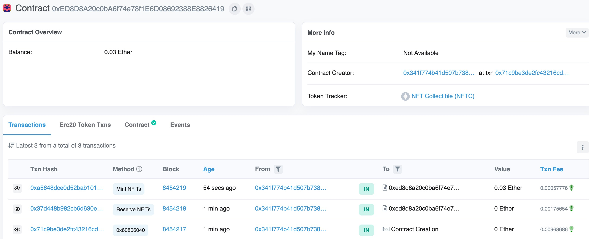
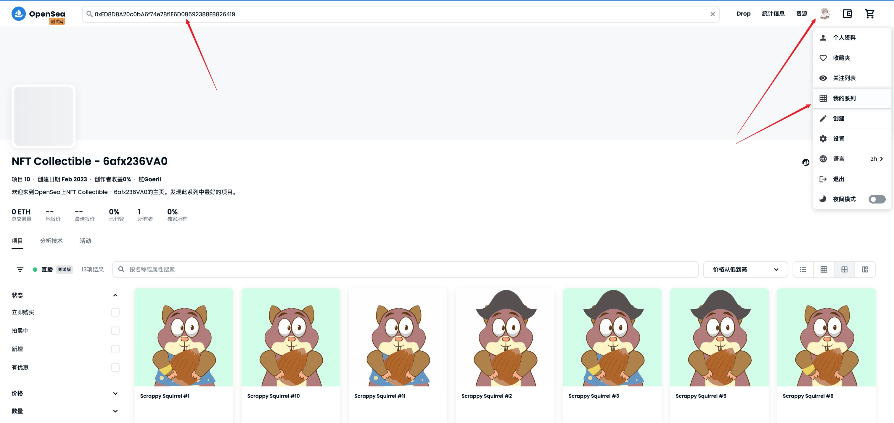
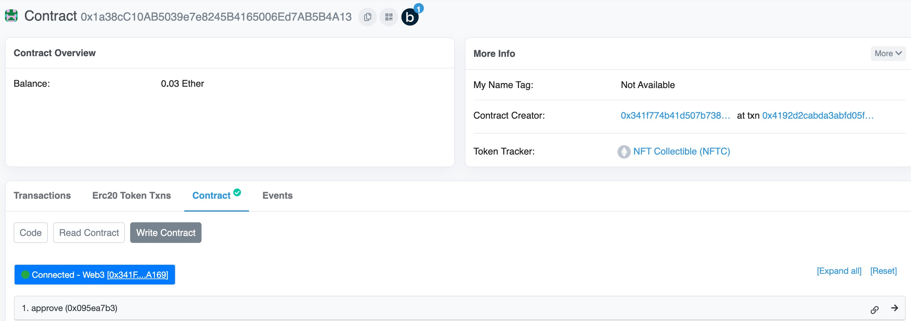
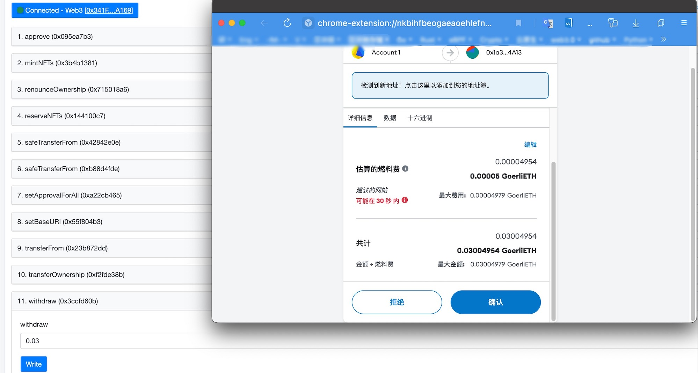

## 实现一个NFT项目

这是一个参考文章 [Writing an NFT Collectible Smart Contract](https://dev.to/rounakbanik/writing-an-nft-collectible-smart-contract-2nh8)
实现一个简单的NFT合约项目。（其中包含笔者的一些特别备注，希望对你有帮助）

> 参考文章的[中文翻译版](https://news.marsbit.co/20220814143202233278.html)

### 1. 安装环境

```shell
mkdir 2.write_an_nft_contract && cd 2.write_an_nft_contract && npm init -y
npm install --save-dev hardhat  # 安装hardhat，笔者安装的Hardhat version 2.12.6

npx hardhat  # 选择 【Create a JavaScript project】其余回车默认接口
```

上述命令初始化一个基础的hardhat项目结构，并安装依赖`@nomicfoundation/hardhat-toolbox`，这个依赖项中包括了hardhat丰富的插件功能，包括
`ethers.js/mocha/chai/network helpers/etherscan/gas-reporter/solidity-coverage`。

初始化的目录结构说明如下：

```shell
lei@WilldeMacBook-Pro 2.write_an_nft_contract % tree -I 'node_modules' -L 3  # 打印项目的层级结构，忽略node_modules/
.
├── README.md
├── contracts   # 合约代码目录
│   └── Lock.sol  # 一个简单的锁定合约实例
├── hardhat.config.js   # hardhat使用的配置
├── package-lock.json
├── package.json
├── scripts  # 项目使用的脚本
│   └── deploy.js  # 部署脚本
└── test     # 测试代码存放的目录
    └── Lock.js  # 锁定合约的测试代码
```

可以尝试运行以下hardhat任务：

```shell
npx hardhat help
npx hardhat test
REPORT_GAS=true npx hardhat test
npx hardhat node
npx hardhat run scripts/deploy.js
```

然后安装第三方库openzeppelin: `npm install @openzeppelin/contracts`，以便直接访问 ERC721 合约的模板代码和其他工具库。

### 2. 编写NFT合约

这一节使用Solidity编写一个智能合约，允许任何人通过支付所需数量的以太币+Gas 来铸造一定数量的 NFT。

创建合约文件：`touch contracts/NFTCollectible.sol`

原文使用 Solidity v0.8.0，但笔者建议使用`./hardhat.config.js`中定义的版本，否则后面编译时可能会遇到合约代码与引用库的语言版本不兼容的问题，合约将继承 OpenZeppelin 的ERC721Enumerable和Ownable合约。前者有一个
ERC721（NFT）标准的默认实现，此外还有一些在处理 NFT 时有用的辅助函数。后者允许我们在合约的增加管理权限。

#### 2.1 基本骨架

```solidity
//SPDX-License-Identifier: MIT
pragma solidity ^0.8.17;

import "@openzeppelin/contracts/utils/Counters.sol";
import "@openzeppelin/contracts/access/Ownable.sol";
import "@openzeppelin/contracts/utils/math/SafeMath.sol";
import "@openzeppelin/contracts/token/ERC721/extensions/ERC721Enumerable.sol";

contract NFTCollectible is ERC721Enumerable, Ownable {
    using SafeMath for uint256;
    using Counters for Counters.Counter;
    Counters.Counter private _tokenIds;
}
```

创建一些状态变量和常量，用以在区块链上持久性地存储一些信息，如下：

```solidity
contract NFTCollectible is ERC721Enumerable, Ownable {
    using SafeMath for uint256;
    using Counters for Counters.Counter;
    Counters.Counter private _tokenIds;

    // 新增部分，前三个为常量，部署后不可修改，baseTokenURI为变量，部署后可修改
    uint public constant MAX_SUPPLY = 100;  // 供应量：可以铸造的 NFT 的最大数量
    uint public constant PRICE = 0.01 ether; // 价格：购买 1 个 NFT 所需的以太币数量
    uint public constant MAX_PER_MINT = 5; // 每次交易的最大铸币数量：你一次可以铸造的 NFT 的上限
    string public baseTokenURI; // 代币 URI 前缀（baseTokenURI）：包含 JSON 元数据的文件夹的 IPFS URL
}
```

#### 2.2 构造函数

```solidity
contract NFTCollectible is ERC721Enumerable, Ownable {
    // 构造函数的作用是在部署合约时设置变量 baseTokenURI，以便铸币时使用
    constructor(string memory baseURI) ERC721("NFT Collectible", "NFTC") {
        setBaseURI(baseURI);
        // 这个函数在下面会介绍
    }
}
```

#### 2.3 定义免费铸币函数

作为项目的创建者，你可能想为你自己、团队以及像赠品这样的活动保留一些 NFT 的集合。那么可以写一个函数，允许我们免费铸造一定数量的 NFT（在这里为 10 个）。由于调用这个函数的人只需要支付 Gas
费，显然需要把它标记为onlyOwner，这样只有合约的所有者才能调用它：

```solidity
contract NFTCollectible is ERC721Enumerable, Ownable {
    function reserveNFTs() public onlyOwner {
        uint totalMinted = _tokenIds.current();
        // 获取到目前为止本项目铸造的 NFT 的总数

        // 检查是否有足够的 NFT 供我们保留
        require(
            totalMinted.add(10) < MAX_SUPPLY, "Not enough NFTs"
        );
        for (uint i = 0; i < 10; i++) {
            _mintSingleNFT();
            // 铸币函数，后面介绍
        }
    }
}
```

#### 2.4 设置 baseTokenURI

```solidity
contract NFTCollectible is ERC721Enumerable, Ownable {
    // 这个函数供内部铸币时调用，获取 baseTokenURI
    function _baseURI() internal view virtual override returns (string memory) {
        return baseTokenURI;
    }
    // 这个函数设置 baseTokenURI，内外皆可调用，仅限合约owner
    function setBaseURI(string memory _baseTokenURI) public onlyOwner {
        baseTokenURI = _baseTokenURI;
    }
}
```

#### 2.5 铸币函数

现在把注意力转向主要的 Mint NFT 函数。当用户和客户想从我们的收藏中购买和铸造 NFT 时，他们会调用这个函数。由于他们要向这个函数发送以太币，我们必须将其标记为`payable`.

在真实铸币发生之前，我们需要做三个检查：

- 有足够的 NFT 数量供调用者铸造；
- 请求的铸币数量超过 0，但少于每笔交易允许的最大 NFT 数量；
- 调用者已经发送了足够的以太币来铸造所要求的 NFT 数量；

```solidity
contract NFTCollectible is ERC721Enumerable, Ownable {
    function mintNFTs(uint _count) public payable {
        uint totalMinted = _tokenIds.current();
        require(
            totalMinted.add(_count) <= MAX_SUPPLY, "Not enough NFTs!"
        );
        require(
            _count > 0 && _count <= MAX_PER_MINT,
            "Cannot mint specified number of NFTs."
        );
        require(
            msg.value >= PRICE.mul(_count),
            "Not enough ether to purchase NFTs."
        );
        for (uint i = 0; i < _count; i++) {
            _mintSingleNFT();
        }
    }
}
```

#### 2.6 _mintSingleNFT函数

最后让我们看看私有的_mintSingleNFT()函数，每当我们（或第三方）想铸造一个 NFT 时，都会调用这个函数:

```solidity
contract NFTCollectible is ERC721Enumerable, Ownable {
    function _mintSingleNFT() private {
        // current()获得已经铸造的代币数量N，同时N这个数字也是未使用的TokenID
        // 也就是说，在发生任何铸币行为之前，代币 ID 为 0
        uint newTokenID = _tokenIds.current();

        // 使用 OpenZeppelin库中的ERC721模板提供的_safeMint()函数，将 NFT ID 分配给调用该函数的账户
        _safeMint(msg.sender, newTokenID);

        // 将 tokenID 的计数器递增 1
        _tokenIds.increment();
    }
}
```

#### 2.7 获取一个特定账户所拥有的所有代币

如果你打算给你的 NFT 持有人提供类似列表类的功能，你会想每个用户持有哪些 NFT。ERC721Enumerable 的 "balanceOf "和 "tokenOfOwnerByIndex"
函数使之变得超级简单。前者告诉我们一个特定的所有者持有多少代币，后者可以用来获得一个所有者拥有的所有Token ID，不过也带来了相应的 gas 成本。

```solidity
contract NFTCollectible is ERC721Enumerable, Ownable {
    function tokensOfOwner(address _owner) external view returns (uint[] memory) {
        uint tokenCount = balanceOf(_owner);
        uint[] memory tokensId = new uint256[](tokenCount);
        for (uint i = 0; i < tokenCount; i++) {
            tokensId[i] = tokenOfOwnerByIndex(_owner, i);
        }

        return tokensId;
    }
}
```
>阅读文章 [调整NFT智能合约，减少70%的铸币Gas成本](https://learnblockchain.cn/article/4388) 以了解更多。


#### 2.8 提取合约余额功能

如果我们不能提取发送到合约中的以太币，那么我们所做的所有努力都将付诸东流。让我们写一个函数，允许我们提取合约的全部余额。这显然需要被标记为onlyOwner。

```solidity
function withdraw() public payable onlyOwner {
    uint balance = address(this).balance;
    require(balance > 0, "No ether left to withdraw");
    (bool success,) = (msg.sender).call{value : balance}("");
    require(success, "Transfer failed.");
}
```

到此，全部合约代码介绍结束，参考 [NFTCollectible.sol](./contracts/NFTCollectible.sol) 。

### 3. 本地测试

现在让我们做准备在本地环境中模拟，以便之后将我们的合约部署到其他测试网（或主网）。创建部署文件：`./scripts/run.js` ，添加以下代码：

```javascript
const {utils} = require("ethers"); // 引入web3交互库ethers.js以便部署 

async function main() {
    // 使用上个教程中获得的元数据的IPFS CID（而不是图片的CID）
    const baseTokenURI = "ipfs://QmacBqarE9dJTqjmVsDbnLbf7NRZaAegtGDd9ZoF6bhBmX/";

    // Get owner/deployer's wallet address
    const [owner] = await hre.ethers.getSigners();

    // Get contract that we want to deploy
    const contractFactory = await hre.ethers.getContractFactory("NFTCollectible");

    // Deploy contract with the correct constructor arguments
    const contract = await contractFactory.deploy(baseTokenURI);

    // Wait for this transaction to be mined
    await contract.deployed();

    // Get contract address
    console.log("Contract deployed to:", contract.address);

    // Reserve NFTs
    let txn = await contract.reserveNFTs();
    await txn.wait();
    console.log("10 NFTs have been reserved");

    // Mint 3 NFTs by sending 0.03 ether
    txn = await contract.mintNFTs(3, {value: utils.parseEther('0.03')});
    await txn.wait()

    // Get all token IDs of the owner
    let tokens = await contract.tokensOfOwner(owner.address)
    console.log("Owner has tokens: ", tokens);

}

main()
    .then(() => process.exit(0))
    .catch((error) => {
        console.error(error);
        process.exit(1);
    });
```

这是一些 Javascript 代码，利用ethers.js库来部署合约，然后在合约被部署后调用合约的功能。

现在运行这个代码文件：`npx hardhat run scripts/run.js`，如果顺利，你会看到以下输出：
```shell
lei@WilldeMacBook-Pro 2.write_an_nft_contract % npx hardhat run scripts/run.js
Downloading compiler 0.8.17
Compiled 17 Solidity files successfully
Contract deployed to: 0x5FbDB2315678afecb367f032d93F642f64180aa3
10 NFTs have been reserved
Owner has tokens:  [
  BigNumber { value: "0" },
  BigNumber { value: "1" },
  BigNumber { value: "2" },
  BigNumber { value: "3" },
  BigNumber { value: "4" },
  BigNumber { value: "5" },
  BigNumber { value: "6" },
  BigNumber { value: "7" },
  BigNumber { value: "8" },
  BigNumber { value: "9" },
  BigNumber { value: "10" },
  BigNumber { value: "11" },
  BigNumber { value: "12" }
]
```
这些输出表示我们的部署代码`run.js`运行成功，也意味着其中的逻辑是正确运行的。

### 4. 部署到测试网

上一节的部署是在本地的Hardhat network进行的，所以不需要我们提供账户和以太币余额（Hardhat帮我们隐藏了这些步骤）。但为了模拟主网的部署步骤，本节将介绍如何将合约部署至以太坊网络的流行的测试网Goerli。
>类似的，在你掌握这个操作后，也可以部署至Rinkeby以及其他测试网。

首先，需要一个测试网的RPC URL，使我们能够广播合约创建交易。我们将使用 Alchemy 来做这件事。在这里创建一个 [Alchemy][0] 账户，然后继续创建一个免费的app,
注意确保app的测试网设置为Goerli。

然后在仪表盘页面的`Demo App` 右侧点击`View Key`就可以看到连接测试网的HTTPS或WEBSOCKETS地址以及私钥信息，ALCHEMY这个私钥暂时用不着。
下一步，将连接测试网的HTTPS地址和你的Goerli账户地址填入到`hardhat.config.js`，如下：
```javascript
// 这是笔者编写此练习时临时使用的配置，可能已经失效，建议自行去alchemy申请账户创建app获得它们
const ALCHEMY_GOERLI_API = 'https://eth-goerli.g.alchemy.com/v2/0l_WW7kaE9pLJIySxGuojjc8JEOke9Ky'
// goerli网络的账户私钥，不要透露给任何人，笔者上传的是随意填写的，但格式、长度是正确的
const ETH_ACCOUNT_PRI_KEY = '2ecf1f16b9dd012c2f737d0307aac4b17fed602a3a1dfdfebb04f0a7ca89ede1'

/** @type import('hardhat/config').HardhatUserConfig */
module.exports = {
    solidity: "0.8.17",
    defaultNetwork: "localhost",
    networks: {
        goerli: {
            url: ALCHEMY_GOERLI_API,
            accounts: [ETH_ACCOUNT_PRI_KEY]
        }
    },
};
```
>注意：原教程使用dotenv库来单独使用环境变量，但这里为了简单起见，笔者以明文方式写在`hardhat.config.js`中。

下一步，我们需要去goerli的水龙头网站获取一点ETH以抵扣合约部署费用，这里推荐两个goerli的水龙头网站（获取需要一定时间）：[网站1][1]  [网站2][2] 。

获取到一定的测试ETH后（在小狐狸metamask钱包中确认ETH余额），下面执行部署命令：
```shell
npx hardhat run scripts/run.js --network goerli
```
如果打印出与上面本地测试相同的输出，说明部署成功，现在去到 [etherscan的goerli网络上](https://goerli.etherscan.io/) 查询部署后的合约地址：`0xED8D8A20c0bA6f74e78f1E6D08692388E8826419`，
可得到如下结果：



### 5. 在OpenSea上查看我们的NFT
当我们成功部署项目到测试网（不管是Rinkeby还是Goerli）后，我们就可以在[OpenSea测试网][6]通过搜索合约地址 或 直接登录账户（连接小狐狸钱包）查看我们的NFT项目，
如下图：



>需要说明的是，原教程编写时OpenSea测试网还未接入Goerli网络，在2022年9月才宣布正式接入。在此之前使用的是Rinkeby测试网。

### 6. 在Etherscan上验证合约代码
Etherscan是一个区块链浏览器，如果我们真正成功部署合约项目，那我们一定能在该网站上查询到与本地完全一致的合约源码，当然手动验证这一步最稳妥。好在Hardhat提供了插件帮我们实现这个操作，
请参考下面的步骤。

首先，在Etherscan上注册一个免费账户，并获取账户的API秘钥(注册后，在账户中心的`OTHERS--API KEYS`部分创建一个API秘钥)，填入到`hardhat.config.js`中，
并做一定修改，完整如下：

<details>
<summary>展开查看代码</summary>
<pre>

```javascript
require("@nomicfoundation/hardhat-toolbox");

// 这是笔者编写此练习时临时使用的配置，可能已经失效，建议自行去alchemy申请账户创建app获得它们
const ALCHEMY_GOERLI_API = 'https://eth-goerli.g.alchemy.com/v2/0l_WW7kaE9pLJIySxGuojjc8JEOke9Ky'
// 以太坊网络账户的私钥，不要透露给任何人，笔者上传的是随意填写的，但格式、长度是正确的
const ETH_ACCOUNT_PRI_KEY = '2ecf1f16b9dd012c2f737d0307aac4b17fed602a3a1dfdfebb04f0a7ca89ede5'
// etherscan api private key
const ETHERSCAN_API_KEY = 'VGDVCY4EB8UAG4W9R9JYKV4PJCZA7MFCQP'

// This is a sample Hardhat task. To learn how to create your own go to
// https://hardhat.org/guides/create-task.html
task("accounts", "Prints the list of accounts", async (taskArgs, hre) => {
    const accounts = await hre.ethers.getSigners();

    for (const account of accounts) {
        console.log(account.address);
    }
});

// You need to export an object to set up your config
// Go to https://hardhat.org/config/ to learn more

/** @type import('hardhat/config').HardhatUserConfig */
module.exports = {
    solidity: "0.8.17",
    defaultNetwork: "goerli",
    networks: {
        goerli: {
            url: ALCHEMY_GOERLI_API,
            accounts: [ETH_ACCOUNT_PRI_KEY]
        },
        etherscan: {
            apiKey: ETHERSCAN_API_KEY
        }
    },
};
```
</pre>
</details>

现在，按顺序运行以下两个命令：
```shell
npx hardhat clean
npx hardhat verify --network goerli DEPLOYED_CONTRACT_ADDRESS "BASE_TOKEN_URI"  # 注意替换变量，第二个需要双引号

# 在笔者的实例中，第二条命令实际如下：npx hardhat verify --network goerli 0xED8D8A20c0bA6f74e78f1E6D08692388E8826419 "ipfs://QmacBqarE9dJTqjmVsDbnLbf7NRZaAegtGDd9ZoF6bhBmX/"
```
到这一步，笔者遇到了本教程的第一个需要Google查询的错误，即上述第二条命令执行报错：
```shell
lei@WilldeMacBook-Pro 2.write_an_nft_contract % npx hardhat verify --network goerli 0x1a38cC10AB5039e7e8245B4165006Ed7AB5B4A13 "ipfs://QmWP92EpH1evo4TGoE32F2bDudfCHEJUJ8VE7TAm145r7A/"

Compiled 17 Solidity files successfully
Error in plugin @nomiclabs/hardhat-etherscan: Failed to send contract verification request.
Endpoint URL: https://api-goerli.etherscan.io/api
Reason: Connect Timeout Error
```
经过认真读完 [这个仓库的discussion中几位同胞们的讨论][3] 后，笔者得知此错误主要是因为`https://api-goerli.etherscan.io/api` 在国内存在DNS污染问题，有两个解决方案：
1. 修改hosts文件（实测不行，因为查询到URL的IP也是需要翻墙的）
2. 开启VPN软件clash的增强模式
3. 在`hardhat.config.js`自定义api url（请参考上述链接）
4. 在`hardhat.config.js`中添加http代理（前提是你的环境中有可访问外网的代理服务）

经过实测，笔者通过方案4解决了问题。添加http代理的代码如下：
```javascript
require("@nomicfoundation/hardhat-toolbox");

// @nomiclabs/hardhat-etherscan 这个库使用undici作为http客户端，所以修改它的代理设置（它并不访问环境变量中的代理配置，所以只能在代码中设置）
const {ProxyAgent, setGlobalDispatcher} = require("undici")
const proxyAgent = new ProxyAgent("http://127.0.0.1:7890") // change to yours
setGlobalDispatcher(proxyAgent)

// 省略其他已有代码
```
最后，执行成功的输出如下：
```shell
lei@WilldeMacBook-Pro 2.write_an_nft_contract % npx hardhat verify --network goerli 0xED8D8A20c0bA6f74e78f1E6D08692388E8826419 "ipfs://QmacBqarE9dJTqjmVsDbnLbf7NRZaAegtGDd9ZoF6bhBmX/"

Nothing to compile
Successfully submitted source code for contract
contracts/NFTCollectible.sol:NFTCollectible at 0xED8D8A20c0bA6f74e78f1E6D08692388E8826419
for verification on the block explorer. Waiting for verification result...

Successfully verified contract NFTCollectible on Etherscan.
https://goerli.etherscan.io/address/0xED8D8A20c0bA6f74e78f1E6D08692388E8826419#code
```
验证合约代码后，访问输出中的URL可以看到我们的NFT合约部署到 Goerli 网络上的全部Solidity代码。需要注意的是，这个验证操作只能进行一次。

### 7. 在Etherscan上连接钱包与合约交互
在刚刚的etherscan验证合约的页面，点击打绿色勾的**Contract**，可以看见 Code、ReadContract、WriteContract 三个按钮，Code刚才已经看过了，
后两个按钮其实就是用来与合约交互的，一个读取合约变量，另一个是具有写性质的函数调用。不论是读还是写，都需要点击三个按钮下的**Connect to Web3**按钮来连接你的浏览器插件钱包，
笔者使用的是小狐狸（metamask）钱包，这里就不解释连接过程了，比较简单。

首先是读操作，很简单，点击ReadContract下面提供的众多合约状态变量按钮就可以看到对应的值，像`blanceOf`函数也是读操作，它读取输入账户的NFT代币余额，
输入你部署合约的Goerli账户地址，可以查询到 13 这个结果（因为我们在部署脚本`run.js`中执行了`reserveNFTs`和`mintNFTs`操作，一共给owner地址铸币13个）。

然后是写操作，如下图:



这里我们可以调用`withdraw`函数将之前部署时执行的`mintNFTs`操作向合约账户转入的0.03ETH提取到我们的账户中（合约账户的余额在页面的左上方可见），
操作也很简单，如下图:



输入提取ETH数量后，浏览器弹出确认窗口（显示该次提现的gas费用），点击确认，由于是测试网，所以在几十秒内会完成一次提现。

### 8. 资源推荐

#### 通过网站直接生成NFT图片
- https://www.mintables.club/projects 免费、用户体验较好、性能好
- https://nft-generator.art/ 专业、用户体验好、100张内免费但有水印

#### 上传资源到IPFS网络的其他方式

- 使用ipfs官方提供的上传工具 [ipfs-desktop][5]，此工具是一个完整的IPFS节点，所以它会自动同步其他节点的文件
- 使用其他Web3服务商（如infura、moralis）

[0]: https://dashboard.alchemy.com/
[1]: https://goerlifaucet.com/
[2]: https://goerli-faucet.pk910.de/
[3]: https://github.com/smartcontractkit/full-blockchain-solidity-course-js/discussions/2247
[4]: https://ip.tool.chinaz.com/api-goerli.etherscan.io/api
[5]: https://github.com/ipfs/ipfs-desktop/releases
[6]: https://testnets.opensea.io