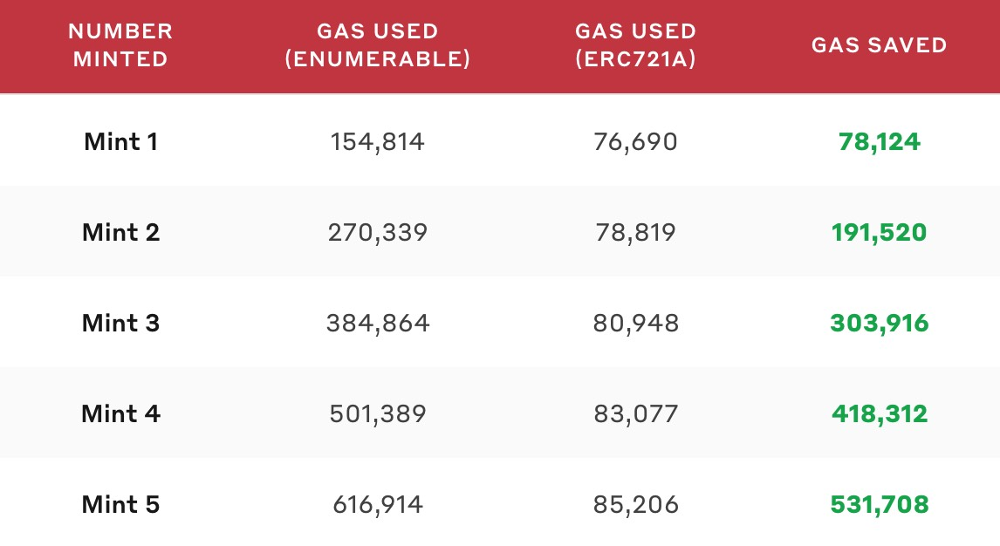

# 如何节省Gas费用

## 基本介绍

以太坊的Gas费用随着ETH的价格上涨而增加，节省Gas费用就是为你的合约项目的功能降低使用成本，从而为项目使用者（消费者）省下真金白银。本文致力于汇总能够节省Gas费用的各种方案措施，持续更新。

## 1. 用Counters取代ERC721Enumerable中的TotalSupply

如果你避免使用OpenZeppelin库中的ERC721Enumerable，并且用`Counter`替换`totalSupply()`来跟踪 TokenID，将为你的卖家节省大量的铸币成本和交易费。

是的，OpenZeppelin库中的模板代码并不总是最优的实现，但许多开发者习惯不加思考的直接引用该库中的代码模板，长期来看，这对开发者和项目用户来说是没有任何好处的。

ERC721Enumerable是ERC721的多个扩展之一，主要用途是Token计数以及快速定位用户的NFT。接口如下：

```solidity
/// @title ERC-721 Non-Fungible Token Standard, optional enumeration extension
/// @dev See https://eips.ethereum.org/EIPS/eip-721
///  Note: the ERC-165 identifier for this interface is 0x780e9d63.
interface ERC721Enumerable /* is ERC721 */ {
    function totalSupply() external view returns (uint256);

    function tokenByIndex(uint256 _index) external view returns (uint256);

    function tokenOfOwnerByIndex(address _owner, uint256 _index) external view returns (uint256);
}
```

它在OpenZeppelin的模板实现在[这里][0]，其中用3个map和1个数组来实现功能，这样的实现会消耗大量的存储空间从而消耗更多Gas。 很多时候我们只需要这个扩展中的一个接口`totalSupply()`
，其他两个接口并不常用，当然重点是扩展实现内的`_beforeTokenTransfer()`接口， 这个接口在每次代币转账前执行以更新内部的map和数组，这些数据结构的空间占用以及更新是消耗大量gas的根本原因。

所以只要开发者使用了这个扩展，高昂的铸币gas成本（包括铸币成本和转账成本）就无法避免。既然我们更常用`totalSupply()`接口，就可以寻找更好的这个接口的替代，以避免无谓的gas开销。

而针对`totalSupply()`，我们可以使用一个计数器来实现，计数器只需要实现加一、减一和重置的简单逻辑即可。好在OpenZeppelin也提供了这个 [Counters][1]
的实现，具体使用可参考本仓库下的NFT新手教程中的一个[NFT项目代码](../nft_beginner_series/2.write_an_nft_contract/contracts/NFTCollectible2.sol) 。

> 需要注意的是，若不引入ERC721Enumerable模板，我们的项目也就不能跟踪从tokenID到owner的映射（反之亦然），但可以使用以太坊事件在链外跟踪这些信息。NFT流行交易市场OpenSea API已经提供了这一点。

### 1.1 Counters的进一步优化利用

在上面提供的NFT项目代码中，Counters的使用方式如下：

```solidity
contract NFTCollectible is ERC721, Ownable {
    using SafeMath for uint256;
    using Counters for Counters.Counter;

    Counters.Counter private _tokenIds;
    // ...
    constructor(string memory baseURI) ERC721("NFT Collectible", "NFTC") {
        setBaseURI(baseURI);
    }
    // ...
}
```

而`Counters.Counter`的结构如下：

```solidity
library Counters {
    struct Counter {
        // This variable should never be directly accessed by users of the library: interactions must be restricted to
        // the library's function. As of Solidity v0.5.2, this cannot be enforced, though there is a proposal to add
        // this feature: see https://github.com/ethereum/solidity/issues/4637
        uint256 _value; // default: 0
    }
    // ...
}
```

也就是说，在合约`NFTCollectible`中，`_tokenIds`在部署时并没有初始化，仅仅是声明，所以直到第一次`_tokenIds.increment()`调用前，`_tokenIds`内部的value都是未初始化的。
而初始化时，会执行对应的`sstore`指令，该指令执行一次固定消耗20000gas（针对256位类型），后续的每次修改消耗5000gas（针对256位类型）。

上述问题会造成首次铸币的交易费高于后续每次铸币，这对首次铸币的用户会造成糟糕的体验。所以我们需要优化一下，方法很简单，在构造函数中初始化`tokenIds`变量即可，如下：

<details>
<summary>展开查看代码</summary>
<pre>

```solidity
contract NFTCollectible is ERC721, Ownable {
    using SafeMath for uint256;
    using Counters for Counters.Counter;

    Counters.Counter private _tokenIds;
    // ...
    constructor(string memory baseURI) ERC721("NFT Collectible", "NFTC") {
        setBaseURI(baseURI);
        _tokenIds.increment(); // <--- 部署后，_tokenIds.value=1
    }
    // ...

    // 新的批量铸币函数
    function mintNFTs(uint _count) public payable {
        uint totalMinted = _tokenIds.current() - 1;

        require(totalMinted.add(_count) <= MAX_SUPPLY, "Not enough NFTs left!");
        require(_count > 0 && _count <= MAX_PER_MINT, "Cannot mint specified number of NFTs.");
        require(msg.value >= PRICE.mul(_count), "Not enough ether to purchase NFTs.");

        for (uint i = 0; i < _count; i++) {
            _mintSingleNFT();
        }
    }
    // 新的铸币函数
    function _mintSingleNFT() private {
        _safeMint(msg.sender, _tokenIds.current());
        // 直接使用当前数值作为新ID
        _tokenIds.increment();
    }
}
```
</pre>
</details>

这样一来，就优化了这个问题，但笔者经过实测，发现虽然相对于修改前的首次铸币确实减少了一定的gas费用，但修改后的首次铸币手续费依旧高于后续铸币，暂未找到原因。
另外，这种优化方式并没有将该变量初始化的gas消耗给避免掉，而是将成本挪到了合约部署者这边。

优化的完整代码查看 [NFTCollectible3.sol](../nft_beginner_series/2.write_an_nft_contract/contracts/NFTCollectible3.sol) 。

### 1.2 检查你的合约是否间接导入ERC721Enumerable
即使你的合约代码中没有导入该模板库，但可能你导入的某些模板内部导入了它，这就导致你仍然要为此买单，所以记得仔细检查你导入的每一个合约库。

同样的思路，很多时候你只是用到了某个库的极小部分功能，但却要为此买个大单（该库中的某些函数被作为钩子被自动调用，不易察觉）。当你发现到了这类问题，
就应该尝试自己实现这个小功能，从而进一步优化你的合约，减小后续的交互手续费，为用户提供良好的使用体验。

## 2. 使用ERC721A进行高效的批量铸币
许多合约都是直接引入OpenZeppelin的实现，但后者并没有对批量铸币进行优化，而批量铸币与单次铸币相比，可以节省一大笔gas费用。
比如批量铸币中，你只需要触发一次转移事件，并且只更新一次所有者余额。

为此，Azuki团队推出了ERC721（以及其扩展）的优化版本 [ERC721A][2]，该团队给出了与ERC721Enumerable铸币费用的对比，如下图：



下面是对ERC721A的简介：
- 完全实现了IERC721、IERC165、IERC721Metadata
- 对于ERC721Enumerable提供的TokenID与Owner地址的映射查询功能，ERC721A推出了另一种优化版的实现IERC721AQueryable
- 重点对批量铸币的gas消耗进行了优化，批量铸币的费用几乎和铸一个币的gas消耗差不多
- 团队与外部安全顾问合作，确保合约合规
- 团队鼓励更广泛的社区采用这一实施方案，以节省用户的gas成本

读者可以直接查看ERC721A的[源码][3]，一探究竟。

## 3. 使用mint而不是safeMint
safeMint与mint的区别是，前者会检查当接收者是一个合约地址时，该合约是否实现了`IERC721Receiver.onERC721Received()`接口，如果没实现，就revert。
检查这个的目的是确保目标合约地址知道接收NFT后如何处理。
```solidity
function _safeMint(
    address to,
    uint256 tokenId,
    bytes memory data
) internal virtual {
    _mint(to, tokenId);
    require(
        _checkOnERC721Received(address(0), to, tokenId, data),
        "ERC721: transfer to non ERC721Receiver implementer"
    );
}
```
但如果你的接收方只是一个普通的账户，而不是一个合约，你就不需要使用safeMint。如果你100%确定接收方的合约可以处理NFT，你也不需要使用safeMint。

通过使用mint而不是safeMint，你可以节省一些Gas。使用transfer而不是safeTransfer也是如此。

## 4. 使用Merkle树实现白名单机制
在许多NFT项目中，常常会添加白名单机制，以允许部分账户在正式发售前就可以铸币。更多关于白名单的信息，你可以在 [这里][4] 查看。

普通的白名单机制的实现很简单，就是在合约中创建一个map变量，由合约部署者添加白名单地址到map中，然后白名单地址账户就可以调用特定的铸币函数进行铸币。
使用map结构虽然查询方便，但比较占用链上存储空间，也就更加耗费gas。而Merkle树就是一种优化方案，它利用Merkle树的哈希证明原理，省去了在合约中预先存储全部白名单地址的步骤，
只需要在合约中存储MerkleRoot（一个哈希值），然后验证时向验证函数传入使用白名单地址生成的MerkleProof和MerkleRoot即可进行验证。具体实现过程参考 [这篇文章][5] 。

大致代码如下：

<details>
<summary>展开查看代码</summary>
<pre>

```solidity
//SPDX-License-Identifier: MIT
pragma solidity ^0.8.0;

import "@openzeppelin/contracts/access/Ownable.sol";
import "@openzeppelin/contracts/utils/cryptography/MerkleProof.sol";

contract Merkle is Ownable {
    bytes32 public saleMerkleRoot;
    mapping(address => bool) public claimed;

    function setSaleMerkleRoot(bytes32 merkleRoot) external onlyOwner {
        saleMerkleRoot = merkleRoot;
    }

    modifier isValidMerkleProof(bytes32[] calldata merkleProof, bytes32 root) {
        require(
            MerkleProof.verify(
                merkleProof,
                root,
                keccak256(abi.encodePacked(msg.sender))
            ),
            "Address does not exist in list"
        );
        _;
    }

    function mint(bytes32[] calldata merkleProof)
        external
        isValidMerkleProof(merkleProof, saleMerkleRoot)
    {
        require(!claimed[msg.sender], "Address already claimed");
        claimed[msg.sender] = true;
    }
}
```
</pre>
</details>


[0]: https://github.com/OpenZeppelin/openzeppelin-contracts/blob/master/contracts/token/ERC721/extensions/ERC721Enumerable.sol
[1]: https://github.com/OpenZeppelin/openzeppelin-contracts/blob/master/contracts/utils/Counters.sol
[2]: https://github.com/chiru-labs/ERC721A
[3]: https://github.com/chiru-labs/ERC721A/blob/main/contracts/ERC721A.sol
[4]: https://www.leixue.com/ask/what-is-the-nft-whitelist
[5]: https://mirror.xyz/qiwihui.eth/HRifb9gziR1UvVmRcMjDfDvQ9mq7o7FA6BNuCJMFT00
### 参考

- [Cut Minting Gas Costs By Up To 70% With One Smart Contract Tweak](https://shiny.mirror.xyz/OUampBbIz9ebEicfGnQf5At_ReMHlZy0tB4glb9xQ0E)
- [Common patterns in good NFT contracts](https://www.solidnoob.com/blog/good-nft-contract-patterns)