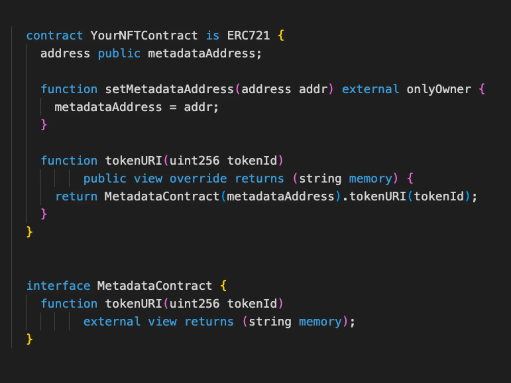

# 合约的技巧性编程

## 1. 可升级/可替换的元数据合约

如果你以后想升级你的NFT的展示，或者在链上和链下的渲染之间切换，你应该让元数据合约可被替换。像这样：



## 2. 使合约可提取ERC-721和ERC-20

大多数合约只是实现了ETH的提取功能，而忘记了ERC-20的问题。但有时人们会错误地将代币发送到合约中。添加一个提取功能，这样它们就不会被卡在你的合约中。

实现也很简单，下面是 [Crypto Coven][5] 的合约中提取ERC-20代币的代码：
```solidity
import "@openzeppelin/contracts/interfaces/IERC20.sol";
contract CryptoCoven is ERC721, IERC2981, Ownable, ReentrancyGuard {
    // ...
    function withdrawTokens(IERC20 token) public onlyOwner {
        uint256 balance = token.balanceOf(address(this));
        token.transfer(msg.sender, balance);
    }
}
```

## 3. 使你的NFT数据不可改变
这里说的是你发布到链上的NFT元数据关联的事实数据（多媒体内容）。想象一下，如果你的NFT合约是允许随时更改事实数据的，那人们就会理所应当地怀疑你合约的安全性，
没有人愿意花钱承担这种风险。

所以针对NFT的事实数据不可变的逻辑，我们有两种方式来实现：
1. 发布前将所有资源上传至去中心化存储，如IPFS或Arweave，然后将上传所得的链接前缀硬编码到合约中；
2. 提前将所有资源按一定顺序排列后，然后计算出每个资源的哈希值，再全部按序拼接为一个大字符串，再计算出这个大字符串的哈希值。然后将这个哈希值硬编码到合约中。后续合约发布后人们可以通过同样方式计算资源的哈希值来匹配合约中的哈希值以确保资源未经更改。
   1. 这种方式也叫做**证明哈希**，英文名词**Provenance**。著名的BAYC项目就是使用的这种方式，这个 [页面][6] 是该项目对使用证明哈希的说明。（注意该合约允许修改证明哈希应该是一个bug）

然而对于第1种方式却有个弊端，那就是合约发布后，聪明的买家能够通过将资源链接和数字拼接后的URL立即看到所有NFT的元数据和资源内容，从而轻松得到稀有NFT的TokenID，
就可以在适当时候去铸造这些稀有NFT（这种攻击方式有个名词叫NFT狙击），这就破坏了项目的公平性，因为稀有NFT的获得应该是随机的。

而使用证明哈希的方式，不光解决了NFT狙击手问题，也确保了所有NFT的元数据和资源的顺序是预先确定的，没有事后操纵。


[5]: https://etherscan.io/address/0x5180db8F5c931aaE63c74266b211F580155ecac8#code
[6]: https://boredapeyachtclub.com/#/provenance

### 参考

- [Common patterns in good NFT contracts](https://www.solidnoob.com/blog/good-nft-contract-patterns)