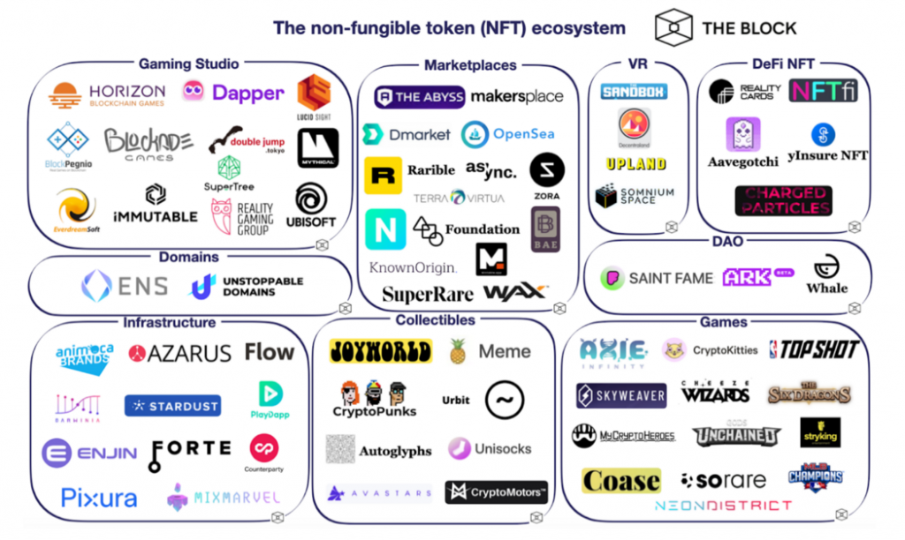

# NFT全了解


### 目录

- [1. 什么是NFT](#1-什么是NFT)
- [2. NFT如何关联虚拟物品](#2-NFT如何关联虚拟物品)
- [3. NFT元数据](#3-NFT元数据)
  - [3.1 基本概念](#31-基本概念)
  - [3.2 技术细节](#32-技术细节)
    - [ERC-721](#321-ERC-721)
    - [ERC-1155](#322-ERC-1155)
    - [ERC-998](#323-ERC-998)
  - [3.3 元数据和NFT事实数据存储](#33-元数据和NFT事实数据存储)
    - [IPFS协议](#331-IPFS协议)
    - [Arweave协议](#332-Arweave协议)
  - [3.4 Filecoin与Arweave对比](#34-Filecoin与Arweave对比)
    - [相同点](#341-相同点)
    - [不同点](#342-不同点)
    - [如何选择](#343-如何选择)
  - [3.5 关于NFTScan](#35-关于NFTScan)
    - [NFTScan介绍](#351-NFTScan介绍)
    - [关于NFTScan API](#352-关于NFTScan-API)
    - [关于NFTScan 多链NFT浏览器](#353-关于NFTScan-多链NFT浏览器)
- [4. NFT的意义](#4-NFT的意义)
- [5. NFT的发展](#5-NFT的发展)
  - [5.1 NFT大事记](#51-NFT大事记)
  - [5.2 NFT生态图](#52-NFT生态图)
  - [5.3 NFT数据分析平台](#53-NFT数据分析平台)
  - [5.4 流行的NFT交易市场](#54-流行的NFT交易市场)
  - [5.5 NFT相关岗位](#55-NFT相关岗位)

## 0. 说在前面
首先，本文是永久免费文档，欢迎传播阅读~

其次，写文确实不易，耗费大量时间，还会因水平问题或其他原因导致一些错误，但笔者肯定会积极修正（此仓库是一个长期更新的文档类项目），期待读者朋友们多反馈~

正题，此文主要介绍NFT基本概念、较基础的技术细节以及NFT生态相关，系NFT科普文性质；不算是抠技术细节的原理类文章（涉及一点点），具有引NFT新人进门以及抛砖引玉的作用，希望你读后有所得。

## 1. 什么是NFT

> 为了让读者有更全面的了解，建议读者先看看维基百科对NFT的解释，下文笔者将用更简明的句子描述NFT。

NFT（Non-Fungible Token）中文叫做非同质化代币，是一种在区块链之上使用代币（Token）去代表数字资产（虚拟物品）的去中心化应用（application）。

每一个NFT代币都通过`TokenID`对应着网络世界中的一件虚拟物品，如画作、艺术品、声音、影片、游戏等（可发挥你的想象力）。在NFT出现以前，这些虚拟商品无法确定其原所有权，
而虚拟物品很容易被复制，这就可能导致多人对同一虚拟物品所有权的争议（下文会描述NFT的意义）。有了NFT，就可以通过【所有人在区块链上的账户——>NFT_TokenID——>NFT元数据】
这样一条链路来确定一件虚拟物品的所有权。也就是说，人们可以通过区块链上的账户来取得和转让NFT（虚拟物品）的所有权。

从技术方面介绍，NFT本质上是基于区块链（主要是以太坊）的智能合约元素，目前已经发展出了多个以太坊NFT协议标准。通过智能合约，以太坊定义了多种代币形式，
如ERC20代表同质化代币（FT），ERC721代表的非同质化代币（NFT），ERC998代表可组合非同质化代币（CNFT），以及ERC1155可同时管理FT和NFT。除了以太坊，其他兼容以太坊的区块链平台也可以应用这些代币标准。

本仓库下存有这些ERC协议的模板代码（**来自openzeppelin库**），每个ERC协议的代码量并不多（除去注释，单个协议实际一两百行代码）。读者可以直接查看它们的各自实现(目录下ERC开头文件是协议推荐实现，IERC开头文件是以太坊官方的协议接口定义)：
- [ERC-20](./test_solidity/node_modules/@openzeppelin/contracts/token/ERC20)
- [ERC-721](./test_solidity/node_modules/@openzeppelin/contracts/token/ERC721)
- [ERC-777](./test_solidity/node_modules/@openzeppelin/contracts/token/ERC777)
- [ERC-1155](./test_solidity/node_modules/@openzeppelin/contracts/token/ERC1155)

## 2. NFT如何关联虚拟物品

既然是虚拟物品，那一定是存在于网络世界中的，就可以用二进制数据表示。最简单、安全的办法是将物品原数据直接上传至区块链网络中随代币一同存储，
但不这样做的原因是区块链的全节点是存储了整个账本的，若使用账本存储这些音视频数据，会使得账本非常臃肿，不利于区块链平台运行，当然还有一个原因是以太坊对存储资源的gas高昂收费**阻止**我们这么做，所以常见做法是链下存储。

链下存储指的是存在NFT所在区块链以外的位置，既可以是某个中心化云存储平台，也可以是如今流行的分布式存储协议IPFS、Arweave区块链。 再通过NFT的元数据字段关联链下存储链接即可。

`NFT元数据`指的是一个NFT（一件虚拟物品）的各种属性，元数据一般都会包含名称、描述、链接三个基础属性字段。可以添加其他与虚拟物品属性相关的字段，
比如NFT游戏卡可能有等级、稀有度等属性。元数据的作用不可忽视，其中最重要的字段是链接（URI），我们在网页上看到的NFT商品的图片链接就存在这个NFT商品的元数据中， 没有这个链接，我们就无法查看这个商品图片。

## 3. NFT元数据

### 3.1 基本概念

NFT 是代表单个特定数字资产的代币，而数字资产本身由于区块链账本存储资源紧张和高收费问题无法直接存储在区块链中。 所以NFT合约标准如最流行的ERC721就规定了一种通过链下元数据关联的方式将NFT和数字资产联系起来。

元数据本身则是对特定数字资产的一系列属性描述，上文已经举例。需要重要说明的是元数据的三个作用：

- 节省链上存储成本：不用将数字资产直接存储于账本中；
- 丰富NFT自身：NFT拥有多个属性字段是非常有用的，既可以表达其价值，又可以增加趣味；
- 记录数字资产的地址（URI）：通常是一个链接，可以是HTTP、IPFS或AR协议。

>**什么是ERC？**  
>ERC全称Ethereum Request for Comment，翻译过来即Ethereum版的意见征求稿，用以记录以太坊上应用级的各种开发标准和协议(application-level standards and conventions)。
> ERC是Ethereum开发者为以太坊社区编写的，所以在ERC的创建流程中，开发人员为了创建一个以太坊平台的标准，提交了一个以太坊改进方案（EIP，Ethereum Improvement Protocol）， 用以改进方案中包括协议规范和合约标准。 一旦EIP被委员会批准并最终确定，它就成为ERC。 EIP的完整原始信息可以在https://github.com/ethereum/EIPs 找到。
### 3.2 技术细节

#### 3.2.1 ERC-721

以太坊的ERC-721是目前NFT市场上最流行的NFT合约协议标准，其通过一个可选的元数据扩展接口提供NFT元数据访问，如下：

```solidity
interface ERC721Metadata /* is ERC721 */ {
    /// @notice A descriptive name for a collection of NFTs in this contract
    function name() external view returns (string _name);

    /// @notice An abbreviated name for NFTs in this contract
    function symbol() external view returns (string _symbol);

    /// @notice A distinct Uniform Resource Identifier (URI) for a given asset.
    /// @dev Throws if `_tokenId` is not a valid NFT. URIs are defined in RFC
    ///  3986. The URI may point to a JSON file that conforms to the "ERC721
    ///  Metadata JSON Schema".
    function tokenURI(uint256 _tokenId) external view returns (string);
}
```

其中的`tokenURI`函数用来返回NFT资产的链下元数据（JSON格式），其描述如下：

```json
{
  "title": "Asset Metadata",
  "type": "object",
  "properties": {
    "name": {
      "type": "string",
      "description": "Identifies the asset to which this NFT represents"
    },
    "description": {
      "type": "string",
      "description": "Describes the asset to which this NFT represents"
    },
    "image": {
      "type": "string",
      "description": "A URI pointing to a resource with mime type image/* representing the asset to which this NFT represents. Consider making any images at a width between 320 and 1080 pixels and aspect ratio between 1.91:1 and 4:5 inclusive."
    }
  }
}
```

这两段代码来自 [EIP-721][1]，需要注意的是，上面这段json并不是元数据本体，本体的一级字段是其中`properties`里面的`name`和`description`相关字段。

这里给出一个Opensea商城中的实际案例，商品是Soul Cafe Genesis创作的 [#758][2]，它的元数据可以通过点击Details部分的 [TokenID链接][3] 得到，这里粘贴如下：

```json
{
  "name": "#758",
  "symbol": "SC",
  "description": "Soul Café is a collection of 3333 randomly generated, unique and diverse women existing as NFTs on the  Ethereum Blockchain.",
  "seller_fee_basis_points": 500,
  "external_url": "https://soulcafe.io",
  "attributes": [
    {
      "trait_type": "Necklace",
      "value": ""
    },
    数组过长
    ，
    省略部分
  ],
  "collection": {
    "name": "Sol Café",
    "family": "collection of 3333"
  },
  "date": 1637869246139,
  "properties": {
    "files": [
      {
        "uri": "https://arweave.net/mijxytN91rovAl9RN-ghx6AVunwGFGCXNNlwEy3R_-4",
        "type": "image/png"
      }
    ],
    "category": "image",
    "maxSupply": 0,
    "creators": [
      {
        "address": "3jcoiAdBUPgjvynAhFP9sHWSrtULpR9SfDXGvyaWtFj4",
        "share": 100
      }
    ]
  },
  "image": "https://arweave.net/mijxytN91rovAl9RN-ghx6AVunwGFGCXNNlwEy3R_-4"
}
```

为了方便丰富商品详情页的元素，OpenSea在ERC721基础上又增加了一些字段，如`external_url`、`animation_url`等，详见 [OpenSea DevDocs][4] 。

#### 3.2.2 ERC-1155

除了ERC721，2018年由**Enjin**首席技术官Witek Radomski等人又开发出了一种新的代币标准ERC1155，
其主要用于游戏行业中道具资产的生成和处理。ERC1155同时支持发行同质化和非同质化代币，并且允许批量发行和转移代币， 相比于ERC721大大降本增效！
> ERC1155元数据标准又称Enjin元数据标准。

ERC-1155较为有名的应用是Enjin network，另有区块链游戏The Sandbox也将ERC-1155作为其首选代币标准。

#### 3.2.3 ERC-998

ERC998同样在2018年被提出，且目前被标准化，叫做可合成非同质化代币（Composable NFT，缩写为CNFT）。

ERC998允许一个NFT拥有其他NFT或FT，也就是说在代币之间增加了所属关系，一个典型的例子是一个ERC721代币可能位于一个树形结构的顶点。
这表示这个顶点的721代币拥有组成树形结构中的不同类型的多种代币。具体来说，ERC998允许的合成关系如下：

- `ERC998ERC721`自上而下的可合成代币可以接收、持有和转账`ERC721`代币
- `ERC998ERC20`自上而下的可合成代币可以接收、持有和转账`ERC20`代币
- `ERC998ERC721`**自下而上**的可合成代币可以附加到其他`ERC721`代币
- `ERC998ERC20`**自下而上**的可合成代币可以附加到其他`ERC721`代币

自上而下的可组合合约存储并跟踪其每个代币的子代币，自下而上的可组合合约存储并跟踪其每个代币的父代币。

### 3.3 元数据和NFT事实数据存储

通过前面例举的OpenSea商品举例，可以发现OpenSea使用分布式存储协议IPFS存储了NFT的元数据，而元数据中使用AR协议存储了NFT绑定的数字资产本身，即NFT事实数据。

> 但是也有NFT项目直接将元数据存储在合约之内，也就是链上存储，如项目Autoglyphs。这样做会有较高的gas费用（成本转嫁到买家或卖家），但优点是元数据的安全性得到了极高的保证（与区块链绑定），这类情况此处不做过多介绍。

#### 3.3.1 IPFS协议

IPFS又叫做星际文件系统，[官网在这][5]，是一个旨在创建持久且分布式存储和共享文件的网络传输协议。这个协议像公链一样，将网络中参与到IPFS网络的计算机设备作为一个存储节点，
节点可以和其他IPFS节点通信，以提供内容索引和下载。参与到网络的节点用户可以只存储感兴趣的文件，以节省空间，这意味着，IPFS之上的数据可能不会永久存储。

IPFS协议将文件分块哈希存储，每个块对应一个哈希ID（叫做ContentID），这个CID会用于内容索引和版本管理，这意味着使用ipfs协议下载文件自带cdn效果。 用户分享（和下载文件）的链接通常也会包含一个哈希。

使用IPFS网络是免费的，但是请注意，添加到IPFS网络的数据不会自动复制到其他节点，数据有丢失的风险。基于此，一个强大的基于IPFS的公链项目诞生了，它就是Filecoin。
Filecoin使用token激励节点来参与数据的存储与分发，为用户文件提供了可用性保证。

**Filecoin的运作方式**是，它利用存储提供商（即矿工）的闲置硬盘空间为用户提供存储，并且在IPFS之上构建了可快速检索下载资源的CDN技术 Saturn（土星）。
用户可自行选择存储提供商进行交易，可以自由选择存储的时限、存储的次数等。交易时，存储提供商会提供FIL代币抵押，如果数据未被正确存储，他们将受到惩罚。

> Filecoin区块链账本只存储用户数据的哈希值以及用户数据需要存储的时限次数相关信息，不含数据本身。

Filecoin底层通过**复制证明和时空证明**来验证存储提供商是否正确存储用户数据。此时我们可发现Filecoin上存储的数据的安全性与FIL代币的价值紧密关联，
当存储提供商（矿工）持有的FIL代币价值不能覆盖自己提供的存储空间价值时，它们是可以销毁数据的，同时也意味着接受Filecoin的质押代币没收惩罚。

**注意**：IPFS只是一个P2P的文件传输协议，而Filecoin则是一个基于IPFS的且包含Token激励机制的公有区块链项目。

#### 3.3.2 Arweave协议

Arweave也是一个去中心化的基于区块链的云存储解决方案，但应用的场景与Filecoin稍有不同，为了简便，下文简称AR。

AR号称支持用户一次付款，永久存储。如果它成功了，Arweave可能成为Web3世界的一个顶级存储链项目。与传统存储方案相比，AR在多个方面具有创新和不同，如下：

- **商业模式创新**：传统云存储商不提供永久存储，除非持续付费，长期存储的成本较高；AR主要解决长期存储问题，其直接推出一次付费，永久存储的商业模式，这也避开了与传统云存储商的价格战；
- **社区激励模式创新**
    - 使用 Blockweave 数据结构，**矿工仅需存储部分历史区块即可立即开始挖矿**，降低挖矿门槛
    - 捐赠池，激励矿工长期存储数据
    - 利益共享社区，让开发者共享收益
- **数据存储完整性的创新**
    - 创新性地把前端页面与智能合约合二为一，让前端数据与合约数据作为一个整体
    - 创新的 Atomic NFT 新标准，让 NFT 的铸造以及内容的存储作为一个整体，存储在链上

AR起源于2017年，那时被称为Archain，其后的两年受到资本注入以及其他知名项目的相继合作，其相关生态发展迅速，目前（2023-1-13）该协议所存储数据容量已达 115 TB。

**AR的迅速流行还要归功于NFT存储领域**。NFT的原始媒体数据通常指向链下存储，**如果该数据丢失或遭遇审查，则NFT可能会变得一无是处**。
AR在这方面相比其他去中心化存储网络具有巨大优势。出于这个原因，Opensea、Mintbase 等已经与 Arweave 牵手合作。Solana链上的NFT项目Metaplex也采用Arweave作为元数据存储的默认工具。
部分其他区块链也用Arweave作为链上事实的备份，比如Solana在Arweave上记录去状态记录。目前基于Arweave协议的应用已经超过250个，领域包括金融、社交网络、内容分发、验证、存储归档、DAO和基础设施工具等等

**AR生态的打造**，一是自身DAPP平台的搭建，二是与IPFS向后兼容即IPFS上构建的开发人员可以无缝过渡到Arweave并获得永久存储，三是生态合作即包括Solana和Opensea以及美国气象局等等机构的大规模合作。
生态也一起以“长远发展”为目标，并在持续扩张中。目前去中心化存储的龙头项目依然是Filecoin，但Arweave创新的永久存储和新的激励机制使其在存储规模上几乎与Filecoin不分伯仲，而其他项目Sia和Storj在资金面上是远低于Filecoin的。

在业务的快速增长背景下，投资市场也对**AR代币**表现出了青睐，2021年AR代币的价格增长了几十倍，整年价格峰值 $85.75 在2021年5月11日，后在2022年1月快速下跌，截止目前（2023-1-13）AR代币的价格是
$7.8，[历史价格走向图在这][6]。

**AR的存储价格**是我们比较重点关心的。为了能在 AR 上存储文件，开发人员会创建一个交易，支付一定数量的 AR
代币作为网络费用就可以永久存储数据，支付费用的一部分会转入AR的捐赠基金内，该基金能够在技术上无限期地缓慢释放奖励。通过这种机制，Arweave 保证了无限的永久存储。
由于使用AR代币支付，所以如果代币价格往上走，用户存储成本会更高。实现收支平衡的时间就会被拉的更长。

总结，Arweave是Web 3.0的存储基础设施，是一个去中心化的云存储解决方案，解决了数据随时间永久存储的问题。它的网络和应用架构支持开发和数据存储的整体，创造了一个原生的区块链数据解决方案。

### 3.4 Filecoin与Arweave对比

#### 3.4.1 相同点

两者都是去中心化存储方案，都是采用一种（类似）区块链并带有激励&惩罚机制的技术构建的存储网络。

#### 3.4.2 不同点

这里总结为以下几点

1. 数据存储安全方面，Filecoin不在链上存储数据，而是通过代币激励节点存储（节点也需要质押FIL代币），AR则是直接链上存储数据，可通过区块链的同步机制确保更高的安全性。
2. 付费模式方面，Filecoin提供与其他传统提供商基本相同的收费机制，即按时间收费，而AR则是一次付费，永久存储。
3. 发展方向方面，Filecoin主要是为了颠覆中心化存储而诞生的（仍然是临时存储），而AR则是永久存储数据，完美符合DeFi、NFT的存储需求，AR注定在 Web3 时代大放光彩。

除了以上方面，AR在技术原理方面也有很大的创新，这就需要读者去自行查阅了。

#### 3.4.3 如何选择

因为AR是永久存储，所以它的付费价格看起来是略高的（相对Filecoin），所以我们一般将重要的数据存储于AR之上，如OpenSea在AR上存储NFT的事实数据（如图片、声音）；
而IPFS的主要优势是内容寻址（保证了数据完整性和一致性），Filecoin则为IPFS存储文件提供了持久化保证以及快速检索功能，所以明星NFT项目如OpenSea在2021年推出的冻结元数据功能采用IPFS和Filecoin来存储NFT元数据，后者中包含的事实数据URL指向AR上存储的NFT事实数据，
当然还有其他项目也采用IPFS存储NFT元数据，如SuperRare、Sandbox等。

> 在这之前，大部分NFT项目将NFT元数据和事实数据存储在传统中心化存储服务，如谷歌云和亚马逊云，这样做的缺点是数据可能因为各种原因被修改或删除，一旦NFT的元数据或事实数据无法找到，
> ，收藏者买到的NFT资产将失去其应用的价值，这就好比你收藏了一首无法播放的音乐；另外，数据被修改也是不能容忍的。

为了降低开发者和普通用户使用Filecoin和IPFS的门槛，ProtocolLab又开发了**NFT.Storage**项目，它可以让用户免费使用IPFS与Filecoin存储NFT及元数据。 此项目参加了Filecoin
Plus计划，所以允许用户免费使用IPFS和Filecoin存储数据。NFT.Storage以两种主要方式在公共IPFS网络上存储上传数据以及副本：

- 首先保存到由NFT.Storage管理的专用IPFS服务器中
- 然后在Filecoin上去中心化备份。

在未来，NFT.Storage会越来越去中心化，包括随着协议的不断发展，更直接地依赖Filecoin网络等等，如直接将数据存储在Filecoin网络上，而不首先将其放在集中式 IPFS 节点上，以及构建oracles + DAO
+网桥以确保网络上的n个数据副本。

目前，IPFS URL已经占据当今NFT资产和元数据的很大一部分，因为它给市场证明了CID 提供的可验证存储的价值。

### 3.5 关于NFTScan

#### 3.5.1 NFTScan介绍

NFTScan 是一个专业的多链 NFT 浏览器和数据基础设施。NFTScan 及其团队于 2021 年由 Zheng Kaihong 和 Shier 共同创立，立足上海、成都和新加坡，
迅速发展至今，已积累了丰富的经验。目前，NFTScan 覆盖了 Ethereum、BNBChain、Polygon、Solana、Arbitrum、Optimism、Moonbeam、PlatON 和 Avalanche 九个区块链上的
NFT 相关数据。用户可以通过该网站检索这些生态系统中的各种 NFT 链上数据。

为了帮助解决 Web3 开发者在 NFT 领域遇到的问题，NFTScan 目前主要打造了两个核心服务：Open API 平台和多链 NFT 浏览器。

#### 3.5.2 关于NFTScan API

NFTScan Open API 平台为开发者提供 NFT 数据服务。现在支持 30 多个针对 EVM 兼容链的公共接口，以及针对 Solana 的一批相同模型的接口，很大程度上满足了开发者索引多种类型的 NFT
数据的需求。为了生态的繁荣发展，NFTScan 为每位注册开发者提供每天 1 万次免费的 API 调用服务。截至 2022 年 10 月 10 日，已有超过 1600 名注册开发者使用 NFTScan NFT API，超过 100
个区块链项目与 NFTScan 建立了合作伙伴关系。一些比较有影响力的项目如 Safepal、Trust Wallet、Mask Network、imToken、CyberConnect、BitKeep、Numbers
Protocol、Kucoin、OneKey 等也在使用其 API 服务。如果想要更高效、更方便地构建 DApp、协议和区块链部署，减少时间和金钱成本，不妨尝试使用 NFTScan 开放 API 平台。

#### 3.5.3 关于NFTScan 多链NFT浏览器

NFTScan Multi-chain Explorer 提供各种数据查询和分析服务，如下：

- NFTScan 支持查询单个 collection/contract 或钱包地址的所有 NFT 信息；
- 分析面板如趋势（Trending）、发现（Discover）、Gas 追踪（Gas Tracker）、交易市场（Marketplace）、排行（Ranking）；
- 所有用户都可以连接钱包来管理自己的个人页面；
- 项目发行方可以对其 collection 进行签名验证。

所有人都可以使用 NFTScan。多链 NFT 浏览器是免费的，客观地向任何想要追踪 NFT 趋势或了解历史信息、了解市场或者想关注那些“smart money”的动向的人展示即时的 NFT 数据。API 服务则更多面向想要在 web3
发展业务的创业者和企业，以及独立开发人员。NFTScan 提供了比较完整的 NFT 数据，以及适合企业自身场景的一系列定制化接口。

这里进行简单使用举例，[此链接][7]是以太坊链上某合约项目中的一个collection在**OpenSea网站**的地址，将其地址 `0xdb8f52d04f9156dd2167d2503a5a2ceef3125b09`
复制到NFTScan浏览器上进行搜索，可以搜索到它的详细信息，点击搜索结果头像下方的`NFTs`，再选择某个NFT查看其详细信息，[此链接][8]直达一个NFT资产详情页。 它的JSON[元数据][9]
在NFTScan浏览器上的显示是经过美化的。

> 通过NFT项目的合约地址 + Collection的地址 + NFT TokenID 可以在世界上唯一定位一个NFT资产，这三个信息在任何一个NFT资产的详情页也都是能看到的。

## 4. NFT的意义

NFT的全称是Non-Fungible Tokens，中文常翻译为"不可同质化代币/不可替代代币"，它代表区块链上的一个唯一的虚拟物品，如一段声音，一段视频，一幅画等等。
为什么在Web2时代不可以建立一个网站并在其之上建立一套NFT交易系统？是因为没有这个需求吗？当然不是，是因为Web2时代的传统服务器存在着服务器或硬盘宕机以及人为掌控的较大风险，无法（趋近于）完美保障一个资产的所有权，
直到区块链的到来，去中心化和智能合约技术为NFT搭建了这样一个近乎完美的平台，让人们能够相信在这个平台上购买的NFT资产是安全可靠不被篡改也不会随着服务器宕机而丢失的，

正是这样的平台**完美**保障了NFT资产的所有权，而一旦资产所有权得到了完美保障，就能够为资产增值，有了让人认可的价值，人们也就自然的放心在平台上购买和转让NFT资产了。

理解了上面这段话你就不会纠结于为何艺术家原本普通的一幅画作、一个表情包、用随机生成器生成的大量头像变身为NFT作品就能卖出离谱的高价。

## 5. NFT的发展

### 5.1 NFT大事记

0. 2012年比特币网络上诞生了世界上第一个类似NFT的通证Colored Coin（彩色币），彩色币是一个实验项目，旨在探索非同质化代币的想法，由于比特币技术本身的局限，没能广泛传播开来；
1. 2014年5月纽约艺术家凯文麦考伊在纳米币（Namecoin）区块链上推出了一个内容是视频的艺术NFT叫做《Quantum》，通常被认为是历史上第一个NFT。Quantum 真正地将链上数据和艺术品联系了起来;
2. 2014年，基于比特币网络的点对点金融平台Counterparty被创立，平台包含一个去中心化交易所（DEX）以及平台币XCP，最重要的是支持在平台上铸造和交易数字资产；
    0. 2015年4月，《Spells of Genesis》的游戏开发者通过 Counterparty 将游戏内资产上链，并通过ICO（那时叫众筹）发行名为 BitCrystals 的代币来资助开发；
    1. 2016年8月，Counterparty 与热门的卡牌游戏“Force of Will”合作，在 Counterparty 平台上发行了他们的卡牌；
    2. 2016年10月，人们开始在Counterparty平台上以资产形式发行"rare pepes"
       （悲伤蛙的图），是一种梗图（英文用meme表示梗，一种表示某种梗的视频或图），这些meme有着庞大的粉丝群，这样的方式提高了人们对NFT的熟知度；
3. 2015年7月，以太坊网络正式运行，其首创的智能合约技术使得以太坊可以化身为**操作系统**的角色，能够在其之上运行各种包含状态和逻辑的**软件**，为NFT的广泛流行打下了基础；
4. 在以太坊推出的 3 个月后，第一个基于以太坊的 NFT 项目 Etheria 便在首届以太坊开发者大会上进行了展示，不过直至 2021 年，该 NFT 项目才整体出售完毕；
5. 2017年6月，做移动APP开发的两人John和matt推出了一个叫做CryptoPunks（加密朋克）的像素画像项目，该项目使用像素角色生成器生成了10000
   个角色画像，每个角色的形象都是独一无二的，并将其放在以太坊区块链上售卖；不过该项目是将`ERC20`协议进行修改后发行的，也正是这个项目的代码激发了后来ERC721的提出。
    0. 2021年5月，在全球顶级的拍卖行佳士得的一场拍卖会上，9个纯数字化的CryptoPunks NFT头像拍出1696万美元的天价；
    1. 2021年6月，在苏富比的在线拍卖活动上，一个编号为#7523的加密朋克NFT的成交价达到1175万美元，创下单个加密朋克的历史成交纪录；
    2. 截至2021年8月21日，加密朋克的历史成交量已经达到10.9亿美元，最便宜的一个加密朋克将近17万美元；
6. 2017年10月，Dapper Labs团队受到 CryptoPunks 的启发，推出了专门面向构建非同质化通证的 `ERC721` 通证标准，并且随后基于 `ERC721`，该团队推出了一款叫做
   CryptoKitties 的加密猫游戏；
    0. 随着CryptoKitties的出现，NFT成为了主流。CryptoKitties是一个基于区块链的虚拟游戏，允许玩家领养、喂养，以及交易虚拟猫。喂养后的虚拟猫更是独一无二，其价值不可复制（稀缺才能让价值最大化）。加密猫这样在价值塑造的呈现方式上面的创新，使得
    CryptoKitties 迅速走红，并成为市场的主流，于是 NFT 开始大行其道；
7. 2018年和2019年，NFT 生态实现了大规模增长。在 OpenSea 和 SuperRare 引领下，NFT 市场蓬勃发展；其次就是web3钱包的升级让NFT的使用更为简便。其他还有各种市场数据平台的推出如NFTScan、Nansen等让项目更加有迹可循，吸引更多参与者带动整个行业的发展。
8. 2020年是NFT市场大爆发的一年，9月NFT市场交易量成功突破700万美元，月内激增十倍以上，截止2020年10月17日，NFT市场交易总量已超过$1.36亿，卖出NFT达500万个；
    0. 这一年里，引领市场的项目仍然主要来自国外，如收藏品游戏项目 Axie Infinity、基于以太坊构建的足球卡牌游戏Sorare（与众多足球俱乐部合作）、基于以太坊构建的社交虚拟现实世界（最为成功的元界NFT项目）；
    1. 随着NFT交易市场的蓬勃发展，影响用户体验的交易成本（gas费用）和交易速度受到人们的更多关注，许多NFT项目已经开始实施和测试扩容解决方案（如 Loom、Ronin、MATIC 和 zk-Rollups）；
    2. 直到2020年末，NFT热度只增不减，盘点出这些NFT行业应用方向：NFT+Game（可再分纸箱收集类、虚拟世界类、策略类）、NFT+Art（画作、动图、视频、音乐及3D对象等）、NFT+DeFi（加密金融资产NFT化、质押"挖矿"）、NFT+DAO；
    3. 除了纯数字创作，许多实体行业也结合自家产品发布了相关的NFT，如2020欧洲杯超过2w张的门票以NFT形式售卖、耐克发布与旗下每双球鞋一对一关联的NFT以供防伪溯源；
9. 2021年，NFT在全网的交易价值达到了惊人的230亿美元。虚拟物品的所有权证明打破了人们以往对待数字艺术和收藏品的方式；
    0. 这一年里，CryptoPunks（程序生成的像素头像），Beeple's The First 5000 Days（由一位数字艺术家的5000张图组合成的一个艺术作品，拍卖出6,900万美元），Bored Ape Yacht Club（BAYC，程序生成的随机猿猴图片）和Art Blocks（程序生成的艺术作品）这样的收藏品成为了年度爆红NFT项目；
    1. 美国数字艺术家Beeple在2020年10月之前，作品很少卖超过100美元。他的作品如今以6,900万美元拍卖成功，成为2021年度售价最高的加密收藏品，同时引爆了加密艺术作品的科技话题；
    2. 收藏家罗德里格斯·福瑞尔（Pablo Rodriguez-Fraile）把2020年10月以66,666元6角6分美元买到的Beeple的10秒影音作品，于2021年2月底以660万美元转售，短短数月价值翻了100倍，由此可见科技的重要性；
    3. 这一年，市场中前100个收藏品的最低市值估计为167亿美元；
    4. NFT与游戏结合产生的价值也不容小觑，最突出的就是游戏物品（如Axie Infinity）和虚拟土地（如Decentraland）项目，玩家可以在虚拟空间中个性化游戏物品以及培养土地，这些物品和土地可以打包作为NFT售卖，它们的价值由其组成元素的稀缺性共同决定。在2021年Q3的107亿美元的NFT交易总额中，游戏NFT的交易额占了22%的比例；
    5. 同时，区块链行业也向大规模采用迈出了巨大的一步;公认的风险投资，品牌和名人加入了这个空间，超过270亿美元的资金被吸引到加密货币和区块链公司；
10. 2022年特别是众多社交平台、组织、明星以及传统行业巨头纷纷入场发布NFT作品，作品一经开售即卖光，在NFT赛道再次掀起一股热浪；
    0. 但相对2021年来说，NFT市场的整体交易总额是一个处于低迷的趋势（被称为NFT的熊市之年，2021年则为牛市）。但这一年出现的另一个关键趋势是NFT交易者数量的爆炸式增长，交易者数量全年都有显着增长；
    1. 使用NFT的 Web3 社交平台如Aave的Lens Protocol自2022年5月推出以来已经拥有近10万用户；
    2. 大量的定性数据表明，NFT热潮吸引大量强大的 Web2 构建者进入 Web3 领域，并使用NFT进行构建。这突出了NFT市场的成功，及其在很短时间内获得的全球关注。如网易、Pixel gaming像素游戏、手游厂商Wildlife、日本游戏巨头Square Enix、育碧和社交游戏Zynga。Gucci、Nike、Adidas和Prada等一线品牌都在营销中采用了NFT；
    3. 在1月1日，周杰伦旗下潮牌PHANTACi与区块链娱乐平台Ezek合作推出Phanta Bear NFT系列作品，总量为10000个，约40分钟内全部售出。1月5日，PhantaBear NFT市值已经突破1000万美元，堪称日赚斗金。2月下旬，该项目交易总额突破1亿美元（Phanta Bear是由 10,000 个通过算法生成的数字收藏品的集合）；
    4. 2月，NFTScan浏览器宣布上线了NFT Collection签名认证功能，支持NFT合约开发者和项目方对其部署的NFT Collection项目进行签名认证，并提交相关基础资料和社交信息；
    5. 3月，BAYC母公司Yuga Labs收购了Larva Labs公司推出的两个最高价值收藏系列CryptoPunks（2017年6月创建）和Meebits。收购后第一步就是发放给CryptoPunks和Mebits的持有者NFT的商业权（允许持有者为任何商业目的使用NFT）；
    6. 这一年，以太坊上Top 100的NFT集合的市值在过去一年中出现了显着的波动，与以美元计算的ETH价格有很强的相关性。具体来说，在3月份，总体市值达到最高点188亿美元，4月开始，在第二季度，受到Terra Luna崩溃的严重影响，ETH价值大幅下降进而直接影响NFT市值。从4月到6月，前100个NFT集合的总价值以美元计算下降了64.09％，以ETH计下降了7.93％，从178亿美元降至63亿美元。下半年呈稳定趋势，年底的Top 100 NFT总市值为47亿美元；
    7. 这一年，越来越多的NFT市场被推出，以促进NFT的交易。这些市场提供了一系列功能，并专注于不同的领域。如LooksRare（去中心化、社区第一）、X2Y2（声称下一代NFT市场，去中心化）、GameStop Marketplace（专注于游戏Nft）、Nickelodeon（以卡通人物为主题且支持混搭的收藏品）、SudoSwap（推出首个链上市场交易协议sudoAMM）、Blur（零平台费，目前的市场份额逼近OpenSea）；
11. 2023年，TODO

### 5.2 NFT生态图



**市场更新较快，仅供参考**

### 5.3 NFT数据分析平台

NFT数据分析平台可以让我们快速发现目前市场上（最）流行的NFT Collections以及它们的详细信息（如价格、交易量走势），这些平台通常提供各种维度的Collections排名，如Price、7d Volume、Average Price、Owner Count(Holders)等。
需要说明的是`Volume`这个维度，它指的是（一段时间内的）交易**量**，量指的是交易总价值或交易笔数，可以根据Volume维度下的数字是否携带货币单位来辨别，若不关联时间也可表示单个Collection或NFT的总价值。

另外这些平台可能还提供近期（即将）发布的NFT Collection信息，供用户查看，这些信息对NFT关注者十分有用，如专注于NFT投资的用户。

更高级的数据分析平台会提供付费功能，比如更加实时的市场动向通知，指定NFT的交易动向（交易量、价格等），还有更直接的提供给用户投资建议。

#### 1. https://nonfungible.com

知名NFT网站，可称之为NFT市场数据库，提供NFT藏品多维度排名数据、NFT生态内各类分析报告以及NFT最新新闻；
NonFungible团队已经协助数十家公司和投资者制定NFT战略，从尽职调查到市场分析，再到评估世界上一些最大的NFT投资组合。

#### 2. https://rarity.tools

网站首页直接列出了各种维度的NFT Collection排名，非常直观，还可以直接检索单个Collection的信息。

#### 3. https://flip.xyz

它的特别之处在于提供了NFT交易市场维度（目前流行的如OpenSea、Uniswap、Coinbase等）的交易趋势图，[链接直达][11]。


#### 4. 其他网站

https://nftgo.io  
https://traitsniper.com  
https://www.nansen.ai  
https://icy.tools  
https://luckytrader.com 提供NFT嗅探工具和NFT drop计划  
https://nftscan.com  
https://www.degenz.finance  
https://poprank.io 通过**美学**对NFT排名

>**NFT drop计划**  
> 指的是一种NFT发行方式，会提供铸币的具体时间日期，并且NFT drop通常会提供白名单以便尽早进入。NFT投资/收藏者会密切关注这个信息，以便快速以较低的价格收藏感兴趣的NFT。
> 但仍然需要注意谨防**NFT诈骗**！可以通过选择知名的NFT铸造作者以及知名NFT发行平台避坑。


### 5.4 流行的NFT交易市场

一个 NFT 交易市场是一个可以在其之上购买、销售和拍卖NFT的去中心化平台，下面罗列一些目前流行的 NFT 交易市场，它们支持的区块链平台和手续费比例等相关信息表格[参考这里][10]。

#### 1. [OpenSea](https://opensea.io/)

目前流行度第一的NFT交易市场，于2017年创立。该平台上除了常见的艺术、音乐、域名、虚拟世界、交易卡、体育类商品外，还可以找到其他平台很少见到的艺术资产如虚拟土地和宠物，也允许用户使用不同的加密货币支付，如ETH和DAI。

#### 2. [Binance](https://www.binance.com/en/nft/home)

Binance原本是一个知名的加密货币交易平台，它的NFT交易功能在2021年才上线。这个平台上的NFT资产包括音乐、视频、域名甚至是现实世界的物品，同时它还允许在两个不同的区块链之间转移NFT。

#### 3. [Crypto.com](https://crypto.com/nft)

同样也是一个领先的NFT交易平台，提供给用户安全、可靠的方式购买、转售数字资产。

#### 4. [Nifty Gateway](https://www.niftygateway.com/)

Nifty Gateway是孪生兄弟Duncan和Griffin创立的NFT交易平台。2019年，被加密货币平台Gemini收购，Nifty
Gateway这个NFT交易平台对创作者要求较高，创作者需要提交申请，附带简短视频介绍，并列明项目中长期目标。NFT首次和二次销售均会收取5%销售佣金。 交易方面，Nifty
Gateway除了支持加密货币外，还提供法币购买NFT的服务，用户可以用信用卡或金融卡直接购买NFT币，而且将售卖所得直接对现至用户指定的银行账户，目前Nifty Gateway只容许美国用户提取法定货币。

#### 5. [Rarible](https://rarible.com/)

Rarible由Alexei Falin和Alexander Salnikov于2020年初推出的一个去中心化NFT交易平台，去中心化交易所将治理（交易所的运行）权移交给任何持有所谓治理型代币（代币主要通过使用该平台获得）的人。
它是一个供用户铸造，销售和创建收藏品的开源市场。任何用户都可以访问市场来创建和显示他们的作品，并且不需要任何编程经验。用户还可以通过购买以太坊代币来收集展示的艺术品，该平台的治理代币是`RARI`。

#### 6. [Super Rare](https://superrare.com/)

这个平台上面销售的NFT作品作者都是需要被邀请的，这可能是与其他平台不同的地方，而且这个平台一般邀请顶级艺术家进行合作，所以值得一试。

### 5.5 NFT相关岗位

#### 1. Solidity 工程师（智能合约工程师，20k+）
- 理解智能合约执行原理，熟练掌握Solidity开发和优化，特别是gas优化
- 了解常见合约漏洞的解决方案
- 熟悉truffle/waffle/hardhat/remix等开发测试、部署工具、深入理解EVM，熟悉OpenZeppelin等第三方合约库
- 熟悉一个或多个NFT项目
- 熟悉以太坊基本原理

笔者注：Solidity除了写NFT项目，也可以写GameFi、DeFi、DAO等类型的项目。另外，Solidity的语法类似JavaScript，特别适合前端开发者学习，有些公司接受前端开发人员入职转Solidity。

#### 2. Web3 全栈工程师（20k+）

根据公司不同，后端栈可能是Node.js、Django，前端栈 是Vue、React；但注意，部分公司还会要求你学习Solidity，区块链及以太坊基础知识，最好提前学习作为加分项。

如果你打算应聘海外远程岗位，你可能需要熟悉海外云服务如AWS/GCP/Azure等。

#### 3. NFT产品经理（20k+）

说重点，这个岗位大多需要你有熟练的英语沟通能力，因为许多公司是在海外运营项目，国内开发产品，需要与海外团队沟通；其次最好有一些区块链产品经验。

#### 4. NFT运营（10k+）

说重点，NFT运营岗位需要你对数字艺术、潮流文化等有较强认知，与产品经理岗位一样，如果公司是海外项目，你需要掌握英语沟通能力。


[1]:https://eips.ethereum.org/EIPS/eip-721

[2]:https://opensea.io/assets/ethereum/0xdb8f52d04f9156dd2167d2503a5a2ceef3125b09/758

[3]:https://ipfs.io/ipfs/QmT11YwPGdUv1ZVvEQ9tU7gH5Q3jWpDovMsT5NpQQec6VD/758.json

[4]:https://docs.opensea.io/docs/metadata-standards

[5]:https://ipfs.tech

[6]:https://coinmarketcap.com/currencies/arweave/

[7]:https://opensea.io/assets/ethereum/ethereum/0xdb8f52d04f9156dd2167d2503a5a2ceef3125b09

[8]:https://www.nftscan.com/0xdb8f52d04f9156dd2167d2503a5a2ceef3125b09/2

[9]:https://www.nftscan.com/json/NSB478F37ED83C5843?type=json

[10]:https://www.guru99.com/nft-marketplace.html

[11]:https://flip.xyz/metrics/exchange-market-share

---

### 参考

- [区块链存储平台Arweave的介绍｜Footprint Analytics](https://blog.csdn.net/m0_60517769/article/details/122727282)
- [Arweave(AR)是什么？为什么对于WEB3.0那么重要？在存储赛道遥遥领先](https://zhuanlan.zhihu.com/p/455156914)
- [全面了解NFT.Storage——NFT存储的最佳方案！](https://baijiahao.baidu.com/s?id=1732435912481843586&wfr=spider&for=pc)
- [Decentralizing NFT metadata on OpenSea](https://opensea.io/blog/announcements/decentralizing-nft-metadata-on-opensea/)
- [NFT 数据基础设施 NFTScan 的产品介绍【科普】](https://xie.infoq.cn/article/d57eb4a68a3c352193cbaaa8b)
- [9个卡通头像，卖了1696万美元…](https://baijiahao.baidu.com/s?id=1717098089174082074&wfr=spider&for=pc)
- [What Are CryptoPunks?](https://academy.binance.com/en/articles/what-are-cryptopunks)
- [15 Best NFT Marketplace: Top Platform to Buy & Sell NFT (2023)](https://www.guru99.com/nft-marketplace.html)
- [一览8个 NFT 分析平台](https://baijiahao.baidu.com/s?id=1743206134346621423)
- [关于NFT drop你需要知道的一切](https://baijiahao.baidu.com/s?id=1722242430800174145)
- [2020 NFT研报](https://baijiahao.baidu.com/s?id=1684506076744227248)
- [2021 Dapp Industry Report](https://dappradar.com/blog/2021-dapp-industry-report)
- [2022 Dapp Industry Report](https://dappradar.com/blog/dapp-industry-report-2022-dapp-industry-proves-resilient-in-crypto-winter)