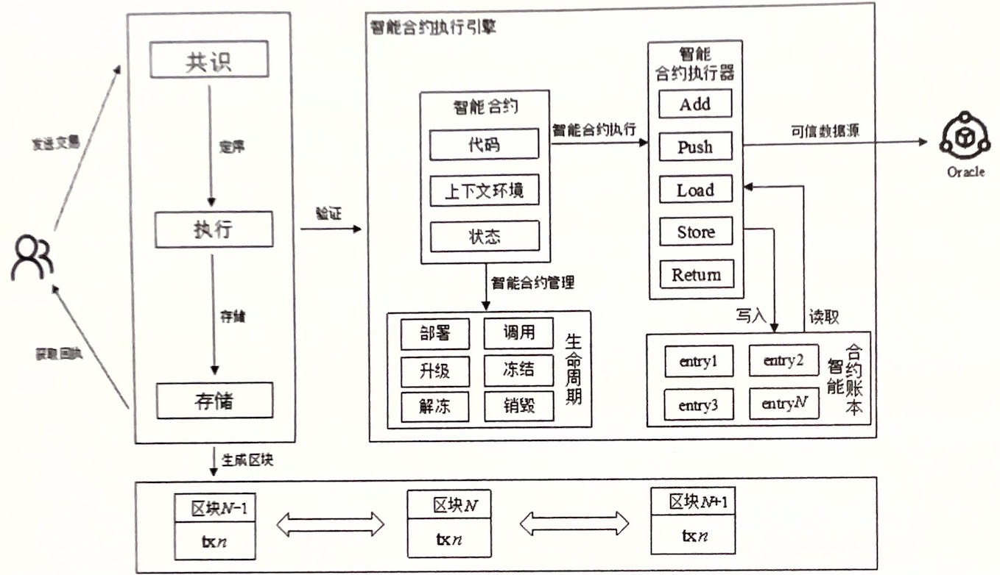
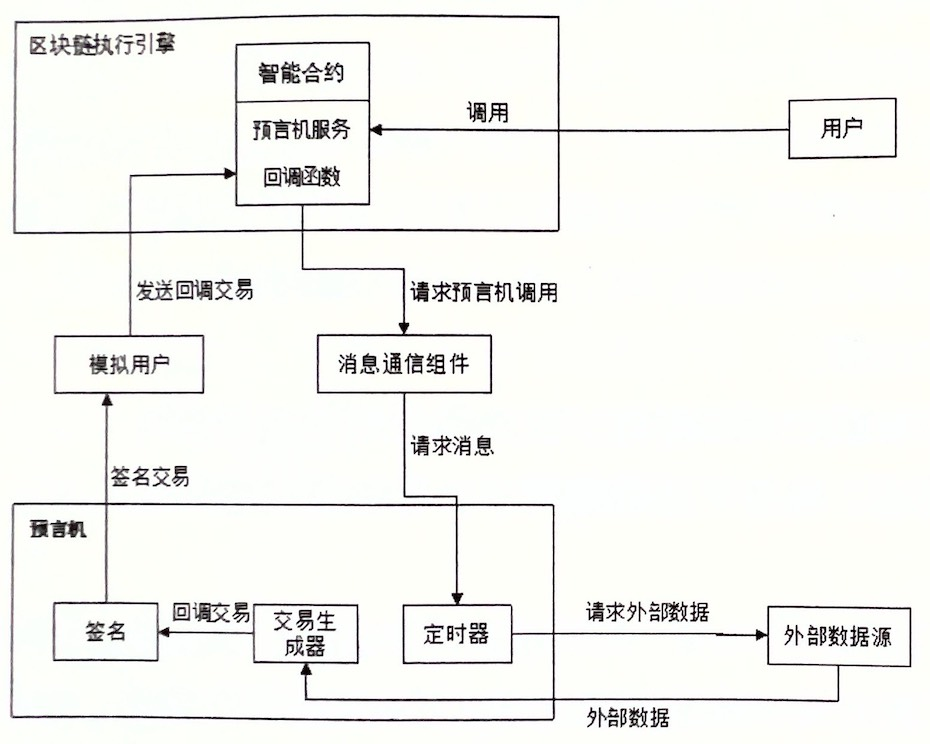

# 智能合约（整理）

### 目录
<!-- TOC -->
  * [基本概述](#基本概述)
    * [1. 合约的定义](#1-合约的定义)
    * [2. 智能合约特性](#2-智能合约特性)
      * [2.1 确定性](#21-确定性)
      * [2.2 有限性](#22-有限性)
      * [2.3 规范性](#23-规范性)
    * [3. 智能合约架构](#3-智能合约架构)
    * [4. 智能合约生命周期管理](#4-智能合约生命周期管理)
      * [4.1 生命周期概述](#41-生命周期概述)
      * [4.2 生命周期管理](#42-生命周期管理)
  * [典型的智能合约执行引擎](#典型的智能合约执行引擎)
    * [1. 栈式执行引擎](#1-栈式执行引擎)
      * [1.1 设计原理](#11-设计原理)
      * [1.2 运行机制](#12-运行机制)
      * [1.3 典型应用](#13-典型应用)
    * [2. 解释型执行引擎](#2-解释型执行引擎)
      * [2.1 设计原理](#21-设计原理)
      * [2.2 运行机制](#22-运行机制)
      * [2.3 典型应用](#23-典型应用)
    * [3. 容器化执行引擎](#3-容器化执行引擎)
      * [3.1 设计原理](#31-设计原理)
      * [3.2 运行机制](#32-运行机制)
      * [3.3 典型应用](#33-典型应用)
  * [智能合约与去中心化应用](#智能合约与去中心化应用)
    * [1. DApp](#1-dapp)
      * [1.1 DApp概述](#11-DApp概述)
      * [1.2 DApp应用](#12-DApp应用)
    * [2. 预言机](#2-预言机)
      * [2.1 背景](#21-背景)
      * [2.2 基本概述](#22-基本概述)
      * [2.3 架构模型](#23-架构模型)
      * [2.4 技术分类](#24-技术分类)
<!-- TOC -->

>本文档内容主要来自书籍《区块链技术指南》邱炜伟，李伟
## 基本概述
智能合约是一套以代码形式定义的承诺，合约参与方节点可以按照合约定义执行对应代码；智能合约拥有确定性、有限性、规范性和不可逆的特点。

智能合约的运行环境是合约执行引擎。合约执行引擎满足两个条件：执行过程可终止；执行过程结果一致性。从合约执行引擎架构来看，目前典型的设计包括栈式执行引擎、解释型执行引擎和容器化执行引擎三类。
不同执行引擎具有不同设计原理、运行机制和应用。合约执行引擎为合约运行提供了一个封闭的、确定性的沙箱环境，合约在运行时无法请求外界数据，
所以需要使用预言机来搭建合约运行时的封闭环境与外部数据源之间的桥梁。

**智能合约**作为区块链中重要的一部分，其核心功能是让用户能够定义一系列针对账本操作的逻辑，合约执行引擎为其提供了丰富的数据类型和工具方法，让开发者能够灵活多样地对账本数据进行操作。

**智能合约**的生命周期包括部署、调用、升级、冻结、解冻和销毁等阶段。合约所有者可以对合约的生命周期进行管理。

### 1. 合约的定义
智能合约最早由美国计算机科学家Nick Szabo于1994年提出，他在1998年发明了一种名叫**Bit Gold**的货币，该货币发行时间早于比特币10年。
Szabo将智能合约定义为执行智能合约的计算机化交易协议，他想把电子交易方法的功能扩展到数字领域。区块链智能合约支持创建无需信任关系的协议，
这代表智能合约参与节点可以通过合约作出可被无条件信任的承诺，从而消除公众对公证机构的需求，降低信任成本。

对于区块链中的智能合约来说，合约是一段计算机逻辑代码，其中包含了区块链用户之间的协议条款，之后这段代码将写入区块链网络。当智能合约参与节点发起对合约的调用交易时，
合约逻辑会被执行引擎执行，最终保存智能合约执行产生的数据和结果，并生成一条可追溯且不可逆的交易记录。

### 2. 智能合约特性
智能合约拥有确定性、有限性、规范性和不可逆的特点。这些特性保证了合约在区块链网络中的执行是安全且被用户认可的。

#### 2.1 确定性
确定性指的是执行结果确定，在输入相同的情况下输出一定相同，这也是编程语言中常见的函数所拥有的特性之一。执行结果包括合约执行逻辑、对账本的修改和结果返回值。
确定性保证运行在不同区块链节点上的同个智能合约的执行结果一致。若不一致会导致节点无法就执行结果形成共识。
>注意，不考虑合约中引用的状态数据对执行结果的影响。

在编写智能合约时应该**禁止调用**可能导致合约产生非确定性结果的数据源，或者是定义某些可能导致合约非确定性的逻辑。不稳定数据源有很多，例如当前时间戳、生成随机数以及请求外部数据等。
不稳定逻辑如并发程序等。

#### 2.2 有限性
有限性指的是一次合约执行占用的资源有限，包括时间和空间资源。智能合约在设计时就应该考虑其执行过程中对资源占用情况的计算，具体限制占用资源的措施在不同的合约执行引擎上不同。
例如，以太坊采用gas计费的方式，对合约执行的每条指令和申请的存储空间都进行定量计费，合约所有者可以设定消耗gas的上限，但仍需为已消耗的资源付费。
Fabric使用容器化的执行引擎模拟交易执行，将空间资源从区块链节点上剥离出去，通过限制执行时间来对其进行限定。

如果某次合约执行过程占用了大量资源，那么节点系统资源将被大量消耗，从而导致系统性能下降，甚至整个区块链网络进入停滞状态。

#### 2.3 规范性
规范性即智能合约编写规范，规范编写合约才能满足执行引擎的执行条件，并且减少合约漏洞。

在**The DAO**事件发生后，合约规范性和安全性得到了重视。最著名的规范性检查当属ERC20接口标准检查。ERC20是以太坊智能合约的标准接口说明，
如果合约开发者没有按照这个标准编写合约，那将对DApp带来不可估量的损失。例如，开发者在使用transfer函数时未声明返回值，可能导致合约无法完成正常交易和转账，
所以开发者需要在实现转账操作的同时，增加目的地址非零检查等。 

### 3. 智能合约架构
区块链智能合约架构一般包含共识、执行和存储模块。共识模块将交易定序后发送给执行模块，存储模块则保存智能合约执行产生后的账本数据和区块数据；
执行模块不仅需要串联共识模块和存储模块，还需要负责合约的执行。通常来说，执行模块包含智能合约执行引擎，为智能合约提供上下文环境和账本数据读写支持。
下图展示了智能合约执行架构



智能合约需要先部署到区块链以太坊上，将智能合约和某个账户地址进行绑定，后续对该合约的数据改动都将保存到账本中对应的地址下。
区块链用户可以通过区块链平台的SDK发起合约交易，指定要调用的合约地址和合约方法参数，经过SDK编码后将交易发送给区块链平台。节点收到交易后通过共识模块对其进行定序和广播，
之后交由合约执行引擎进行交易验证。执行引擎为合约执行构造了执行的上下文环境，提供了合约执行的参数和账本访问的接口；同时能够让合约管理者对合约的生命周期进行管理。
合约执行完成后的执行结果将会写入账本，在区块提交后，用户可通过SDK查询合约执行结果，智能合约执行结果主要包括合约方法的返回值，可能还包括合约执行消耗的gas、交易哈希值等。

上面描述了一种常见的智能合约架构工作模式，不同区块链平台在具体实现上有所出入。例如，合约执行引擎可以有多重不同架构，支持不同合约语言。
不同架构的执行引擎和账本的交互也有所不同。例如，EVM和HVM是两种支持不同合约语言的执行引擎。它们对于指令的定义也是不同的；同样地，合约执行模块也并非要包含合约执行引擎。
例如，Fabric将合约执行引擎独立为背书节点（Endorser），执行模块只对执行结果的读写集进行冲突检查与合并。
>HVM是趣链区块链平台上以Java为合约语言的执行引擎。

### 4. 智能合约生命周期管理
#### 4.1 生命周期概述
智能合约生命周期是从一个智能合约被创建开始，直至该智能合约被销毁结束。在智能合约存活的生命周期期间，合约管理者可以对合约进行升级、冻结、解冻等操作。

#### 4.2 生命周期管理
在智能合约被部署后，一般只有合约所有者才能管理其生命周期。对合约生命周期的不同管理操作，会对区块链节点产生对应的变更，最终体现在世界状态中，
包括但不限于部署、调用、升级、冻结、解冻销毁等。

**【一、部署】**  
部署合约就是创建一个合约账户，以及将合约保存到区块链账本的合约账户中的一个过程。合约上链后，才可以被用户使用或被其他合约调用。

**【二、调用】**  
调用者角度的不同，可以将调用分为以下2种。
1. 调用已部署的合约：本质上是调用部署在链上的合约的某个函数。
2. 跨合约调用：从一个合约中调用另一个合约的某个功能，这要求被调用合约是正常状态。

**【三、升级】**  
升级合约就是在某个特定合约地址上，用新的合约替换旧的合约。替换时要求被替换合约是正常状态。升级过程中也要注意一些问题。开发者在升级合约时需要遵循一定的升级规范，
确保旧的合约数据在新的合约中仍然能被访问到。

**【四、冻结】**  
合约被冻结后会被禁止调用或升级。

**【五、解冻】**  
冻结的合约在被解冻后恢复正常状态，可以被调用或升级。

**【六、销毁】**  
销毁即删除合约。销毁后，用户不能调用合约方法，也无法访问在账本中记录的合约状态数据，该行为只有合约管理者能够触发。

## 典型的智能合约执行引擎
智能合约执行引擎作为合约的运行环境，其主要职责是准确地运行用户编写的智能合约逻辑，一般智能合约执行引擎需要满足以下两个条件。
1. 执行过程可终止。合约不能无限占用执行引擎资源而不释放，一般会通过合约中执行的指令进行计费，或者限制合约执行时间。
2. 安全执行环境。保证合约执行不会导致程序崩溃，屏蔽执行过程中的随机因素，保证相同的输入会有相同的输出。

合约执行引擎还为合约执行提供上下文环境，包括账本数据的访问、外部数据的获取，最终将执行结果交由区块链共识模块进行全网一致性验证。从合约执行引擎的架构来看，
目前典型的合约执行引擎主要包括栈式执行引擎、解释型执行引擎和容器化执行引擎三类，不同架构的执行引擎有各自的优缺点，下面将分析不同执行引擎的设计原理、运行机制和典型应用。

### 1. 栈式执行引擎 
#### 1.1 设计原理
这类引擎通过栈式数据结构来执行合约。栈式执行引擎通常先将合约编译成字节码指令的形式，而字节码指令记录的就是针对栈数据的操作，配合程序计数器，
通过不断地操作数据入栈和出栈，最终执行完合约方法逻辑并返回结果。部分栈式执行引擎还会引入局部变量表和栈帧的概念，其目的也是辅助字节码指令的栈式执行过程。
局部变量表是一个能暂时存储数据的列表，可以保存智能合约方法参数或栈数据计算的中间结果；栈帧主要用于保存智能合约方法调用的调用栈信息和当前执行智能合约方法的上下文环境，
当然这两个结构不是必需的，单纯使用栈数据也能实现对应功能。

#### 1.2 运行机制
下面通过一段伪代码来解释字节码指令的运行过程。
```
func int add(int a, int b){
    int c = a + b;
    return c;
}
```
同时我们定义一系列字节码指令并规定其行为，如下表所示。

| 指令      | 行为                           |
|---------|------------------------------|
| load x  | 表示将局部变量表第x个位置元素加载到栈顶         |
| add     | 表示将栈顶的两个元素出栈，并进行加法运算，结果再压入栈顶 |
| store x | 表示将栈顶元素出栈，存入第x个位置的局部变量表      |
| return  | 表示将栈顶元素出栈，并作为智能合约方法返回值返回     |

根据上表中的指令定义，我们可以得出上文伪代码经过编译后最终表现为如下指令行为。
```
// 假定入参为1，2，那么add(1,2)的过程如下
load 1
load 2
add
store 3
load 3
return
```
栈式执行引擎通过程序计数器记录当前正在执行的指令，最终根据合约编译后的指令作出相应指令操作。当然，不同栈式执行引擎会有不同的栈式结构和指令定义，
但是基本原理与上述执行过程相同。

栈式调用在智能合约停机和安全控制方面比较容易，可通过指令执行次数和指令对应权值计算出合约执行复杂度，定量控制合约的执行时间，从而保证不同执行环境下执行相同的合约的复杂度一致；
而安全方面则可以通过禁用系统指令和方法的形式来控制，包括去除可能造成随机因素的调用，从而保证执行结果的一致性。

#### 1.3 典型应用
**【一、EVM】**  
Solidity是一门图灵完备的智能合约原因，需要被编译器编译成字节码指令，运行在EVM（以太坊虚拟机）上。Solidity和EVM的出现，使得编写智能合约变得十分容易，
让很多基于区块链的DApp大放光彩，推动了区块链智能合约的发展。Solidity通过solc编译器可以编译输出两种格式的文件：bin和abi。bin文件为合约的字节码文件，
用户将合约对应的bin文件部署到区块链上，通过abi文件编码参数进行合约的调用。EVM执行引擎会解析出用户调用的合约方法，逐条执行bin文件中的指令，执行过程基于一个操作数栈进行，
同时在EVM中采用一个Memory结构来存储操作数栈执行过程的中间执行结果，即上文描述中的局部变量表的作用。

Solidity从设计初期就作为智能合约语言来考虑，其在账本操作上有较大优势。合约中需要进行的账本操作可以在编译期翻译为账本操作指令`SSTORE`和`SLOAD`，
分别为存储和读取账本数据。在EVM中的最小slot（数据槽，用来存储数据的字节组合）为32字节。因此，对于Solidity中的静态类型，如int、uint和byte32等，
其最多只会占用一个slot，获取完整数据只需进行一次指令操作；而对于动态类型，如String、bytes和map等，其会将数据进行拆分，并依据数据大小建立索引，
一次完整的数据读取涉及多次账本操作，需要从多个slot中恢复原始数据。

**【二、WASM】**  
WASM（WebAssembly）是一种新的与平台无关的二进制格式，最初是为了解决JavaScript在浏览器上复制逻辑执行效率低的问题，主要是一些CPU密集型的工作，如需要在web前端进行的游戏逻辑和图像处理任务。

WASM字节码简短、高效，使得主流语言C/C++、Rust和Go开始支持编译为WASM字节码格式。WASM的这些优势也受到了区块链项目的青睐，拓展了区块链使用高效多智能合约语言的可能性。
WASM执行引擎本质上还是一个栈式虚拟机，典型实现包括操作数栈、局部变量表和程序计数器。

由于WASM不像Solidity一样能够通过编译器增加账本访问指令，以支持对区块链账本的访问，所以为了能够将WASM和区块链系统整合起来，需要为WASM编写的合约提供能访问区块链网络的账本数据接口。
WASM字节码提供导入模块功能，通过自定义账本访问模块，使用native方式实现模块内容，从而将账本接口和WASM执行引擎结合起来。在合约中引入账本访问模块后即可操作账本数据，
具体账本模块接口的定义形式可以根据不同的区块链平台进行修改，具有较大灵活性。

>关于WASM的更多介绍请读者自行查询。

**【WASM相对EVM的优势】**  
首先是**生态优势**，WASM是W3C定义和创建的标准，最早是为Web而推进的标准，还得到了谷歌(Chrome)、微软(Edge)、苹果(Safari)和Mozilla(Firefox)等厂商浏览器的支持;
而后也受到许多后端高级语言C/C++、Rust、Go等的支持。  
而EVM虽然也受到多个公链的支持，但在语言支持上仍然相形见绌，目前只有Solidity、Vyper、Fe、Huff 和 Yul（后两种是类汇编语言）这些新兴合约语言支持，
对开发者来说具有不小的上手成本。

其次是**性能优势**，EVM类似JVM，是在物理机器上建立的一套VM机制，其可以模拟物理CPU的指令完成各种各样的任务。问题在于它始终是在物理机器之上重新建立的一套机制，
EVM上的字节码运行时要经过EVM的一层转换，最终仍是物理CPU执行，整个执行过程不是native的。  
而WASM字节码可以直接在物理机器上运行，无需经过任何转换。
说明它已经是由对应CPU平台支持的指令集合构成，这种native的运行速度是EVM不能比拟的，其中的性能差距可能达到几十上百倍。

最后是**升级runtime的优势**，目前EVM的升级（象征着solidity等基于EVM的合约语言的升级）仍然需要整个区块链进行硬分叉的形式进行，
这样带来的缺点是效率低、容易出错。而诸如波卡（Polkadot）这类采用WASM技术的公链在升级合约runtime逻辑时，
只需对其支持的高级语言的账本SDK进行升级，如Substrate（Rust的区块链开发框架），这种升级方式对整个公链几乎是无感知的，
将升级runtime逻辑的风险大大降低。

**【WASM在区块链领域的发展应用】**  
目前已经有越来越多的区块链平台开始转向或采用WASM作为平台之上的合约执行底层技术，例如EOS、Ontology、Polkadot等知名公链，
并且以太坊2.0的虚拟机平台eWASM也将支持WASM技术。

在区块链领域应用WASM技术还有一个重大优势，那就是不用重新开发一门新的合约语言，它可以利用现在高级语言们对WASM高度支持的特点（生态复用），省去一大部分造轮子的工作，
仅需要在此基础上完成为各大高级语言提供账本API的工作即可，如EOS（采用C++）、Polkadot（采用Rust）和Cardano（采用Haskell、Rust）等。

**【三、HVM】**  
HVM（HyperVM）是基于趣链区块链平台开发的合约执行引擎，其实现基于《Java虚拟机标准规范》开发的JVM执行引擎，能够运行用Java编写的合约。
Java合约在经过javac编译后会形成class字节码文件，每个Java类文件都将被编译成一个class文件，多个class文件经过压缩可形成合约jar包，然后将jar包部署到趣链区块链平台之上。

HVM和WASM执行引擎面临一样的问题，需要能够让Java编写的智能合约访问区块链账本，依赖Java提供的native方法机制（JNI接口），HVM可以将部分Java的合约方法通过JVM虚拟机底层实现，
而不是通过JDK实现。通过native实现的JVM虚拟机底层实现方法，实现封装对区块链账本访问的接口。进一步地，HVM为了让合约编写者能够更方便地访问区块链账本，
将账本操作封装成HyperTable、HyperMap和HyperList结构，使合约中对于账本的访问方式如同访问Java的集合类型。

### 2. 解释型执行引擎
#### 2.1 设计原理
基于解释型执行引擎的合约的最大特点是，每笔交易都包括一个执行脚本，执行脚本内指定了当前交易的账户对象和对应的操作逻辑，而不是在交易结构中指定交易的账户对象。

一笔交易的交易脚本每次都可以被修改，并且可以在脚本中操作多个账户对象。执行引擎将根据脚本定义的逻辑执行。交易脚本大大增加了交易执行的灵活性，可以为每笔交易自由制定逻辑。

#### 2.2 运行机制
在按照区块链平台要求编写对应的交易脚本后，将其作为payload，由交易发送方对自定义的交易脚本进行签名，发送至区块链平台。最终由执行引擎根据脚本中的逻辑进行交易验证。

#### 2.3 典型应用
Move语言是Facebook公司的区块链平台Libra上定义的交易脚本语言，旨在为Libra区块链提供安全可编程的基础。Libra区块链中的账户是一个容器，
它包含任意数量的Move资源和Move模块（Modules）。提交到Libra区块链的智能合约执行交易包含用Move语言编写的交易脚本，脚本可以调用模块声明的过程来更新区块链的全局状态。

Move模块相当于是传统区块链上的智能合约，在Move模块下可以自定义资源，一个账户可以有多个Move模块，Move虚拟机通过字节码验证器保证Move资源的安全性。
用户编写Move模块后将其编译，再通过交易的形式将其发布到区块链账户地址上。交易脚本可以调用Move模块中声明的公开过程。

执行脚本之前，执行引擎将对Move交易脚本进行反序列化，解析为Move虚拟机的字节码。Move虚拟机通过操作数栈来完成Move交易脚本字节码中定义的数据操作，
使用CallStack来记录交易脚本的方法调用过程，同时通过计算执行指令的Gas定量计算智能合约的复杂度，用户需要为Move交易脚本的执行过程付费。

### 3. 容器化执行引擎
#### 3.1 设计原理
容器化执行引擎最大的特点是逻辑和数据隔离，其实现相对比较简单，不需要实现虚拟机来执行智能合约逻辑，取而代之使用容器作为智能合约执行环境。
该引擎会提供一个安全的沙箱环境作为容器来运行智能合约，不同的智能合约只需提供不同的容器和对应语言的账本操作API。由于整个过程在容器中运行，
因此执行过程不会影响到区块链网络，用户只需收集在容器中执行的模拟操作账本读写集。

#### 3.2 运行机制
执行引擎接收客户端发送的合约执行请求，通过容器化环境将合约放入容器，通过对应语言的账本操作API在容器中访问账本，此时一般不会将智能合约执行结果直接写入账本，
而是执行模拟操作账本的读写集后将结果返回给客户端，客户端需要再次发起将模拟交易产生的读写集写入账本的请求。

由于容器化执行引擎执行合约逻辑一般native化，所以不能采用定量分析合约复杂度的形式，而是采用超时机制来限制合约复杂度。

#### 3.3 典型应用
典型应用代表是Fabric 链码（Chaincode）。Fabric执行引擎核心组成主要包括SDK、排序节点、背书节点（Endorser）、容器化执行引擎和账本。执行过程大致如下步骤。
1. 生成提案。由客户端生成一个提案，提案指的是一个调用智能合约功能函数的请求，用来确定哪些数据可以读取或写入账本（一般客户端会借助目前Fabric提供的一系列SDK生成提案），
2. 背书节点模拟执行。提案被发送至背书节点进行模拟执行并背书，背书节点会进行响应的校验，然后再将提案交由对应的链码进行模拟执行，之后背书节点会对执行结果进行背书，将背书的提案response返回给客户端。
3. 客户端封装交易。客户端收集符合背书策略的提案response，将其封装为一个交易，调用排序节点的Broadcast接口，发送交易至排序节点进行交易排序。
4. 提交节点进行交易校验。排序节点将交易排序后通过主节点将交易转发给其他节点，最终每个提交节点在收到交易后都会对交易进行校验，包括签名、背书策略及链码模拟执行产生的读写集的校验。
在校验无误的情况下将结果提交到账本，同时更新世界状态。

**Fabric容器化执行引擎的缺点**  
- 虽然能做到逻辑和账本隔离，并且支持多智能合约语言，但是其缺点也是很明显的。首先，由于容器化执行导致合约逻辑的复杂度不能定量控制，而是依赖超时机制，
因此很有可能导致多个背书节点的容器化执行引擎受到系统环境的影响，出现部分背书节点超时、部署背书节点不超时的情况；
- 其次，采用Fabric链码模拟执行产生读写集，读过读写集冲突校验判断，抛弃产生冲突的交易，可能导致用户执行的智能合约结果最终无法生效；
- 最后，对于客户端来说，需要收集多个背书节点的提案response才能构成交易，导致客户端与服务器端交互逻辑复杂，使用体验不够优化。

## 智能合约与去中心化应用
### 1. DApp
#### 1.1 DApp概述
DApp全称是Decentralized Application，即去中心化应用。  
区别于传统App，DApp依赖的是区块链基础设施作为运行平台，所以天然具备不可篡改、去中心化存储的特性。DApp最大优势是去中心化、完全开源、自由运行。但是，凡事都有两面性，优势在某些时候也成为劣势，
黑客可以随时获取DApp的源码进行漏洞分析，这就大大增加了DApp遭受攻击的风险。同时，自由运行的特点在一定程度上提高了监管、审查的难度，还有其他许多问题。

DApp并无法取代传统App，二者是和谐共存的关系。因为它们各自存在于不同的场景，发挥其各自的优势。共同促进互联网繁荣的并存关系。

区块链开发者要把握好DApp的优势，解决App无法解决的市场与技术矛盾。目前，市场高热度的DApp主要由去中心化交易所（Exchange）、游戏等与交易数据、交易资产有直接关联的应用。

#### 1.2 DApp应用
截止2020年第一季度，根据权威网站统计，共有约3500款DApp。其中Game、High-risk的DApp数量分别以22%、21%的高占比位列前三。其中，
Game的日活跃DApp数量排名第二，High-risk稍微落后排列第三。Exchange和Finance的DApp虽然在数量上占比只有4%，但Finance的DApp的日活跃用户量排名第一、
日交易量排名第二，而Exchange的DApp日交易量则排名第一，可以推断，这两类也是DApp目前较为活跃的市场领域。根据这份市场报告我们可以看到，目前DApp能够大展身手的领域大部分集中在与交易资产有关联的领域。
Game领域最出名的是CryptoKitties（加密猫），在保证游戏趣味的基础上，用户通过对猫咪进行短期或长期投资来赚取代币，与交易资产依然有不可分割的联系。

下面简单介绍几款比较知名的DApp。

**【一、CryptoKitties（Game，以太坊）】**  
这是一款虚拟养猫游戏，于2017年11月28日正式上线。用户可以通过购买、培育、繁殖，得到并收藏拥有不同特征和属性的猫咪，也可通过交易卖出猫咪获取以太币，
猫咪的价格会随市场需求而变化，当游戏热度高时价格随之升高，当用户流失时价格不断降低。

**【二、Oasis（Exchanger，以太坊）】**  
Oasis是一款Exchaner DApp。2019年下半年，Oasis正式上线Oasis Trade交易所，推出Dai稳定币，和美元保持1:1汇率，Oasis Trade交易所支持Dai和多种数字货币进行交易，
支持去中心化借贷存款。用户想要使用Oasis上的资产，只需要通过以太坊钱包。Dai的发行由链上资产进行抵押，经过严格的形式化验证和审计，具有非常高的安全标准。

**【三、飞洛印（Others，趣链区块链平台）】**  
这是一款基于高性能的企业级联盟链——趣链区块链平台开发的可信存证DApp，其主要目标是做好强司法保障、提高司法效率、构建线上司法生态。从细节功能上划分，
飞洛印制定了证据获取、证据固定、证据管理、证据调用一整套证据的生命周期管理方案，提前保护了数据，实现了数据证据确权、不可篡改。此外，飞洛印还支持数据公示、网页，手机取证，
确保数据实时有效。

### 2. 预言机
#### 2.1 背景
虽然区块链拥有去中心化、不可篡改、可追溯等优势，但其由一个本质的缺陷，那就是区块链是一个封闭的、确定性的沙箱环境。在这个环境中，区块链只能获取链上的数据，
链上的数据都是被动输入得到的，并且区块链在运行智能合约的过程中无法对外部请求获取新数据，只能基于已有数据以一种确定性方式产生新数据，不能与网络相关或涉及硬件相关的调用。
根据这个描述可以发现，区块链和外部是一种隔绝的状态，然而区块链上的智能合约和DApp对外部数据又有强烈的交互需求，这与智能合约的执行环境产生了矛盾。

综上所述，预言机就是为了打破区块链与外部世界的隔绝状态而出现的。通过预言机，合约可以主动获取外部数据，如追踪快递信息、获取机票实时价格等，并对此类数据做相应的处理、存储，
并且整个过程有可靠保证，无法被篡改。

#### 2.2 基本概述
预言机是区块链这个封闭环境与外部数据源的纽带，其需要满足两个功能：获取外部数据、确保获取到的数据不被篡改。从计算机的角度触发，预言机是一个图灵机，
能够解决任何决定性和功能性问题；从区块链角度来看，预言机是一个数据组件模块，扮演中间件角色，负责区块链与外部世界交互。

预言机带来的价值：
1. 预言机的出现打破了区块链封闭的运行环境，打通了其与外部数据源的交互通道，提高了区块链对于外部数据的感知度，为区块链建立了新的赋能方式。
2. 预言机确保数据不会被篡改，在打通交互通道的基础上维护了区块链的一致性、安全性、真正实现并建立了数据获取、组织、管理、存储与交互这一条完整的生态链。
3. 通过将预言机引入区块链，可以增强区块链应用的可移植性，支持更多、更丰富的业务场景或数据操作，保障区块链应用真正落地，实现智能合约的利益价值最大化。

综上所述，预言机作为一个可信的第三方数据中间件模块，解决了区块链无法与外部数据交互这一发展痛点，提升了区块链的价值转化。我们有理由相信，在未来，
预言机将会加速区块链技术的发展，并与区块链技术一同摸索，构建更完善的DApp和生态。

#### 2.3 架构模型
下图为预言机架构模型图，可以帮助读者理解预言机如何与区块链执行引擎通力合作，打通与外部数据源的交互通道。



如上图所示，预言机一般作为区块链的一个独立模块或第三方服务与区块链执行引擎进行交互。预言机只负责数据的可信获取，不直接参与交易的执行。
首先，（上图中）用户通过合约调用的形式（也可通过特殊的API服务等其他方式发起预言机服务请求）发起预言机服务请求，通过调用某个内置合约接口（图中的预言机服务接口），
告知区块链执行引擎，用户想要执行一笔含预言机服务的交易。

执行引擎在执行过程中检测到对预言机的服务请求，通过内部通信组件将该请求转发给预言机，这个请求里会封装请求外部数据源的一些信息，如一个web请求所需的url、http头等信息。

预言机在收到服务请求后，向外部数据源发起数据获取请求，获取数据后利用交易生成器生成一笔新的回调交易，并对其进行签名（这一过程使用TEE等硬件技术保障安全性和不可篡改）。

最后，预言机将这笔回调交易发给执行引擎，对获取的数据执行组织、管理、存储等一系列操作。至此，一个完整的含预言机服务的区块链交易执行流程结束。

通过上述流程可以得知，预言机在设计过程中最需要考虑的两个要素分别是数据获取和可靠保证。

**【一、数据获取】**  
在实际的数据获取过程中，开发者开发预言机时需要满足以下几点。
- 对外部数据源的选取和可信认证。预言机需要谨慎选择外部数据源，必须保证对每个选取的外部数据源，都可以验证其是可信的，如对于web的数据获取，选取的外部数据源需要持有证书。
- 制定外部数据获取的标准流程。开发者必须明确执行引擎、用户、外部数据源与预言机的数据交互流程，对于不同的外部数据源类型要能够统一或明确区分数据的交互流程，确保交互方法可执行、可落地。
- 统一定义数据获取过程中的数据交互格式。不同的外部数据源类型有不同的数据交互格式，以传感器为外部数据源和以web为外部数据源获取的数据交互格式是不一样的，针对这两种情况，
预言机需要有明确、统一的数据编解码层，以对不同外部数据源的数据进行请求和解释。

**【二、可靠保证】**  
预言机需要提供一种可靠保证机制保证自己的数据未经过篡改。针对不同的外部数据源，预言机需要提供不同模式的可靠保证机制。例如，网络连接时需要使用TLS协议，
与安卓应用交互数据需要SafetyNet技术提供保障。

预言机需要分别对两个阶段做数据的可靠保证。第一个阶段为数据从网络到本地，普遍采用HTTPS协议（底层采用TLS协议）保障连接和数据的正确性、完整性；
第二个阶段为数据从本地到链上，预言机采用TEE，TEE是CPU内的一块安全区，它从硬件入手，和操作系统独立运行，同时使用硬件和软件技术确保数据的机密性、可靠性。

#### 2.4 技术分类
在最底层的技术基础和安全设施上，不同的预言机实现之间比较相似，大多采用TEE，但根据区块链应用场景和市场的不同，预言机上层的技术架构和模型也会有非常大的差异，
主要分为中心化预言机和去中心化预言机。

**【一、中心化预言机】**  
这类预言机需要引入一个第三方机构，如国家或能够提供背书的大型企业，验证方式也通过第三方机构独立验证。以Oraclize为例，作为一个中心化预言机，
Oraclize通过TLS协议实现web数据的可靠传输，并结合Intel SGX确保数据在本地不可篡改。Oraclize给用户提供了API，用户只需要调用预先设计的智能合约接口，
就可以使用预言机服务获取web数据。Oraclize作为一个独立的单点模块，这样的实现具有高性能的优势，也同时有单点故障、拓展性弱的特点，并且中心化思想与区块链的去中心化理念背道而驰。

**【二、去中心化预言机】**  
这类预言机使用多重签名或分布式算法保证数据的正确性、一致性，不需要引入第三方机构，但这也导致其实现的高复杂度，以及性能弱势。
以Chainlink为例，它是一个去中心化的分布式预言机，建立了一个去中心化的数据网络，每个预言机都是网络中的一个节点，其架构分为链上组件和链下组件。
链上组件负责和用户交互，如收集、响应用户请求，而链下组件是之前提到的数据网络，用于处理数据获取和传输。在这个架构中，Chainlink主要的问题如何保证分布式环境下的数据一致性、以及如何获得良好性能。

参考
- [《区块链技术指南》邱炜伟，李伟](https://item.jd.com/10057248453271.html)